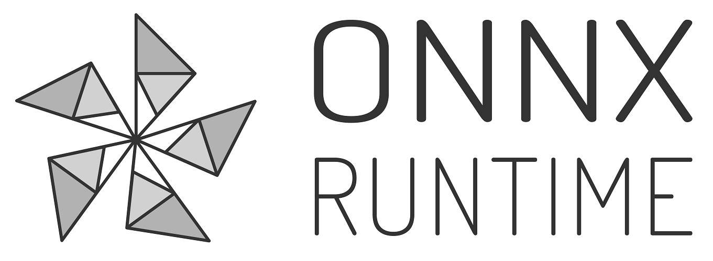

**ONNX Runtime** is a cross-platform **inference and training machine-learning accelerator** compatible with deep learning frameworks, PyTorch and TensorFlow/Keras, as well as classical machine learning libraries such as scikit-learn, and more.

ONNX Runtime uses the portable [ONNX](https://onnx.ai) computation graph format, backed by execution providers optimized for operating systems, drivers and hardware.

Common use cases for ONNX Runtime:

* Improve inference performance for a wide variety of ML models
* Reduce time and cost of training large models
* Train in Python but deploy into a C#/C++/Java app
* Run with optimized performance on different hardware and operating systems
* Support models created in several different frameworks

[ONNX Runtime inference](https://www.onnxruntime.ai/docs/get-started/inference.html) APIs are stable and production-ready since the [1.0 release](https://github.com/microsoft/onnxruntime/releases/tag/v1.0.0) in October 2019 and can enable faster customer experiences and lower costs.

[ONNX Runtime training](https://www.onnxruntime.ai/docs/get-started/training.html) feature was introduced in May 2020 in preview. This feature supports acceleration of PyTorch training on multi-node NVIDIA GPUs for transformer models. Additional updates for this feature are coming soon.

## Get Started

**http://onnxruntime.ai/**
* [Install](https://www.onnxruntime.ai/docs/get-started/install.html)
* [Inference](https://www.onnxruntime.ai/docs/get-started/inference.html)
* [Training](https://www.onnxruntime.ai/docs/get-started/training.html)
* [Documentation](https://www.onnxruntime.ai/docs/)
* [Samples and Tutorials](https://www.onnxruntime.ai/docs/tutorials/)
* [Build Instructions](https://www.onnxruntime.ai/docs/how-to/build.html)
* [Frequently Asked Questions](./docs/FAQ.md)

## Build Pipeline Status
|System|CPU|GPU|EPs|
|---|---|---|---|
|Windows||||
|Linux|    |   | |
|Mac| |||
|Android||||
|iOS||||
|WebAssembly||||

## Data/Telemetry

This project may collect usage data and send it to Microsoft to help improve our products and services. See the [privacy statement](docs/Privacy.md) for more details.

## Contributions and Feedback

We welcome contributions! Please see the [contribution guidelines](CONTRIBUTING.md).

For feature requests or bug reports, please file a [GitHub Issue](https://github.com/Microsoft/onnxruntime/issues).

For general discussion or questions, please use [Github Discussions](https://github.com/microsoft/onnxruntime/discussions).

## Code of Conduct

This project has adopted the [Microsoft Open Source Code of Conduct](https://opensource.microsoft.com/codeofconduct/).
For more information see the [Code of Conduct FAQ](https://opensource.microsoft.com/codeofconduct/faq/)
or contact [opencode@microsoft.com](mailto:opencode@microsoft.com) with any additional questions or comments.

## License

This project is licensed under the [MIT License](LICENSE).
