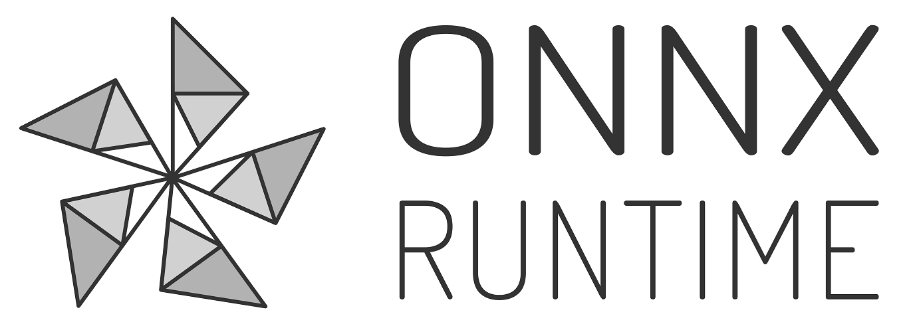

**ONNX Runtime QNN is an ONNX Runtime execution provider optimized for Qualcomm's hardware**.

**ONNX Runtime QNN** provides high-performance inference for machine learning models on Qualcomm platforms. ONNX Runtime QNN leverages Qualcomm's AI Runtime (QAIRT) to deliver optimal performance on Qualcomm hardware accelerators. [Learn more &rarr;](https://onnxruntime.ai/docs/execution-providers/QNN-ExecutionProvider.html)

This repository is maintained by Qualcomm and contains the QNN-specific execution provider for ONNX Runtime. For the general ONNX Runtime project, please visit [microsoft/onnxruntime](https://github.com/microsoft/onnxruntime).

## Get Started & Resources

* **General Information**:
  - [onnxruntime.ai](https://onnxruntime.ai)
  - [QNN Execution Provider](https://onnxruntime.ai/docs/execution-providers/QNN-ExecutionProvider.html)

* **Usage documentation and tutorials**: [onnxruntime.ai/docs](https://onnxruntime.ai/docs)

* **YouTube video tutorials**: [youtube.com/@ONNXRuntime](https://www.youtube.com/@ONNXRuntime)

* [**Upcoming Release Roadmap**](https://onnxruntime.ai/roadmap)

* **Companion sample repositories**:
  - ONNX Runtime QNN Inferencing: [microsoft/onnxruntime-inference-examples](https://github.com/microsoft/onnxruntime-inference-examples)

## Releases

The current release and past releases can be found here: https://github.com/onnxruntime/onnxruntime-qnn/releases.

For details on the general ONNX Runtime roadmap, please visit: https://onnxruntime.ai/roadmap.

## Data/Telemetry

Windows distributions of this project may collect usage data and send it to Microsoft to help improve our products and services. See the [privacy statement](docs/Privacy.md) for more details.

## Contributions and Feedback

We welcome contributions! Please see the [contribution guidelines](CONTRIBUTING.md).

For feature requests or bug reports, please file a [GitHub Issue](https://github.com/onnxruntime/onnxruntime-qnn/issues).

For general discussion or questions, please use [GitHub Discussions](https://github.com/onnxruntime/onnxruntime-qnn/discussions).

## Code of Conduct

This project has adopted the [Microsoft Open Source Code of Conduct](https://opensource.microsoft.com/codeofconduct/).
For more information see the [Code of Conduct FAQ](https://opensource.microsoft.com/codeofconduct/faq/)
or contact [opencode@microsoft.com](mailto:opencode@microsoft.com) with any additional questions or comments.

## License

This project is licensed under the [MIT License](LICENSE).
