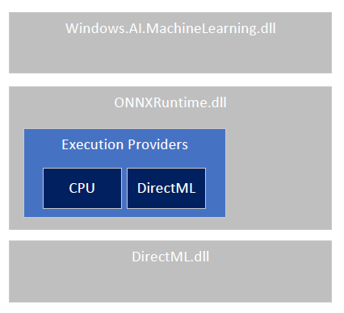

# ONNX Runtime High Level Design

This document outlines the high level design of
ONNX Runtime - a high performance, cross platform engine.

## Key objectives
* Maximally and automatically leverage the custom accelerators and runtimes
available on disparate platforms.
* Provide the right abstraction and runtime support for custom accelerators and
runtimes. We call this abstraction an [execution
provider](../include/onnxruntime/core/framework/execution_provider.h). It defines and exposes a set of
its capabilities to ONNXRuntime: a set of single or fused nodes it can
execute, its memory allocator, and more. Custom accelerators and runtimes are
instances of execution providers.
* We don't expect that an execution provider can always run an ONNX model fully
on its device. This means that ONNXRuntime must be able to execute a single
model in a heterogeneous environment involving multiple execution providers.
* Provide support for high-level optimizations that can be expressed as
model-to-model transformations via a [graph-transformation
API](../include/onnxruntime/core/optimizer/graph_transformer.h). Such
transformations fall into two categories: global transformations, those that
require analysis and transformation of the entire graph, and local
transformations, which can be captured as simple (algebraic) [rewriting
rules](../include/onnxruntime/core/optimizer/rewrite_rule.h).

## High-level system architecture
The flow is quite simple. Starting from an ONNX model, ONNXRuntime first
converts the model graph into its in-memory graph representation. It then
applies a number of graph transformations that a) perform a set of provider
independent optimizations such cast transformations between float16 and float32, and b) partition the
graph into a set of subgraphs based on the available execution providers. Each
subgraph is assigned to an execution provider. We ensure that a subgraph can be
executed by an execution provider by querying the capability of the execution
provider using the GetCapability() API.

### More about partitioning
ONNXRuntime partitions a model graph into subgraphs based on the available execution providers, one for each distinct provider. ONNXRuntime provides
a default execution provider that is used as the fallback execution for the
operators that cannot be pushed onto the more specialized but more efficient
execution providers. Intuitively we want to push computation to more
specialized execution providers whenever possible.

We use a simple graph partitioning technique. The available execution providers
will be considered in a specific order, and each will be assigned the maximal
subgraphs (possibly more than one) that it is able to handle. The
ONNXRuntime-provided default execution provider will be the last one
considered, and it ensures completeness. More sophisticated optimizations can be
considered in the future (or can even be implemented as a composite execution
provider).

Conceptually, each partition is reduced to a single fused operator. It is
created by invoking the execution provider's Compile() method and wraps it as a
custom operator. Currently we support only synchronous mode of execution. An execution
provider exposes its memory allocator, which is used to allocate the input
tensors for the execution provider. The rewriting and partitioning transform the
initial model graph into a new graph composed of operators assigned to either
the default execution provider or other registered execution
providers. The ONNXRuntime execution engine is responsible for running this graph.

## Key design decisions
* Multiple threads can invoke the Run() method on the same
inference session object. See [API doc](C_API.md) for more details.
* To facilitate this, the Compute() function of all kernels is const
implying the kernels are stateless.
* Implementations of the operators by execution providers are called
kernels. Each execution provider supports a subset of the (ONNX)
operators/kernels.
* The ONNX Runtime guarantees that all operators are supported by the default
execution provider.
* Tensor representation: ONNXRuntime will utilize a standard representation for
the tensor runtime values. The execution providers can internally use a
different representation if they choose to, but it is their responsibility to
convert the values from/to the standard representation at the boundaries of
their subgraph.

## Extensibility Options
* [Add a custom operator/kernel](AddingCustomOp.md)
* [Add an execution provider](AddingExecutionProvider.md)
* [Add a new graph
transform](../include/onnxruntime/core/optimizer/graph_transformer.h)
* [Add a new rewrite rule](../include/onnxruntime/core/optimizer/rewrite_rule.h)

## The ONNX Runtime and Windows OS integration

The ONNX runtime shipped with the Windows operating system in build 1809 (RS5).  The runtime was embedded inside the Windows.AI.MachineLearning.dll and was exposed via that WinRT API (WinML for short).  It includes CPU support and a DirectML execution provider for GPU support.   Since then it has continued to ship in every version of Windows.

Starting with the ONNX Runtime 1.2 release we are bringing a new layered architecture to the ONNX Runtime and Windows ML.
*Note:  This feature is preview as of the 1.2 release*

The high level design looks like this

You can see we replaced the embedded ONNX runtime with the new ONNXRuntime.dll.  With this new approach customers have flexibility on which API they choose to use and on how they want to distribute the binaries.

### API choice

Developers can now choose which API works best for their scenario.

||WinRT|C API|
|--|--|--|
|Type system| Integration with Windows RT types| Platform neutral types|
|Language support| Language support via WinRT Projections| Language support via per language projections|
|Tensorization| Accepts VideoFrames and converts to tensors (support for CPU and GPU)| Accepts tensors|

### Distribution choice

You can also choose to use runtimes included in the Windows OS, or use the redist nuget to ship the runtime with the app.

|Distribution|Inbox|App nuget|
|--|--|--|
|Disk footprint| Included in the OS| Included in the App|
|Servicing fixes| Serviced by OS updates| Serviced by the App|
|Execution Providers| CPU & DirectML EP | App chosen EP|
|Compatability testing| Tested with OS flights against supported GPU's and CPU's | App performs compatibility testing|
|Opset| Refreshed in OS updates| App chooses|
