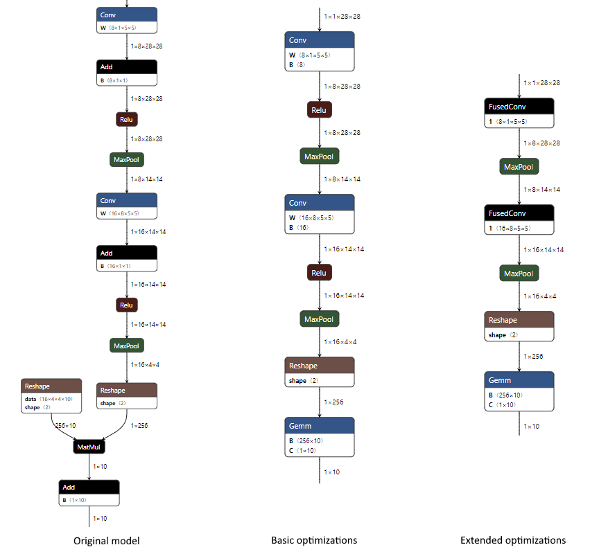
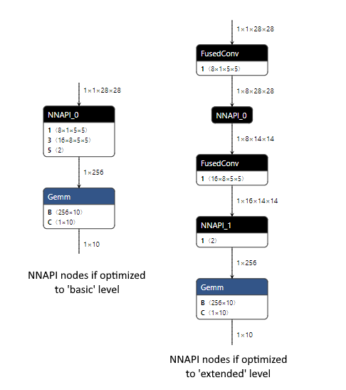

# ONNX Runtime Mobile Build: Advanced Usage with NNAPI

The ONNX Runtime Mobile with the NNAPI execution provider can be used to execute ORT format models on Android platforms. This document explains the different options available to optimize the ORT model for exection with NNAPI. 

Review the details for using NNAPI with ONNX Runtime Mobile [here](ONNX_Runtime_for_Mobile_Platforms.md#using-nnapi-with-onnx-runtime-mobile).

## Effect of Optimization Levels on NNAPI Execution Provider

The performance of the ORT model execution through NNAPI is influenced by the different optimization applicable when the ORT formatted model is created.

### Background about optimization for ORT Models

ONNX Runtime applies optimizations on the ONNX model to improve inference performance. There are three optimization steps:

*Step 1:*

The _basic_ optimizations (removing redundant nodes and computations) are applied on the ONNX model. See the [graph optimization](ONNX_Runtime_Graph_Optimizations.md) documentation for further details. Only ONNX operators are used when modifying the model in this step.

*Step 2:*

The [execution providers](execution_providers/README.md) (EP) specific optimizations assign nodes to EPs based on the reponse from the EP. The user defined priority is used to allocate nodes among different hardware specific execution providers.

Nodes in the ORT model are assigned to the NNAPI EP using this process.

ONNX Runtime may group nodes into a sub-graph for efficient execution via NNAPI. This reduces the overhead to copy data between the CPU and NNAPI when executing the nodes. The inference performace is better with more nodes in each sub-graph, and fewer sub-graphs.

*Step 3:* 

The 'extended' and 'layout' optimizations replace one or more standard ONNX operators with custom internal ONNX Runtime operators designed to boost performance on certain hardware (HW) platforms. These optimizations are applied to the nodes assinged to the corresponding EP for the target HW platform. These custom internal operators are generally limited to the EPs for execution on x86_64 / aarch64 CPU architecture and the CUDA EP on NVIDIA GPUs.

These optimizations will not be applicable to the nodes assigned to the NNAPI EP.

### Example of optimizations on MNIST

Below is an example of the changes that occur in 'basic' and 'extended' optimizations when applied to the MNIST model.

- At the 'basic' level we combine the Conv and Add nodes (the addition is done via the 'B' input to Conv), we combine the MatMul and Add into a single Gemm node (the addition is done via the 'C' input to Gemm), and constant fold to remove one of the Reshape nodes. 
- At the 'extended' level we additionally fuse the Conv and Relu nodes using the internal ONNX Runtime FusedConv operator.



During runtime, for each group of nodes that is assigned to it, the NNAPI EP will create an NNAPI model that replicates the processing done by the nodes in the group. It will create a function to handle executing this NNAPI model, including copying data between the CPU and NNAPI. The original nodes in the model are replaced with a single node containing this function.

### Considerations when creating an NNAPI-aware ORT format model

The ONNX model intended for using with NNAPI should be optimized when creating the ORT formatted model. *Step 1* and *Step 2* optimizations should be used. *Step 3* optimizations may be considerd based on the performance impacts as the benefits are model dependent.

*Step 2* optimizations would identify and assign nodes for NNAPI execution and replace groups of nodes with functions when possible. This will contribute towards improving the performance by reducing data flow between CPU and NNAPI.

The 'extended' optimizations from *Step 3* may benefit the ORT model as some of the CPU nodes can be replaced by the custom ONNX operators designed for improved execution on the CPU. 

The 'layout' optimizations are not applicable for execution with NNAPI.

Below is an example for the MNIST model comparing the ORT format model with 'basic' or 'extended' optimizations.

As the 'basic' level optimizations result in a model that only uses ONNX operators, the NNAPI EP is able to handle the majority of the model in a single function as NNAPI can execute all the Conv, Relu and MaxPool nodes at once.

The 'extended' level optimizations introduced the custom FusedConv nodes, resulting in two functions using NNAPI, each handling a single MaxPool node. 




In this example, the 'extended' optimizations resulted in worse performance with NNAPI due to the additional data copies between CPU and NNAPI for the MaxPool calculations.

__NOTE:__ If your model benefits signficantly from 'extended' optimizations, you may wish to create an ORT format model optimized to 'basic' level for use with NNAPI (see instructions [here](ONNX_Runtime_for_Mobile_Platforms.md#Using-NNAPI-with-ONNX-Runtime-Mobile)), and an ORT format model optimized to 'extended' level for use everywhere else.

If your model benefits from 'extended' optimizations then it is possible to create an ORT format model that only applies extended optimizations to nodes assigned for CPU execution, i.e. not handled by NNAPI.

## Create an NNAPI-aware ORT format model

Follow these steps to create the ORT formatted model for execution with NNAPI. You will need to use the python package for ONNX Runtime __with__ the NNAPI EP.

1. Create a 'full' build of ONNX Runtime with NNAPI EP by [building ONNX Runtime from source](https://github.com/microsoft/onnxruntime/blob/master/BUILD.md#start-baseline-cpu). 

    This build can be created on any platform and does NOT need to be an Android build. When building add `--use_nnapi --build_shared_lib --build_wheel` to the build flags if any of those are missing.

    Do NOT add the --minimal_build` flag.
    - Windows :
        ```
        <ONNX Runtime repository root>\build.bat --config RelWithDebInfo --use_nnapi --build_shared_lib --build_wheel --parallel
        ```

    - Linux:
        ```
        <ONNX Runtime repository root>/build.sh --config RelWithDebInfo --use_nnapi --build_shared_lib --build_wheel --parallel
        ```

  - **NOTE** if you have previously done a minimal build you will need to run `git reset --hard` to make sure any operator kernel exclusions are reversed prior to performing the 'full' build. If you do not, you may not be able to load the ONNX format model due to missing kernels.

2. Install the python wheel from the build output directory.

    - Windows : This is located in `build/Windows/<config>/<config>/dist/<package name>.whl`. 
    
    - Linux : This is located in `build/Linux/<config>/dist/<package name>.whl`.
    
        The package name will differ based on your platform, python version, and build parameters. `<config>` is the value from the `--config` parameter from the build command.
        ```
            pip install -U build\Windows\RelWithDebIfo\RelWithDebIfo\dist\onnxruntime_noopenmp-1.5.2-cp37-cp37m-win_amd64.whl
        ```

3. Create an NNAPI-aware ORT format model by running `convert_onnx_models_to_ort.py` as per the [standard instructions](ONNX_Runtime_for_Mobile_Platforms.md#Create-ORT-format-model-and-configuration-file-with-required-operators), with NNAPI enabled (`--use_nnapi`), and the optimization level set to 'extended' (`--optimization_level extended`). This will allow extended level optimizations to run on any nodes that NNAPI can not handle.

        ```
        python <ORT repository root>/tools/python/convert_onnx_models_to_ort.py --use_nnapi --optimization_level extended /models
        ```

    The python package from your 'full' build with NNAPI enabled must be installed for `--use_nnapi` to be a valid option

4. Create ONNX Runtime Mobile build for Android with the NNAPI EP enabled using the build steps [here](ONNX_Runtime_for_Mobile_Platforms.md#Create-a-minimal-build-for-Android-with-NNAPI-support).

## Performance caveats

The best optimization settings will differ by model. Testing the model for optimal performance is highly reccomended. At a minimum, compare the performance between the NNAPI-aware ORT model and the standard ORT model.

Run performance test:
  - with NNAPI enabled and an ORT format model created with 'basic' level optimization
  - with NNAPI disabled and an ORT format model created wtih 'extended' level optimization 

If your model is particularly performance sensitive, you can additionally test an NNAPI-aware ORT format model.

Note that it is possible and may be easier to do all this testing with a 'full' [Android build of ONNX Runtime with the NNAPI EP enabled](https://github.com/microsoft/onnxruntime/blob/master/BUILD.md#Android-NNAPI-Execution-Provider), as the execution logic and therefore performance for a full build is exactly the same as for a minimal build. The original ONNX model can be used with this testing instead of creating multiple ORT format models, the optimization level [can be specified](ONNX_Runtime_Graph_Optimizations.md#Usage) via SessionOptions, and the NNAPI EP can be [dynamically enabled or disabled](execution_providers/README.md#Using-Execution-Providers). 
