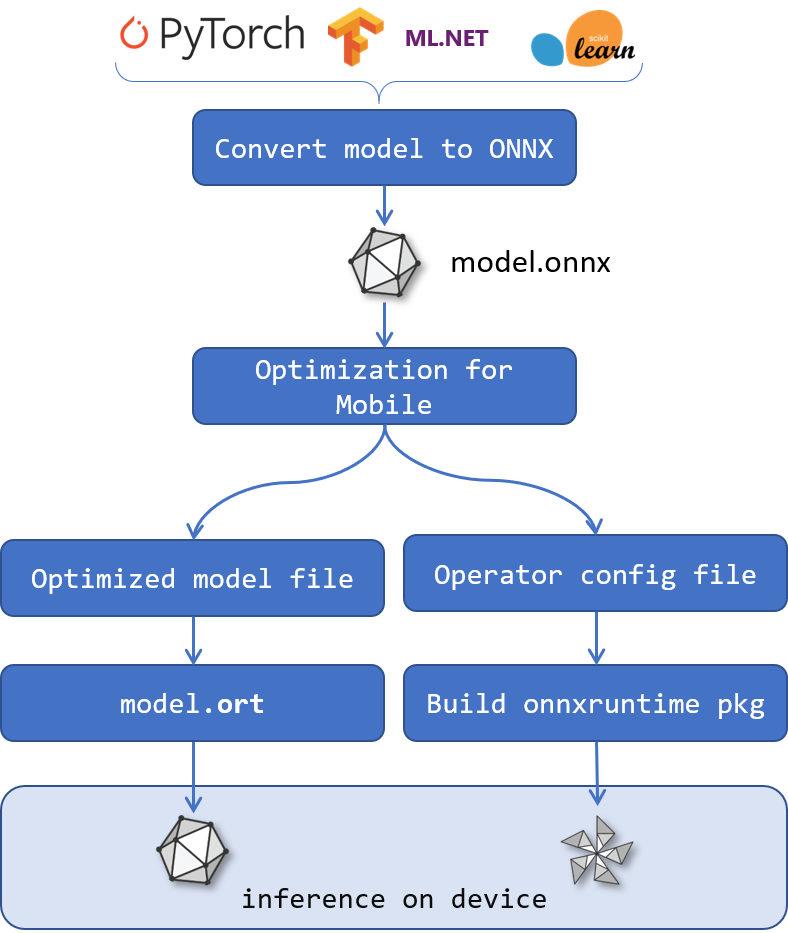

# ONNX Runtime for Mobile Platforms

## Overview



ONNX Runtime now supports an internal model format to minimize the build size for usage in mobile and embedded scenarios. An ONNX model can be converted to an internal ONNX Runtime format ('ORT format model') using the below instructions.

The minimal build can be used with any ORT format model, provided that the kernels for the operators used in the model were included in the build.
    i.e. the custom build provides a set of kernels, and if that set satisfies a given ORT format model's needs, the model can be loaded and executed.

## Steps to create model and minimal build

You will need a script from the the ONNX Runtime repository, and to also perform a custom build, so you will need to clone the repository locally. See [here](https://github.com/microsoft/onnxruntime/blob/master/BUILD.md#prerequisites) for initial steps.

The directory the ONNX Runtime repository was cloned into is referred to as `<ONNX Runtime repository root>` in this documentation.

Once you have cloned the repository, perform the following steps to create a minimal build of ONNX Runtime that is model specific:

### 1. Create ORT format model and configuration file with required operators

We will use a helper python script to convert ONNX format models into ORT format models, and to create the configuration file for use with the minimal build.
This will require the standard ONNX Runtime python package to be installed.

  - Install the ONNX Runtime nightly python package from https://test.pypi.org/project/ort-nightly/
    - e.g. `pip install -i https://test.pypi.org/simple/ ort-nightly`
    - ensure that any existing ONNX Runtime python package was uninstalled first, or use `-U` with the above command to upgrade an existing package
    - using the nightly package is temporary until ONNX Runtime version 1.5 is released
  - Copy all the ONNX models you wish to convert and use with the minimal build into a directory
  - Convert the ONNX models to ORT format 
    - `python <ONNX Runtime repository root>/tools/python/convert_onnx_models_to_ort.py <path to directory containing one or more .onnx models>`
      - For each ONNX model an ORT format model will be created with '.ort' as the file extension.
      - A `required_operators.config` configuration file will also be created.

Example:

Running `'python <ORT repository root>/tools/python/convert_onnx_model_to_ort.py /models'` where the '/models' directory contains ModelA.onnx and ModelB.onnx
  - Will create /models/ModelA.ort and /models/ModelB.ort
  - Will create /models/required_operators.config/

### 2. Create the minimal build

You will need to build ONNX Runtime from source to reduce the included operator kernels and other aspects of the binary. 

See [here](https://github.com/microsoft/onnxruntime/blob/master/BUILD.md#start-baseline-cpu) for the general ONNX Runtime build instructions. 

#### Binary size reduction options:

The follow options can be used to reduce the build size. Enable all options that your scenario allows.
  - Reduce build to required operator kernels
    - Add `--include_ops_by_config <config file produced by step 1>` to the build parameters.
    - See the documentation on the [Reduced Operator Kernel build](Reduced_Operator_Kernel_build.md) for more information. This step can also be done pre-build if needed.

  - Enable minimal build (`--minimal_build`)
    - A minimal build will ONLY support loading and executing ORT format models. 
    - RTTI is disabled by default in this build, unless the Python bindings (`--build_wheel`) are enabled. 

  - Disable exceptions (`--disable_exceptions`)
    - Disables support for exceptions in the build.
      - Any locations that would have thrown an exception will instead log the error message and call abort(). 
      - Requires `--minimal_build`.
      - NOTE: This is not a valid option if you need the Python bindings (`--build_wheel`) as the Python Wheel requires exceptions to be enabled.
    - Exceptions are only used in ORT for exceptional things. If you have validated the input to be used, and validated that the model can be loaded, it is unlikely that ORT would throw an exception unless there's a system level issue (e.g. out of memory). 

  - ML op support (`--disable_ml_ops`)
    - Whilst the operator kernel reduction script will disable all unused ML operator kernels, additional savings can be achieved by removing support for ML specific types. If you know that your model has no ML ops, or no ML ops that use the Map type, this flag can be provided. 
    - See the specs for the [ONNX ML Operators](https://github.com/onnx/onnx/blob/master/docs/Operators-ml.md) if unsure.

  - Use shared libc++ on Android (`--android_cpp_shared`)
    - Building using the shared libc++ library instead of the default static libc++ library will result in a smaller libonnxruntime.so library.
    - See [Android NDK documentation](https://developer.android.com/ndk/guides/cpp-support) for more information.

#### Build Configuration 

The `MinSizeRel` configuration will produce the smallest binary size.
The `Release` configuration could also be used if you wish to prioritize performance over binary size.

#### Example build commands

##### Windows

`<ONNX Runtime repository root>\build.bat --config=MinSizeRel --cmake_generator="Visual Studio 16 2019" --build_shared_lib --minimal_build --disable_ml_ops --disable_exceptions --include_ops_by_config <config file produced by step 1>`

##### Linux

`<ONNX Runtime repository root>/build.sh --config=MinSizeRel --build_shared_lib --minimal_build --disable_ml_ops --disable_exceptions --include_ops_by_config <config file produced by step 1>`

##### Building ONNX Runtime Python Wheel as part of Minimal build

Remove `--disable_exceptions` (Python requires exceptions to be enabled) and add `--build_wheel` to build a Python Wheel with the ONNX Runtime bindings. 
A .whl file will be produced in the build output directory under the `<config>/dist` folder.

  - The Python Wheel for a Windows MinSizeRel build using build.bat would be in `<ONNX Runtime repository root>\build\Windows\MinSizeRel\MinSizeRel\dist\`
  - The Python Wheel for a Linux MinSizeRel build using build.sh would be in `<ONNX Runtime repository root>/build/Linux/MinSizeRel/dist/`

The wheel can be installed using `pip`. Adjust the following command for your platform and the whl filename.
  -  `pip install -U .\build\Windows\MinSizeRel\MinSizeRel\dist\onnxruntime-1.4.0-cp37-cp37m-win_amd64.whl`

## Executing ORT format models

The API for executing ORT format models is the same as for ONNX models. See the [ONNX Runtime API documentation](https://github.com/Microsoft/onnxruntime/#api-documentation).

If you provide a filename for the ORT format model, a file extension of '.ort' will be inferred to be an ORT format model.
If you provide in-memory bytes for the ORT format model, a marker in those bytes will be checked to infer if it's an ORT format model.

If you wish to explicitly say that the InferenceSession input is an ORT format model you can do so via SessionOptions.

C++ API
```C++
Ort::SessionOptions session_options;
session_options.AddConfigEntry('session.load_model_format', 'ORT');
```

Python
```python
so = onnxruntime.SessionOptions()
so.add_session_config_entry('session.load_model_format', 'ORT')
session = onnxruntime.InferenceSession(<path to model>, so)
```

## Limitations

A minimal build has the following limitations currently:
  - No support for ONNX format models
    - Model must be converted to ORT format
  - No support for runtime optimizations
    - Optimizations should be performed prior to conversion to ORT format
  - No support for runtime partitioning (assigning nodes in a model to an execution provider)
    - Execution providers that will be used at runtime must be enabled when creating the ORT format model
  - Only supports execution providers that have statically registered kernels
    - e.g. ORT CPU and CUDA execution providers
    - Execution providers that dynamically compile nodes in the graph into custom kernels at runtime are not supported
  - No support for custom operators

We do not currently offer backwards compatibility guarantees for ORT format models, as we will be expanding the capabilities in the short term and may need to update the internal format in an incompatible manner to accommodate these changes. You may need to regenerate the ORT format models to use with a future version of ONNX Runtime. Once the feature set stabilizes we will provide backwards compatibility guarantees.

