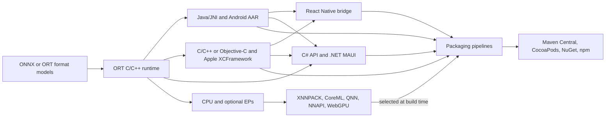
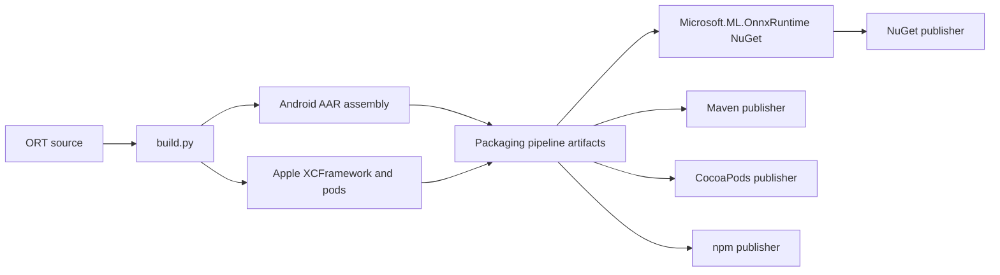

# ONNX Runtime Mobile Infrastructure

This document is a high-level map of the ONNX Runtime (ORT) pieces used to deliver inference on Android, iOS, and
other mobile environments. It is intended for an ORT developer who needs to find the relevant source, build, test,
packaging, and publishing infrastructure.

## Mental model

"ORT Mobile" is primarily a deployment scenario, not a separate runtime. Mobile packages use the same C/C++ runtime,
language bindings, model formats, and Execution Provider (EP) framework as other ORT deployments. The mobile-specific
parts are the platform bindings and packages, cross-compilation settings, hardware EPs, device tests, and binary-size
work.

## Current state

| Area | State |
| --- | --- |
| Android | The `onnxruntime-android` AAR is the primary package. It exposes the Java API through JNI and also contains headers and native libraries for C/C++ consumers. |
| iOS | The `onnxruntime-c` and `onnxruntime-objc` CocoaPods are built around an Apple XCFramework. The Objective-C API is also consumable from Swift. |
| macOS and Mac Catalyst | The Objective-C binding and CoreML EP support Apple desktop platforms as well as iOS. The CocoaPods XCFramework includes macOS slices, while the XCFramework embedded in the `Microsoft.ML.OnnxRuntime` NuGet package includes Mac Catalyst slices instead. See [Apple](#apple). |
| C# and .NET MAUI | The `Microsoft.ML.OnnxRuntime` NuGet package supports MAUI applications on Android and iOS. It depends on `Microsoft.ML.OnnxRuntime.Managed` for the C# API and includes platform-native artifacts and MSBuild targets that add the Android AAR or Apple XCFramework to the application. The package also declares a Mac Catalyst target. |
| CoreML EP | Available on macOS and iOS and included in the standard Apple framework build settings. The EP can convert supported graph partitions to the legacy Core ML `NeuralNetwork` representation or the current `ML Program` representation. `NeuralNetwork` remains the default; `ML Program` requires Core ML 5 or later and must be selected through the provider options. |
| WebGPU EP | Available on mobile platforms through Dawn backends: Vulkan on Android and Metal on iOS/macOS. The standard Android AAR enables it, while the standard Apple framework settings do not. It can also be used through `onnxruntime-web` where the mobile browser provides WebGPU. Native package inclusion and browser support are separate concerns and must both be checked for the target scenario. |
| QNN EP | Owned by Qualcomm and available from the [`onnxruntime/onnxruntime-qnn`](https://github.com/onnxruntime/onnxruntime-qnn) repository. That repository is the authoritative location for QNN EP development, hardware acceleration, and advanced Qualcomm-device functionality. |
| NNAPI EP | Google has deprecated NNAPI. The ORT NNAPI EP remains in the tree for compatibility and still has CI coverage, but it is not under active feature development. New Android acceleration work should not assume NNAPI investment. |
| React Native | Source and Android/iOS end-to-end CI remain in the repository. The `onnxruntime-react-native` package has not been published since 1.24.3 (March 2026). There is no current scenario driving publication priority, and the team lacks dedicated React Native expertise. Treat the binding as unstaffed and do not assume that repository CI implies a current npm release. |
| Legacy ORT Mobile packages | The reduced-operator `onnxruntime-mobile`, `onnxruntime-mobile-c`, and `onnxruntime-mobile-objc` packages are historical. Their last release was ORT 1.18; ORT 1.19 produced only dev builds. Current mobile packages are full builds by default and can be custom-built for a smaller footprint. |

## Code and package map

| Concern | Main locations | Notes |
| --- | --- | --- |
| Core runtime and public C/C++ API | [`onnxruntime/core`](../onnxruntime/core), [`include/onnxruntime/core/session`](../include/onnxruntime/core/session) | Shared by mobile and non-mobile deployments. |
| Android Java API and JNI | [`java/src/main/java/ai/onnxruntime`](../java/src/main/java/ai/onnxruntime), [`java/src/main/native`](../java/src/main/native), [`java/src/main/android`](../java/src/main/android) | Packaged as `com.microsoft.onnxruntime:onnxruntime-android`. |
| Android AAR assembly | [`tools/ci_build/github/android/build_aar_package.py`](../tools/ci_build/github/android/build_aar_package.py), [`java/build-android.gradle`](../java/build-android.gradle) | Builds native libraries for each ABI and uses Gradle to assemble a local Maven layout. |
| Apple Objective-C API | [`objectivec`](../objectivec) | Wraps the C API and is used by the `onnxruntime-objc` pod. |
| Apple framework and pods | [`tools/ci_build/github/apple`](../tools/ci_build/github/apple) | Builds the XCFramework and assembles `onnxruntime-c` and `onnxruntime-objc` pod artifacts. |
| C# API and MAUI package targets | [`csharp/src/Microsoft.ML.OnnxRuntime`](../csharp/src/Microsoft.ML.OnnxRuntime), [`csharp/src/Microsoft.ML.OnnxRuntime/targets`](../csharp/src/Microsoft.ML.OnnxRuntime/targets), [`tools/nuget/generate_nuspec_for_native_nuget.py`](../tools/nuget/generate_nuspec_for_native_nuget.py) | Builds the managed API package and packages Android/iOS native artifacts and target files for `Microsoft.ML.OnnxRuntime`. |
| React Native binding | [`js/react_native`](../js/react_native) | TypeScript API with Android Java and iOS Objective-C bridges. It consumes the Android AAR and `onnxruntime-c` pod. |
| Model conversion and reduced-op configuration | [`tools/python/util/convert_onnx_models_to_ort.py`](../tools/python/util/convert_onnx_models_to_ort.py), [`tools/python/create_reduced_build_config.py`](../tools/python/create_reduced_build_config.py) | Produces ORT format models and/or the required-operator configuration used by reduced builds. |
| Android custom-build helper | [`tools/android_custom_build`](../tools/android_custom_build) | Docker-based helper around model conversion and custom AAR creation. |

### Mobile-relevant Execution Providers

| EP | Platforms and role | Source/build entry points | Development status |
| --- | --- | --- | --- |
| CPU | Universal fallback and reference path. | [`onnxruntime/core/providers/cpu`](../onnxruntime/core/providers/cpu) | Active. |
| CoreML | Apple acceleration for iOS and macOS, including Apple Neural Engine use where supported. Supports the legacy `NeuralNetwork` and current `ML Program` Core ML model representations. `ML Program` is selected with `COREML_FLAG_CREATE_MLPROGRAM` or the equivalent `ModelFormat=MLProgram` provider option. | [`onnxruntime/core/providers/coreml`](../onnxruntime/core/providers/coreml), [`include/onnxruntime/core/providers/coreml/coreml_provider_factory.h`](../include/onnxruntime/core/providers/coreml/coreml_provider_factory.h), [`cmake/onnxruntime_providers_coreml.cmake`](../cmake/onnxruntime_providers_coreml.cmake) | Active. |
| WebGPU | Cross-platform GPU execution through Dawn. Mobile backends are Vulkan on Android and Metal on iOS/macOS. | [`onnxruntime/core/providers/webgpu`](../onnxruntime/core/providers/webgpu), [`cmake/onnxruntime_providers_webgpu.cmake`](../cmake/onnxruntime_providers_webgpu.cmake) | Active. The standard Android AAR build settings currently enable it. Browser use is delivered through `onnxruntime-web`. |
| QNN | Qualcomm acceleration and advanced functionality for Qualcomm devices. The EP is owned by Qualcomm and developed in [`onnxruntime/onnxruntime-qnn`](https://github.com/onnxruntime/onnxruntime-qnn). | The external QNN repository is authoritative. Existing ORT integration paths include [`onnxruntime/core/providers/qnn`](../onnxruntime/core/providers/qnn) and [`tools/ci_build/github/android/default_qnn_aar_build_settings.json`](../tools/ci_build/github/android/default_qnn_aar_build_settings.json). | Qualcomm-owned. Use the external repository for current development and distribution guidance; QNN is not part of the standard Android AAR. |
| XNNPACK | Optimized CPU execution on Android and iOS. ORT's integration is intentionally limited and simplistic: it uses individual XNNPACK kernels rather than treating XNNPACK as a broad graph accelerator. It was added as a gap fill for floating-point operators that did not have MLAS implementations on ARM. | [`onnxruntime/core/providers/xnnpack`](../onnxruntime/core/providers/xnnpack), [`cmake/onnxruntime_providers_xnnpack.cmake`](../cmake/onnxruntime_providers_xnnpack.cmake) | Minimal development. Included in standard Android and iOS build settings, but its limited kernel coverage should be considered when selecting an EP. |
| NNAPI | Android platform acceleration API. | [`onnxruntime/core/providers/nnapi`](../onnxruntime/core/providers/nnapi), [`cmake/onnxruntime_providers_nnapi.cmake`](../cmake/onnxruntime_providers_nnapi.cmake) | Compatibility only. Deprecated by Google and not under active ORT feature development. |

## Build infrastructure

[`tools/ci_build/build.py`](../tools/ci_build/build.py) is the common build driver. Relevant options include `--android`,
`--ios`, `--macos`, `--build_java`, `--build_apple_framework`, `--use_coreml`, `--use_xnnpack`, `--use_nnapi`,
`--use_qnn`, and `--use_webgpu`.

### Android

The normal package entry point is
[`build_aar_package.py`](../tools/ci_build/github/android/build_aar_package.py). Its JSON settings define the ABIs, SDK
levels, and build flags for every native build that is placed in the AAR.

- [`default_full_aar_build_settings.json`](../tools/ci_build/github/android/default_full_aar_build_settings.json) builds
  `armeabi-v7a`, `arm64-v8a`, `x86`, and `x86_64` and currently enables NNAPI, XNNPACK, and WebGPU.
- [`default_qnn_aar_build_settings.json`](../tools/ci_build/github/android/default_qnn_aar_build_settings.json) is the
  existing ORT-side Qualcomm package configuration. For current QNN EP build and distribution guidance, use the
  Qualcomm-owned [`onnxruntime-qnn`](https://github.com/onnxruntime/onnxruntime-qnn) repository.
- [`java/build-android.gradle`](../java/build-android.gradle) defines the AAR and Maven publication metadata.

### Apple

[`build_apple_framework.py`](../tools/ci_build/github/apple/build_apple_framework.py) cross-builds the Apple slices and
combines them into an XCFramework. [`build_and_assemble_apple_pods.py`](../tools/ci_build/github/apple/build_and_assemble_apple_pods.py)
then stages the C/C++ and Objective-C pods.

- [`default_full_apple_framework_build_settings.json`](../tools/ci_build/github/apple/default_full_apple_framework_build_settings.json)
  is the default for the CocoaPods packaging pipeline. It covers iOS device, iOS simulator, and macOS slices and enables
  CoreML and XNNPACK on every slice.
- [`default_full_ios_framework_build_settings.json`](../tools/ci_build/github/apple/default_full_ios_framework_build_settings.json)
  builds the XCFramework embedded in the `Microsoft.ML.OnnxRuntime` NuGet package. It covers iOS device, iOS
  simulator, and Mac Catalyst slices and enables CoreML; the iOS slices also enable XNNPACK.

The pods and the NuGet package therefore ship different Apple slices. Only the NuGet XCFramework supports Mac
Catalyst, and only the pods include macOS.
- [`tools/ci_build/github/apple/c`](../tools/ci_build/github/apple/c) and
  [`tools/ci_build/github/apple/objectivec`](../tools/ci_build/github/apple/objectivec) contain pod metadata and assembly
  scripts.

### C# and .NET MAUI

The `Microsoft.ML.OnnxRuntime` NuGet package is the mobile entry point for C# applications, including .NET MAUI. For
the standard package, the managed project enables `net9.0-android`, `net9.0-ios`, and `net9.0-maccatalyst` when mobile
targets are included; the desktop-only build disables them. These conditions are defined in
[`Microsoft.ML.OnnxRuntime.csproj`](../csharp/src/Microsoft.ML.OnnxRuntime/Microsoft.ML.OnnxRuntime.csproj).

[`generate_nuspec_for_native_nuget.py`](../tools/nuget/generate_nuspec_for_native_nuget.py) places the Android AAR
under `runtimes/android/native` and the Apple XCFramework archive under `runtimes/ios/native`. NuGet imports the
platform-specific MSBuild files automatically. The native package also depends on the separately produced
`Microsoft.ML.OnnxRuntime.Managed` package, which supplies the C# API.

- [`net9.0-android/targets.xml`](../csharp/src/Microsoft.ML.OnnxRuntime/targets/net9.0-android/targets.xml) adds the AAR
  as an `AndroidLibrary` for Android applications.
- [`net9.0-ios/targets.xml`](../csharp/src/Microsoft.ML.OnnxRuntime/targets/net9.0-ios/targets.xml) adds the XCFramework
  as a static `NativeReference`, links the C++ runtime, and weak-links CoreML.
- [`net9.0-maccatalyst`](../csharp/src/Microsoft.ML.OnnxRuntime/targets/net9.0-maccatalyst) relies on the .NET runtime
  identifier graph to resolve the Apple native asset.

Application code uses the same `Microsoft.ML.OnnxRuntime` managed API as desktop C#. Available EPs are determined by
the native artifact embedded in the NuGet package.

## Binary size and model format

Start development with a full package. Only move to a custom build after the model and target EPs are working, because
operator reduction can turn a model change into a runtime compatibility change.

The main size controls are documented in [Custom build](https://onnxruntime.ai/docs/build/custom.html) and
[Reduced operator kernel build](Reduced_Operator_Kernel_build.md). Minimal builds and operator/type reduction are
separate choices:

- Every minimal build (`--minimal_build`, including basic and extended levels) supports only ORT format models.
- Operator reduction with `--include_ops_by_config` can be used without `--minimal_build`. This removes unused kernels
  while retaining the full runtime's support for both ONNX and ORT format models.
- Type reduction with `--enable_reduced_operator_type_support` is also independent of `--minimal_build`, but it requires
  `--include_ops_by_config` because the types are read from that file. The most reliable type information comes from
  ORT format conversion because ONNX models are not guaranteed to contain the
  required per-node type information.

A typical size-reduction workflow is:

1. Decide whether the application requires a minimal build or only operator/type reduction. Convert every model to ORT
   format if using any minimal-build level.
2. Generate a required-operator configuration from all models shipped by the application.
3. Pass that file with `--include_ops_by_config` to remove unused kernels.
4. Optionally enable reduced operator type support.
5. Independently consider `--disable_ml_ops`, `--disable_exceptions`, `--disable_rtti`, and a `MinSizeRel` build.
6. On Android, consider `--android_cpp_shared` when the application can provide the shared C++ runtime.

The Android and Apple package scripts accept custom build settings and a required-operator configuration, so a custom
package should continue to use those scripts rather than assembling native files by hand. Full builds support ONNX and
ORT format models. A non-minimal build with reduced operators and/or types retains ONNX format support. Every minimal
build requires ORT format models.

The published `Microsoft.ML.OnnxRuntime` NuGet consumes the full Android AAR and Apple XCFramework packaging
artifacts. A reduced custom runtime for a MAUI application therefore requires rebuilding the native package inputs and
the NuGet package; adding the normal NuGet reference alone does not produce an operator-reduced runtime.

## Continuous integration and tests

Mobile CI definitions are under [`.github/workflows`](../.github/workflows):

| Workflow | What it covers |
| --- | --- |
| [`android.yml`](../.github/workflows/android.yml) | Android CPU and NNAPI builds/tests, emulator execution, minimal-build coverage, and an Android binary-size threshold. NNAPI CI is compatibility coverage, not evidence of new EP investment. |
| [`ios.yml`](../.github/workflows/ios.yml) | iOS simulator framework build with CPU, CoreML, and XNNPACK. |
| [`react_native.yml`](../.github/workflows/react_native.yml) | Builds an Android AAR and Apple pod, then runs React Native Android and iOS end-to-end tests. This validates the source tree but does not publish npm packages. |
| [`linux_minimal_build.yml`](../.github/workflows/linux_minimal_build.yml) | Linux reduced/minimal-build checks, including a build with `--use_coreml` and an Android arm64 extended minimal build with NNAPI and exceptions disabled. The Android binary-size check is in `android.yml`. |

The NuGet packaging tests remain in Azure Pipelines. [`nuget/templates/test_android.yml`](../tools/ci_build/github/azure-pipelines/nuget/templates/test_android.yml)
builds a MAUI Android APK from the produced `Microsoft.ML.OnnxRuntime` package, uploads it to BrowserStack, and runs
the device tests from
[`Microsoft.ML.OnnxRuntime.Tests.BrowserStack.Android`](../csharp/test/Microsoft.ML.OnnxRuntime.Tests.BrowserStack.Android). The package contains iOS and Mac Catalyst targets, but the current MAUI test project and pipeline do
not provide an equivalent iOS or Mac Catalyst device lane.

Important test code includes:

- [`java/src/test/android`](../java/src/test/android) for consuming and exercising Android AARs.
- [`onnxruntime/test/platform/apple/apple_package_test`](../onnxruntime/test/platform/apple/apple_package_test) for Apple
  package consumption through CocoaPods.
- [`js/react_native/e2e`](../js/react_native/e2e) for Detox-based Android and iOS application tests.
- [`csharp/test/Microsoft.ML.OnnxRuntime.Tests.MAUI`](../csharp/test/Microsoft.ML.OnnxRuntime.Tests.MAUI) for consuming
  the NuGet package from a MAUI application. Its active CI target is Android.
- Provider unit tests under [`onnxruntime/test/providers`](../onnxruntime/test/providers), which are built into the shared `onnxruntime_provider_test` binary.

Mobile hardware behavior is not fully represented by simulators and emulators. Changes to CoreML, QNN, WebGPU, or
device-specific performance should also be validated on representative physical hardware.
The listed Android and iOS workflows do not provide dedicated native WebGPU mobile coverage.

### Android binary-size guardrail

[`android.yml`](../.github/workflows/android.yml) passes a hardcoded maximum size through
`--threshold_size_in_bytes` to
[`build_ort_and_check_binary_size.py`](../tools/ci_build/github/linux/ort_minimal/build_ort_and_check_binary_size.py).
The checker uses the ELF section total for finer-grained measurement than the on-disk file size and fails CI when the
minimal Android binary exceeds the threshold.

[`binary-size-checks-pipeline.yml`](../tools/ci_build/github/azure-pipelines/binary-size-checks-pipeline.yml) is the
pre-migration Azure Pipelines version of this check. `android.yml` replaced it in April 2025 (#24534), and its
threshold has not been updated since 2023. Only the `android.yml` threshold is maintained.

The threshold is a guardrail for awareness, not an expectation that the binary will never grow. New functionality
naturally increases size over time; the important case is a large increase in one pull request. Size growth is only
investigated when the check fails, so the headroom left above the measured size determines how large a jump can pass
unnoticed. Large jumps are often caused by inefficient template instantiation or similar duplication that can be
refactored.

When the check fails:

1. Review the pull request that introduced the growth and determine which code contributes the increase.
2. Reduce avoidable growth before changing the threshold, particularly duplicated or inefficiently templatized code.
3. If the remaining increase is justified, update the threshold in `android.yml` to the new measured size plus a 2 KB
   buffer (2,048 bytes).

Routine threshold increases have typically been 1-2 KB, so a 2 KB buffer absorbs a small change or two while
ensuring a larger single-change regression trips the check. It is easier to address a significant increase in the
introducing pull request than to find equivalent savings months later.

## Packaging and publishing

Packaging and publishing are separate stages. GitHub Actions provide most pull-request CI. Azure Pipelines create
release artifacts, and dedicated release pipelines publish those artifacts to public registries.

### Artifact creation in the ORT repository

The original Azure Pipeline definitions remain under
[`tools/ci_build/github/azure-pipelines`](../tools/ci_build/github/azure-pipelines) while pipeline migration is in
progress.

| Artifact | Primary definitions |
| --- | --- |
| Android AAR | [`templates/c-api-cpu.yml`](../tools/ci_build/github/azure-pipelines/templates/c-api-cpu.yml) invokes [`templates/android-java-api-aar.yml`](../tools/ci_build/github/azure-pipelines/templates/android-java-api-aar.yml) with the full AAR settings and publishes the `onnxruntime-android-full-aar` pipeline artifact. |
| Apple pods | [`mac-ios-packaging-pipeline.yml`](../tools/ci_build/github/azure-pipelines/mac-ios-packaging-pipeline.yml) invokes [`templates/stages/mac-ios-packaging-build-stage.yml`](../tools/ci_build/github/azure-pipelines/templates/stages/mac-ios-packaging-build-stage.yml) to build/test the XCFramework and stage `onnxruntime-c` and `onnxruntime-objc`. |
| `Microsoft.ML.OnnxRuntime` NuGet | [`templates/c-api-cpu.yml`](../tools/ci_build/github/azure-pipelines/templates/c-api-cpu.yml) consumes `onnxruntime-android-full-aar` and `onnxruntime-ios-full-xcframework`, then [`generate_nuspec_for_native_nuget.py`](../tools/nuget/generate_nuspec_for_native_nuget.py) places those assets and the MAUI targets in the CPU NuGet artifact. |
| React Native npm artifact | [`stages/npm-packaging-stage.yml`](../tools/ci_build/github/azure-pipelines/stages/npm-packaging-stage.yml) has an `EnableReactNative` switch, disabled by default, and uses [`templates/react-native-ci.yml`](../tools/ci_build/github/azure-pipelines/templates/react-native-ci.yml). |

### Registry publication in `release-pipelines`

Publishing definitions are being migrated to the internal
[`release-pipelines`](https://aiinfra.visualstudio.com/Lotus/_git/release-pipelines) repository. The relevant release
definitions are:

| Registry/package | `release-pipelines` definition | Behavior |
| --- | --- | --- |
| CocoaPods: `onnxruntime-c`, `onnxruntime-objc` | `converted-pipelines/aiinfra/Lotus/classicRelease/14/aiinfra-Lotus-14.yml` | Consumes Apple packaging artifacts, uploads pod archives, updates podspecs, and runs `pod trunk push`. |
| NuGet: `Microsoft.ML.OnnxRuntime` | `onnxruntime_publish_nuget.yml` | Publishes the CPU NuGet artifact, including the MAUI Android/iOS assets, to NuGet.org or the configured ADO feed. |
| npm: web, node, optional React Native | `converted-pipelines/aiinfra/Lotus/classicRelease/26/aiinfra-Lotus-26.yml` | React Native publication is opt-in and has two gates: `PUBLISH_REACT_NATIVE_PACKAGE` (default `false`) downloads the artifact, and `RELEASE_PACKAGES` (default `web,node`) must also include `react-native` for the package to be published. |
| Maven Central: Android and Java | `converted-pipelines/aiinfra/Lotus/classicRelease/71/aiinfra-Lotus-71.yml` | Consumes `onnxruntime-android-full-aar` and Java artifacts and releases them through ESRP. |

## Documentation and starting points

- [Get started with ORT Mobile](https://onnxruntime.ai/docs/get-started/with-mobile.html) is the public mobile landing
  page.
- [Deploy on mobile](https://onnxruntime.ai/docs/tutorials/mobile/) covers package selection and mobile tutorials.
- [Install ONNX Runtime](https://onnxruntime.ai/docs/install/) lists the Android AAR, Apple pods, and
  `Microsoft.ML.OnnxRuntime` NuGet package used by C# MAUI applications.
- [Build for Android](https://onnxruntime.ai/docs/build/android.html) and
  [build for iOS](https://onnxruntime.ai/docs/build/ios.html) cover platform prerequisites.
- [Custom build](https://onnxruntime.ai/docs/build/custom.html) is the main binary-size guide.
- [ORT model format](https://onnxruntime.ai/docs/performance/model-optimizations/ort-format-models.html) explains model
  conversion and required-operator configuration generation.
- [WebGPU EP](https://onnxruntime.ai/docs/execution-providers/WebGPU-ExecutionProvider.html) documents native platform
  backends and build options.
- [`Android_testing.md`](Android_testing.md) describes testing Android changes with the emulator.
- [`js/react_native/README.md`](../js/react_native/README.md) describes local React Native development and testing;
  its install examples should be read together with the publication status above.
