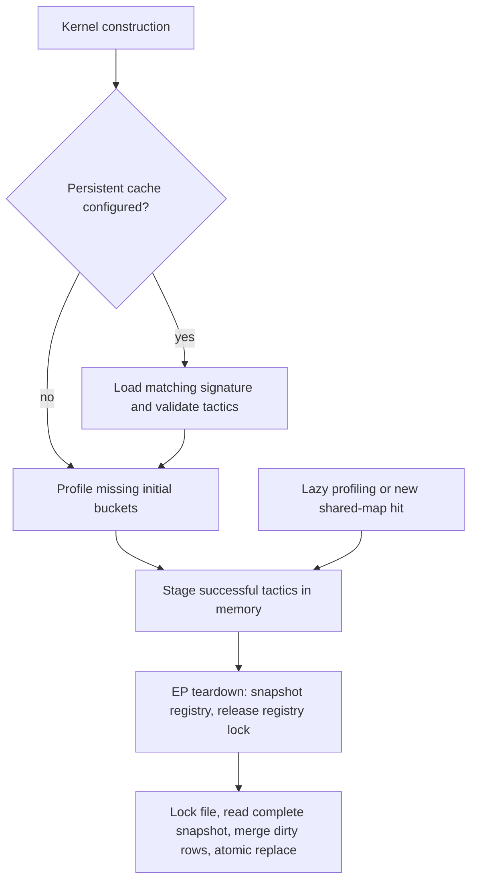

# fpA_intB / QMoE GEMM Tactic Autotune Cache — Design & Plan

## 1. Scope and motivation

This PR implements persistent tactic caching for **MatMulNBits fpA_intB only**.
QMoE caching and automatic model-sidecar selection are future work. The reduced
initial M sweep and lazy profiling already exist in the base branch; persistence
avoids repeating that work in a new process.

## 2. Current implementation

| Concern | Behavior |
|---|---|
| In-process identity | Shape, activation dtype, packing SM, quantization bits/group size, zero points, bias, GEMV support, and GPU name |
| Initial sweep | Small configurable M set, default `{1,2,4,...,2048}`; missing runtime buckets are profiled lazily |
| Persistence | Opt-in MatMulNBits TSV file; no file I/O when no location is configured |
| Reuse guard | GPU name, SM, CUDA runtime, ORT version, and tactic-selection version |
| Loaded tactics | Candidate membership plus an untimed execution on profiler scratch checks problem-specific constraints and compiled kernel support before reuse; buckets above the session's launch limit are skipped |
| Failed profiling | No negative results are saved; old negative rows are ignored and retried |
| Flush boundary | Construction and lazy results are staged in memory, then batched at CUDA EP teardown for both built-in and plugin EPs |
| Shared maps | Newly added buckets observed on exact or rounded hits, including CUDA graph capture, are staged once per attached profiler, including different cache prefixes |
| Concurrency | Only locally changed rows are merged into a complete disk snapshot; read errors preserve the old file and dirty rows; all failed writes clean up their temporary file |

### Startup validation measurement

On an H200 with CUDA 13.0 and the compact fpA_intB build, a 750 MB synthetic model
with 32 distinct MatMulNBits shapes (`K=8192`, `N=4096,4160,...,6080`) and five M
buckets (`1,8,64,512,2048`) took 3.01 s to construct cold. Three fresh-process
cached runs took 1.79–1.96 s (median 1.82 s); forcing 64-row chunks reduced cached
startup to 1.74 s by skipping the larger validation buckets. These are total
session-construction times, including model loading and weight packing, not
isolated validation timings. All problem-specific execution checks remain enabled;
stream/scratch reuse is deferred pending evidence that validation dominates startup.

## 3. Goals / non-goals

**Goals (including future work)**
- Reduce first-time tuning by profiling a small, configurable set of M buckets.
- Persist tuned tactics to disk and reuse across sessions.
- Deduplicate identical shapes across nodes (single cache entry per unique problem).
- Reuse only on the *same* GPU model + SM + toolkit/runtime version.
- Optionally attach the cache to the model.
- Provide an offline tuning tool.
- Keep persistent filesystem writes opt-in unless an explicit cache directory/prefix is configured.

**Non-goals**
- Changing kernel implementations or the tactic search space.
- Sharing tactics across different GPUs or CUDA/ORT versions.
- Persisting prepacked weights (a separate concern).

## 3.1 Priority

Implement the cache in this order:

1. **MatMulNBits fpA_intB first.** This path pays the broad first-time profile sweep at kernel
   construction and is the clearest startup-time win.
2. **QMoE grouped GEMM second.** Production QMoE currently calls `MoeGemmProfiler` for grouped-GEMM
   tactic selection, including integer W4A16/W8A16 grouped GEMM and FP4/FP8 modes when they route
   through the grouped-GEMM runner. The MoE GEMV fast path itself does not need profiling, but the
   current QMoE compute path selects grouped-GEMM tactics before the runner can fall through to GEMV.
   Therefore QMoE caching is useful, but lower priority than MatMulNBits unless QMoE startup tuning
   shows up as the dominant user-visible cost.

## 4. Cache split and serialization format

MatMulNBits and QMoE should use **separate cache tables**. They can be implemented by the same
`gemm_tactic_cache` utility, but the persisted rows should not be forced into one sparse schema:

- MatMulNBits is a single GEMM/GEMV problem keyed by fpA_intB packed shape and quantization mode.
- QMoE is a grouped-GEMM problem keyed by expert topology, activation, bias, parallelism, and GEMM
  role (`Gemm1` or `Gemm2`).

Physical files (only the MatMulNBits table is implemented):

```
<cache_prefix>.matmulnbits_fpa_intb.tsv
<cache_prefix>.qmoe_gemm.tsv  # planned
```

For a user cache directory, `<cache_prefix>` is derived from the hardware/build signature. For a
model sidecar, `<cache_prefix>` is derived from the model path when the model path is known, or from
an explicit `ORT_CUDA_GEMM_TACTIC_CACHE_PREFIX` / session config value.

The cache is small and **naturally tabular**: one row per `(problem_key, M-bucket) → tactic`. The
chosen format is **TSV** (tab-separated) because ORT core has no JSON library, the Python offline
tool must read/write the same file, and `cudaDeviceProp.name` contains spaces (and occasionally
punctuation) that make CSV quoting fragile.

| Format | C++ parse | Python | Debuggable | Evolution | Decision |
|---|---|---|---|---|---|
| **TSV** | trivial split | `csv` stdlib | excellent | map by header name | **Chosen** |
| CSV | trivial | `csv` stdlib | good | good | Rejected (name spaces/commas → quoting) |
| JSON (hand-rolled) | needs a mini-parser (no dep) | native | good | excellent (nested/optional) | Fallback |
| Binary (flatbuffers/proto) | build complexity | needs bindings | none | careful | Rejected (overkill for KB data) |
| INI/key=value | easy | manual | ok | good | Rejected (awkward for repeated rows) |

**MatMulNBits file layout** (`<cache_prefix>.matmulnbits_fpa_intb.tsv`):

```
# ort_cuda_gemm_tactic_cache	v1
# table	matmulnbits_fpa_intb
# tactic_selection_version	3
# device_name	NVIDIA A100-SXM4-80GB
# sm	80
# multiprocessor_count	108
# cuda_runtime	13000
# cuda_driver	13000
# ort_version	1.23.0
# ort_git_commit	<git-sha-or-unknown>
# ort_build_config	Release
n_16b	k	activation_dtype	weight_type	bits	block_size	has_zero_points	zero_point_dtype	gemv_enabled	has_bias	packing_sm	paired_gemv_mode	wave_aware_gemv	m_bucket	valid_config	sm_version	tile80	tile90	tile100	tile120	split_k_style	split_k	stages	cluster	mainloop	epilogue	tma	enable_cuda_kernel	cuda_kernel_variant
12288	4096	half	uint4b_t	4	64	1	uint4b_t	1	0	80	0	0	1	1	80	23	0	0	0	1	1	3	0	0	0	0	1	0
12288	4096	half	uint4b_t	4	64	1	uint4b_t	1	0	80	0	0	64	1	80	17	0	0	0	0	-1	4	0	0	0	0	0	0
...
```

**QMoE file layout** (`<cache_prefix>.qmoe_gemm.tsv  # planned`):

```
# ort_cuda_gemm_tactic_cache	v1
# table	qmoe_gemm
# tactic_selection_version	2
# device_name	NVIDIA A100-SXM4-80GB
# sm	80
# multiprocessor_count	108
# cuda_runtime	13000
# cuda_driver	13000
# ort_version	1.23.0
# ort_git_commit	<git-sha-or-unknown>
# ort_build_config	Release
schema_version	n	k	activation_dtype	weight_dtype	quant_format	gemm_type	num_experts	top_k	activation_type	bias	group_size	parallelism_mode	need_weights	m_bucket	valid_config	sm_version	tile80	tile90	tile100	tile120	split_k_style	split_k	stages	cluster	mainloop	epilogue	tma	enable_cuda_kernel
1	2880	2880	half	uint4b_t	mxfp4	Gemm1	32	4	Swiglu	0	32	default	0	512	1	80	23	0	0	0	0	1	1	3	0	0	0	0	0
...
```

- `#`-prefixed lines carry a cache format version, table name, and hardware/build signature.
- One header row names columns; readers map by **column name** so appended columns are
  backward/forward compatible (unknown columns ignored; missing columns defaulted).
- Enum/config fields are stored as their integer values (mirror of `CutlassGemmConfig`).
- Free-text fields must not contain raw tabs or newlines. Use percent-encoding for `%`, `\t`, and
  `\n` when writing and decode on read.
- `valid_config=0` is understood for format compatibility but ignored on load. Only successful
  tactics are persisted, because a profiling failure can be temporary.
- Writes are atomic: acquire a lock, reload the current file, merge the new rows, write to a temp
  file, then `rename` and release the lock. The lock prevents lost updates from two sessions tuning
  different shapes concurrently.

## 5. Hardware signature

Purpose: reject reuse across different GPU models / SM / toolkit versions.

```
signature = {
  device_name:          cudaDeviceProp.name           // e.g. "NVIDIA GeForce RTX 4090"
  sm:                   major*10 + minor              // e.g. 80, 89, 90
  multiprocessor_count: cudaDeviceProp.multiProcessorCount
  cuda_runtime:         CUDART_VERSION
  cuda_driver:          cudaDriverGetVersion()
  ort_version:          ORT_VERSION
  ort_git_commit:       ORT_GIT_COMMIT or "unknown"
  ort_build_config:     ORT_BUILD_CONFIG or build config string
}
```

- Used both to name the cache file and as a stored guard. On load, a mismatch on
  `device_name` / `sm` / `cuda_runtime` / `ort_version` rejects the file (forces re-profiling).
  `multiprocessor_count`, `cuda_driver`, `ort_git_commit`, and `ort_build_config` are recorded for
  diagnostics only; every loaded CUTLASS tactic is also re-validated against the current runner.
- `tactic_selection_version` (a code constant, not hardware) is also strict. Bump it whenever the
  profiler's selection logic changes (for example, the L2-resident GEMV bias), because dev builds
  keep the same `ort_version` across commits.
- Rationale: RTX 4090 and RTX 4060 are both `sm_89` but perform differently, so the **device name**,
  not just SM, is the primary discriminator — matching the requirement.

## 6. Cache keys (problem keys)

Use op-specific keys rather than a single sparse superset.

```
matmulnbits_key = {
  n_16b, k, activation_dtype, weight_type, bits, block_size,
  has_zero_points, zero_point_dtype, gemv_enabled, has_bias, packing_sm,
  paired_gemv_mode, wave_aware_gemv
}

qmoe_key = {
  n, k, activation_dtype, weight_dtype, quant_format, gemm_type,
  num_experts, top_k, activation_type, bias, group_size,
  parallelism_mode, need_weights
}
```

Each key maps to a set of `(m_bucket → optional<CutlassGemmConfig>)`. Many nodes with the same shape
collapse to one entry. For `MatMulNBits`, `n_16b` is the value used by the existing `GemmIdCore`.
For QMoE, the key includes the profiler parameters that affect `GemmProfilerBackend::init` so that
cache reuse remains conservative.

MatMulNBits keys separate paired-K modes (disabled, autotuned, forced) and wave-aware GEMV
launches. `cuda_kernel_variant` preserves the selected GEMV implementation (0 = default,
1 = paired-K). Selection version 3 rejects older files that cannot represent these choices.

## 7. Implemented architecture

The shared module `contrib_ops/cuda/llm/gemm_tactic_cache.{h,cc}` provides hardware
signatures, TSV encoding, config parsing, and the `MatMulNBitsTacticCache` wrapper.
There is no QMoE wrapper yet.

Location precedence is session prefix, session directory, environment prefix,
then environment directory. This selects one file, not a sequence of fallback
files. No location means in-process caching only.


```mermaid
flowchart TD
  A[Kernel construction] --> B{Persistent cache configured?}
  B -- yes --> C[Load matching signature and validate tactics]
  B -- no --> D[Profile missing initial buckets]
  C --> D
  D --> E[Stage successful tactics in memory]
  F[Lazy profiling or new shared-map hit] --> E
  E --> G[EP teardown: snapshot registry, release registry lock]
  G --> H[Lock file, read complete snapshot, merge dirty rows, atomic replace]
```

## 8. Original roadmap and future extensions

This roadmap includes unimplemented QMoE and model-sidecar work. Section 2 is the
authoritative description of shipped behavior; phases below are not an options list.

### Phase 1 — Foundation (`gemm_tactic_cache.{h,cc}`)
Hardware signature, TSV (de)serialization, `CutlassGemmConfig` serialize/parse, problem key,
file lock, atomic file write, and two typed cache wrappers: MatMulNBits and QMoE. Self-contained and
unit-testable.

### Phase 2 — Wire disk cache into both profilers *(depends on 1)*
- *Strategy*: Wire the `gemm_tactic_cache` utility independently into `GemmPluginProfiler` and `MoeGemmProfiler` rather than attempting a large refactor. The shared cache utility provides a simple `GetConfig(...)` / `PutConfig(...)` API.
- `gemm_profiler.h`: before the M sweep in `profileTactics`, load matching entries and skip if hit;
  after profiling, merge into the disk cache. Re-enable the serialize stubs.
- `matmul_nbits.{h,cc}`: pass `bits / block_size / zero-point mode / gemv_enabled / has_bias / packing_sm`
  into the MatMulNBits key.
- `moe_quantization.cc` + `moe_gemm_profiler.{h,cc}`: use the same disk cache + key; QMoE gains
  cross-node dedup via the shared cache. Add a process-global MoE profiler manager
  mirroring `s_profilerManager` for in-session dedup before the first write to prevent redundant file I/O for models with many MoE nodes.
- Cache directory/prefix is opt-in via env var or session config. If unset, do not write persistent
  files.

### Phase 3 — Reduce first-time M sweep *(parallel with 2)*
- Replace the fixed `1…8291` sweep with a small default bucket set
  `{1,2,4,8,16,32,64,128,256,512,1024,2048}` clamped to `[minM, maxM]`, unioned with exact decode
  `M=1` and `bucketM(maxM)`.
- If runtime asks for an unprofiled bucket, **lazily profile that single bucket** and merge it into the cache. This briefly blocks inference but guarantees optimal performance and handles unprofiled edge cases safely.
- `ORT_FPA_INTB_PROFILE_M` (comma list) overrides the set. Derive `MatMulNBits` `max_m` from
  dims/env instead of the `8291` literal.

### Phase 4 — Optional store-with-model *(depends on 2)*
- Sidecars use the same cache prefix scheme:
  - `"<model_path>.matmulnbits_fpa_intb.tsv"`
  - `"<model_path>.qmoe_gemm.tsv"`
- Writing is opt-in via session config or env var. Because C++ kernels do not always have a reliable
  model path (for example, models loaded from bytes), the core implementation should prefer an
  explicit cache prefix and let the offline Python tool derive `<model_path>.*.tsv` when possible.

### Phase 5 — Offline tuning tool *(depends on 4)*
- `onnxruntime/python/tools/fpa_intb_tune.py` (+ CLI): `--model`, `--output-prefix`, `--m-values`,
  `--no-inference`. Sets session options, builds a CUDA EP session, runs dummy inferences over
  the requested M values to force profiling, releases the session to flush the cache, prints the
  path and tuned shapes.

### Phase 6 — Docs + tests *(depends on 2–5)*
- Document env vars, sidecar format, hardware guard, and the offline tool in
  `docs/contrib_ops/cuda/matmul_nbits.md` and the QMoE docs.
- Unit tests: `CutlassGemmConfig` serialize/parse round-trip; signature-mismatch rejection;
  TSV column-name mapping with an appended column.
- A100 validation: 2nd session reuses cache (profiling skipped, tune time ≈ 0); outputs unchanged;
  many same-shape MoE nodes yield one entry per unique shape.
- The fresh-process Python integration test also runs with the CUDA plugin wheel. It checks
  session-specific selected-tactic reports so import-time plugin log filtering cannot hide cache
  reuse or bucket filtering. Built-in CUDA additionally checks the INFO diagnostics.
- CUDA Python CI installs CPU-only PyTorch for weight-packer parity tests when the transformers
  suite is disabled; compact builds skip only prepacked cases outside their supported contract.

## 9. Supported environment variables & options

| Name | Effect |
|---|---|
| `ORT_CUDA_GEMM_TACTIC_CACHE_DIR` | Directory for persistent cache files. Unset means persistent cache disabled. |
| `ORT_CUDA_GEMM_TACTIC_CACHE_PREFIX` | Explicit file prefix. Writes `<prefix>.matmulnbits_fpa_intb.tsv`. |
| `ORT_FPA_INTB_PROFILE_M` | Comma-separated M buckets to profile (overrides the default set for MatMulNBits/fpA_intB). |
| `ep.cuda.gemm_tactic_cache_dir` | Session-option equivalent of `ORT_CUDA_GEMM_TACTIC_CACHE_DIR`. |
| `ep.cuda.gemm_tactic_cache_prefix` | Session-option equivalent of `ORT_CUDA_GEMM_TACTIC_CACHE_PREFIX`. |
| `ep.cuda.gemm_tactic_cache_tuning_results_prefix` | Optional separate TSV output of this session's selected tactics (including valid cache hits), flushed at EP teardown. The tuning tool uses a fresh temporary prefix to verify that the current model selected successful tactics and that their full settings reached the main cache. No environment-variable fallback. |

## 10. Original roadmap file inventory (includes future work)

**Add**
- `contrib_ops/cuda/llm/gemm_tactic_cache.h` / `.cc`
- `onnxruntime/python/tools/fpa_intb_tune.py`

**Modify**
- `contrib_ops/cuda/llm/gemm_profiler.h` — sweep reduction, cache hooks, re-enable serialize
- `contrib_ops/cuda/llm/cutlass_extensions/gemm_configs.h` — config (de)serialization support
- `contrib_ops/cuda/quantization/matmul_nbits.{h,cc}` — key metadata, `max_m`, sidecar wiring
- `contrib_ops/cuda/moe/moe_quantization.cc`, `llm/moe_gemm/moe_gemm_profiler.{h,cc}` — cache + bucket cut
- `docs/contrib_ops/cuda/matmul_nbits.md`, QMoE docs

Note: normal and plugin CUDA provider builds glob `contrib_ops/cuda/*.cc`, so no explicit CMake edit
is expected for `gemm_tactic_cache.cc`. The new `.cc` still needs a `#if defined(USE_CUDA) && defined(ORT_USE_CUDA_GEMM)` (or analogous) guard
and must avoid dependencies on non-plugin CUDA EP internals.

## 11. Roadmap decisions (not all implemented)

1. **QMoE in-process dedup**: Added to Phase 2. A global MoE profiler manager is necessary to prevent duplicate profiling in the very first session before the cache is cleanly merged.
2. **Cache miss strategy**: Added to Phase 3. Lazy profile of the exact missing bucket is the chosen strategy over nearest-neighbor fallback.
3. **Profiler integration**: Handled via simple utility APIs in both `GemmPluginProfiler` and `MoeGemmProfiler` rather than a unified base class to minimize refactoring risk.

## 12. Open considerations

1. **Strictness of driver/MP checks** — the guard is strict on device name, SM, runtime, and ORT
  version; driver, MP count, git commit, and build config stay diagnostic unless validation shows
  they must be strict.
2. **JSON fallback** — switch to hand-rolled JSON only if nested/optional structure is later required.
