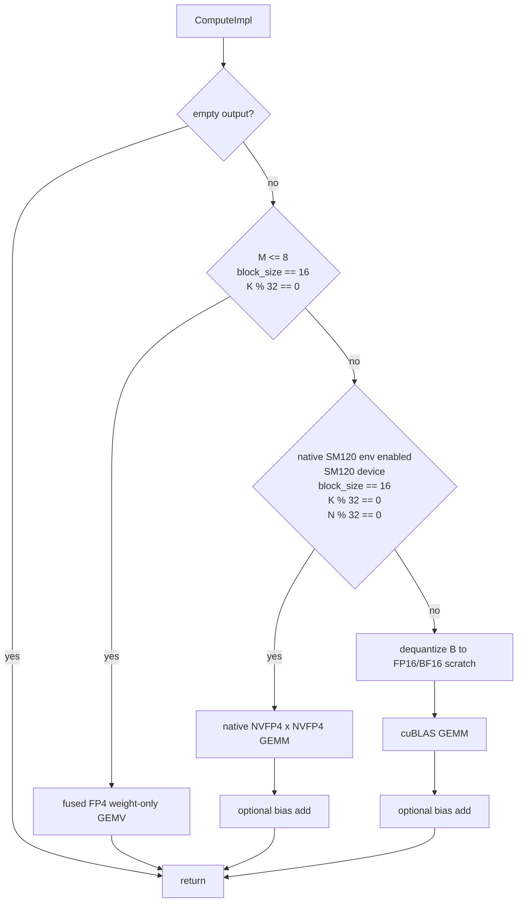

# MatMulBlockScaledFp4 - CUDA Operator Documentation

This document describes the CUDA execution-provider implementation of
**MatMulBlockScaledFp4** (`com.microsoft::MatMulBlockScaledFp4`): its tensor
format, dispatch chain, native Blackwell path, prepacking behavior, and test /
benchmark workflow.

MatMulBlockScaledFp4 computes `Y = A * dequant(B)^T (+ bias)` where `A` is
FP16 or BF16 and `B` is an `N x K` weight matrix stored as packed NVIDIA FP4
E2M1 values with block-wise E4M3 scales. The default semantics are
weight-only FP4: activations stay FP16/BF16. An opt-in SM120 path quantizes
activations to NVFP4 internally and uses native block-scaled tensor cores.

Source files:

- [onnxruntime/contrib_ops/cuda/math/matmul_block_scaled_fp4.cc](../../../onnxruntime/contrib_ops/cuda/math/matmul_block_scaled_fp4.cc) - operator, validation, dispatch, and `PrePack`.
- [onnxruntime/contrib_ops/cuda/math/matmul_block_scaled_fp4.h](../../../onnxruntime/contrib_ops/cuda/math/matmul_block_scaled_fp4.h) - kernel class and CUDA launcher declarations.
- [onnxruntime/contrib_ops/cuda/math/matmul_block_scaled_fp4.cu](../../../onnxruntime/contrib_ops/cuda/math/matmul_block_scaled_fp4.cu) - dequantization, bias add, and decode GEMV kernels.
- [onnxruntime/contrib_ops/cuda/math/matmul_block_scaled_fp4_sm120.cu](../../../onnxruntime/contrib_ops/cuda/math/matmul_block_scaled_fp4_sm120.cu) - native SM120 NVFP4 x NVFP4 CUTLASS path.
- [onnxruntime/test/python/contrib_ops/profile_matmul_block_scaled.py](../../../onnxruntime/test/python/contrib_ops/profile_matmul_block_scaled.py) - opt-in accuracy and latency harness.

---

## Table of Contents

1. [Operator Schema](#1-operator-schema)
2. [Weight Format](#2-weight-format)
3. [Dispatch Chain](#3-dispatch-chain)
4. [Decode Path - Fused GEMV](#4-decode-path---fused-gemv)
5. [Default Path - Dequantize + cuBLAS](#5-default-path---dequantize--cublas)
6. [Native SM120 FP4 x FP4 Path](#6-native-sm120-fp4-x-fp4-path)
7. [PrePack](#7-prepack)
8. [Environment Variables](#8-environment-variables)
9. [Testing and Benchmarking](#9-testing-and-benchmarking)

---

## 1. Operator Schema

| Attribute | Meaning |
|-----------|---------|
| `K` | Input feature dimension: columns of `A` and logical columns of `B`. |
| `N` | Output feature dimension: rows of logical `B`. |
| `block_size` | Quantization group size along `K`. Current CUDA paths are optimized for `16`; default is `16`. |

| Input | Index | Type | Notes |
|-------|-------|------|-------|
| `A` | 0 | FP16 or BF16 | Activation tensor with last dimension `K`. Leading dimensions are flattened into `M`. |
| `B` | 1 | UINT8 | Packed NVFP4 E2M1 weight, shape `[N, K / 2]`. Two FP4 values per byte, low nibble first. |
| `weight_scale` | 2 | UINT8 | Raw E4M3 per-block scales, shape `[N, ceil(K / block_size)]`. |
| `weight_scale_2` | 3 | FP32 scalar | Global weight scale. |
| `input_scale` | 4 | Optional FP32 scalar | Used only by the opt-in native SM120 FP4 x FP4 path. |
| `bias` | 5 | Optional FP16/BF16 | Bias of shape `[N]`, same type as `A`. |

Output `Y` has the same leading dimensions as `A` and last dimension `N`. Its
type matches `A`.

---

## 2. Weight Format

`B` is a row-major logical `[N, K]` matrix packed to `[N, K / 2]` bytes. Each
byte contains two E2M1 values:

- low nibble: even K element,
- high nibble: odd K element.

`weight_scale[n, kb]` is a raw E4M3 byte for output row `n` and K block `kb`.
The dequantized value is:

```
B_dequant[n, k] = fp4_e2m1(B[n, k]) * e4m3(weight_scale[n, k / block_size]) * weight_scale_2
```

`K` must be even because two FP4 values are packed per byte. The decode and
native SM120 paths additionally require `block_size == 16` and `K % 32 == 0`.

---

## 3. Dispatch Chain

`MatMulBlockScaledFp4::ComputeImpl` tries the cheapest applicable path first:



The decode GEMV path intentionally has priority over native SM120 GEMM. For
small `M`, the warp-per-column GEMV is memory-bound and avoids activation
quantization, CUTLASS setup, and underutilized tensor-core GEMM work.

---

## 4. Decode Path - Fused GEMV

`LaunchMatMulBlockScaledFp4Gemv` is used when:

- `0 < M <= 8`,
- `block_size == 16`,
- `K % 32 == 0`.

Each warp computes one output element `Y[row, col]`. A lane consumes 32 K
elements per iteration, which is exactly two 16-element scale blocks. The kernel
loads:

- 16 packed FP4 bytes from one row of `B`,
- 32 FP16/BF16 activation values from `A`,
- two contiguous E4M3 scale bytes from `weight_scale[col, :]`.

The per-block scales are folded into the partial sums and `weight_scale_2` is
applied once after the warp reduction. Optional bias is fused in lane 0.

This kernel reads the original unswizzled `[N, K / 16]` scale layout. Experiments
with the native SM120 swizzled scale layout for GEMV were slower; see
[matmul_block_scaled_fp4_experiments.md](matmul_block_scaled_fp4_experiments.md).

---

## 5. Default Path - Dequantize + cuBLAS

When decode GEMV and native SM120 GEMM do not apply, the operator uses a
portable weight-only fallback:

1. `LaunchDequantizeNvFp4` expands `B` into a scratch `[N, K]` buffer of the
   activation type (FP16 or BF16).
2. cuBLAS computes `Y = A * B_dequant^T`.
3. `LaunchAddBiasNvFp4` adds optional bias.

This path keeps full-precision activations and runs on CUDA devices with NVFP4
conversion intrinsic support in the configured CUDA toolkit. It is the default
prefill path when the SM120 native environment variable is not enabled.

---

## 6. Native SM120 FP4 x FP4 Path

The native Blackwell path is compiled when the build defines
`ORT_ENABLE_BLOCKQUANT_SM120` and is enabled at runtime with:

```bash
ORT_MATMUL_BLOCK_SCALED_FP4_NATIVE_SM120=1
```

Runtime guards:

- device compute capability is SM120 (`sm_ >= 120 && sm_ < 130`),
- `block_size == 16`,
- `K % 32 == 0`,
- `N % 32 == 0`,
- `M > 8` because decode GEMV has priority.

The native path performs three steps:

1. Quantize activation `A` to packed NVFP4 E2M1 with per-16-block E4M3 scales.
2. Provide `B` scales in the SM120 block-scaled swizzled layout required by
   CUTLASS. If `PrePack` cached this layout, the cached buffer is reused;
   otherwise it is repacked into scratch for this run.
3. Run CUTLASS block-scaled NVFP4 x NVFP4 GEMM and optionally add bias.

Accuracy note: this path changes internal arithmetic from weight-only FP4 to
activation-and-weight FP4. The profiling harness therefore compares native SM120
results against an activation-quantized FP4 reference when the env var and shape
select this path.

---

## 7. PrePack

`PrePack` handles input index `2` (`weight_scale`) only for the eligible native
SM120 path. It converts the original `[N, K / 16]` E4M3 scale tensor into the
SM120 swizzled scale layout once and stores it in `b_scale_prepacked_`.

`is_packed` deliberately remains `false`: the original `weight_scale` input must
stay available because the decode GEMV and default dequant+cuBLAS paths still
consume the unswizzled layout.

If `weight_scale` is not an initializer, or the native SM120 path is not enabled
or supported, the operator falls back to per-run scratch repacking for native
GEMM and the original scale tensor for the other paths.

---

## 8. Environment Variables

| Variable | Default | Meaning |
|----------|---------|---------|
| `ORT_MATMUL_BLOCK_SCALED_FP4_NATIVE_SM120` | `0` | Enables the opt-in native SM120 NVFP4 x NVFP4 GEMM path when the shape and device guards pass. |

The default remains the existing weight-only semantics: decode GEMV for small
`M`, otherwise dequantize `B` and call cuBLAS.

---

## 9. Testing and Benchmarking

The commands below use two environment variables so they can be copied without
editing developer-specific paths. Set them once to your repo root and build
output directory:

```bash
export ORT_REPO=$(git rev-parse --show-toplevel)
export ORT_BUILD="$ORT_REPO/build/cu130/Release"
```

Focused C++ tests:

```bash
CUDA_VISIBLE_DEVICES=0 "$ORT_BUILD/onnxruntime_provider_test" \
  --gtest_filter='MatMulBlockScaledFp4OpTest.*'
```

Python harness examples:

```bash
# Decode GEMV
cd /tmp && PYTHONPATH="$ORT_BUILD" CUDA_VISIBLE_DEVICES=0 \
  python "$ORT_REPO/onnxruntime/test/python/contrib_ops/profile_matmul_block_scaled.py" \
  --op fp4 --activation-dtype fp16 --m 1 --n 11008 --k 4096 --warmup 100 --repeat 500

# Default prefill: dequantize + cuBLAS
cd /tmp && PYTHONPATH="$ORT_BUILD" CUDA_VISIBLE_DEVICES=0 \
  python "$ORT_REPO/onnxruntime/test/python/contrib_ops/profile_matmul_block_scaled.py" \
  --op fp4 --activation-dtype fp16 --m 16 --n 11008 --k 4096 --warmup 50 --repeat 200

# Native SM120 prefill
cd /tmp && PYTHONPATH="$ORT_BUILD" CUDA_VISIBLE_DEVICES=0 \
  ORT_MATMUL_BLOCK_SCALED_FP4_NATIVE_SM120=1 \
  python "$ORT_REPO/onnxruntime/test/python/contrib_ops/profile_matmul_block_scaled.py" \
  --op fp4 --activation-dtype fp16 --m 16 --n 11008 --k 4096 --warmup 50 --repeat 200
```

After rebuilding `libonnxruntime_providers_cuda.so`, sync the provider into the
Python load locations before Python benchmarks:

```bash
cp "$ORT_BUILD/libonnxruntime_providers_cuda.so" \
  "$ORT_BUILD/onnxruntime/capi/libonnxruntime_providers_cuda.so"
cp "$ORT_BUILD/libonnxruntime_providers_cuda.so" \
  "$ORT_BUILD/build/lib/onnxruntime/capi/libonnxruntime_providers_cuda.so"
```
