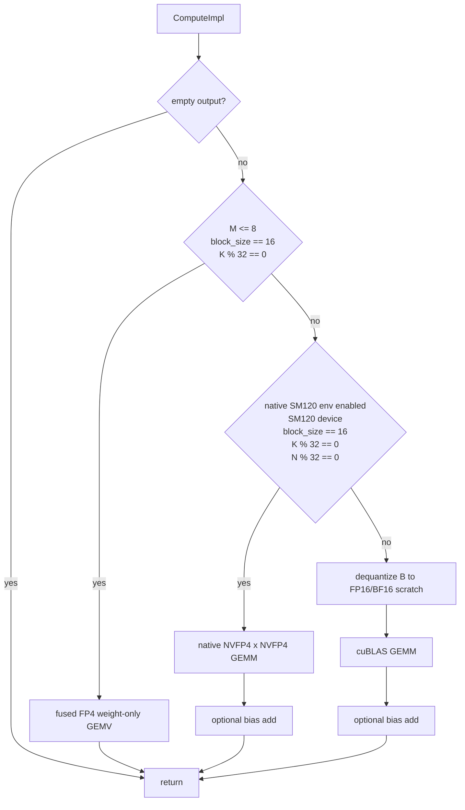

# MatMulBlockQuantizedFp4Weight - CUDA Operator Documentation

This document describes the CUDA execution-provider implementation of
**MatMulBlockQuantizedFp4Weight** (`com.microsoft::MatMulBlockQuantizedFp4Weight`): its tensor
format, dispatch chain, native Blackwell path, prepacking behavior, and test /
benchmark workflow.

MatMulBlockQuantizedFp4Weight computes `Y = A * dequant(B)^T (+ bias)` where `A` is
FP16 or BF16 and `B` is an `N x K` weight matrix stored as packed NVIDIA FP4
E2M1 values with block-wise E4M3 scales. The default semantics are
weight-only FP4: activations stay FP16/BF16. An opt-in SM120 path quantizes
activations to NVFP4 internally and uses native block-scaled tensor cores.

Source files:

- [onnxruntime/contrib_ops/cuda/math/matmul_block_scaled_fp4.cc](../../../onnxruntime/contrib_ops/cuda/math/matmul_block_scaled_fp4.cc) - operator, validation, dispatch, and `PrePack`.
- [onnxruntime/contrib_ops/cuda/math/matmul_block_scaled_fp4.h](../../../onnxruntime/contrib_ops/cuda/math/matmul_block_scaled_fp4.h) - kernel class and CUDA launcher declarations.
- [onnxruntime/contrib_ops/cuda/math/matmul_block_scaled_fp4.cu](../../../onnxruntime/contrib_ops/cuda/math/matmul_block_scaled_fp4.cu) - dequantization, bias add, and decode GEMV kernels.
- [onnxruntime/contrib_ops/cuda/math/matmul_block_scaled_fp4_sm120.cu](../../../onnxruntime/contrib_ops/cuda/math/matmul_block_scaled_fp4_sm120.cu) - native SM120 NVFP4 x NVFP4 CUTLASS path.
- [onnxruntime/test/python/contrib_ops/profile_matmul_block_scaled.py](../../../onnxruntime/test/python/contrib_ops/profile_matmul_block_scaled.py) - opt-in accuracy and latency harness.

---

## Table of Contents

1. [Operator Schema](#1-operator-schema)
2. [Weight Format](#2-weight-format)
3. [Dispatch Chain](#3-dispatch-chain)
4. [Decode Path - Fused GEMV](#4-decode-path---fused-gemv)
5. [Default Path - Dequantize + cuBLAS](#5-default-path---dequantize--cublas)
   - [5.1 Vectorized dequantization](#51-vectorized-dequantization)
6. [Native SM120 FP4 x FP4 Path](#6-native-sm120-fp4-x-fp4-path)
7. [PrePack](#7-prepack)
8. [Environment Variables](#8-environment-variables)
9. [Testing and Benchmarking](#9-testing-and-benchmarking)

---

## 1. Operator Schema

| Attribute | Meaning |
|-----------|---------|
| `block_size` | Quantization group size along `K`. Current CUDA paths are optimized for `16`; default is `16`. |

`N` and `K` are not attributes. They are derived from the weight shape:
`N = B.shape[0]` and `K = 2 * B.shape[1]`.

| Input | Index | Type | Notes |
|-------|-------|------|-------|
| `A` | 0 | FP16 or BF16 | Activation tensor with last dimension `K`. Leading dimensions are flattened into `M`. |
| `B` | 1 | UINT8 | Packed NVFP4 E2M1 weight, shape `[N, K / 2]`. Two FP4 values per byte, low nibble first. |
| `weight_scale` | 2 | UINT8 | Raw E4M3 per-block scales, shape `[N, ceil(K / block_size)]`. |
| `weight_scale_2` | 3 | FP32 scalar | Global weight scale. |
| `input_scale` | 4 | Optional FP32 scalar | Used only by the opt-in native SM120 FP4 x FP4 path. |
| `bias` | 5 | Optional FP16/BF16 | Bias of shape `[N]`, same type as `A`. |

Output `Y` has the same leading dimensions as `A` and last dimension `N`. Its
type matches `A`.

---

## 2. Weight Format

`B` is a row-major logical `[N, K]` matrix packed to `[N, K / 2]` bytes. Each
byte contains two E2M1 values:

- low nibble: even K element,
- high nibble: odd K element.

`weight_scale[n, kb]` is a raw E4M3 byte for output row `n` and K block `kb`.
The dequantized value is:

```
B_dequant[n, k] = fp4_e2m1(B[n, k]) * e4m3(weight_scale[n, k / block_size]) * weight_scale_2
```

`K` must be even because two FP4 values are packed per byte. The decode and
native SM120 paths additionally require `block_size == 16` and `K % 32 == 0`.

---

## 3. Dispatch Chain

`MatMulBlockQuantizedFp4Weight::ComputeImpl` tries the cheapest applicable path first:


```mermaid
flowchart TD
  A[ComputeImpl] --> Z{empty output?}
  Z -- yes --> R[return]
  Z -- no --> G{M <= 8<br/>block_size == 16<br/>K % 32 == 0}
  G -- yes --> GEMV[fused FP4 weight-only GEMV] --> R
  G -- no --> N{native SM120 env enabled<br/>SM120 device<br/>block_size == 16<br/>K % 32 == 0<br/>N % 32 == 0}
  N -- yes --> P[native NVFP4 x NVFP4 GEMM] --> BIAS[optional bias add] --> R
  N -- no --> DQ[dequantize B to FP16/BF16 scratch] --> CUBLAS[cuBLAS GEMM] --> BIAS2[optional bias add] --> R
```

The decode GEMV path intentionally has priority over native SM120 GEMM. For
small `M`, the warp-per-column GEMV is memory-bound and avoids activation
quantization, CUTLASS setup, and underutilized tensor-core GEMM work.

---

## 4. Decode Path - Fused GEMV

`LaunchMatMulBlockQuantizedFp4WeightGemv` is used when:

- `0 < M <= 8`,
- `block_size == 16`,
- `K % 32 == 0`.

Each warp computes one output column `col`. A lane consumes 32 K
elements per iteration, which is exactly two 16-element scale blocks. The kernel
loads:

- 16 packed FP4 bytes from one row of `B`,
- 32 FP16/BF16 activation values from `A`,
- two contiguous E4M3 scale bytes from `weight_scale[col, :]`.

The per-block scales are folded into the partial sums and `weight_scale_2` is
applied once after the warp reduction. Optional bias is fused in lane 0.

### Row tiling

A warp produces `RowsPerBlock` rows of `Y` at once (1, 2 or 4). The packed weight
load and the E2M1 decode are shared by all rows in the tile, which matters for
speculative decoding / MTP verify where `M = N_spec + 1 > 1`. This trades grid
parallelism for reuse, because `M` no longer contributes to `gridDim.y`, so it is
only enabled when the column grid `ceil(N / 8)` covers at least one full wave of
SMs on its own. Measured on H200 (132 SMs, `M = 4`, FP16):

| Shape | N | column blocks | `RowsPerBlock = 4` vs `1` |
| --- | --- | --- | --- |
| `lm_head` | 248320 | 31040 | 615.8 -> 537.7 us (1.15x) |
| shared `down_proj` | 2048 | 256 | 4.30 -> 3.33 us (1.29x) |
| shared `gate_up_proj` | 512 | 64 | 3.47 -> 4.27 us (0.81x) - gated off |

Per-row fp32 accumulation order does not depend on `RowsPerBlock`, so results are
bit-identical across tilings. Set `ORT_FP4_GEMV_ROW_TILING=0` to force
`RowsPerBlock == 1`.

Note that the tensor-core sub-path below takes precedence on SM80+ whenever
`K % 128 == 0`, which covers most production shapes. Row tiling is therefore what
actually runs on pre-SM80 devices or when `K` is not a multiple of 128.

### Tensor-core sub-path (SM80+)

On SM80 and newer, when `K % 128 == 0` and `M <= 8`, the warp reduction above is
replaced by `mma.m16n8k16`, so a warp produces **16 output columns** at once
instead of one. Set `ORT_FP4_GEMV_MMA=0` to fall back to the scalar path.

The scalar path re-reads the whole `A` tile once per output column: at
`RowsPerBlock = 4` a warp pulls 16 KB of activation for 1 KB of weight, a 16:1
amplification that dominates `lm_head`. Producing 16 columns per warp cuts those
re-reads by 16x.

The fragments are free because the **weight goes in the mma `A` slot** and the
**activation in the mma `B` slot**: `B` is `[N, K]` row-major, which is exactly the
`A`-row-major fragment, and `A` is `[M, K]` row-major, which is exactly the
`B`-col-major fragment. No transpose, no `ldmatrix`, no shared-memory staging. The
mma `M` extent becomes the column count (16) and the mma `N` extent becomes `M`.

A lane does not own a whole dot product: with `g = lane >> 2` and `t = lane & 3`,
it supplies the weights of output columns `g` and `g + 8` (the `A` fragment) and
activation row `g` (the `B` fragment), and the accumulator it receives back covers
output rows `2t` and `2t + 1` of those two columns. Loads are therefore keyed off
`g` and stores off `t`; the kernel source carries the full fragment table, and the
`GemvTensorCoreLaneOwnership*` tests probe the mapping with a one-hot activation.

The K axis is then permuted so the four k-slots a lane needs are contiguous in
memory, which is legal because K is a reduction axis and the same permutation is
applied to both operands. A window is 128 K elements = 64 packed bytes; lane
`(g, t)` owns elements `[32t, 32t + 32)`, i.e. one `uint4` of weight and one
`uint4` of activation, spanning exactly two 16-element scale blocks.

Because the mma sums across the four `t` lanes, which hold *different* scale
blocks, the accumulator cannot be flushed per block. The E4M3 scale is instead
folded into the decoded weight before the mma. That is exact in both FP16 and
BF16: E2M1 magnitudes carry 2 significand bits and E4M3 scales carry 4, so the
product needs at most 6, inside FP16's 11 and BF16's 8; the range is safe too
(max `6 * 448 = 2688`, min `0.5 * 2^-9 = 2^-10`).

`KSplit` warps per block take a strided share of the K windows and reduce through
shared memory. Without it, 16 columns per warp yields 16x fewer warps than the
scalar path and the small MLP shapes lose more to idle SMs than they gain. The
launcher targets four waves of SMs before using one-column blocks, and uses eight
waves for four-column blocks when the reduction is long (`K / 128 >= 64`):

| Grid condition | Reduction | Configuration |
|---|---|---|
| four-column grid covers four waves | ordinary or wide enough long reduction | `ColTiles = 4, KSplit = min(2, K / 128)` |
| four-column grid does not cover four waves, but one-column grid does | `K / 128 < 64` | `ColTiles = 1, KSplit = min(2, K / 128)` |
| four-column grid does not cover eight waves, but one-column grid covers four waves | `K / 128 >= 64` | `ColTiles = 1, KSplit = 8` |
| one-column grid does not cover four waves | any | `ColTiles = 1`, up to 16 K-split warps |

The extra grid-wave requirement avoids collapsing a medium-wide GEMV into too
few blocks. On H200, this keeps the Qwen3.8 MTP `N=17408,K=5120` shape at
`KSplit=2,ColTiles=1`, while the long `K=8192` sibling uses `KSplit=8`.

Measured on H200 (132 SMs, `M = 4`, FP16), scalar -> tensor core:

| Shape | N | K | scalar | tensor core | speedup |
| --- | --- | --- | --- | --- | --- |
| `lm_head` | 248320 | 2048 | 537.6 us | 108.3 us | **4.96x** |
| shared `gate_up_proj` | 512 | 2048 | 3.48 us | 2.99 us | 1.17x |
| shared `down_proj` | 2048 | 512 | 3.32 us | 2.52 us | 1.32x |

Over a Qwen3.6 NVFP4 MTP decode step (121 FP4 GEMV launches) this is
0.949 -> 0.448 ms/step, and 9.54 -> 8.99 ms/step end to end.

The fp32 accumulation order differs from the scalar path, so this path is not
bit-identical to it. Max relative error against an fp64 reference is unchanged
(2.4e-04 .. 3.5e-04, i.e. NVFP4 quantization noise, not accumulation noise).

This kernel reads the original unswizzled `[N, K / 16]` scale layout. Experiments
with the native SM120 swizzled scale layout for GEMV were slower; see
[matmul_block_scaled_fp4_experiments.md](matmul_block_scaled_fp4_experiments.md).

---

## 5. Default Path - Dequantize + cuBLAS

When decode GEMV and native SM120 GEMM do not apply, the operator uses a
portable weight-only fallback:

1. `LaunchDequantizeNvFp4` expands `B` into a scratch `[N, K]` buffer of the
   activation type (FP16 or BF16).
2. cuBLAS computes `Y = A * B_dequant^T`.
3. `LaunchAddBiasNvFp4` adds optional bias.

This path keeps full-precision activations and runs on CUDA devices with NVFP4
conversion intrinsic support in the configured CUDA toolkit. It is the default
prefill path when the SM120 native environment variable is not enabled.

### 5.1 Vectorized dequantization

When `K % 8 == 0` and `block_size` is even - the layout every real NVFP4 model
uses - `LaunchDequantizeNvFp4` picks `DequantizeNvFp4Vec8Kernel` instead of the
scalar kernel. Each thread owns exactly one 8-element K chunk of one row, so a
warp issues one contiguous 128-byte packed load and one contiguous 512-byte
store. Widening the per-thread chunk beyond one `uint4` store was measured to be
about 2x slower because each store instruction then strides across lanes
(1.9 vs 3.9 TB/s on H200). The row index comes from `blockIdx.y`, which removes
the 64-bit division of the scalar kernel, `weight_scale_2` is hoisted into a
register, and codes are decoded with the same branch-free `Fp4Cvt` `prmt`
lookup the decode GEMV uses rather than the software-emulated
`__nv_cvt_fp4x2_to_halfraw2()`.

The output is bitwise identical to the scalar kernel. Measured on H200 for
`M = 1024`, BF16, `block_size = 16` (median dequant kernel time):

| N | K | scalar | vectorized | speedup |
|---:|---:|---:|---:|---:|
| 4096 | 4096 | 60.7 us | 15.5 us | 3.93x |
| 6144 | 2048 | 46.1 us | 12.1 us | 3.81x |
| 2048 | 6144 | 46.2 us | 11.9 us | 3.88x |

The scalar kernel remains for odd `block_size` or `K % 8 != 0`.

---

## 6. Native SM120 FP4 x FP4 Path

The native Blackwell path is compiled when the build defines
`ORT_ENABLE_BLOCKQUANT_SM120` and is enabled at runtime with:

```bash
ORT_MATMUL_BLOCK_SCALED_FP4_NATIVE_SM120=1
```

Runtime guards:

- device compute capability is SM120 (`sm_ >= 120 && sm_ < 130`),
- `block_size == 16`,
- `K % 32 == 0`,
- `N % 32 == 0`,
- `M > 8` because decode GEMV has priority.

The native path performs three steps:

1. Quantize activation `A` to packed NVFP4 E2M1 with per-16-block E4M3 scales.
2. Provide `B` scales in the SM120 block-scaled swizzled layout required by
   CUTLASS. If `PrePack` cached this layout, the cached buffer is reused;
   otherwise it is repacked into scratch for this run.
3. Run CUTLASS block-scaled NVFP4 x NVFP4 GEMM and optionally add bias.

Accuracy note: this path changes internal arithmetic from weight-only FP4 to
activation-and-weight FP4. The profiling harness therefore compares native SM120
results against an activation-quantized FP4 reference when the env var and shape
select this path.

---

## 7. PrePack

`PrePack` handles input index `2` (`weight_scale`) only for the eligible native
SM120 path. It converts the original `[N, K / 16]` E4M3 scale tensor into the
SM120 swizzled scale layout once and stores it in `b_scale_prepacked_`. Because
the weight tensor is not visible in `PrePack`, `N` and `K` are recovered from the
scale shape itself (`N = scale.shape[0]`, `K = scale.shape[1] * block_size`),
which is exact for the `K % block_size == 0` shapes this path requires.

`is_packed` deliberately remains `false`: the original `weight_scale` input must
stay available because the decode GEMV and default dequant+cuBLAS paths still
consume the unswizzled layout.

If `weight_scale` is not an initializer, or the native SM120 path is not enabled
or supported, the operator falls back to per-run scratch repacking for native
GEMM and the original scale tensor for the other paths.

---

## 8. Environment Variables

| Variable | Default | Meaning |
|----------|---------|---------|
| `ORT_MATMUL_BLOCK_SCALED_FP4_NATIVE_SM120` | `0` | Enables the opt-in native SM120 NVFP4 x NVFP4 GEMM path when the shape and device guards pass. |
| `ORT_FP4_GEMV_MMA` | `1` | Set to `0` to disable the decode GEMV tensor-core sub-path (`mma.m16n8k16`, SM80+, `K % 128 == 0`) and use the scalar warp-reduction path. |
| `ORT_FP4_GEMV_ROW_TILING` | `1` | Set to `0` to force `RowsPerBlock == 1` in the scalar decode GEMV. |
| `ORT_FP4_GEMV_KSPLIT` | `0` | Benchmark override for the tensor-core GEMV K-split value (`1, 2, 4, 8, or 16`). |
| `ORT_FP4_GEMV_COL_TILES` | `0` | Benchmark override for tensor-core GEMV column tiles (`1` or `4`). |
| `ORT_FP4_GEMV_MATCH_N` / `ORT_FP4_GEMV_MATCH_K` | `0` | Restrict the two benchmark overrides to one `N`/`K` shape; zero means any shape. |

The default remains the existing weight-only semantics: decode GEMV for small
`M`, otherwise dequantize `B` and call cuBLAS.

---

## 9. Testing and Benchmarking

The commands below use two environment variables so they can be copied without
editing developer-specific paths. Set them once to your repo root and build
output directory:

```bash
export ORT_REPO=$(git rev-parse --show-toplevel)
export ORT_BUILD="$ORT_REPO/build/cu130/Release"
```

Focused C++ tests:

```bash
CUDA_VISIBLE_DEVICES=0 "$ORT_BUILD/onnxruntime_provider_test" \
  --gtest_filter='MatMulBlockQuantizedFp4WeightOpTest.*'
```

The `Gemv*` cases cover the decode path and the `PrefillDequant*` cases cover the
dequantize + cuBLAS path, with `M > 8` so the GEMV is skipped: `*Vectorized*` for
`DequantizeNvFp4Vec8Kernel` and `OddBlockSize` / `KNotMultipleOf8` for the scalar
fallback, each in both FP16 and BF16.

Python harness examples:

```bash
# Decode GEMV
cd /tmp && PYTHONPATH="$ORT_BUILD" CUDA_VISIBLE_DEVICES=0 \
  python "$ORT_REPO/onnxruntime/test/python/contrib_ops/profile_matmul_block_scaled.py" \
  --op fp4 --activation-dtype fp16 --m 1 --n 11008 --k 4096 --warmup 100 --repeat 500

# Default prefill: dequantize + cuBLAS
cd /tmp && PYTHONPATH="$ORT_BUILD" CUDA_VISIBLE_DEVICES=0 \
  python "$ORT_REPO/onnxruntime/test/python/contrib_ops/profile_matmul_block_scaled.py" \
  --op fp4 --activation-dtype fp16 --m 16 --n 11008 --k 4096 --warmup 50 --repeat 200

# Native SM120 prefill
cd /tmp && PYTHONPATH="$ORT_BUILD" CUDA_VISIBLE_DEVICES=0 \
  ORT_MATMUL_BLOCK_SCALED_FP4_NATIVE_SM120=1 \
  python "$ORT_REPO/onnxruntime/test/python/contrib_ops/profile_matmul_block_scaled.py" \
  --op fp4 --activation-dtype fp16 --m 16 --n 11008 --k 4096 --warmup 50 --repeat 200
```

After rebuilding `libonnxruntime_providers_cuda.so`, sync the provider into the
Python load locations before Python benchmarks:

```bash
cp "$ORT_BUILD/libonnxruntime_providers_cuda.so" \
  "$ORT_BUILD/onnxruntime/capi/libonnxruntime_providers_cuda.so"
cp "$ORT_BUILD/libonnxruntime_providers_cuda.so" \
  "$ORT_BUILD/build/lib/onnxruntime/capi/libonnxruntime_providers_cuda.so"
```
