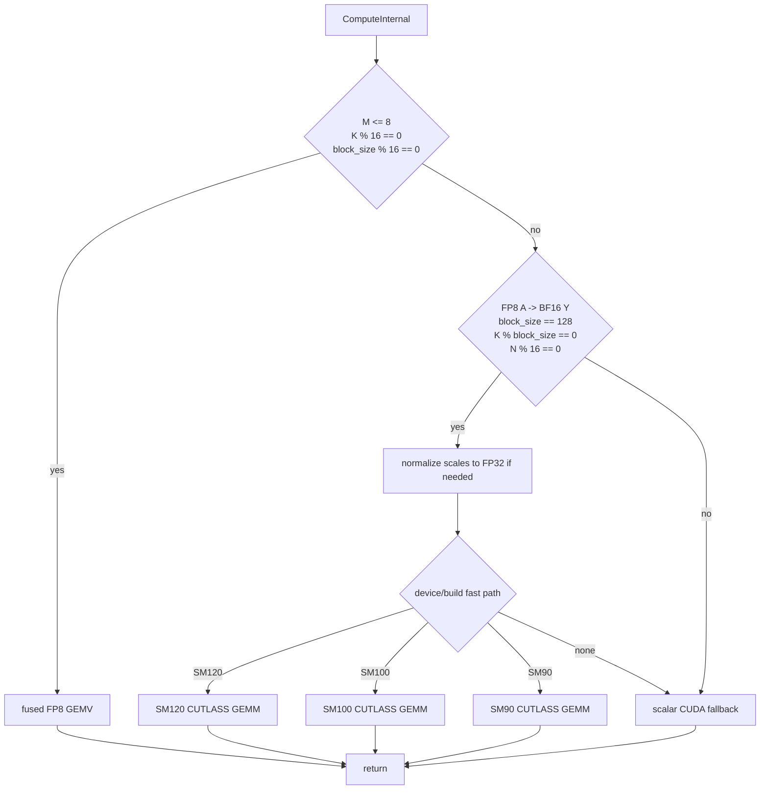

# MatMulBlockScaledFp8 - CUDA Operator Documentation

This document describes the CUDA execution-provider implementation of
**MatMulBlockScaledFp8** (`com.microsoft::MatMulBlockScaledFp8`): its tensor
format, dispatch chain, Hopper / Blackwell fast paths, and test / benchmark
workflow.

MatMulBlockScaledFp8 computes block-scaled matrix multiplication using FP8 E4M3
weights and either FP8 or FP16 activations:

```
Y = (A * scaleA) * (B * scaleB)^T
```

The scale tensors hold one scale per K block for each row of `A` and each row of
logical `B`.

Source files:

- [onnxruntime/contrib_ops/cuda/math/matmul_block_scaled_fp8.cc](../../../onnxruntime/contrib_ops/cuda/math/matmul_block_scaled_fp8.cc) - operator, validation, and dispatch chain.
- [onnxruntime/contrib_ops/cuda/math/matmul_block_scaled_fp8.h](../../../onnxruntime/contrib_ops/cuda/math/matmul_block_scaled_fp8.h) - kernel class and CUDA launcher declarations.
- [onnxruntime/contrib_ops/cuda/math/matmul_block_scaled_fp8.cu](../../../onnxruntime/contrib_ops/cuda/math/matmul_block_scaled_fp8.cu) - scalar fallback, scale conversion, and decode GEMV kernel.
- [onnxruntime/contrib_ops/cuda/math/matmul_block_scaled_fp8_sm90.cu](../../../onnxruntime/contrib_ops/cuda/math/matmul_block_scaled_fp8_sm90.cu) - SM90 CUTLASS block-scaled GEMM.
- [onnxruntime/contrib_ops/cuda/math/matmul_block_scaled_fp8_sm100.cu](../../../onnxruntime/contrib_ops/cuda/math/matmul_block_scaled_fp8_sm100.cu) - SM100 CUTLASS block-scaled GEMM.
- [onnxruntime/contrib_ops/cuda/math/matmul_block_scaled_fp8_sm120.cu](../../../onnxruntime/contrib_ops/cuda/math/matmul_block_scaled_fp8_sm120.cu) - SM120 CUTLASS block-scaled GEMM.
- [onnxruntime/test/python/contrib_ops/profile_matmul_block_scaled.py](../../../onnxruntime/test/python/contrib_ops/profile_matmul_block_scaled.py) - opt-in accuracy and latency harness.

---

## Table of Contents

1. [Operator Schema](#1-operator-schema)
2. [Tensor and Scale Format](#2-tensor-and-scale-format)
3. [Dispatch Chain](#3-dispatch-chain)
4. [Decode Path - Fused GEMV](#4-decode-path---fused-gemv)
5. [Hopper / Blackwell CUTLASS Fast Path](#5-hopper--blackwell-cutlass-fast-path)
6. [Scalar Fallback](#6-scalar-fallback)
7. [Testing and Benchmarking](#7-testing-and-benchmarking)

---

## 1. Operator Schema

| Attribute | Meaning |
|-----------|---------|
| `block_size` | K-block size for scale application. Default is `128`. |

| Input | Index | Type | Notes |
|-------|-------|------|-------|
| `A` | 0 | FP8 E4M3FN or FP16 | Activation tensor with last dimension `K`. Leading dimensions are flattened into `M`. |
| `B` | 1 | FP8 E4M3FN | Weight tensor of shape `[N, K]`. Logical output columns are rows of `B`. |
| `scaleA` | 2 | FP32 | Shape `[M, ceil(K / block_size)]`. |
| `scaleB` | 3 | FP32 | Shape `[N, ceil(K / block_size)]`. |

Output type is constrained by activation type:

- FP8 `A` -> BF16 `Y`,
- FP16 `A` -> FP16 `Y`.

Model builders must convert scales to FP32 before creating the operator inputs.

---

## 2. Tensor and Scale Format

`B` is stored row-major as `[N, K]`, where each row is one output column in the
matrix product. For each K block:

```
A_scaled[m, k] = fp8_or_fp16(A[m, k]) * scaleA[m, k / block_size]
B_scaled[n, k] = fp8(B[n, k]) * scaleB[n, k / block_size]
Y[m, n] = sum_k A_scaled[m, k] * B_scaled[n, k]
```

`scaleA` and `scaleB` are FP32. Canonicalizing scales offline avoids conversion
and scratch-buffer allocation on every operator invocation.

---

## 3. Dispatch Chain

`MatMulBlockScaledFp8::ComputeInternal` routes as follows:



The decode GEMV path has priority for small `M` because tensor-core GEMM is
underutilized there.

---

## 4. Decode Path - Fused GEMV

`LaunchMatMulBlockScaledFp8Gemv` is used when:

- `0 < M <= 8`,
- `K % 16 == 0`,
- `block_size % 16 == 0`.

The kernel maps one warp to one output column and a row group of 1, 2, 4, or 8
rows. Each lane loads 16 K elements from `B` and 16 K elements from each active row of `A`. A
16-element chunk is guaranteed to stay inside one scale block, so the kernel
loads one `scaleA` and one `scaleB` value for that chunk and folds both into the
partial sum. Grouping all rows into one warp for `M <= 8` streams each weight row
once instead of launching a second warp over the same weights for `M = 5..8`.

This path avoids a materialized dequant buffer and runs on all supported CUDA
architectures because it uses regular FP8 conversion and warp-shuffle reduction,
not architecture-specific block-scaled tensor cores.

---

## 5. Hopper / Blackwell CUTLASS Fast Path

The CUTLASS path is used for prefill-like shapes when all of the following hold:

- activation `A` is FP8,
- output `Y` is BF16,
- `block_size == 128`,
- `K % block_size == 0`,
- `N % 16 == 0`,
- the build contains the corresponding architecture macro:
  `ORT_ENABLE_BLOCKQUANT_SM90`, `ORT_ENABLE_BLOCKQUANT_SM100`, or
  `ORT_ENABLE_BLOCKQUANT_SM120`.

Dispatch order:

- SM120 devices use `LaunchBlockQuantizedFp8GemmSm120`,
- SM90 devices use `LaunchBlockQuantizedFp8GemmSm90`,
- SM100 devices use `LaunchBlockQuantizedFp8GemmSm100`.

The SM120 launcher selects among three CUTLASS configurations:

- `M <= 64`: `64x128x128` ping-pong kernel,
- `64 < M <= 128`, `N <= 2048`, `K >= 4096`, and `K >= 4 * N`:
  `128x128x128` Stream-K kernel,
- all other supported shapes: `128x128x128` cooperative kernel.

Workspace sizing uses the same predicates as launch dispatch. The Stream-K
region is intentionally conservative and covers shapes where the output tile
grid underfills SM120 while K is long enough to amortize reduction and fixup
overhead.

The full-K-block guard is important. Partial K scale blocks are handled by the
scalar fallback to avoid launching a CUTLASS kernel with unsupported scale
layout assumptions.

---

## 6. Scalar Fallback

`LaunchMatMulBlockScaledFp8` is the general fallback. It launches a simple CUDA
kernel over `[M, N]`; each thread computes one output element by looping over
`K`, applying `scaleA` and `scaleB` for each K block.

The fallback handles:

- FP8 A -> BF16 Y,
- FP16 A -> FP16 Y,
- FP32 scales,
- partial final K scale blocks,
- shapes not supported by decode GEMV or CUTLASS fast paths.

---

## 7. Testing and Benchmarking

Focused C++ tests:

```bash
export CUDA_VISIBLE_DEVICES=0
cd build/Linux/Release
./onnxruntime_provider_test --gtest_filter='MatMulBlockScaledFp8OpTest.*'
```

Python harness examples:

```bash
export ORT_REPO=$(git rev-parse --show-toplevel)
cd $ORT_REPO/onnxruntime/test/python/contrib_ops
# Decode GEMV
  python profile_matmul_block_scaled.py \
  --op fp8 --activation-dtype fp8 --m 1 --n 4096 --k 4096 --warmup 100 --repeat 500

# CUTLASS fast path on SM120/SM100/SM90, when available
  python profile_matmul_block_scaled.py \
  --op fp8 --activation-dtype fp8 --m 32 --n 4096 --k 4096 --warmup 50 --repeat 200

# FP16 activation fallback / GEMV cases
  python profile_matmul_block_scaled.py \
  --op fp8 --activation-dtype fp16 --m 16 --n 4096 --k 4096 --warmup 50 --repeat 200
```
