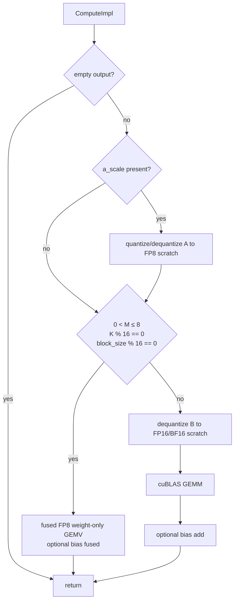

# MatMulBlockQuantizedFp8Weight - CUDA Operator Documentation

This document describes the CUDA execution-provider implementation of
**MatMulBlockQuantizedFp8Weight** (`com.microsoft::MatMulBlockQuantizedFp8Weight`):
its tensor format, dispatch chain, decode fast path, optional W8A8 activation
path, and test / benchmark workflow.

MatMulBlockQuantizedFp8Weight computes `Y = A * dequant(B)^T (+ bias)` where `A`
is FP16 or BF16 and `B` is an `N x K` weight matrix stored as FP8 E4M3 values
with one FP32 scale per K block. The default semantics are weight-only FP8:
activations stay FP16/BF16. An optional per-tensor `a_scale` quantizes the
activation to FP8 E4M3 internally (W8A8 numerics).

```
Y[m, n] = sum_k A[m, k] * (fp8_e4m3(B[n, k]) * b_scale[n, k / block_size]) + bias[n]
```

The path is architecture independent: it dequantizes the weight to the
activation type and runs a standard cuBLAS GEMM (or a fused GEMV for small `M`),
so it does not rely on native FP8 block-scaled tensor cores and works on any
CUDA architecture (SM80+).

Source files:

- [onnxruntime/contrib_ops/cuda/math/matmul_block_scaled_fp8.cc](../../../onnxruntime/contrib_ops/cuda/math/matmul_block_scaled_fp8.cc) - operator, validation, and dispatch chain.
- [onnxruntime/contrib_ops/cuda/math/matmul_block_scaled_fp8.h](../../../onnxruntime/contrib_ops/cuda/math/matmul_block_scaled_fp8.h) - kernel class and CUDA launcher declarations.
- [onnxruntime/contrib_ops/cuda/math/matmul_block_scaled_fp8.cu](../../../onnxruntime/contrib_ops/cuda/math/matmul_block_scaled_fp8.cu) - weight dequantization, bias add, activation quantize/dequantize, and decode GEMV kernels.
- [onnxruntime/test/contrib_ops/matmul_block_scaled_fp8_test.cc](../../../onnxruntime/test/contrib_ops/matmul_block_scaled_fp8_test.cc) - focused CUDA operator tests.
- [onnxruntime/test/python/contrib_ops/profile_matmul_block_scaled.py](../../../onnxruntime/test/python/contrib_ops/profile_matmul_block_scaled.py) - opt-in accuracy and latency harness.

---

## Table of Contents

1. [Operator Schema](#1-operator-schema)
2. [Tensor and Scale Format](#2-tensor-and-scale-format)
3. [Dispatch Chain](#3-dispatch-chain)
4. [Decode Path - Fused GEMV](#4-decode-path---fused-gemv)
5. [Default Path - Dequantize + cuBLAS](#5-default-path---dequantize--cublas)
6. [Optional W8A8 Activation Path](#6-optional-w8a8-activation-path)
7. [Testing and Benchmarking](#7-testing-and-benchmarking)

---

## 1. Operator Schema

| Attribute | Meaning |
|-----------|---------|
| `block_size` | Number of consecutive K values that share one weight scale. Default is `128`. |

| Input | Index | Type | Notes |
|-------|-------|------|-------|
| `A` | 0 | FP16 or BF16 (`T`) | Activation tensor with last dimension `K`. Leading dimensions are flattened into `M`. |
| `B` | 1 | FP8 E4M3FN (`T1`) | Weight tensor of shape `[N, K]`, one byte per value (not packed). Logical output columns are rows of `B`. |
| `b_scale` | 2 | FP32 (`T2`) | Per-block weight scales of shape `[N, ceil(K / block_size)]`. |
| `a_scale` | 3 | Optional FP32 scalar (`T2`) | When present, `A` is statically quantized to FP8 E4M3 with this scale and dequantized back before the matmul (W8A8 numerics). When absent, `A` stays in full FP16/BF16 precision (weight-only W8A16). |
| `bias` | 4 | Optional FP16/BF16 (`T`) | Bias of shape `[N]`, same type as `A`. |

Output `Y` has the same leading dimensions as `A` and last dimension `N`. Its
type matches `A`.

Type constraints:

- `T` = `tensor(float16)` or `tensor(bfloat16)` (activation, bias, output),
- `T1` = `tensor(float8e4m3fn)` (weight),
- `T2` = `tensor(float)` (scales).

---

## 2. Tensor and Scale Format

`B` is stored row-major as `[N, K]`, one FP8 E4M3 byte per value, where each row
is one output column in the matrix product. For each K block:

```
B_dequant[n, k] = fp8_e4m3(B[n, k]) * b_scale[n, k / block_size]
Y[m, n] = sum_k A[m, k] * B_dequant[n, k] + bias[n]
```

`b_scale` is FP32. A partial final K block (when `K` is not a multiple of
`block_size`) uses the last scale column for the remaining K values.

---

## 3. Dispatch Chain

`MatMulBlockQuantizedFp8Weight::ComputeImpl` tries the cheapest applicable path
first:


```mermaid
flowchart TD
  A[ComputeImpl] --> Z{empty output?}
  Z -- yes --> R[return]
  Z -- no --> QDQ{a_scale present?}
  QDQ -- yes --> Q[quantize/dequantize A to FP8 scratch]
  QDQ -- no --> G
  Q --> G{0 &lt; M &le; 8<br/>K % 16 == 0<br/>block_size % 16 == 0}
  G -- yes --> GEMV[fused FP8 weight-only GEMV<br/>optional bias fused] --> R
  G -- no --> DQ[dequantize B to FP16/BF16 scratch]
  DQ --> CUBLAS[cuBLAS GEMM] --> BIAS[optional bias add] --> R
```

The decode GEMV path has priority for small `M` because a dequantize-plus-GEMM
is memory-bound and underutilized there: the fused warp-per-column GEMV reads
the FP8 weight directly and avoids both the `[N, K]` dequant scratch buffer and
the cuBLAS call.

---

## 4. Decode Path - Fused GEMV

`LaunchMatMulBlockScaledFp8Gemv` is used when:

- `0 < M <= 8`,
- `K % 16 == 0`,
- `block_size % 16 == 0`.

The kernel maps one warp to one output column and a row group of 1, 2, 4, or 8
rows (`RowsPerWarp` selected from `M`). Each of the 32 lanes loads 16 K elements
from `B` (one `uint4` of FP8) and 16 K elements from each active row of `A`. A
16-element chunk is guaranteed to stay inside one scale block whenever
`block_size` is a multiple of 16, so the kernel loads one `b_scale` value per
chunk and folds it into the partial sum. Grouping all rows of a `M <= 8` tile
into one warp streams each weight row exactly once instead of relaunching a warp
over the same weights for each row. Optional bias is added by lane 0 after the
warp-shuffle reduction.

This path avoids a materialized dequant buffer and runs on all supported CUDA
architectures because it uses regular FP8 conversion and warp-shuffle reduction,
not architecture-specific block-scaled tensor cores.

### 4.1 Tensor-Core Sub-Path (SM80+)

When the device is SM80 or newer and, in addition to the predicate above,

- `K % 64 == 0` and `K >= 256`,
- `block_size % 64 == 0`,
- `M <= 8` (the mma "N" extent),

the GEMV runs `MatMulBlockScaledFp8MmaGemvKernel`, which replaces the FP32 FMA
dot products with `mma.m16n8k16` (FP32 accumulate). The FMA kernel is ALU bound
for `M > 1` because it re-widens `A` and `B` to FP32 for every row/column pair;
the tensor-core kernel cuts instructions per weight byte roughly 10x.

The weight is fed to the mma **A** operand and the activation to the **B**
operand, so both fragments match the tensors' natural row-major layouts. The mma
"M" extent is therefore the output column count (16 columns per warp) and the mma
"N" extent is `M` (up to 8 rows). A lane does not own a whole dot product: with
`g = lane >> 2` and `t = lane & 3`, it supplies the weights of output columns
`g` and `g + 8` (the A fragment) and activation row `g` (the B fragment), and the
accumulator it receives back covers output rows `2t` and `2t + 1` of those two
columns. Loads are therefore keyed off `g` and stores off `t`; the kernel source
carries the full fragment table, and the `GemvTensorCoreLaneOwnership*` tests
probe the mapping with a one-hot activation. Fragment loads are made fully
coalesced by permuting the K axis - K is a reduction axis, so any permutation
applied to both operands leaves the result unchanged - which lets each lane load
one contiguous `uint4` of weight bytes per 64-element K window and feed four mma
instructions with it. `KSplit` warps per block take a strided share of the K
windows and are reduced through shared memory, which restores the memory-level
parallelism lost by giving each warp 16 columns instead of 1-4.

Every individual product is exact (E4M3 to FP16/BF16 is lossless) and the mma
accumulates in FP32 just like the FMA path, but the summation order differs, so
the result is **not** bit-identical to the FMA kernel. Note also that the mma
path is preferred over the FMA kernel by default on SM80+, including at `M == 1`.
Set `ORT_FP8_GEMV_MMA=0` to fall back to the FMA kernel.

---

## 5. Default Path - Dequantize + cuBLAS

When the decode GEMV predicate does not hold (larger `M`, or `K` /
`block_size` not divisible by 16), the operator uses a portable weight-only
fallback:

1. `LaunchDequantizeBlockScaledFp8` expands `B` into a scratch `[N, K]` buffer of
   the activation type (FP16 or BF16), applying the per-block FP32 scales.
2. `cublasGemmHelper` computes `Y = A * B_dequant^T`.
3. `LaunchAddBiasBlockScaledFp8` adds the optional `[N]` bias in place.

Because the GEMM at prefill shapes is cheap relative to expanding the whole
weight, the dequantization is the bottleneck of this path and is fully memory
bound (it reads `N*K` FP8 bytes and writes `N*K` FP16/BF16 values). Two kernels
back `LaunchDequantizeBlockScaledFp8`:

- `DequantizeBlockScaledFp8Vec16Kernel` (fast path, used when `K % 16 == 0`):
  each thread owns one aligned 16-element K chunk of a single row, so the FP8
  load is one coalesced 16-byte `uint4` and the store is a coalesced 32-byte
  pair of `uint4`. The row index comes from a 2D grid (`blockIdx.y`), avoiding a
  per-element 64-bit `idx / K` division. When `block_size % 16 == 0` the whole
  chunk shares one scale, so a single scale value is loaded per chunk instead of
  per element.
- `DequantizeBlockScaledFp8Kernel` (scalar fallback, used when `K % 16 != 0`):
  one thread per element with per-element scale lookup.

This keeps the GEMM in the activation type and runs on any CUDA architecture
with FP8 conversion intrinsics (CUDA >= 11.8). It is the default prefill path.

---

## 6. Optional W8A8 Activation Path

When the optional `a_scale` scalar is provided, the activation is statically
quantized before the matmul:

```
A_deq = fp8_e4m3(A / a_scale) * a_scale
```

`LaunchQuantizeDequantizeActivationFp8` writes `A_deq` into a `[M, K]` scratch
buffer of the activation type, and the decode GEMV or dequant + cuBLAS path then
runs on `A_deq`. This intentionally introduces FP8 activation rounding so the
result matches native W8A8 execution, while the GEMM stays in the activation
type (architecture independent). When `a_scale` is absent the activation keeps
full FP16/BF16 precision (weight-only W8A16).

---

## 7. Testing and Benchmarking

The commands below use two environment variables so they can be copied without
editing developer-specific paths. Set them once to your repo root and build
output directory:

```bash
export ORT_REPO=$(git rev-parse --show-toplevel)
export ORT_BUILD="$ORT_REPO/build/cu130/Release"
```

Focused C++ tests:

```bash
CUDA_VISIBLE_DEVICES=0 "$ORT_BUILD/onnxruntime_provider_test" \
  --gtest_filter='MatMulBlockQuantizedFp8WeightOpTest.*'
```

Python harness examples:

```bash
# Decode GEMV (small M)
cd /tmp && PYTHONPATH="$ORT_BUILD" CUDA_VISIBLE_DEVICES=0 \
  python "$ORT_REPO/onnxruntime/test/python/contrib_ops/profile_matmul_block_scaled.py" \
  --op fp8 --activation-dtype fp16 --m 1 --n 4096 --k 4096 --warmup 100 --repeat 500

# Default prefill: dequantize + cuBLAS
cd /tmp && PYTHONPATH="$ORT_BUILD" CUDA_VISIBLE_DEVICES=0 \
  python "$ORT_REPO/onnxruntime/test/python/contrib_ops/profile_matmul_block_scaled.py" \
  --op fp8 --activation-dtype fp16 --m 32 --n 4096 --k 4096 --warmup 50 --repeat 200

# W8A8 activation path (optional a_scale)
cd /tmp && PYTHONPATH="$ORT_BUILD" CUDA_VISIBLE_DEVICES=0 \
  python "$ORT_REPO/onnxruntime/test/python/contrib_ops/profile_matmul_block_scaled.py" \
  --op fp8 --activation-dtype bf16 --m 16 --n 4096 --k 4096 --warmup 50 --repeat 200 --w8a8
```

After rebuilding `libonnxruntime_providers_cuda.so`, sync the provider into the
Python load locations before Python benchmarks (or reinstall the wheel):

```bash
cp "$ORT_BUILD/libonnxruntime_providers_cuda.so" \
  "$ORT_BUILD/onnxruntime/capi/libonnxruntime_providers_cuda.so"
```
