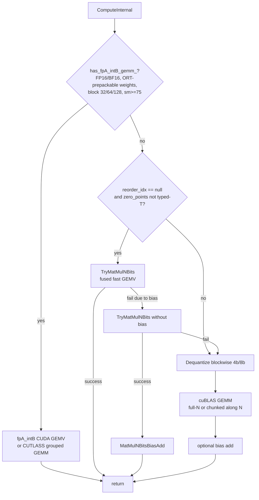

# MatMulNBits — CUDA Operator Documentation

This document describes the CUDA execution-provider implementation of the
**MatMulNBits** (`com.microsoft::MatMulNBits`) operator: its kernel dispatch
chain, the fast / fallback / specialized kernels, the weight format they expect,
and the environment variables that control routing.

MatMulNBits computes `Y = A · dequant(B)ᵀ (+ bias)` where `B` is an `N × K`
weight matrix quantized to 4 or 8 bits with block-wise (group) scales and
optional zero points. It is the building block for weight-only quantized linear
layers (including MoE routers and LM heads).

Source files:

- [onnxruntime/contrib_ops/cuda/quantization/matmul_nbits.cc](../../../onnxruntime/contrib_ops/cuda/quantization/matmul_nbits.cc) — operator, `ComputeInternal`, dispatch chain, dequant+GEMM fallback.
- [onnxruntime/contrib_ops/cuda/quantization/matmul_nbits.h](../../../onnxruntime/contrib_ops/cuda/quantization/matmul_nbits.h) — kernel class, constructor-time configuration, environment-variable parsing.
- [onnxruntime/contrib_ops/cuda/quantization/matmul_nbits.cuh](../../../onnxruntime/contrib_ops/cuda/quantization/matmul_nbits.cuh) — `TryMatMulNBits` fast-path entry and bias-add launcher.
- [onnxruntime/contrib_ops/cuda/quantization/matmul_4bits.cu](../../../onnxruntime/contrib_ops/cuda/quantization/matmul_4bits.cu) — 4-bit fast GEMV kernels (generic + router specialization).

---

## Table of Contents

1. [Operator Schema](#1-operator-schema)
2. [Weight Format](#2-weight-format)
3. [Dispatch Chain](#3-dispatch-chain)
4. [Fast Path — Fused GEMV](#4-fast-path--fused-gemv)
   - [4.1 Generic 4-bit GEMV kernel](#41-generic-4-bit-gemv-kernel)
   - [4.2 Router GEMV specialization](#42-router-gemv-specialization)
5. [Fallback Path — Dequantize + GEMM](#5-fallback-path--dequantize--gemm)
6. [fpA_intB_gemm Path (CUTLASS weight-only)](#6-fpa_intb_gemm-path-cutlass-weight-only)
7. [Bias Handling](#7-bias-handling)
8. [Environment Variables](#8-environment-variables)
9. [Testing](#9-testing)

---

## 1. Operator Schema

| Attribute | Meaning |
|-----------|---------|
| `K` | Input feature dimension (columns of `A`, columns of the logical `B`). |
| `N` | Output feature dimension (rows of the logical `B`). |
| `bits` | Quantization bit width: `4` or `8`. |
| `block_size` | Quantization group size along `K` (16 / 32 / 64 / 128). One scale (and optional zero point) per group. |
| `accuracy_level` | Minimum accuracy level for internal handling of `A`; default `0` means unset. |
| `weight_prepacked` | CUDA fpA_intB weight-layout selector. `0` (default): `B` is in standard MatMulNBits layout and may be runtime-prepacked. `1`: `B` is already prepacked in the CUDA SM80 fpA_intB layout. `2`: `B` is prepacked in the CUDA SM90 (Hopper) fpA_intB layout, consumed by the native SM90 kernel (requires an SM90 device and `block_size` in {64, 128}). |

| Input | Index | Notes |
|-------|-------|-------|
| `A` | 0 | Activations, FP16 / BF16 / FP32. Shape `[M, K]`. |
| `B` | 1 | Packed 4/8-bit weights. |
| `scales` | 2 | Per-group scales, same element type as `A`. |
| `zero_points` | 3 | Optional. Packed integer (symmetric default) **or** same type as `A`. |
| `g_idx` / `reorder_idx` | 4 | Optional group/reorder index (act-order). |
| `bias` | 5 | Optional `[N]` bias added to the output. |

`M` is the (flattened) token count: `M = 1` is the decode / GEMV case that the
fast kernels target.

---

## 2. Weight Format

For 4-bit, `B` is stored as `[N, ceil(K / block_size), block_size / 2]` bytes:
each expert/output row `n` is a contiguous run of `K/2` bytes (two 4-bit weights
per byte), preceded conceptually by `K / block_size` scales in the `scales`
tensor. Quantization is **column-wise block** by default
(`column_wise_quant_blk_ = true`); row-wise layouts interleave `K` blocks across
`N` and cannot be sliced along `N` (this disables the chunked fallback).

Symmetric 4-bit weights store values `0..15` that dequantize to `(q − 8) ·
scale`; the fast kernels hard-code the zero point of `8` when no `zero_points`
input is present.

### 2.1 CUDA fpA_intB prepacked layout

`weight_prepacked=1` means input `B` has the same tensor shape and byte count as
the standard MatMulNBits `B`, but its bytes are already reordered into the CUDA
fpA_intB SM80 weight-only layout. During ORT prepacking the CUDA EP passes those
bytes directly to the fpA_intB kernels without an additional GPU copy: when `B`
is already device-resident (e.g. a constant initializer pinned to the GPU) the
prepacking step is skipped entirely; when `B` is host-resident it is transferred
to device as usual but the runtime weight transpose / mixed-GEMM preprocessing
step is **not** performed.

The offline CUDA packer exposed through Python produces this layout:

```python
from onnxruntime.capi import onnxruntime_cuda_quant_preprocess as _cuda_quant

prepacked_flat = _cuda_quant.pack_weights_for_cuda_mixed_gemm(
  q_weight.reshape(N, -1), N, K, bits, 80
)
prepacked_b = np.asarray(prepacked_flat, dtype=np.int8).view(np.uint8).reshape(q_weight.shape)
```

The final argument is the target packing architecture. Use `80` for the SM80
layout (consumed by the SM80 CUTLASS kernel, including on newer GPUs via the
compatibility path) and set `weight_prepacked=1` on the node. Use `90` for the
native SM90 (Hopper) layout and set `weight_prepacked=2` on the node.

`weight_prepacked=2` selects the native SM90 (Hopper TMA/WGMMA) mixed-GEMM
kernel and its Hopper weight layout. It requires a compute capability 9.0 device
and `block_size` in `{64, 128}` (the SM90 kernel needs `group_size` to be a
multiple of the 64-element Hopper K tile, so `block_size=32` is SM80-only). On
SM90 devices, runtime-prepacked (`weight_prepacked=0`) and SM80-prepacked
(`weight_prepacked=1`) weights continue to route to the SM80 CUTLASS
kernel/layout.

---

## 3. Dispatch Chain

`MatMulNBits<T>::ComputeInternal` tries the cheapest applicable path first and
falls through to progressively more general ones:



The fast fused path is only attempted when there is **no** `reorder_idx` and the
`zero_points` (if any) are packed integers (not the same element type as `A`).

---

## 4. Fast Path — Fused GEMV

`TryMatMulNBits` ([matmul_nbits.cuh](../../../onnxruntime/contrib_ops/cuda/quantization/matmul_nbits.cuh))
dispatches by bit width:

- `bits == 8` → `TryMatMul8Bits` (no bias support; returns `false` if bias set).
- `bits == 4` → `TryMatMul4Bits`.

`TryMatMul4Bits` ([matmul_4bits.cu](../../../onnxruntime/contrib_ops/cuda/quantization/matmul_4bits.cu))
first applies a guard common to all fused kernels:

```
n % kColsPerThreadBlock (8) == 0   and   k % 8 == 0   and   m <= 1
```

i.e. the fast path is a **GEMV** (single token). If the guard passes it then
chooses between the router specialization (§4.2) and the generic kernel (§4.1).

### 4.1 Generic 4-bit GEMV kernel

`MatMulFloatInt4Kernel<T, block_size, has_zero_point>`:

- **Launch:** grid `(ceil(N / 8), M)`, block `(warpSize, 8)` — one **warp per
  output column** (`kColsPerThreadBlock = 8` warps per block).
- **Scales / zero points** are staged into shared memory once per thread block
  (hence the `shared_mem_size > sharedMemPerBlock` bail-out in
  `TryMatMul4Bits`).
- **Inner loop:** each lane consumes `kElementsPerThreadPerIteration = 8`
  weights per step; a warp covers `warpSize × 8 = 256` `K` elements per
  iteration via `AccumulateEightElements4b` (a `prmt` + `lop3`-based int4→half2
  conversion). A 3-tier macro unroll (`×16`, `×4`, `×1`) plus a scalar remainder
  step walks all of `K`, followed by a warp-shuffle reduction.
- **Supported `block_size`:** 16 / 32 / 64 / 128 (others throw).
- **Bias:** not supported — the kernel returns `false` to `TryMatMul4Bits` when
  `bias != nullptr` (see §7 for how bias is then handled).

### 4.2 Router GEMV specialization

`MatMulFloatInt4RouterKernel<T, BlockSize>` is a specialization for MoE-router
GEMVs (`output(1, N) = A(1, K) · dequant(B(N, K)) + bias(N)`). It is selected by
`IsSupportedRouterGemvShape` when:

- `zero_points == nullptr` (symmetric), `M == 1`,
- `block_size ∈ {32, 64}` and `K % block_size == 0`,
- the `(N, K)` pair matches the exact-gated router shape:

| Model | `N` (experts) | `K` (hidden size) |
|-------|---------------|-------------------|
| gpt-oss-20b | 32 | 2880 |

Design notes:

- **One warp per expert column**, `kColsPerThreadBlock = 8` warps per block;
  grid is `(N / 8, 1)`. `N` is supplied at runtime via the grid and `K` at
  runtime as a kernel argument, so a single instantiation per `(T, BlockSize)`
  serves every router shape. Only `BlockSize` is a template parameter because it
  drives the scale stride.
- **No shared memory:** scales are read directly from global memory (and are
  L2-resident at these tiny sizes), avoiding the staging `__syncthreads` of the
  generic kernel.
- **Bias is fused:** lane 0 adds `bias[n_id]` before the store.
- **Group size 32 vs 64:** both are supported because `kPerIter = 256` is
  divisible by each, keeping the per-iteration scale stride exact. 64 halves the
  number of scale loads relative to 32; pick whichever quantization granularity
  gives the best accuracy/latency trade-off for the model. (Per-row / per-column
  quantization, i.e. one scale per expert, is **not** a supported MatMulNBits
  layout and is intentionally excluded.)
- The same correctness invariants as the generic kernel apply (3-tier unroll +
  remainder, warp-shuffle reduction).

To add another router, extend `IsSupportedRouterGemvShape` with its `(N, K)`;
no kernel change is required as long as `N % 8 == 0` and `K % block_size == 0`.

---

## 5. Fallback Path — Dequantize + GEMM

When neither the fpA_intB path nor the fused GEMV applies (e.g. `M > 1`,
`reorder_idx` present, typed zero points, or an unsupported shape), the operator
dequantizes `B` into a scratch buffer and runs a dense cuBLAS GEMM:

- `DequantizeBlockwise4b` / `DequantizeBlockwise8b` (or the column-wise helper)
  expands packed weights to `T` into a `N × K_padded` scratch buffer, where
  `K_padded = ceil(K / block_size) · block_size`.
- A single cuBLAS `GEMM` (`transb = true`) then produces `Y`.

**Chunked variant.** For large `N`, materializing the full `N × K_padded`
dequantized matrix can dominate device memory. The implementation slices the
dequant+GEMM along `N` into chunks when:

- column-wise quantization and no `reorder_idx`, **and**
- `force_chunked_` is set, **or** scratch `> 256 MB` and `N > 2 ×
  chunk_target_rows`.

`chunk_target_rows` defaults to 32768 (configurable, see §8) — chosen so each
tile saturates the SMs while keeping scratch ≲128 MB.

---

## 6. fpA_intB_gemm Path (CUTLASS weight-only)

When built with `onnxruntime_USE_FPA_INTB_GEMM=ON` (`USE_FPA_INTB_GEMM` in C++)
and enabled via `ORT_FPA_INTB_GEMM`, FP16/BF16 MatMulNBits can use the
TensorRT-LLM-derived CUTLASS weight-only kernels. The constructor sets
`has_fpA_intB_gemm_` only when:

- dtype is FP16 or BF16, `bits ∈ {4, 8}`, `block_size ∈ {32, 64, 128}`,
- no `g_idx`, `N % (bits==8 ? 32 : 64) == 0`, `K % block_size == 0`,
- `sm_ >= 75`, and weight/scale/zero-point inputs are constant initializers that
  ORT can prepack.

`block_size=32` is served by the SM80/Ampere-class fine-grained kernel (and its
SM90 compatibility path); the native SM90 kernel (`weight_prepacked=2`) supports
only `block_size ∈ {64, 128}` — see §2.1.

At run time a profiler picks the best tactic; small `M` may use a dedicated CUDA
GEMV kernel (`bestTactic->enableCudaKernel`), otherwise a CUTLASS grouped GEMM.
This path takes precedence over everything in §3 when active.

For `weight_prepacked=0`, the CUDA EP preprocesses the standard MatMulNBits
weight initializer into the fpA_intB layout during ORT prepacking. For
`weight_prepacked=1`, the initializer is treated as already preprocessed and is
copied directly after a byte-size check.

Prepacked weights are intentionally strict:

- If ORT was built without `onnxruntime_USE_FPA_INTB_GEMM=ON`, any nonzero
  `weight_prepacked` value throws during kernel construction.
- Any nonzero `weight_prepacked` value forces the fpA_intB path on, so the enable
  flag (`ep.cuda.fpa_intb_gemm` session config, or the `ORT_FPA_INTB_GEMM` env
  var) is ignored for prepacked weights — the layout choice was fixed at export
  time and cannot be turned off at run time.
- Nonzero `weight_prepacked` requires FP16 or BF16 input `A`, because only the
  CUDA fpA_intB path consumes this layout.
- `weight_prepacked` must match the layout the selected kernel expects: `1` is
  the SM80 layout, `2` is the native SM90 (Hopper) layout. `2` additionally
  requires a compute-capability 9.0 device and `block_size ∈ {64, 128}` and is
  rejected otherwise.

---

## 7. Bias Handling

Only the router specialization (§4.2) fuses bias inside the GEMV. For every other
fast-path shape, `TryMatMul4Bits` / `TryMatMul8Bits` return `false` when bias is
present. `ComputeInternal` then:

1. Retries `TryMatMulNBits` with `bias = nullptr`; on success it adds the bias
   with a separate `MatMulNBitsBiasAdd` kernel (`LaunchMatMulNBitsBiasAdd`,
   accumulating in float for half/bfloat16 accuracy).
2. If the fast path still does not apply, falls through to the dequant+GEMM
   fallback (§5), which ignores bias, followed by the same bias-add kernel.

---

## 8. Environment Variables

| Variable | Type / default | Effect |
|----------|----------------|--------|
| `ORT_DISABLE_QMOE_ROUTER_GEMV_SPECIALIZATION` | bool, `0` | Disable the router GEMV specialization (§4.2); shapes fall back to the generic GEMV / dequant path. Useful for A/B benchmarking. |
| `ORT_FPA_INTB_GEMM` | int/string, `0` | Enable the CUTLASS weight-only path (§6). `0` or `off` disables it, otherwise enables it. |
| `ORT_MATMULNBITS_FORCE_CHUNKED` | int, `0` | Force the chunked dequant+GEMM fallback (§5) regardless of the size heuristic. |
| `ORT_MATMULNBITS_CHUNK_SIZE` | int64, `32768` | Target rows per chunk in the chunked fallback. Values `< 1` reset to the default. |

> Environment variables are read with ORT's cross-platform
> `ParseEnvironmentVariableWithDefault` helper (safe on Windows), not
> `std::getenv`.

---

## 9. Testing

- Python operator tests: `onnxruntime/test/python/transformers` (see the QMoE /
  GEMV profiling helpers, e.g. `profile_qmoe_gemv.sh`).
- CUDA prepacked-weight parity tests:
  [onnxruntime/test/python/quantization/test_op_matmulnbits_prepacked_cuda.py](../../../onnxruntime/test/python/quantization/test_op_matmulnbits_prepacked_cuda.py).
  These use `onnxruntime_cuda_quant_preprocess.pack_weights_for_cuda_mixed_gemm(..., 80)` to produce
  `weight_prepacked=1` initializers and compare their outputs against runtime
  fpA_intB prepacking for int4/int8 and GEMV/GEMM-shaped `M` values.
- Constructor failure tests for unsupported prepacked configurations live in
  [onnxruntime/test/contrib_ops/matmul_4bits_test.cc](../../../onnxruntime/test/contrib_ops/matmul_4bits_test.cc).
- GEMV profiling baselines and methodology are recorded in
  [qmoe_gemv_experiments.md](qmoe_gemv_experiments.md).
- To compare the router specialization against the generic path, run the same
  model with and without `ORT_DISABLE_QMOE_ROUTER_GEMV_SPECIALIZATION=1`.

After editing any `.cu` kernel, rebuild the CUDA provider
(`ninja onnxruntime_providers_cuda`) and re-run the relevant tests; note the
nvcc incremental-build caveats in the repository build notes.
