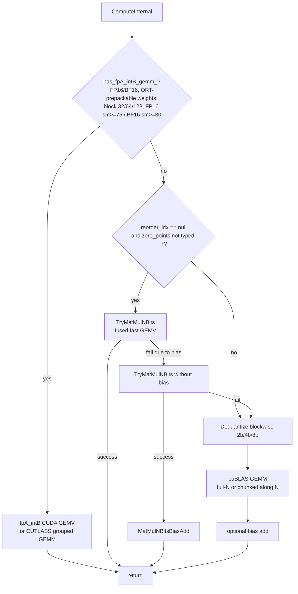

# MatMulNBits — CUDA Operator Documentation

This document describes the CUDA execution-provider implementation of the
**MatMulNBits** (`com.microsoft::MatMulNBits`) operator: its kernel dispatch
chain, the fast / fallback / specialized kernels, the weight format they expect,
and the environment variables that control routing.

MatMulNBits computes `Y = A · dequant(B)ᵀ (+ bias)` where `B` is an `N × K`
weight matrix quantized to 2, 4, or 8 bits with block-wise (group) scales and
optional zero points. It is the building block for weight-only quantized linear
layers (including MoE routers and LM heads).

Source files:

- [onnxruntime/contrib_ops/cuda/quantization/matmul_nbits.cc](../../../onnxruntime/contrib_ops/cuda/quantization/matmul_nbits.cc) — operator, `ComputeInternal`, dispatch chain, dequant+GEMM fallback.
- [onnxruntime/contrib_ops/cuda/quantization/matmul_nbits.h](../../../onnxruntime/contrib_ops/cuda/quantization/matmul_nbits.h) — kernel class, constructor-time configuration, environment-variable parsing.
- [onnxruntime/contrib_ops/cuda/quantization/matmul_nbits.cuh](../../../onnxruntime/contrib_ops/cuda/quantization/matmul_nbits.cuh) — `TryMatMulNBits` fast-path entry and bias-add launcher.
- [onnxruntime/contrib_ops/cuda/quantization/matmul_2bits.cu](../../../onnxruntime/contrib_ops/cuda/quantization/matmul_2bits.cu) — 2-bit fast GEMV / small-batch dispatch.
- [onnxruntime/contrib_ops/cuda/quantization/dequantize_blockwise_2bits.cu](../../../onnxruntime/contrib_ops/cuda/quantization/dequantize_blockwise_2bits.cu) — generic 2-bit fallback dequantization.
- [onnxruntime/contrib_ops/cuda/quantization/matmul_4bits.cu](../../../onnxruntime/contrib_ops/cuda/quantization/matmul_4bits.cu) — 4-bit fast GEMV kernels (generic + router specialization).

---

## Table of Contents

1. [Operator Schema](#1-operator-schema)
2. [Weight Format](#2-weight-format)
3. [Dispatch Chain](#3-dispatch-chain)
4. [Fast Path — Fused GEMV](#4-fast-path--fused-gemv)
   - [4.1 Generic 4-bit GEMV kernel](#41-generic-4-bit-gemv-kernel)
  - [4.2 Small-M batched GEMV](#42-small-m-batched-gemv)
  - [4.3 Router GEMV specialization](#43-router-gemv-specialization)
  - [4.4 2-bit fused kernels](#44-2-bit-fused-kernels)
5. [Fallback Path — Dequantize + GEMM](#5-fallback-path--dequantize--gemm)
6. [fpA_intB_gemm Path (CUTLASS weight-only)](#6-fpa_intb_gemm-path-cutlass-weight-only)
7. [Bias Handling](#7-bias-handling)
8. [Environment Variables](#8-environment-variables)
9. [Testing](#9-testing)

---

## 1. Operator Schema

| Attribute | Meaning |
|-----------|---------|
| `K` | Input feature dimension (columns of `A`, columns of the logical `B`). |
| `N` | Output feature dimension (rows of the logical `B`). |
| `bits` | Quantization bit width: `2`, `4`, or `8`. |
| `block_size` | Power-of-two quantization group size along `K`, at least 16. Fast-path support varies by bit width. One scale (and optional zero point) per group. |
| `accuracy_level` | Minimum accuracy level for internal handling of `A`; default `0` means unset. |
| `weight_prepacked` | CUDA fpA_intB weight-layout selector. `0` (default): `B` is in standard MatMulNBits layout and may be runtime-prepacked. `1`: `B` is already prepacked in the CUDA SM80 fpA_intB layout. `2`: `B` is prepacked in the CUDA SM90 (Hopper) fpA_intB layout, consumed by the native SM90 kernel (requires an SM90 device and `block_size` in {64, 128}). The native SM90 kernel is not compiled on Windows/MSVC builds (CUDA 13 host stubs hit MSVC `C2719` with over-aligned TMA parameters — see [moe_qmoe.md §14.1](./moe_qmoe.md)); on those builds the default `0`/`1` layouts run the SM80 compatibility kernel on Hopper instead. |

| Input | Index | Notes |
|-------|-------|-------|
| `A` | 0 | Activations, FP16 / BF16 / FP32. Shape `[M, K]`. |
| `B` | 1 | Packed 2/4/8-bit weights. |
| `scales` | 2 | Per-group scales, same element type as `A`. |
| `zero_points` | 3 | Optional. Packed integer (symmetric default) **or** same type as `A`. |
| `g_idx` / `reorder_idx` | 4 | Optional group/reorder index (act-order). Not supported for 2-bit CUDA weights. |
| `bias` | 5 | Optional `[N]` bias added to the output. |

`M` is the (flattened) token count: `M = 1` is the decode / GEMV case that the
fast kernels target.

---

## 2. Weight Format

For `bits=b`, `B` is stored as
`[N, ceil(K / block_size), block_size / (8 / b)]` bytes: each expert/output row
`n` is a contiguous packed run with `8 / b` weights per byte, preceded
conceptually by `K / block_size` scales in the `scales` tensor. Quantization is
**column-wise block** by default
(`column_wise_quant_blk_ = true`); row-wise layouts interleave `K` blocks across
`N` and cannot be sliced along `N` (this disables the chunked fallback).

Symmetric 4-bit weights store values `0..15` that dequantize to `(q − 8) ·
scale`; the fast kernels hard-code the zero point of `8` when no `zero_points`
input is present.

For 2-bit weights, four codes are packed into each byte, low two-bit code first.
Packed zero points use the same four-per-byte layout and default to `2` when the
input is absent. The CUDA implementation supports power-of-two block sizes from
16 through 256; fused kernels accept block sizes that divide their 512-element
warp iteration. `g_idx` is rejected for 2-bit weights.

### 2.1 CUDA fpA_intB prepacked layout

`weight_prepacked=1` means input `B` has the same tensor shape and byte count as
the standard MatMulNBits `B`, but its bytes are already reordered into the CUDA
fpA_intB SM80 weight-only layout. During ORT prepacking the CUDA EP passes those
bytes directly to the fpA_intB kernels without an additional GPU copy: when `B`
is already device-resident (e.g. a constant initializer pinned to the GPU) the
prepacking step is skipped entirely; when `B` is host-resident it is transferred
to device as usual but the runtime weight transpose / mixed-GEMM preprocessing
step is **not** performed.

The offline CUDA packer exposed through Python produces this layout:

```python
from onnxruntime.capi import onnxruntime_cuda_quant_preprocess as _cuda_quant

prepacked_flat = _cuda_quant.pack_weights_for_cuda_mixed_gemm(
  q_weight.reshape(N, -1), N, K, bits, 80
)
prepacked_b = np.asarray(prepacked_flat, dtype=np.int8).view(np.uint8).reshape(q_weight.shape)
```

The final argument is the target packing architecture. Use `80` for the SM80
layout (consumed by the SM80 CUTLASS kernel, including on newer GPUs via the
compatibility path) and set `weight_prepacked=1` on the node. Use `90` for the
native SM90 (Hopper) layout and set `weight_prepacked=2` on the node.

`weight_prepacked=2` selects the native SM90 (Hopper TMA/WGMMA) mixed-GEMM
kernel and its Hopper weight layout. It requires a compute capability 9.0 device
and `block_size` in `{64, 128}` (the SM90 kernel needs `group_size` to be a
multiple of the 64-element Hopper K tile, so `block_size=32` uses the
non-Hopper kernel). On SM90 devices, runtime-prepacked (`weight_prepacked=0`)
and SM80-prepacked (`weight_prepacked=1`) weights continue to route to the SM80
CUTLASS kernel/layout.

---

## 3. Dispatch Chain

`MatMulNBits<T>::ComputeInternal` tries the cheapest applicable path first and
falls through to progressively more general ones:


```mermaid
flowchart TD
  A[ComputeInternal] --> F{has_fpA_intB_gemm_?<br/>FP16/BF16, ORT-prepackable weights,<br/>block 32/64/128, FP16 sm>=75 / BF16 sm>=80}
  F -- yes --> FP[fpA_intB CUDA GEMV<br/>or CUTLASS grouped GEMM] --> R[return]
  F -- no --> G{reorder_idx == null<br/>and zero_points not typed-T?}
  G -- no --> DQ
  G -- yes --> T1[TryMatMulNBits<br/>fused fast GEMV]
  T1 -- success --> R
  T1 -- fail due to bias --> T2[TryMatMulNBits without bias]
  T2 -- success --> BIAS[MatMulNBitsBiasAdd] --> R
  T2 -- fail --> DQ
  DQ[Dequantize blockwise 2b/4b/8b] --> GEMM[cuBLAS GEMM<br/>full-N or chunked along N]
  GEMM --> BIAS2[optional bias add] --> R
```

The fast fused path is only attempted when there is **no** `reorder_idx` and the
`zero_points` (if any) are packed integers (not the same element type as `A`).

---

## 4. Fast Path — Fused GEMV

`TryMatMulNBits` ([matmul_nbits.cuh](../../../onnxruntime/contrib_ops/cuda/quantization/matmul_nbits.cuh))
dispatches by bit width:

- `bits == 8` → `TryMatMul8Bits` (no bias support; returns `false` if bias set).
- `bits == 4` → `TryMatMul4Bits`.
- `bits == 2` → `TryMatMul2Bits` (`1 <= M <= 8`; no fused bias support; larger `M` or bias falls through to §5).

`TryMatMul4Bits` ([matmul_4bits.cu](../../../onnxruntime/contrib_ops/cuda/quantization/matmul_4bits.cu))
first applies a guard common to all fused kernels:

```
n % kColsPerThreadBlock (8) == 0   and   k % 8 == 0   and   m <= 16
```

i.e. the fused path handles a single token or a small batch. If the guard passes,
it chooses between the M=1 kernel (§4.1), the small-M batched kernels (§4.2),
and the router specialization (§4.3).

### 4.1 Generic 4-bit M=1 GEMV kernel

`MatMulFloat4BitsKernelM1<T, block_size, has_zero_point>` is implemented in
`matmul_4bits_m1_impl.cuh` and instantiated by the dtype-specific translation
units:

- **Launch:** grid `(ceil(N / 8), 1)`, block `(warpSize, 8)` — one **warp per
  output column** (`kColsPerThreadBlock = 8` warps per block).
- **Scales / zero points** are staged into shared memory once per thread block
  and the launcher returns `false` if the total requirement exceeds the per-block limit.
- **Inner loop:** each lane consumes eight packed int4 weights per iteration,
  followed by a warp reduction.
- **Supported `block_size`:** 16 / 32 / 64 / 128.
- **Bias:** not supported — the kernel returns `false` to `TryMatMul4Bits` when
  `bias != nullptr` (see §7 for how bias is then handled).

### 4.2 Small-M batched GEMV

For `2 <= M <= 16`, `TryMatMul4Bits` first attempts the register-tiled
half/BF16 batched kernel and then the shared-memory `MatMulFloatInt4KernelSmallM`
path. These paths dequantize each packed weight word once and reuse it across
multiple activation rows.

### 4.3 Router GEMV specialization

`MatMulFloatInt4RouterKernel<T, BlockSize>` is a specialization for MoE-router
GEMVs (`output(1, N) = A(1, K) · dequant(B(N, K)) + bias(N)`). It is selected by
`IsSupportedRouterGemvShape` when:

- `zero_points == nullptr` (symmetric), `M == 1`,
- `block_size ∈ {32, 64}` and `K % block_size == 0`,
- the `(N, K)` pair matches the exact-gated router shape:

| Model | `N` (experts) | `K` (hidden size) |
|-------|---------------|-------------------|
| gpt-oss-20b | 32 | 2880 |

Design notes:

- **One warp per expert column**, `kColsPerThreadBlock = 8` warps per block;
  grid is `(N / 8, 1)`. `N` is supplied at runtime via the grid and `K` at
  runtime as a kernel argument, so a single instantiation per `(T, BlockSize)`
  serves every router shape. Only `BlockSize` is a template parameter because it
  drives the scale stride.
- **No shared memory:** scales are read directly from global memory (and are
  L2-resident at these tiny sizes), avoiding the staging `__syncthreads` of the
  generic kernel.
- **Bias is fused:** lane 0 adds `bias[n_id]` before the store.
- **Group size 32 vs 64:** both are supported because `kPerIter = 256` is
  divisible by each, keeping the per-iteration scale stride exact. 64 halves the
  number of scale loads relative to 32; pick whichever quantization granularity
  gives the best accuracy/latency trade-off for the model. (Per-row / per-column
  quantization, i.e. one scale per expert, is **not** a supported MatMulNBits
  layout and is intentionally excluded.)
- The same correctness invariants as the generic kernel apply (3-tier unroll +
  remainder, warp-shuffle reduction).

To add another router, extend `IsSupportedRouterGemvShape` with its `(N, K)`;
no kernel change is required as long as `N % 8 == 0` and `K % block_size == 0`.

### 4.4 2-bit fused kernels

The 2-bit fast path handles `1 <= M <= 8`, `N % 8 == 0`, and `K % 16 == 0`.
Each thread loads one aligned 32-bit word containing 16 codes. The M=1 kernel
uses one warp per output column; M=2 through 8 use register-tiled batched
kernels. The block size must be at least 16 and divide both `K` and the
512-element warp iteration. FP16 half2 kernels require SM53 or newer; older
devices decline the fused path and use generic dequantization plus cuBLAS.

---

## 5. Fallback Path — Dequantize + GEMM

When neither the fpA_intB path nor the fused GEMV applies (e.g. `M > 1`,
`reorder_idx` present, typed zero points, or an unsupported shape), the operator
dequantizes `B` into a scratch buffer and runs a dense cuBLAS GEMM:

- `DequantizeNBits` dispatches the column-wise 2/4/8-bit implementations; the
  row-wise fallback uses `DequantizeBlockwise4b` / `DequantizeBlockwise8b`. These
  expand packed weights to `T` into a `N × K_padded` scratch buffer, where
  `K_padded = ceil(K / block_size) · block_size`.
- A single cuBLAS `GEMM` (`transb = true`) then produces `Y`.

**Chunked variant.** For large `N`, materializing the full `N × K_padded`
dequantized matrix can dominate device memory. The implementation slices the
dequant+GEMM along `N` into chunks when:

- column-wise quantization and no `reorder_idx`, **and**
- `force_chunked_` is set, **or** scratch `> 256 MB` and `N > 2 ×
  chunk_target_rows`.

`chunk_target_rows` defaults to 32768 (configurable, see §8) — chosen so each
tile saturates the SMs while keeping scratch ≲128 MB.

---

## 6. fpA_intB_gemm Path (CUTLASS weight-only)

`onnxruntime_USE_FPA_INTB_GEMM` is the master build option and defaults to `ON`
for CUDA builds. Its default kernel set is intentionally compact, excludes the
native Hopper kernel, and covers the SM80-layout RC model contract:

- FP16 or BF16 activations and INT2, INT4 or INT8 weights,
- scale-only quantization with no zero-points, bias, or `g_idx`, at
  `block_size=32` for 4/8-bit and `block_size=64` for 2-bit (2-bit has no valid
  `block_size=32`; see §6.1),
- `N % (bits==8 ? 32 : bits==4 ? 64 : 128) == 0`, `K % block_size == 0`, and
  `sm_ >= 75` for FP16 or `sm_ >= 80` for BF16,
- unpacked weights or `weight_prepacked=1` (the SM80 layout).

Set `onnxruntime_USE_FPA_INTB_GEMM_FULL=ON` to build the legacy full kernel
matrix. Full mode additionally supports `block_size=128`, `block_size=64` for
4/8-bit, zero-points, bias, and the native SM90 layout
(`weight_prepacked=2`). The native SM90 kernel supports only
`block_size ∈ {64, 128}`; see §2.1.

### 6.1 2-bit weights

`bits=2` reuses the SM80 column-interleaved weight layout. The compact set
carries the FP16/BF16 scale-only variants at `block_size=64`; `block_size=128`
and zero-points need `onnxruntime_USE_FPA_INTB_GEMM_FULL=ON`. Relative to 4-bit
the eligibility rules add two constraints:

- `N` must be a multiple of **128** rather than 64, because the 2-bit layout
  interleaves 8 columns per 128-byte cache line instead of 4.
- `block_size` must be **64 or 128**. At 2 bits a single `ldmatrix.x4` fills a
  warp's whole B fragment for a complete 64-element K tile, and the fused GEMV
  likewise applies one scale to each thread's 64-element run, so a 32-element
  quantization group has no valid kernel.

There is **no native SM90 (Hopper) 2-bit kernel**. `weight_prepacked=2` is
rejected for `bits=2`, and on an SM90 device 2-bit weights run the SM80
compatibility kernel. A native Hopper layout for 2-bit is future work.

The layout parameters follow the same formulas as the other widths, evaluated at
`sizeof_bits<ElementB> = 2`:

| | 8-bit | 4-bit | 2-bit |
|---|---|---|---|
| `ThreadblockK` (fp16 activations) | 64 | 64 | 64 |
| `ColumnsInterleaved` / `kInterleave` | 2 | 4 | 8 |
| LDSM row-permutation tile (`kPerm_W*`) | 16 | 32 | 64 |
| `kWarpGemmIterationsForB` (B smem loads per K tile) | 4 | 2 | 1 |
| GEMV `kStepK` | 16 | 32 | 64 |
| GEMV `CtaN` (no zero-points) | 8 | 8 | 4 |
| Required `N` alignment | 32 | 64 | 128 |
| Supported `block_size` | 32/64/128 | 32/64/128 | 64/128 |

`CtaN` is halved for 2-bit so that the per-block register tile of dequantized
weights (`CtaN * kStepK` halves) and the number of columns a block covers
(`CtaN * kInterleave = 32`) both stay at the values the 4-bit kernel was tuned
for.

`kWarpGemmIterationsForB == 1` is what makes 2-bit the first width to exercise an
odd B-load count per K tile. The dequantizing mainloops
(`cutlass_extensions/gemm/threadblock/dq_mma_{multistage,pipelined}_{finegrained,percol}.h`)
index the two-deep B register pipeline with the *within-tile* load index, which is
only a valid cursor when that count is even. They now rotate the two buffers
(`warp_frag_B[0] = warp_frag_B[1]`) after the last k-iteration when the count is
odd, keeping both indices compile-time constants. A running read cursor also
fixes the correctness bug but is not loop-invariant across the mainloop, so
`warp_frag_B` becomes dynamically indexed and ptxas gives it a 64-byte per-thread
stack frame; that cost 4-7% at `M >= 128`. The generated code is unchanged for 4-
and 8-bit (verified by diffing PTX against the pre-2-bit baseline).

The offline weight transform gains a `QuantType::W2_A16` that mirrors the 4-bit
pipeline: row-permute, sub-byte transpose, 8-column interleave, then a
`[e0,e2,...,e14,e1,e3,...,e15]` pair-interleave with the codes re-centred on the
symmetric zero point 2. `FastInterleavedAndBiasedNumericArrayConverter<T,
uint2b_t, N>` inverts exactly that pair-interleave, which is why its output
comes back in logical order.

#### The row-permutation map is forced, not tuned

`kPerm_W2_A16` follows the same closed form as the existing 8- and 4-bit maps.
With `tile = 8 * kInterleave` and `i = (tile/4)*q + r`:

```
perm[i] = 2q + 8*(r >> 1) + (r & 1)
```

which reproduces `kPerm_W8_A16` at `kInterleave = 2` and `kPerm_W4_A16` at
`kInterleave = 4`, and gives the 64-entry 2-bit map at `kInterleave = 8`.

This map is a **correctness requirement, not a bank-conflict optimization**, and
it has no free parameters:

- `ldmatrix` always moves 16-bit elements, so one of its element slots carries
  `16/bits` weights (`= kInterleave`). The permutation is what puts the weight a
  thread needs into the slot `ldmatrix` will hand that thread; it composes with
  the fixed `ldmatrix` pattern and the fixed converter shuffle to the identity.
- Measured on H200 with `ncu`: the 2-bit `CtaShape128x128x64` kernel executes
  **0 shared-memory bank conflicts** on both loads and stores
  (`l1tex__data_bank_conflicts_pipe_lsu_mem_shared_op_{ld,st}.sum = 0`, over 832
  load and 128 store wavefronts); 4-bit is also 0. Bank-conflict avoidance is
  already handled by the swizzled smem layout
  (`layout::ColumnMajorTensorOpMultiplicandCrosswise<2, 64>`), which is a
  separate mechanism from this map.
- Perturbing the map fails `MatMulNBitsFpAIntBLayout.Int2WeightsRoundTripExactly`
  immediately: swapping the two entries *within* one pair, or swapping two whole
  pairs, both produce wrong results. Every position is pinned.

So there is no A/B test to run on the map itself. Any bank-conflict work would
have to change the shared-memory layout and the permutation together.

`MatMulNBitsFpAIntBLayout` in
[onnxruntime/test/contrib_ops/matmul_nbits_fpa_intb_layout_test.cc](../../../onnxruntime/test/contrib_ops/matmul_nbits_fpa_intb_layout_test.cc)
pins this layout down: it runs the op with `A = I` so the output *is* the
dequantized weight matrix, and compares it exactly.

#### Measured behaviour (H200, FP16, `block_size=128`)

Latencies in microseconds for the bonsai2-27B 2-bit shapes, from the benchmark
table printed by `Fp16Int2GroupwiseTest`:

| shape | `M` | fpA_intB GEMV | fpA_intB GEMM | fused 2-bit GEMV (§4) | dequant + cuBLAS (§5) |
|---|---|---|---|---|---|
| `N=17408, K=5120` | 1 | **15.03** | 40.17 | 21.79 | 138.55 |
| `N=5120, K=6144` | 1 | **7.75** | 24.67 | 9.93 | 54.19 |
| `N=1024, K=5120` | 1 | **5.41** | 18.25 | 5.67 | 16.19 |
| `N=17408, K=5120` | 512 | n/a | 446.8 | n/a | **204.4** |
| `N=17408, K=5120` | 2048 | n/a | 1703 | n/a | **556.2** |

So the 2-bit fpA_intB path is a **decode** optimization: the fused GEMV is the
fastest option at every production shape for `M <= 8` (1.05-1.45x over the
hand-written 2-bit GEMV and 2.9-9.2x over dequant+cuBLAS), and the tactic
profiler switches to the CUTLASS GEMM at around `M = 14`.

Above roughly `M = 128` the 2-bit CUTLASS GEMM is **slower than dequant+cuBLAS**
(2.2x at `M=512`, 3.1x at `M=2048`). This is specific to 2 bits, not to the
weight-only path: under the same harness the 4-bit GEMM is 1.3x *faster* than
dequant+cuBLAS at `M=512`. The warp B fragment is fixed at 32 bytes per thread by
`ldmatrix.x4`, so at 2 bits it decodes to 128 halves where 4 bits decodes to 64,
and one B load feeds 4 MMA k-steps instead of 2.

Converting that fragment one k-step at a time — so only 32 halves are live rather
than 128 — was implemented and measured, and it is a **loss**: 9-15% slower than
the shipped kernel across every production shape at `M >= 128`. It saves 6
registers (226 -> 220), but occupancy is 1 CTA/SM either way, so the saving buys
nothing while the strided gather that rebuilds each k-step's converter word is
pure added ALU. Do not retry it without first changing what limits occupancy.

When enabled via `ORT_FPA_INTB_GEMM`, eligible MatMulNBits nodes use the
TensorRT-LLM-derived CUTLASS weight-only kernels. Weight and scale inputs (and
zero-points in full mode) must be constant initializers that ORT can prepack.

At run time a profiler picks the best tactic; small `M` may use a dedicated CUDA
GEMV kernel (`bestTactic->enableCudaKernel`), otherwise a CUTLASS grouped GEMM.
The compact fpA_intB GEMV does not support zero-points or bias. This path takes
precedence over everything in §3 when active.

For `weight_prepacked=0`, the CUDA EP preprocesses the standard MatMulNBits
weight initializer into the fpA_intB layout during ORT prepacking. For
`weight_prepacked=1`, the initializer is treated as already preprocessed and is
copied directly after a byte-size check.

### 6.2 M chunking

The fpA_intB path launches a single GEMM over all `M` rows by default. Two
buffers grow with `M`:

- the runtime CUTLASS workspace, `ceil(M/16) * ceil(N/64) * 28` bytes on the
  SM80 kernel (the native SM90 kernel reserves a fixed stream-K workspace), and
- the tactic-profiler scratch for an `M` bucket, which holds `A` (`M x K`), a
  weight-sized buffer, scales, and a full output `C` (`M x N`). It is allocated
  once at kernel construction (largest initial bucket, 2048 by default) and again
  on first use of any `M` whose rounded bucket was not profiled.

For a large-vocabulary LM head this scratch is dominated by `C`. With
Qwen3.8-27B (`N=248320`, `K=5120`, INT4, `block_size=32`), the profiler scratch is
~1.72 GiB at `M=2048` and ~4.7 GiB for a lazily profiled `M=8192` prefill chunk.

Setting `ep.cuda.matmul_nbits_m_chunk_size` (or `ORT_MATMULNBITS_M_CHUNK_SIZE`)
to a positive value `Mc` computes `Y` in row chunks of at most the effective
`Mc`. For values below 8192, the configured `Mc` is rounded down to a supported
profile bucket.

- `M > Mc`, and
- `M` exceeds the 256 MiB row cutoff, `floor(256 MiB / ((N + K) * sizeof(T)))`.
  Below 8192, that cutoff is rounded down to the previous profile bucket because
  the profiler rounds requested M up; at and above 8192, profiler buckets
  saturate at 8192.

Small layers are not split, because the extra launches cost time and save almost
nothing.

`ORT_MATMULNBITS_FORCE_CHUNKED=1` bypasses the size condition (it also forces
the §5 fallback's N chunking). For Qwen3.8-27B in FP16/BF16 the size condition
means:

| node | `N` | `K` | size-gate cutoff (`M` >) |
|---|---|---|---|
| LM head | 248320 | 5120 | 512 |
| MLP gate/up | 17408 | 5120 | 4096 |
| MLP down | 5120 | 17408 | 4096 |
| any node with `N + K <= 16384` | | | >= 8192 |

Each chunk reuses one workspace sized for the effective `Mc`, looks up its own tactic (a
trailing partial chunk may pick a different tactic, including the GEMV for fewer
than 16 rows). Constructor profiling is capped at the largest `M` that can still
run unchunked, `max(Mc, size-gate M)`, so a large node never profiles a bucket
above that cap. At `Mc=256` the LM-head profiler scratch above
drops to ~0.86 GiB; the remainder is the weight-sized and scale buffers, which do
not depend on `M`. Prefer a power of two so trailing chunks round to an
already-profiled bucket.

Measured on H200 for that LM-head node alone (FP16, fpA_intB SM80 kernel,
`arena_extend_strategy=kSameAsRequested`, NVML sampled from a separate process):

| `M` | chunk | session-creation peak | run peak | session creation | first run | steady run |
|---|---|---|---|---|---|---|
| 2048 | off | 3112 MiB | 3080 MiB | 17.5 s | 584 ms | 78.4 ms |
| 2048 | 256 | 2234 MiB | 3080 MiB | 8.2 s | 619 ms | 79.0 ms |
| 8192 | off | | 10762 MiB | 18.5 s | 21716 ms | 464-480 ms |
| 8192 | 2048 | | 5990 MiB | 18.3 s | 2239 ms | 316-324 ms |
| 8192 | 256 | | 5990 MiB | 9.0 s | 2208-2362 ms | 313-390 ms |

When `M` exceeds the largest profiled bucket, chunking removes the lazy
profiling of the large bucket: -4.7 GiB peak and a ~10x faster first run. The
remaining 5990 MiB is mostly the `Y` output itself (3.8 GiB at `M=8192`).

When `M` is within the profiled range, chunking only lowers the session-creation
peak (the profiler's `M x N` output buffer), and the run peak is about as high:

| component (M=2048), from the NVML timeline | MiB | depends on M chunk |
|---|---|---|
| CUDA context and other runtime allocations | 658 | no |
| raw `B` + scales initializers, kept after prepack | 692 | no |
| prepacked `B` + scales | 684 | no |
| `A` and other run allocations | 64 | no |
| output `Y` (969 MiB) + CUTLASS workspace (13 MiB) | 980 | workspace only (13 -> 2 MiB) |

The raw initializer stays resident because it is freed into the BFC arena.
With `session.use_device_allocator_for_initializers=1` it is released, and the
peaks become 3114 -> 2568 MiB (chunk off -> 256; run peak 2430 / 2416 MiB). In a
full model the session-creation peak also overlaps other nodes' initializers, so
the saving applies per profiled node.

The Level-2 `DeclareWorkspaceRequirements` estimate uses the chunk size. The
Level-1 (partition-time) estimate ignores it and stays a conservative upper
bound.

M chunking applies only to the fpA_intB path. The dequantize + cuBLAS fallback
(§5) needs no `M`-proportional scratch; its dequantized-weight buffer is bounded
by `N` chunking (`ORT_MATMULNBITS_CHUNK_SIZE`). The fused GEMV (§4) handles
`M <= 16` and needs no workspace.

Prepacked weights are intentionally strict:

- If ORT was built without `onnxruntime_USE_FPA_INTB_GEMM=ON`, any nonzero
  `weight_prepacked` value throws during kernel construction.
- Any nonzero `weight_prepacked` value forces the fpA_intB path on, so the enable
  flag (`ep.cuda.fpa_intb_gemm` session config, or the `ORT_FPA_INTB_GEMM` env
  var) is ignored for prepacked weights — the layout choice was fixed at export
  time and cannot be turned off at run time.
- Nonzero `weight_prepacked` requires FP16 or BF16 input `A` in the default
  compact build or a full build, because only the CUDA fpA_intB path consumes
  this layout.
- `weight_prepacked` must match the layout the selected kernel expects: `1` is
  the SM80 layout, `2` is the native SM90 (Hopper) layout. `2` additionally
  requires a compute-capability 9.0 device and `block_size ∈ {64, 128}` and is
  rejected otherwise.

---

## 7. Bias Handling

Only the router specialization (§4.3) fuses bias inside the GEMV. For every other
fast-path shape, `TryMatMul2Bits` / `TryMatMul4Bits` / `TryMatMul8Bits` return `false` when bias is
present. `ComputeInternal` then:

1. Retries `TryMatMulNBits` with `bias = nullptr`; on success it adds the bias
   with a separate `MatMulNBitsBiasAdd` kernel (`LaunchMatMulNBitsBiasAdd`,
   accumulating in float for half/bfloat16 accuracy).
2. If the fast path still does not apply, falls through to the dequant+GEMM
   fallback (§5), which ignores bias, followed by the same bias-add kernel.

---

## 8. Environment Variables

| Variable | Type / default | Effect |
|----------|----------------|--------|
| `ORT_DISABLE_QMOE_ROUTER_GEMV_SPECIALIZATION` | bool, `0` | Disable the router GEMV specialization (§4.3); shapes fall back to the generic GEMV / dequant path. Useful for A/B benchmarking. |
| `ORT_FPA_INTB_GEMM` | int/string, `0` | Enable the CUTLASS weight-only path (§6). `0` or `off` disables it, otherwise enables it. |
| `ORT_MATMULNBITS_FORCE_CHUNKED` | int, `0` | Force the chunked dequant+GEMM fallback (§5) regardless of the size heuristic, and bypass the fpA_intB M-chunking size condition (§6.2). |
| `ORT_MATMULNBITS_CHUNK_SIZE` | int64, `32768` | Target rows per chunk in the chunked fallback. Values `< 1` reset to the default. |
| `ORT_MATMULNBITS_M_CHUNK_SIZE` | int, `0` | Max rows of `A` per fpA_intB launch (§6.2). `0` disables M chunking. Overridden by the `ep.cuda.matmul_nbits_m_chunk_size` session config entry. Also applies to the CUDA plugin EP. |

> Environment variables are read with ORT's cross-platform
> `ParseEnvironmentVariableWithDefault` helper (safe on Windows), not
> `std::getenv`.

---

## 9. Testing

- CUDA EP internal tests run through `CUDA_EP_Unittest` in
  [onnxruntime/test/providers/cuda/cuda_provider_test.cc](../../../onnxruntime/test/providers/cuda/cuda_provider_test.cc).
  Run them from `onnxruntime_provider_test` with:

  ```bash
  ./onnxruntime_provider_test --gtest_filter=CUDA_EP_Unittest.*
  ```

  This wrapper executes the internal CUDA-UT shared library and covers the
  fpA_intB / MatMulNBits groupwise GEMM tests under
  [onnxruntime/test/contrib_ops/cuda_kernels/fpA_intB_gemm_kernel_test.cc](../../../onnxruntime/test/contrib_ops/cuda_kernels/fpA_intB_gemm_kernel_test.cc)
  as well as the SM90 validation tests in
  [onnxruntime/test/contrib_ops/cuda_kernels/matmul_nbits_sm90_validation_test.cc](../../../onnxruntime/test/contrib_ops/cuda_kernels/matmul_nbits_sm90_validation_test.cc).
- Python operator tests: `onnxruntime/test/python/transformers` (see the QMoE /
  GEMV profiling helpers, e.g. `profile_qmoe_gemv.sh`).
- CUDA prepacked-weight parity tests:
  [onnxruntime/test/python/quantization/test_op_matmulnbits_prepacked_cuda.py](../../../onnxruntime/test/python/quantization/test_op_matmulnbits_prepacked_cuda.py).
  These use `onnxruntime_cuda_quant_preprocess.pack_weights_for_cuda_mixed_gemm(..., 80)` to produce
  `weight_prepacked=1` initializers and compare their outputs against runtime
  fpA_intB prepacking for int4/int8 and GEMV/GEMM-shaped `M` values.
- Constructor failure tests for unsupported prepacked configurations live in
  [onnxruntime/test/contrib_ops/matmul_4bits_test.cc](../../../onnxruntime/test/contrib_ops/matmul_4bits_test.cc).
- CUDA 2-bit fused, fallback, chunked, and validation coverage lives in
  [onnxruntime/test/contrib_ops/matmul_2bits_test.cc](../../../onnxruntime/test/contrib_ops/matmul_2bits_test.cc).
  Run it from `onnxruntime_provider_test` with
  `--gtest_filter=MatMul2BitsCuda.*`.
- GEMV profiling baselines and methodology are recorded in
  [qmoe_gemv_experiments.md](qmoe_gemv_experiments.md).
- To compare the router specialization against the generic path, run the same
  model with and without `ORT_DISABLE_QMOE_ROUTER_GEMV_SPECIALIZATION=1`.

After editing any `.cu` kernel, rebuild the CUDA provider
(`ninja onnxruntime_providers_cuda`) and re-run the relevant tests; note the
nvcc incremental-build caveats in the repository build notes.
