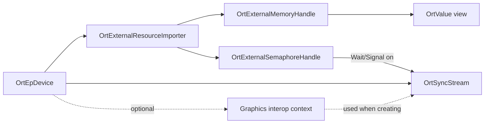

# Interop API: usage and extension guide

The `OrtInteropApi` enables zero-copy sharing and GPU-side synchronization between ONNX Runtime (ORT) and external
GPU workloads. An application can import externally allocated memory as an ORT tensor, import timeline semaphores or
fences, and enqueue waits and signals on an EP stream. Graphics interop initialization can also let an execution
provider (EP) create streams in a graphics-compatible context.

External resource import was added in ORT 1.24. Graphics interop initialization was added in ORT 1.25. Both are
optional EP capabilities. In minimal builds, `OrtApi::GetInteropApi()` returns null and `Ort::GetInteropApi()` throws.

This document is for application developers using the API, EP authors implementing it, and ORT developers extending
it. The sections on implementing an importer and on where to make changes are for the latter two audiences.

## API model

Applications obtain the API through `OrtApi::GetInteropApi()` or the C++ helper `Ort::GetInteropApi()`. Operations are
associated with an `OrtEpDevice`, not directly with a session.

There are two related but independent capabilities:

- **External resource import:** `CreateExternalResourceImporterForDevice` returns an EP-specific capability object.
  A successful call may return a null importer when the EP or device does not support import. If the returned importer
  is non-null, use `CanImportMemory` and `CanImportSemaphore` before importing a particular handle type.
- **Graphics interop initialization:** `InitGraphicsInteropForEpDevice` lets an EP factory configure a graphics-aware
  context before streams are created. This is global to the `OrtEpDevice`, not a session. An EP may support resource
  import without requiring graphics initialization, or support neither capability.



The public descriptors and `OrtInteropApi` function table are declared in
[`onnxruntime_c_api.h`](../../include/onnxruntime/core/session/onnxruntime_c_api.h). Every versioned descriptor must have
its `version` field set to `ORT_API_VERSION`. ORT core does not validate descriptor versions or contents beyond null
checks; the EP performs that validation.

### Reporting unsupported functionality

The two capabilities report lack of support differently:

| Call | EP or device does not support it |
| --- | --- |
| `CreateExternalResourceImporterForDevice` | Success with a null importer |
| `CanImportMemory`, `CanImportSemaphore` | Success with `false` |
| `ImportMemory`, `ImportSemaphore`, `CreateTensorFromMemory`, `WaitSemaphore`, `SignalSemaphore` | `ORT_NOT_IMPLEMENTED` |
| `InitGraphicsInteropForEpDevice`, `DeinitGraphicsInteropForEpDevice` | `ORT_NOT_IMPLEMENTED` |
| `CreateSyncStreamForEpDevice` | `ORT_NOT_IMPLEMENTED` if the EP is not stream-aware; <br>`ORT_INVALID_ARGUMENT` if the `OrtEpDevice` has a device memory type that is not `DEFAULT` |

### Descriptor and handle rules

- `OrtExternalMemoryDescriptor::size_bytes` is the size of the whole external allocation. `offset_bytes` is the base
  offset of the imported region within it.
- `OrtExternalTensorDescriptor::offset_bytes` is added to the memory descriptor's offset, so several tensors can view
  the same imported allocation. ORT core does not check that a tensor fits in the imported region, and does not prevent
  overlapping views; the EP is expected to validate bounds.
- `ORT_EXTERNAL_MEMORY_HANDLE_TYPE_HOST_ALLOCATION` (ORT 1.30) takes a host virtual address that must be page-aligned.
- ORT core never duplicates or closes a `native_handle`. Whether the EP duplicates it, and how long the application
  must keep it open, is EP-specific; ownership of the native object itself follows the originating platform API.
- ORT core adds no locking around importers, handles, or streams. Unless the EP documents otherwise, do not use the
  same object from several threads concurrently.

## Example: import D3D12 memory

The following abbreviated C++ example assumes the application has already registered an EP, selected its
`OrtEpDevice`, and created a shared D3D12 buffer and handle. Check every returned `OrtStatus`; error handling is omitted
only to keep the example focused.

```cpp
const OrtApi& ort_api = Ort::GetApi();
const OrtInteropApi& interop_api = Ort::GetInteropApi();

OrtExternalResourceImporter* importer = nullptr;
Ort::ThrowOnError(
    interop_api.CreateExternalResourceImporterForDevice(ep_device, &importer));
if (importer == nullptr) {
  // This EP device does not implement external resource import.
  return;
}

bool supported = false;
Ort::ThrowOnError(interop_api.CanImportMemory(
    importer, ORT_EXTERNAL_MEMORY_HANDLE_TYPE_D3D12_RESOURCE, &supported));
if (!supported) {
  interop_api.ReleaseExternalResourceImporter(importer);
  return;
}

OrtExternalMemoryDescriptor memory_desc{};
memory_desc.version = ORT_API_VERSION;
memory_desc.handle_type = ORT_EXTERNAL_MEMORY_HANDLE_TYPE_D3D12_RESOURCE;
memory_desc.native_handle = shared_d3d12_handle;
memory_desc.size_bytes = buffer_size;

OrtExternalMemoryHandle* memory = nullptr;
Ort::ThrowOnError(interop_api.ImportMemory(importer, &memory_desc, &memory));

const int64_t shape[] = {1, 3, 224, 224};
OrtExternalTensorDescriptor tensor_desc{};
tensor_desc.version = ORT_API_VERSION;
tensor_desc.element_type = ONNX_TENSOR_ELEMENT_DATA_TYPE_FLOAT;
tensor_desc.shape = shape;
tensor_desc.rank = std::size(shape);

OrtValue* tensor = nullptr;
Ort::ThrowOnError(
    interop_api.CreateTensorFromMemory(importer, memory, &tensor_desc, &tensor));

// Bind or pass tensor to a session that uses ep_device.

ort_api.ReleaseValue(tensor);
interop_api.ReleaseExternalMemoryHandle(memory);
interop_api.ReleaseExternalResourceImporter(importer);
```

`CreateTensorFromMemory` creates a view and does not copy or own the imported allocation. The external memory handle
must outlive every tensor created from it. A tensor descriptor's `offset_bytes` is relative to the memory descriptor's
`offset_bytes`, so one imported allocation can back multiple tensors.

## Initializing graphics interop

Some EPs need to know the external graphics API before they create streams, for example to create a CUDA context that
can interoperate with D3D12. Call `InitGraphicsInteropForEpDevice` before `CreateSyncStreamForEpDevice` for the same
`OrtEpDevice`; streams created earlier do not use the graphics-aware context.

```cpp
OrtGraphicsInteropConfig config{};
config.version = ORT_API_VERSION;
config.graphics_api = ORT_GRAPHICS_API_D3D12;
config.command_queue = d3d12_command_queue;  // Optional; interpreted by the EP.
config.additional_options = nullptr;         // Optional; opaque to ORT, keys are EP-specific.

Ort::Status status{interop_api.InitGraphicsInteropForEpDevice(ep_device, &config)};
if (!status.IsOK() && status.GetErrorCode() != ORT_NOT_IMPLEMENTED) {
  // Handle the error. ORT_NOT_IMPLEMENTED means the EP does not need or support graphics interop.
}
```

ORT passes `config` to the EP factory unchanged. How `command_queue` is used, and which `additional_options` keys are
recognized, is EP-specific; see the EP's documentation. For example, the TensorRT RTX EP uses `command_queue` for D3D12
and reads its Vulkan interop data from `additional_options`. The initialized state applies to all sessions that use the
`OrtEpDevice`. Call `DeinitGraphicsInteropForEpDevice` once the
streams, semaphores, and importers created for that device have been released.

## Running on a supplied stream

Work submitted to the same native stream is already ordered and requires no semaphore. Pass the stream to inference
with `RunOptionsSetSyncStream` or `Ort::RunOptions::SetSyncStream`. The stream temporarily overrides the session stream
for the matching device for that call to `Run` and must remain alive until `Run` returns. `Run` fails with
`ORT_INVALID_ARGUMENT` if the session has no stream for the stream's device.

The session must use `ORT_SEQUENTIAL`. With `ORT_PARALLEL`, ORT logs a warning and **ignores** the supplied stream, so
inference runs on the session's own stream and any ordering that relies on the supplied stream is lost.

### Synchronizing a D3D12 queue with a CUDA stream

The following example uses the TensorRT RTX EP and crosses two queue domains: an external D3D12 command queue produces
the input, while ORT runs inference on a CUDA stream. Graphics interop makes the CUDA context compatible with D3D12, but
it does not make the D3D12 queue and CUDA stream a single ordered stream. The shared fence establishes ordering between
them. Other EPs follow the same pattern with their own native stream type.

The snippet assumes that:

- `importer` supports D3D12 fences;
- `ep_device` supports stream creation and `session` runs on that device with `ORT_SEQUENTIAL`;
- `input` and `output` are `Ort::Value` instances that wrap device-resident tensors from `CreateTensorFromMemory`
  with known shapes (`Ort::Value` takes ownership, so do not also call `ReleaseValue` on the raw pointers);
- `shared_fence_handle` identifies a shared D3D12 fence; and
- the D3D12 queue signals `input_ready_value` after producing the input.

```cpp
OrtExternalSemaphoreDescriptor semaphore_desc{};
semaphore_desc.version = ORT_API_VERSION;
semaphore_desc.type = ORT_EXTERNAL_SEMAPHORE_D3D12_FENCE;
semaphore_desc.native_handle = shared_fence_handle;

OrtExternalSemaphoreHandle* semaphore = nullptr;
OrtSyncStream* stream = nullptr;
Ort::ThrowOnError(interop_api.ImportSemaphore(importer, &semaphore_desc, &semaphore));
Ort::ThrowOnError(ort_api.CreateSyncStreamForEpDevice(ep_device, nullptr, &stream));

// The D3D12 queue signals input_ready_value after producing the input.
Ort::ThrowOnError(interop_api.WaitSemaphore(importer, semaphore, stream, input_ready_value));

Ort::RunOptions run_options;
run_options.SetSyncStream(stream);  // C API: ort_api.RunOptionsSetSyncStream(run_options, stream)
run_options.AddConfigEntry("disable_synchronize_execution_providers", "1");

const char* input_names[] = {"input"};
const char* output_names[] = {"output"};
session.Run(run_options, input_names, &input, 1, output_names, &output, 1);

Ort::ThrowOnError(interop_api.SignalSemaphore(importer, semaphore, stream, inference_done_value));
// The D3D12 queue waits for inference_done_value before consuming the output.
```

Setting `disable_synchronize_execution_providers` allows `Run` to return after submitting inference, so the
output-ready signal can be enqueued next on the CUDA stream without a host-side synchronization. Without that setting,
the ordering remains correct, but `Run` synchronizes the EP before returning and loses the asynchronous pipeline
benefit. Do not release the semaphore or stream until the queued work has completed; see the lifetime order below.

## Lifetime order

Release dependent objects before the objects that provide their backing state:

1. Finish work that uses the imported tensors and stream.
2. Release each imported `OrtValue` (`ReleaseValue`, or let the owning `Ort::Value` go out of scope).
3. Release external memory and semaphore handles.
4. Release `OrtSyncStream` instances.
5. Release the external resource importer.
6. Call `DeinitGraphicsInteropForEpDevice`, if graphics interop was initialized.
7. Release the native resources and the `OrtEpDevice` according to their own ownership rules.

## TensorRT RTX reference implementation

The NvTensorRtRtx EP can be used as a reference implementation:

- [`nv_provider_factory.cc`](../../onnxruntime/core/providers/nv_tensorrt_rtx/nv_provider_factory.cc) implements
  `OrtExternalResourceImporterImpl`, derived memory/semaphore handles, CUDA import, tensor creation, semaphore waits and
  signals, and D3D12/Vulkan graphics initialization.
- [`nv_external_resource_importer_test.cc`](../../onnxruntime/test/providers/nv_tensorrt_rtx/nv_external_resource_importer_test.cc)
  contains focused D3D12 examples for capability checks, memory and fence import, tensor creation, and synchronization.
  `FullInferenceWithExternalMemory` passes imported tensors directly as input and preallocated output values, sets the
  stream on `Ort::RunOptions`, and validates inference between an imported-fence wait and signal.
- [`nv_vulkan_test.cc`](../../onnxruntime/test/providers/nv_tensorrt_rtx/nv_vulkan_test.cc) is the end-to-end Vulkan
  example for exported memory, timeline semaphores, per-run stream override, and optional CUDA-in-Graphics
  initialization.
- [`nv_basic_ort_interop_test.cc`](../../onnxruntime/test/providers/nv_tensorrt_rtx/nv_basic_ort_interop_test.cc)
  demonstrates D3D12 graphics initialization, stream creation, and the per-run stream override during inference.

On Windows, the EP currently reports D3D12 resource/heap and Vulkan Win32 memory support, plus D3D12 fence and Vulkan
timeline semaphore support. On Linux, it reports Vulkan opaque file-descriptor memory and timeline semaphore support.
Always query capabilities instead of relying on this list.

## Implementing an importer

An EP adds import support by implementing `OrtEpFactory::CreateExternalResourceImporterForDevice` and returning an
`OrtExternalResourceImporterImpl`. Start from the minimal mock in
[`ep_external_resource_importer.cc`](../../onnxruntime/test/autoep/library/example_plugin_ep/ep_external_resource_importer.cc)
and use the TensorRT RTX implementation for real CUDA import. The contract is:

- **Factory callback:** if the device cannot import, set `*out_importer = nullptr` and return success. Any error status,
  including `ORT_NOT_IMPLEMENTED`, is returned to the application as a failure. ORT wraps a non-null result and calls
  `OrtExternalResourceImporterImpl::Release` when the application releases the importer.
- **Versions:** set `ort_version_supported` to `ORT_API_VERSION` on the importer. Validate `desc->version` and reject
  descriptors or handle types you do not recognize; ORT core does not.
- **Capability probes:** `CanImportMemory` and `CanImportSemaphore` return `bool` directly and must reflect the device
  and platform actually selected. `Import*` must check the handle type again rather than trust that the caller probed.
- **Derived handles:** `ImportMemory` and `ImportSemaphore` return an EP-defined type derived from
  `OrtExternalMemoryHandle` or `OrtExternalSemaphoreHandle`. Fill in `version`, `ep_device`, a copy of `descriptor`,
  and `Release`. Never return success with a null handle; ORT converts that into `ORT_FAIL`.
- **Handle release:** `ReleaseExternalMemoryHandle` and `ReleaseExternalSemaphoreHandle` call the handle's own
  `Release` callback, not the importer's `ReleaseMemory` or `ReleaseSemaphore`. Handle release must therefore not
  depend on the importer still being alive.
- **Tensors:** `CreateTensorFromMemory` returns a non-owning `OrtValue`, typically via `CreateTensorWithDataAsOrtValue`
  with an `OrtMemoryInfo` that matches the EP device's memory. Check that the shape, element type, and both offsets fit
  within the imported region.
- **Semaphores:** `WaitSemaphore` and `SignalSemaphore` enqueue work on the native stream returned by
  `SyncStream_GetHandle` and must not block the host. Reject streams that belong to a different device.
- **Graphics interop:** `InitGraphicsInterop` stores per-`OrtEpDevice` state that `CreateSyncStreamForDevice` uses.
  `DeinitGraphicsInterop` releases it. ORT does not interpret `command_queue` or `additional_options`, so document the
  values and keys your EP accepts. Return `ORT_NOT_IMPLEMENTED` or leave the callbacks null when unsupported.

## Where to make changes

- **Public application API:** update `OrtInteropApi` and its descriptors in
  [`onnxruntime_c_api.h`](../../include/onnxruntime/core/session/onnxruntime_c_api.h). API function pointers are
  append-only for ABI compatibility.
- **Core validation and dispatch:** update [`interop_api.h`](../../onnxruntime/core/session/interop_api.h) and
  [`interop_api.cc`](../../onnxruntime/core/session/interop_api.cc). Append new entries to the `ort_interop_api`
  initializer in exactly the same order as the public struct, add an `End of Version NN` marker and `static_assert`,
  and add a stub to the `ORT_MINIMAL_BUILD` branch. Update the C++ wrappers in
  [`onnxruntime_cxx_api.h`](../../include/onnxruntime/core/session/onnxruntime_cxx_api.h) if applicable.
- **Version gating:** before reading an `OrtEpFactory` callback added in ORT 1.NN, check
  `factory->ort_version_supported >= NN` as well as the null pointer. A factory built against older headers has a
  shorter struct, so reading a newer field is out of bounds. Apply the same check in core dispatch and in the provider
  bridge.
- **EP implementation contract:** update `OrtExternalResourceImporterImpl`, the derived handle bases, or the
  `OrtEpFactory` callbacks in
  [`onnxruntime_ep_c_api.h`](../../include/onnxruntime/core/session/onnxruntime_ep_c_api.h). Keep versioned structs
  append-only.
- **Plugin EP forwarding:** if a factory callback changes, update
  [`forward_to_factory_impl.h`](../../onnxruntime/core/session/plugin_ep/forward_to_factory_impl.h),
  [`ep_factory_internal_impl.h`](../../onnxruntime/core/session/plugin_ep/ep_factory_internal_impl.h),
  [`ep_factory_internal.cc`](../../onnxruntime/core/session/plugin_ep/ep_factory_internal.cc), and
  [`ep_factory_provider_bridge.h`](../../onnxruntime/core/session/plugin_ep/ep_factory_provider_bridge.h) together.
- **EP support:** implement the optional factory callbacks and an `OrtExternalResourceImporterImpl` in the EP; see
  [Implementing an importer](#implementing-an-importer).
- **Tests:** the hardware-independent mock importer is under
  [`example_plugin_ep`](../../onnxruntime/test/autoep/library/example_plugin_ep/), with public dispatch tests in
  [`test_external_resource_importer.cc`](../../onnxruntime/test/autoep/test_external_resource_importer.cc). Factory
  version-gate tests for graphics interop are the `InteropApiTest` cases in
  [`ep_plugin_provider_test.cc`](../../onnxruntime/test/framework/ep_plugin_provider_test.cc); add one for each new
  factory callback. Add hardware-specific import and synchronization tests under the implementing EP.
