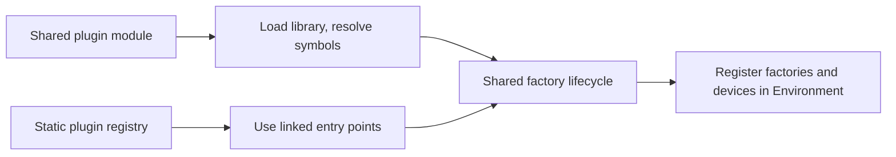

# Static Plugin EP Registration

Status: Implemented in draft PR #32395. ORT Web's migration onto this path remains follow-up work. Detailed design
supporting [Plugin Boundary and Web/Wasm Integration](plugin_boundary_and_web_integration_workstream.md).

## Purpose

Define how a plugin execution provider (EP) that is linked into the host binary is registered with ONNX Runtime, so
that statically linked and dynamically loaded plugin EPs share one provider implementation and one public API
boundary.

WebGPU is the first consumer. This change adds a statically linked WebGPU configuration that uses the plugin EP path,
alongside the existing static build that uses `EpLibraryInternal`.

## Decision summary

| Concern | Decision |
| --- | --- |
| D1 Discovery | ORT core owns a hand-written, build-guarded static registry |
| D2 Symbol names | Shared builds use standard names; static builds use provider-prefixed names |
| D3 Process globals | Ownership is selected at build time; no new optional teardown ABI |
| D4 Build configuration | `onnxruntime_WEBGPU_STATIC_PLUGIN` selects linked-in plugin mode |
| D5 Test infrastructure | The plugin library path becomes optional |
| D6 Registration timing | Register after publishing `OrtEnv`; environment creation stays serialized |
| D7 C++ API initialization | Linked-in plugins use the host binary's normal initialization mode |

Both linkage modes converge on one factory lifecycle; only discovery differs:



## Background

Before this change, the two `EpLibrary` implementations relevant here were:

- `EpLibraryPlugin` (`onnxruntime/core/session/plugin_ep/ep_library_plugin.cc`) loads a shared library, resolves the
  `CreateEpFactories` and `ReleaseEpFactory` symbols, and drives the factory lifecycle.
- `EpLibraryInternal` (`onnxruntime/core/session/plugin_ep/ep_library_internal.cc`) wraps an in-tree
  `IExecutionProvider`, including `EpLibraryInternal::CreateWebGpuEp`.

Neither accepted factory entry points directly, so a provider compiled into the host could not reach the plugin
path. `EpLibraryStaticPlugin` (`onnxruntime/core/session/plugin_ep/ep_library_static_plugin.h`) is what this design
adds to close that gap.

This blocked ORT Web specifically. `cmake/onnxruntime_providers_webgpu.cmake` raises a `FATAL_ERROR` for the WebGPU
shared-module build under Emscripten, so static linking is the only way a Wasm build can ever reach the plugin
boundary.

## Goals

- Register a plugin EP that is linked into the host, reusing the existing plugin registration path after the point
  where symbol lookup would occur.
- Present statically linked plugin code with the same runtime conditions as dynamically loaded plugin code.
- Require no change to provider sources between the two linkage modes.
- Avoid new host call sites for in-tree providers.
- Keep the shared-library path's existing ABI and runtime behavior unchanged.

## Non-goals

- A public C API for registering static plugin EPs. Deferred until a provider is genuinely out-of-tree.
- Removal of the EP API adapters. Tracked separately.
- Removal of the direct `IExecutionProvider` WebGPU path. That is the final step of the workstream, not this change.
- Support for static plugin EPs in minimal builds. `cmake/onnxruntime_session.cmake` excludes all of
  `core/session/plugin_ep/` when `onnxruntime_MINIMAL_BUILD` is set.

## Static plugin contract

- A statically linked provider exposes the standard `CreateEpFactories` and `ReleaseEpFactory` entry points under a
  provider-specific prefix that is unique within the host binary. Their signatures and factory ownership rules are
  unchanged from the shared-plugin ABI.
- ORT core discovers those entry points through its build-guarded registry. Applications do not register linked-in
  providers explicitly.
- Registration occurs during process-singleton `OrtEnv` creation, after the environment is published but before
  other threads can obtain it. Direct callers of `onnxruntime::Environment::Create` do not receive static plugin
  registration.
- `GetSupportedDevices` may call environment-resolving `OrtApi` functions on the creating thread. It runs before the
  current provider's devices are committed, so `GetEpDevices` does not include those devices and may include only
  static providers registered earlier in the registry.
- ORT releases factories through `ReleaseEpFactory` during environment teardown. A statically linked provider must
  not release process-global state owned by the host.
- Minimal builds reject static plugin EP configuration until the required plugin infrastructure is available there.

### Failure behavior

`EpLibraryStaticPlugin` releases any factories created before `CreateEpFactories` reports a failure. Duplicate
registration names are rejected by the existing `Environment::RegisterExecutionProviderLibrary` path, and other
factory or device-registration errors retain that path's diagnostics. If automatic static registration fails,
`OrtEnv::GetOrCreateInstance` unpublishes and destroys the partially created singleton before returning the error, so
another thread cannot observe an environment whose static registrations are incomplete.

## Decisions

### D1: Registration mechanism is a link-time registry in ORT core

ORT core holds a hand-written, `#if`-guarded list of statically linked plugin EP entry points, mirroring the shape of
`EpLibraryInternal::CreateInternalEps`. A new `EpLibraryStaticPlugin` accepts the entry points directly and reuses
`EpLibraryPlugin`'s factory lifecycle logic without the dynamic-library load and unload steps.

Rationale: every host — `onnxruntime_test_all`, the Python bindings, `onnxruntime.dll`, and Wasm — gets the provider
with no per-host call site.

Alternatives considered:

- CMake-generated registry using an X-macro. Rejected: added build-system machinery for generality that may never be
  needed while providers remain in-tree.
- A public `RegisterStaticExecutionProviderLibrary` C API called by each host. Rejected for now: it requires a call
  site in every statically linked host and introduces a window in which `GetEpDevices` reports no devices. Revisit
  when an out-of-tree provider needs static linking.

### D2: Entry point names depend on the linkage mode

`onnxruntime/core/providers/webgpu/ep/api.cc` uses `ORT_PLUGIN_EP_STATICALLY_LINKED` to select the entry point names.

The shared build must continue to export the unprefixed `CreateEpFactories` and `ReleaseEpFactory`, because
`EpLibraryPlugin::Load` resolves those exact names. The static build emits prefixed variants, for example
`WebGpu_CreateEpFactories`, so that multiple static plugins can coexist in one binary.

### D3: No new EP library ABI hook for teardown

All teardown remains in `ReleaseEpFactory`. Process-global shutdown that belongs to the host — currently
`google::protobuf::ShutdownProtobufLibrary()` in `onnxruntime/core/providers/webgpu/ep/api.cc` — is guarded by
`#if !defined(ORT_PLUGIN_EP_STATICALLY_LINKED)`, so it is compiled **in** for the shared-library build and **out**
for the statically linked build. The polarity follows ownership: a shared plugin module owns the process-global
state it initialized and must tear it down, whereas a statically linked plugin shares protobuf with the host, which
owns its lifetime and shuts it down itself. `ORT_PLUGIN_EP_STATICALLY_LINKED` is defined by the static plugin
configuration only; see D7 for where it is defined and what else it controls.

The legacy static WebGPU cleanup block in `onnxruntime/core/session/ort_env.cc` is already guarded by
`defined(USE_WEBGPU) && !defined(ORT_USE_EP_API_ADAPTERS)`. The static plugin configuration defines
`ORT_USE_EP_API_ADAPTERS`, so the block compiles out on its own and needs no edit. It must be kept for the default
internal-EP WebGPU build.

Consequence to test for: static linking has no library unload, so provider process-global state survives
unregistration. Registering, running, unregistering, re-registering, and running again is the primary regression case.

### D4: One new durable build option

- `onnxruntime_USE_EP_API_ADAPTERS` is unchanged. It is transitional and is retired when WebGPU moves fully onto the
  public plugin API.
- `onnxruntime_WEBGPU_STATIC_PLUGIN` is new and durable. It selects linkage into the host rather than a loadable
  module.
- `onnxruntime_WEBGPU_LINKED_INTO_HOST` is derived and used at the linkage sites.

`onnxruntime_USE_EP_API_ADAPTERS` currently conflates three meanings: compiling against the adapters, building a
separate module, and registering by path in tests. The static plugin configuration answers the first yes and the
other two no, so only the linkage and test sites move to the derived option. The global `add_compile_definitions` in
`cmake/CMakeLists.txt` stays as-is, and no provider sources change.

`cmake/onnxruntime_providers_webgpu.cmake` gains a third arm. The Emscripten and `onnxruntime_BUILD_CACHE`
`FATAL_ERROR`s narrow to the shared-module case, which is what unblocks ORT Web.

`build.py` gains `--use_webgpu static_plugin`.

`onnxruntime_WEBGPU_STATIC_PLUGIN` validates its prerequisites at configure time and fails with `FATAL_ERROR` if
they are not met: it requires `onnxruntime_USE_WEBGPU` and `onnxruntime_USE_EP_API_ADAPTERS`, and it rejects a
minimal build. The last one is a temporary guard rather than a permanent restriction. A minimal build excludes
`core/session/plugin_ep` from `onnxruntime_session_srcs`, and `Environment::CreateAndRegisterStaticPluginEps` is
compiled out with it, but `cmake/onnxruntime_providers_webgpu.cmake` still builds and links the provider. The
combination would therefore produce a binary containing the WebGPU EP that never registers it, with nothing
reporting the problem at configure, build or run time. Allowing minimal builds to use a static plugin EP is
worthwhile and needs the registration path to be available there first; the exclusion is currently justified by
provider-bridge dependencies, and only two of the files under `plugin_ep` are provider-bridge, so the subset may be
separable. Until then a loud configure error is preferable to a silently EP-less binary.

The CUDA plugin is unaffected: it is gated by `onnxruntime_BUILD_CUDA_EP_AS_PLUGIN` and sets
`ORT_USE_EP_API_ADAPTERS` as a private target compile definition, never referencing the CMake option. CUDA's split
between role (`BUILD_CUDA_EP_AS_PLUGIN`) and mechanism (`ORT_USE_EP_API_ADAPTERS`) is the in-tree template for
WebGPU's eventual cleanup.

### D5: Test infrastructure treats the library path as optional

In `onnxruntime/test/unittest_util/test_dynamic_plugin_ep.cc`, `InitializationConfig::ep_library_path` becomes
optional. When absent, library registration is skipped because ORT core has already performed it, and the RAII
registration handle is left empty. The existing handle deleter already tolerates an empty handle. Device selection,
de-duplication, and factory creation are unchanged.

Virtual devices are enabled through the `allow_virtual_devices` environment configuration entry
(`kOrtEnvAllowVirtualDevices`) supplied at environment creation, rather than the `.virtual` registration-name suffix.
The suffix is unavailable because ORT core chooses the registration name for statically linked providers.

The `dynamic_plugin_ep_infra` naming becomes inaccurate. Renaming is deferred to a separate mechanical change.

### D6: Static plugin EPs are registered after the environment is published

**Problem.** The natural insertion point is next to `CreateAndRegisterInternalEps` inside `Environment::Initialize`.
Registration enumerates devices, which calls provider code:

```
OrtEnv::GetOrCreateInstance()
  lock(m_)                                          non-recursive
  Environment::Create() -> Initialize()
    Environment::CreateAndRegisterStaticPluginEps()
      Environment::RegisterExecutionProviderLibrary()
        EpInfo::Create -> factory GetSupportedDevices()
          webgpu::ep::Factory::GetSupportedDevices()   provider code
            Api().ep.GetEnvConfigEntries()
              OrtEnv::TryGetInstance()
                lock(m_)                            self-deadlock
```

`Environment::CreateAndRegisterInternalEps` already documents this hazard, and the internal WebGPU factory avoids it
by capturing `allow_virtual_devices` at construction. A plugin factory cannot use that workaround, because the public
API is all it has.

The problem is not confined to one function. Plugin EPs receive the full `OrtApi`, so any API that resolves the
environment is affected, including `CreateEnv`, which re-enters `GetOrCreateInstance` and deadlocks on the same mutex.

**Decision.** `OrtEnv::GetOrCreateInstance` publishes `p_instance_` and takes its own reference *before* invoking
`Environment::CreateAndRegisterStaticPluginEps`, and `OrtEnv::m_` becomes a `std::recursive_mutex`. Registration
therefore runs against a fully constructed and published environment.

Properties:

- Environment-resolving `OrtApi` calls can safely re-enter on the creating thread. `TryGetInstance` finds a published
  instance, and a re-entrant `CreateEnv` acquires the recursive lock and increments the reference count.
- No new contract for provider authors, and nothing for a future API author to remember. The constraints that do
  apply to `GetSupportedDevices` are the ones dynamic plugin EP registration already imposes, now documented on
  `OrtEpFactory::GetSupportedDevices` in `onnxruntime_ep_c_api.h`.
- No race. Other threads block on `m_` for the duration, which is already true across `Environment::Create`.
- The reference count cannot reach zero mid-construction, because the creating thread's reference is taken first.
- Provider sources need no conditional compilation for the two linkage modes.

Costs and limits:

- Failure during registration requires explicit teardown of the just-published instance.
- A recursive mutex is normally undesirable. Here it states the actual invariant: the environment creation path can
  legitimately re-enter the environment accessor on the same thread. Static plugin EP registration is the only reason
  `OrtEnv::m_` is recursive; it was a `std::mutex` before this change and no other code path requires recursion.
- A static plugin EP's `GetSupportedDevices` runs against an environment in which its own `OrtEpDevice` instances are
  not yet registered, so `OrtApi::GetEpDevices` returns an incomplete list. This is not specific to static linking:
  `EpInfo::Create` calls `GetSupportedDevices` before `RegisterExecutionProviderLibrary` appends to
  `execution_devices_`, so a dynamically registered plugin EP sees the same thing. Registration also proceeds one
  library at a time, so with more than one static plugin EP the Nth would observe the first N-1, making the visible
  set depend on `CreateStaticPluginEpLibraries` ordering. Accepted as a side effect.
- Callers of `onnxruntime::Environment::Create` do not get static plugin EPs. In the tree this is one production call
  site plus tests and orttraining sample binaries.
- Provider code that starts a thread which calls `CreateEnv` and then joins it will deadlock. This is already true of
  any code running inside `Environment::Create`.

The call to `Environment::CreateAndRegisterStaticPluginEps` therefore lives in `ort_env.cc`. Static plugin
registration is a process-singleton concern tied to the `OrtEnv` lifetime, so the singleton wrapper is its correct
home.

Alternatives considered:

- Thread-local pointer to the environment under construction, consulted by `GetEnvConfigEntries`. Rejected: it
  addresses one function, while the reachable surface is the whole `OrtApi`.
- Defer device enumeration until after environment creation. Rejected: lazy initialization moves registration
  failures from environment creation to the first `GetEpDevices` call, which is a worse place to report them.
- Register outside the lock after publishing. Rejected: another thread can observe a published environment whose
  static EPs are not yet registered, and avoiding that requires a second lock and a completion barrier.

`onnxruntime::Environment` remains directly constructible, and tests rely on that. `OrtEnv::GetOrCreateInstance`
returns any existing instance and ignores the logging manager, threading options, and configuration entries passed by
later callers, so a test needing specific threading or logging configuration must bypass it. Those tests are
deliberately opting out of process-singleton semantics and should not receive static plugin EPs.

### D7: The statically linked build does not use manual C++ API initialization

`include/onnxruntime/ep/api.h` force-enables `ORT_API_MANUAL_INIT` around its include of `onnxruntime_cxx_api.h`, and
`onnxruntime::ep::ApiInit` calls `Ort::InitApi(ort_api)`. That is required for a plugin EP shared library, which must
not call `OrtGetApiBase()` itself.

`onnxruntime_cxx_api.h` emits `#pragma detect_mismatch("ORT_API_MANUAL_INIT", ...)` on MSVC, so every translation
unit linked into one binary must agree. The statically linked plugin EP is linked with ORT core and with test code,
neither of which uses manual initialization, so forcing it on produces `LNK2038` for every EP object file.

The build therefore defines `ORT_PLUGIN_EP_STATICALLY_LINKED` on the statically linked plugin EP target. Under that
macro `ep/api.h` includes `onnxruntime_cxx_api.h` unmodified and `ApiInit` skips `Ort::InitApi`. The C++ API then
default-initializes from `OrtGetApiBase()->GetApi(ORT_API_VERSION)`, which resolves in-process and yields the same
`OrtApi` that `ApiInit` would have installed, because the EP and ORT are the same binary and therefore the same
version. `onnxruntime::ep::ApiPtrs` is still populated from the `OrtApiBase*` that ORT passes to `CreateEpFactories`,
so the EP's own API access is unchanged.

The macro is generic rather than WebGPU-specific because `ep/api.h` is shared with the CUDA plugin EP.

## Implementation map

| Decision | Owning code |
| --- | --- |
| D1 static registry | `core/session/plugin_ep/ep_static_plugins.cc`, `ep_library_static_plugin.h` |
| D1 shared factory lifecycle | `core/session/plugin_ep/ep_library_plugin.cc`, factored out for reuse |
| D2 entry point prefixing | `core/providers/webgpu/ep/api.cc`, `include/onnxruntime/ep/api.h` |
| D3 process-global ownership | `core/providers/webgpu/ep/api.cc` `ReleaseEpFactory` |
| D4 build option | `cmake/CMakeLists.txt`, `cmake/onnxruntime_providers_webgpu.cmake`, `tools/ci_build/build.py` |
| D5 optional library path | `test/unittest_util/test_dynamic_plugin_ep.cc` |
| D6 registration timing | `core/session/ort_env.cc`, `Environment::CreateAndRegisterStaticPluginEps` |
| D7 C++ API initialization | `include/onnxruntime/ep/api.h` |

Test definitions are applied to `onnxruntime_provider_test` as well as `onnxruntime_test_all`, via a shared
`onnxruntime_set_webgpu_plugin_ep_test_definitions` cmake function. `onnxruntime_provider_test` holds the operator
tests, so without this the plugin path has no operator test coverage. It also needs
`ORT_UNIT_TEST_HAS_WEBGPU_STATIC_PLUGIN_EP` in its own right, because that macro is what enables the
`allow_virtual_devices` environment configuration entry at environment creation in `test_main.cc`.

## Follow-up cleanup

`Environment::CreateAndRegisterInternalEps` stays where it is, at the end of `Environment::Initialize`. Internal EP
factories are ORT-core code that does not re-enter the `OrtEnv` singleton, so they are not subject to the constraint
in D6. Moving them would also remove EP devices from every directly constructed `Environment`, and `InferenceSession`
reads `Environment::GetOrtEpDevices` directly. For static plugin EPs the resulting gap is unimplemented new
functionality; for internal EPs it would be a silent regression.

The `allow_virtual_devices` parameter threaded through `EpLibraryInternal::CreateInternalEps` exists only for the
internal WebGPU EP factory, which cannot query the environment at `GetSupportedDevices` time. The comment in
`CreateAndRegisterInternalEps` documents that constraint. Both can be deleted once WebGPU is no longer an internal EP:
the remaining internal EPs are CPU, kept deliberately as a special case, and DML, which is no longer maintained.
Neither takes the parameter. In a build that defines `ORT_USE_EP_API_ADAPTERS` this is already true, since the
internal WebGPU EP is compiled out and the parameter reaches `ORT_UNUSED_PARAMETER`.

This does not affect the `.virtual` registration-name suffix or the `allow_virtual_devices` environment
configuration entry, which remain in use for dynamically registered plugin libraries.

## Limitations and follow-ups

| Item | State |
| --- | --- |
| Environment recreation | Untested. Existing unit-test binaries retain the process-singleton `OrtEnv`; a dedicated process is needed to exercise register, run, tear down, recreate, and run again. |
| Multiple static plugin EPs | Untested. WebGPU is the only registry entry, so prefix uniqueness and registration ordering are not covered with two providers. |
| Minimal builds | Unsupported and rejected at configure time because they exclude plugin EP infrastructure. |
| ORT Web production migration | Deferred. The shipping Wasm configuration still uses the internal EP path. |
| Dawn shared-library mode | Remains incompatible with the EP API adapter configuration. |
| Binary size and dead-code elimination | Deferred to ORT Web migration, where the shipped Wasm artifact can be measured. |

## Validation summary

| Configuration | Result | Evidence and remaining gap |
| --- | --- | --- |
| Windows static plugin, real GPU | Build and tests pass | Zero status differences across the 5894 `onnxruntime_provider_test` cases common to the static-plugin and internal-EP builds. |
| Windows shared plugin | Build and tests pass | The DLL continues to export the unprefixed entry points required by `EpLibraryPlugin`. |
| Linux static plugin, GCC | Build passes | Build-only CI covers GCC and Python wheel linkage; GPU execution is not exercised. |
| Emscripten static plugin | Build passes | Build-only CI and symbol inspection verify linked entry points. A local prototype passed 2152 browser WebGPU tests, but the shipping artifacts and blocking CI still use the internal EP path. |
| Minimal build | Rejected at configure time | Prevents a provider from being linked into a binary that omits its registration infrastructure. |

The adapter configuration excludes 12 operator cases that depend on internal WebGPU test infrastructure, in addition
to white-box and disabled tests. Re-registration after complete `OrtEnv` teardown and registration of more than one
static plugin EP also remain untested.
