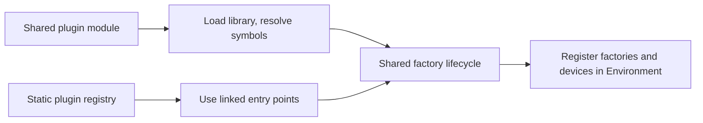

# Static Plugin EP Registration

Status: Implemented in PR #32395. ORT Web's migration onto this path remains follow-up work. This design
supports [Plugin Boundary and Web/Wasm Integration](plugin_boundary_and_web_integration_workstream.md).

## Context and scope

A provider linked into the host could not previously use the plugin EP path. `EpLibraryPlugin` discovers factory
entry points in a shared library, while `EpLibraryInternal` wraps an in-tree `IExecutionProvider`. Neither accepts
linked factory entry points.

This design adds that missing discovery path. Static and dynamic plugins then share the same factory lifecycle and
public API boundary. WebGPU is the first consumer because Emscripten cannot use its shared-module build.

This design does not add a public static-registration API, support minimal builds, remove the EP API adapters, or
remove WebGPU's existing `EpLibraryInternal` path. Those changes remain follow-up work.

## Decision summary

| Concern | Decision |
| --- | --- |
| D1 Discovery | ORT core owns a hand-written, build-guarded static registry |
| D2 Symbol names | Shared builds use standard names; static builds use provider-prefixed names |
| D3 Process globals | Ownership is selected at build time; no new optional teardown ABI |
| D4 Build configuration | `onnxruntime_WEBGPU_STATIC_PLUGIN` selects linked-in plugin mode |
| D5 Test infrastructure | The plugin library path becomes optional |
| D6 Registration timing | Register after publishing `OrtEnv`; environment creation stays serialized |
| D7 C++ API initialization | Linked-in plugins use the host binary's normal initialization mode |

Both linkage modes converge on one factory lifecycle; only discovery differs:



## Static plugin contract

- A statically linked provider exposes the standard `CreateEpFactories` and `ReleaseEpFactory` entry points under a
  provider-specific prefix that is unique within the host binary. Their signatures and factory ownership rules are
  unchanged from the shared-plugin ABI.
- ORT core discovers those entry points through its build-guarded registry. Applications do not register linked-in
  providers explicitly.
- Registration occurs during process-singleton `OrtEnv` creation, after the environment is published but before
  other threads can obtain it. Direct callers of `onnxruntime::Environment::Create` do not receive static plugin
  registration.
- `GetSupportedDevices` may call environment-resolving `OrtApi` functions on the creating thread. It runs before the
  current provider's devices are committed, so `GetEpDevices` does not include those devices and may include only
  static providers registered earlier in the registry.
- ORT releases factories through `ReleaseEpFactory` during environment teardown. A statically linked provider must
  not release process-global state owned by the host.
- Minimal builds reject static plugin EP configuration until the required plugin infrastructure is available there.

### Failure handling

`EpLibraryStaticPlugin` releases factories created before `CreateEpFactories` reports a failure. Existing
`Environment::RegisterExecutionProviderLibrary` diagnostics cover duplicate names and factory or device errors. If
automatic registration fails, `OrtEnv::GetOrCreateInstance` unpublishes and destroys the partial singleton before
returning the error. Other threads therefore cannot observe incomplete static registration.

## Decisions

### D1: Registration mechanism is a link-time registry in ORT core

ORT core holds a hand-written, `#if`-guarded list of linked factory entry points. `EpLibraryStaticPlugin` accepts
those entry points directly and reuses `EpLibraryPlugin` after its library-loading and symbol-resolution steps.
This gives every host the provider without adding a host-specific registration call.

Alternatives considered:

- A CMake-generated registry adds machinery that is not justified while providers remain in-tree.
- A public registration API requires every host to call it and creates a period in which `GetEpDevices` has no
  static devices. Revisit this option when an out-of-tree provider needs static linking.

### D2: Entry point names depend on the linkage mode

Shared plugins continue to export `CreateEpFactories` and `ReleaseEpFactory`, the names resolved by
`EpLibraryPlugin::Load`. Static plugins use provider-prefixed names such as `WebGpu_CreateEpFactories`, allowing
multiple providers to coexist in one binary. `ORT_PLUGIN_EP_STATICALLY_LINKED` selects the names in provider code.

### D3: No new EP library ABI hook for teardown

Factory teardown remains in `ReleaseEpFactory`. Host-owned process-global teardown, currently
`google::protobuf::ShutdownProtobufLibrary()`, is compiled out when `ORT_PLUGIN_EP_STATICALLY_LINKED` is defined. A
shared module owns the state it initializes; a static plugin shares that state with the host, which owns its lifetime.

The existing WebGPU cleanup in `ort_env.cc` remains for the internal-EP build. It already compiles out for the static
plugin configuration because that configuration defines `ORT_USE_EP_API_ADAPTERS`.

Static linking has no library unload, so process-global state survives unregistration. A complete regression test
must register, run, tear down the environment, recreate it, and run again.

### D4: One new durable build option

`onnxruntime_WEBGPU_STATIC_PLUGIN` selects linked-in plugin mode, and `build.py` exposes it as
`--use_webgpu static_plugin`. The derived `onnxruntime_WEBGPU_LINKED_INTO_HOST` controls linkage sites.

The option requires WebGPU and the EP API adapters. It rejects minimal builds because they exclude the plugin EP
registration code while still linking the provider, which would otherwise create a binary in which WebGPU is present
but never registered. Emscripten and build-cache restrictions continue to apply only to the shared-module mode.

`onnxruntime_USE_EP_API_ADAPTERS` remains transitional. Provider sources and the CUDA plugin configuration are
unchanged.

### D5: Test infrastructure treats the library path as optional

`InitializationConfig::ep_library_path` becomes optional. When it is absent, tests skip library registration because
ORT core has already registered the static plugin. The existing RAII handle supports this empty state; device
selection, de-duplication, and factory creation are unchanged.

Virtual devices are enabled through the `allow_virtual_devices` environment configuration entry
(`kOrtEnvAllowVirtualDevices`) supplied at environment creation, rather than the `.virtual` registration-name suffix.
The suffix is unavailable because ORT core chooses the registration name for statically linked providers.

A shared CMake helper applies the static-plugin test definitions to both `onnxruntime_test_all` and
`onnxruntime_provider_test`, where the operator tests run.

### D6: Static plugin EPs are registered after the environment is published

**Problem.** The natural insertion point is next to `CreateAndRegisterInternalEps` inside `Environment::Initialize`.
Registration enumerates devices, which calls provider code:

```
OrtEnv::GetOrCreateInstance()
  lock(m_)                                          non-recursive
  Environment::Create() -> Initialize()
    Environment::CreateAndRegisterStaticPluginEps()
      Environment::RegisterExecutionProviderLibrary()
        EpInfo::Create -> factory GetSupportedDevices()
          webgpu::ep::Factory::GetSupportedDevices()   provider code
            Api().ep.GetEnvConfigEntries()
              OrtEnv::TryGetInstance()
                lock(m_)                            self-deadlock
```

The internal WebGPU factory avoids this hazard by capturing configuration at construction. A plugin factory cannot:
its only access is through `OrtApi`, and any environment-resolving API can re-enter the same mutex.

**Decision.** `OrtEnv::GetOrCreateInstance` publishes `p_instance_` and takes its own reference *before* invoking
`Environment::CreateAndRegisterStaticPluginEps`, and `OrtEnv::m_` becomes a `std::recursive_mutex`. Registration
therefore runs against a fully constructed and published environment.

Guarantees:

- Environment-resolving API calls can re-enter on the creating thread and find the published instance.
- Other threads remain blocked until registration completes.
- The creating thread's reference prevents destruction during registration.
- Provider code and its `GetSupportedDevices` contract remain the same for both linkage modes.

Costs and limits:

- Registration failure must explicitly tear down the published instance.
- `OrtEnv::m_` becomes recursive solely to permit same-thread re-entry during static registration.
- During `GetSupportedDevices`, `GetEpDevices` cannot include the current provider and can include only static
  providers registered earlier. Dynamic registration has the same current-provider limitation.
- Direct callers of `onnxruntime::Environment::Create` deliberately bypass singleton registration, often to control
  logging or threading in tests, and do not receive static plugin EPs.
- Provider code that starts a thread which calls `CreateEnv` and then joins it will deadlock. This is already true of
  any code running inside `Environment::Create`.

`CreateAndRegisterStaticPluginEps` therefore runs from the `OrtEnv` singleton wrapper, not from
`Environment::Initialize`. `CreateAndRegisterInternalEps` remains in `Environment::Initialize`, so directly created
environments retain internal EP devices.

Alternatives considered:

- A thread-local environment pointer fixes only selected APIs, not the full `OrtApi` surface.
- Deferred device enumeration reports registration failures from `GetEpDevices` instead of environment creation.
- Registration outside the lock lets other threads observe incomplete registration unless another barrier is added.

### D7: The statically linked build does not use manual C++ API initialization

Shared plugins use `ORT_API_MANUAL_INIT` because they must initialize the C++ API from the host-supplied `OrtApi`.
MSVC requires every translation unit in one binary to agree on that mode, so using it in a statically linked plugin
causes `LNK2038` against ORT core and test code.

For a static plugin, `ORT_PLUGIN_EP_STATICALLY_LINKED` leaves `onnxruntime_cxx_api.h` in its normal mode and skips
`Ort::InitApi`. `OrtGetApiBase()` resolves in the same binary and returns the same-version API. The EP-specific
`ApiPtrs` are still populated from the `OrtApiBase*` passed to `CreateEpFactories`.

The macro is generic rather than WebGPU-specific because `ep/api.h` is shared with the CUDA plugin EP.

## Limitations and follow-ups

| Item | State |
| --- | --- |
| Environment recreation | Untested. Existing unit-test binaries retain the process-singleton `OrtEnv`; a dedicated process is needed to exercise register, run, tear down, recreate, and run again. |
| Multiple static plugin EPs | Untested. WebGPU is the only registry entry, so prefix uniqueness and registration ordering are not covered with two providers. |
| Minimal builds | Unsupported and rejected at configure time because they exclude plugin EP infrastructure. |
| ORT Web production migration | Deferred. The shipping Wasm configuration still uses the internal EP path. |
| Dawn shared-library mode | Remains incompatible with the EP API adapter configuration. |
| Binary size and dead-code elimination | Deferred to ORT Web migration, where the shipped Wasm artifact can be measured. |
| Internal WebGPU cleanup | Remove `allow_virtual_devices` plumbing from `CreateAndRegisterInternalEps` after retiring the internal WebGPU path. |

## Validation summary

| Configuration | Result | Evidence and remaining gap |
| --- | --- | --- |
| Windows static plugin, real GPU | Build and tests pass | The static-plugin and internal-EP builds have matching results for their common provider tests. |
| Windows shared plugin | Build and tests pass | The DLL continues to export the unprefixed entry points required by `EpLibraryPlugin`. |
| Linux static plugin, GCC | Build passes | Build-only CI covers GCC and Python wheel linkage; GPU execution is not exercised. |
| Emscripten static plugin | Build passes | Build-only CI and symbol inspection verify linked entry points. A local prototype passed the browser WebGPU suite, but shipping artifacts and blocking CI still use the internal EP path. |
| Minimal build | Rejected at configure time | Prevents a provider from being linked into a binary that omits its registration infrastructure. |

The adapter configuration excludes operator cases that depend on internal WebGPU test infrastructure, in addition
to white-box and disabled tests.

## Appendix: implementation map

| Decision | Owning code |
| --- | --- |
| D1 static registry | `core/session/plugin_ep/ep_static_plugins.cc`, `ep_library_static_plugin.h` |
| D1 shared factory lifecycle | `core/session/plugin_ep/ep_library_plugin.cc` |
| D2 entry point prefixing | `core/providers/webgpu/ep/api.cc`, `include/onnxruntime/ep/api.h` |
| D3 process-global ownership | `core/providers/webgpu/ep/api.cc` `ReleaseEpFactory` |
| D4 build option | `cmake/CMakeLists.txt`, `cmake/onnxruntime_providers_webgpu.cmake`, `tools/ci_build/build.py` |
| D5 optional library path | `test/unittest_util/test_dynamic_plugin_ep.cc` |
| D6 registration timing | `core/session/ort_env.cc`, `Environment::CreateAndRegisterStaticPluginEps` |
| D7 C++ API initialization | `include/onnxruntime/ep/api.h` |
