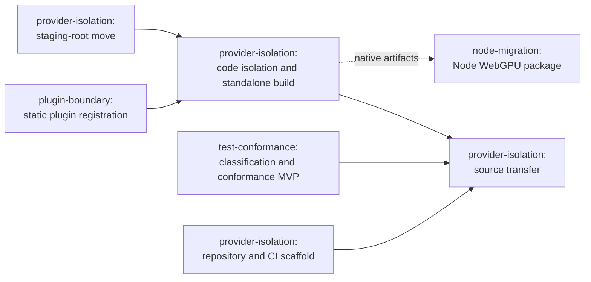

# WebGPU EP Repository Extraction

Status: Working plan

This overview and the workstream documents it links define objectives, ownership, sequencing, and gates.
Implementation detail such as dependency inventories, staging-root layout, and test classification is produced by the
work packages themselves rather than specified here.

## Goal

Move the WebGPU Execution Provider (EP) into its own repository without making ongoing WebGPU EP development slower or
more fragile.

The new repository should own the WebGPU EP implementation, dependencies, tests, optional plugin packages, release
process, and development workflow. ONNX Runtime (ORT) should consume versioned WebGPU EP artifacts or source rather
than remain the implementation repository.

The WebGPU EP remains optional for native ORT consumers. Core ORT packages should support plugin loading but must not
bundle or depend on the WebGPU plugin package. `onnxruntime-web` is the exception because it must statically link the
provider into its WebAssembly module.

## Guiding principles

- Use the public plugin EP interface (`OrtApi`, `OrtEpApi`, `OrtEpFactory`, and `OrtEp`) as the only runtime boundary
  between ORT and the WebGPU EP.
- Use the same provider implementation for dynamically loaded and statically linked builds.
- Keep the WebGPU EP independently buildable, testable, versioned, and releasable.
- A normal kernel change should be developed, tested, reviewed, and released in the WebGPU repository alone.
- Do not create an undocumented cross-repository C++ interface to private ORT implementation code.
- Treat copied ORT helpers as WebGPU-owned forks. Preserve provenance and license, but do not keep the copies
  synchronized with ORT. A plugin EP is responsible for the correctness of its own implementation, whether or not
  that implementation started from ORT-provided utility code.
- Keep cross-repository integration reproducible through pinned versions, compatibility checks, and CI.
- Preserve existing tested behavior and supported consumers throughout the move.

## Terminology

| Term | Meaning |
| --- | --- |
| Plugin EP API | The public ORT API used to implement a plugin EP: `OrtApi`, `OrtEpApi`, `OrtEpFactory`, and `OrtEp` |
| Staging root | `plugin-ep-webgpu/`, the in-tree directory the provider is consolidated into before the move |

## Workstreams

The effort is divided into four workstreams:

| Identifier | Workstream | Primary outcome |
| --- | --- | --- |
| `plugin-boundary` | [Plugin boundary and Web/Wasm integration](plugin_boundary_and_web_integration/plugin_boundary_and_web_integration_workstream.md) | Static and dynamic builds use the same public plugin EP boundary, including the ORT Web browser bridge |
| `provider-isolation` | [Provider isolation and repository migration](provider_isolation_and_repository_migration/provider_isolation_and_repository_migration_workstream.md) | WebGPU-owned code, dependencies, tests, and existing plugin packaging move under `plugin-ep-webgpu/` and then to an independent repository |
| `test-conformance` | [Test ownership and operator conformance](test_ownership_and_conformance/test_ownership_and_conformance_workstream.md) | Existing coverage is preserved, every test has an owner, and portable conformance coverage protects the external provider |
| `node-migration` | [Node plugin migration](node_plugin_migration/node_plugin_migration_workstream.md) | Existing bundled Node WebGPU support is replaced by an explicitly consumable plugin without regressing current users |

The detailed reusable conformance-suite design is in
[Execution Provider Operator Conformance Suite](test_ownership_and_conformance/ep_operator_conformance_design.md).

## Related work

Two adjacent efforts target `onnxruntime-web` and are independent of this one:

- [ORT Web JSEP to WebGPU EP migration](../onnxruntime_web_jsep_to_webgpu_ep_migration.md), with the user-facing
  [JSEP deprecation notice](../../JSEP_Deprecation.md), replaces the deprecated JSEP TypeScript compute path with the
  native WebGPU EP.
- [ORT Web WebGL backend removal](../onnxruntime_web_remove_webgl_backend.md) retires the WebGL backend.

Neither effort gates this extraction, and this extraction does not gate them. `onnxruntime-web` includes the WebGPU
EP in some form regardless of when JSEP is removed, and both implementations register under the same `webgpu` backend
key, so changing which one a bundle ships requires no consumer source change.

The efforts interact in one place: while both implementations coexist, the browser CI lanes are
implementation-specific even though the tests are not, so a passing default-bundle lane says nothing about the
provider being extracted. This is handled in
[Test ownership and operator conformance](test_ownership_and_conformance/test_ownership_and_conformance_workstream.md).

## Consumer dispositions

Every consumer that receives WebGPU today needs a recorded disposition before the built-in implementation is removed
from ORT. Platform and architecture details remain to be inventoried in the individual workstreams.

| Consumer or package | Disposition | Extraction requirement |
| --- | --- | --- |
| `onnxruntime-web` | Consume a pinned external WebGPU source revision through static plugin registration | Required |
| Python WebGPU plugin package | Move the existing optional plugin package and release pipeline | Required |
| WebGPU NuGet plugin package | Move the existing optional plugin package and release pipeline | Required |
| Node WebGPU support | Provide a tested replacement for the WebGPU implementation currently bundled in `onnxruntime-node`; final package naming is open | Required before bundled support is removed |
| `onnxruntime-webgpu` on PyPI | Publication has already stopped; do not resurrect it or convert it into a plugin-dependent package | Confirm whether any other retired package needs the same treatment |

Hosts that do not ship WebGPU support today are outside this table. Adding one is a separate decision and is not an
extraction prerequisite.

The table should be updated as the current package and platform inventory is completed. Dropping a consumer requires
an explicit compatibility decision rather than silently removing support.

## Sequencing

Most work proceeds concurrently, but one sequence determines the end date:

Static plugin registration is a prerequisite for isolation, not merely an enabler. The `provider-isolation` workstream
moves provider sources into the staging root rather than copying them, so once isolation completes there is exactly
one WebGPU implementation and it is adapter-free. The non-plugin static build that `onnxruntime-web` ships from today
must already be served through static plugin registration before the adapter can be removed. Relocating the sources
is not itself blocked; removing the adapter is.

The remaining convergence points are not on the critical path:

- Provider isolation identifies private dependencies. A dependency becomes public API work only when an existing
  public API cannot express a necessary, stable runtime interaction and the proposed addition meets the high bar for
  a permanent plugin EP API.
- Test classification determines which tests move with the provider and which remain in ORT.
- The Node workstream consumes generic plugin loading from ORT and native WebGPU artifacts from the external provider.
- The final repository copy depends on `plugin-ep-webgpu/` being independently buildable.

## Success criteria

These are the outcomes that show the whole effort is complete:

- Static and shared builds execute the same provider implementation, through the public plugin EP API, against the
  same operator tests.
- The ORT repository retains provider integration shims only, and no longer contains WebGPU EP implementation, build,
  or packaging inputs.
- The external repository owns WebGPU code, dependencies, tests, packages, and releases.
- ORT updates its pinned WebGPU revision through a routine dependency update.
- `onnxruntime-web` preserves supported functionality and accepted size and performance characteristics.
- Native ORT packages remain usable without installing WebGPU.
- Existing Node WebGPU users have a documented and tested migration path.
- Compatibility failures produce clear build-time, registration-time, or package-time diagnostics.
