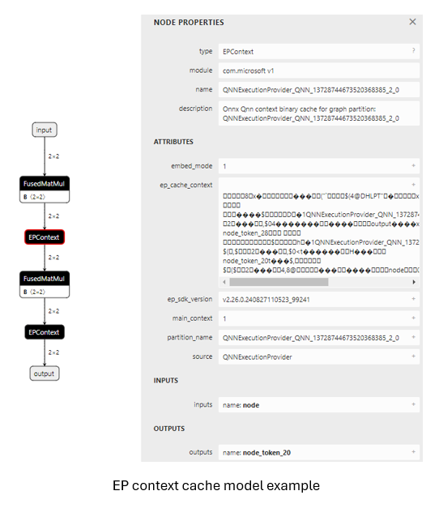
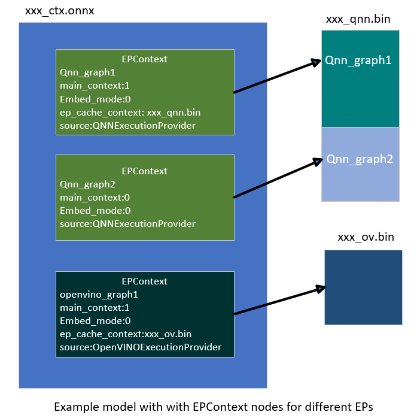

# OnnxRuntime EP context cache feature design
{: .no_toc }

## Contents
{: .no_toc }

* TOC placeholder
{:toc}

## Background

OnnxRuntime Execution Providers enable users to inference Onnx model on different kinds of hardware accelerators empowered by backend SDKs (like QNN, OpenVINO, Vitis AI, etc). The Execution Providers converts the Onnx model into graph format required by the backend SDK, and compiles it into the format required by the hardware. Specific to NPU world, the converting and compiling process takes a long time to complete, especially for LLM models. The session creation time costs tens of minutes for some cases which impacts the user experience badly.
To avoid the converting and compiling cost, most of the backend SDKs provide the feature to dump the pre-compiled model into binary file. The pre-compiled model can be loaded by backend SDK directly and executed on the target device. It improves the session creation time greatly by using this way. In order to achieve this, OnnxRuntime defined a contribute Op called EPContext in MS domain.

## EPContext Op Schema

Op domain: com.microsoft
Node inputs & outputs: variadic
Domain: com.microsoft
Atrribures:

|Attributes           |Data type|Description                                                                                               |
|---------------------|---------|----------------------------------------------------------------------------------------------------------|
|main_context         |int64    |1 (default): This node points to an EP context content that contains the graph referred to by this node. 0: The node does not point to any EP context content. Expect to get the graph from node with this field is 1. Some EPs support 1 single context contains multiple graphs. The EPContext node with main_context=1 refers to the real context. And the context contains graphs that are referred by other nodes with main_context=0.|
|ep_cache_context     |string   |Payload of the EP context if embed_mode=1, or path to the context file if embed_mode=0. The path is a relative path to the Onnx model file. It can be a file name, or subfolder/filename|
|embed_mode           |int64    |1(default): ep_cache_context contains the payload of context content. 0: ep_cache_context is the context binary file path.|
|ep_sdk_version       |string   |Optional. SDK version that used to generate the node.                                                     |
|onnx_model_filename  |string   |Optional. Original Onnx model file name.                                                                  |
|hardware_architecture|string   |Optional. Hardware architecture.|
|partition_name       |string   |Optional. OnnxRuntime partitioned graph name.|
|source               |string   |Optional. The source used to generate the node. Should be a key identified by the EP so that OnnxRuntime can support multiple EPContext nodes run with different EPs. For example, QNN EP only accepts nodes with source=QNN or QnnExecutionProvider, OpenVINO EP only accepts nodes with source=OpenVINOExecutionProvider.|
|notes                |string   |Optional. Additional information required by specific EP.                                                 |

## OnnxRuntime Session options related to EP context cache generation and inference

|Session option             |Description                                                                                               |
|---------------------------|----------------------------------------------------------------------------------------------------------|
|ep.context_enable          |Used for context model generation only. 1: Enable OnnxRuntime to dump the context cache model. 0 (default): disable.|
|ep.context_file_path       |Specify the file path for the dump model. Default to original_file_name.onnx_ctx.onnx for context model generation. For model inference, if user loads model from memory buffer and the EP context binary is outside the Onnx model, user need to set this option. OnnxRuntime EP use this path to get the folder path together with the ep_cache_context (which point to the contex binary path) to get the absoluate path for the context binary file.|
|ep.context_embed_mode      |Used for context model generation only. 1 (default): dump the EP context content into the Onnx model, inside ep_cache_context node attribute. 0: dump the EP context content into a separate file, keep the file name in the Onnx model. File path tracked in ep_cache_context node attribute.|
|ep.context_node_name_prefix|Used for context model generation only. Specify the EPContext node name (also the partition_name attribute, internal graph name) prefix to make it unique across nodes in case user glue multiple EPContext nodes in one model to avoid conflict.|

## EP Context cache model generation workflow

OnnxRuntime EPs should flows these rules to create the EP context cache model to maintain a unified user interface.
1. ep.context_enable
  OnnxRuntime create the EP context cache model if ep.context_enable = 1. Otherwise, ep.context_enable = 0 (default), just do the normal workflow.
2. ep.context_file_path
  OnnxRuntime just append “_ctx.onnx” to the input file name as the output file name if no ep.context_file_path provided. Otherwise just use the user provided file path.
  ep.context_file_path is required if user loads the model from memory buffer, since there’s no way for OnnxRuntime to get the input file path for this scenario.
3. ep.context_embed_mode
  1 (default): dump the EP context context content into the Onnx model.
  0: dump the EP context content as a separate file. EP decides the file name and tracks the file name in EPContext node attribute ep_cache_context. The separate file should always at the same location as the dumped Onnx model file. And the file path tracked in EPContext node is a relative path to the Onnx model file. Note: subfolder is allowed.
4. ep.context_node_name_prefix
  In case the user wants to add special tag inside the EPContext node name (also the partition_name attribute, and graph name), EP should provide this capability when EP creates the EPContext nodes.
  This is useful if the user wants to glue multiple EPContext nodes from multiple models into one model and there’s risk that node name (graph name) confliction happens across models. Dependes on EP implementation. QNN EP supports multiple EPContext nodes, so user can merge and re-connect EPContext nodes from different models.

## Inference from EP Context cache model workflow

OnnxRuntime EPs which support loading from Onnx model with EPContext nodes should follow the workflow/rules for model inference.
1. EP should be able to identify the model which has EPContext node.
  a. EP follows its normal workflow if there’s no EPContext nodes inside the model.
  b. If it is the Onnx model has EPContext nodes.
    i. EP should check the source node attribute from all EPContext nodes to make sure there is any EPContext node for this EP (the source node attribute matches the key required by the EP).
    ii. EP only partition in the EPContext nodes which has source node attribute matches the key required by the EP.
    iii. EP loads from the cached context inside EPContext node
2. If the context cache Onnx model is dumped with embed_mode = 1, so there is separate context binary file beside the Onnx model in the same folder. 
  a. OnnxRuntime EP gets the context binary file relative path from EPContext ep_cache_context node attribute.
  b. If the user loads the model from a Onnx model file path, then EP should get the input model folder path, and combine it with the relative path got from step a) as the context binary file full path.
  c. If the user loads the model from memory buffer, user needs to provide session option ep.context_file_path. EP gets the folder path from ep.context_file_path, and combines it with the relative path   got from step a) as the context binary file full path. 

