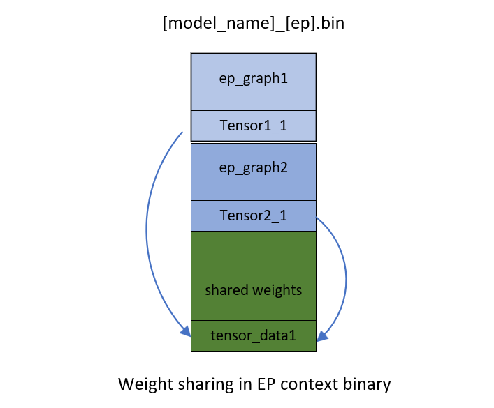
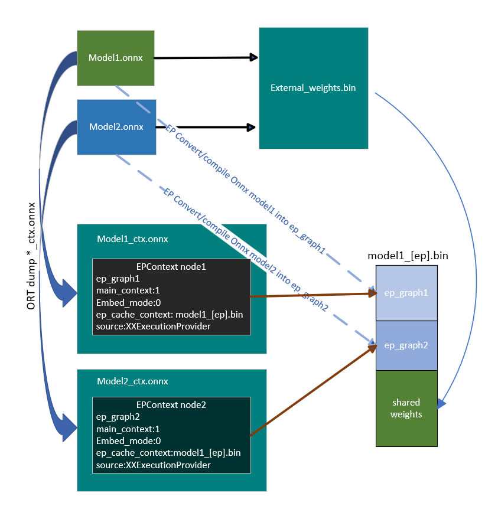

# OnnxRuntime EP context cache feature design
{: .no_toc }

## Contents
{: .no_toc }

* TOC placeholder
{:toc}

## Background

OnnxRuntime Execution Providers enable users to inference Onnx model on different kinds of hardware accelerators empowered by backend SDKs (like QNN, OpenVINO, Vitis AI, etc). The Execution Providers convert the Onnx model into graph format required by the backend SDK, and compile it into the format required by the hardware. Specific to NPU world, the converting and compiling process takes a long time to complete, especially for LLM models. The session creation time costs tens of minutes for some cases which impacts the user experience badly.
To avoid the converting and compiling cost, most of the backend SDKs provide the feature to dump the pre-compiled model into binary file. The pre-compiled model can be loaded by backend SDK directly and executed on the target device. It improves the session creation time greatly by using this way. In order to achieve this, OnnxRuntime defined a contribute Op called EPContext in MS domain.

## EPContext Op Schema

Op domain: com.microsoft
Node inputs & outputs: variadic
Domain: com.microsoft
Atrribures:

|Attributes           |Data type|Description                                                                                               |
|---------------------|---------|----------------------------------------------------------------------------------------------------------|
|main_context         |int64    |1 (default): This node points to an EP context content that contains the graph referred to by this node.<br/>0: The node does not point to any EP context content. Expect to get the graph from node with this field is 1.<br/>Some EPs support 1 single context contains multiple graphs. The EPContext node with main_context=1 refers to the real context. And the context contains graphs that are referred by other nodes with main_context=0.|
|ep_cache_context     |string   |Payload of the EP context if embed_mode=1, or path to the context file if embed_mode=0.<br/>The path is a relative path to the Onnx model file. It can be a file name, or subfolder/filename|
|embed_mode           |int64    |1(default): ep_cache_context contains the payload of context content.<br/>0: ep_cache_context is the context binary file path.|
|ep_sdk_version       |string   |Optional. SDK version that used to generate the node.|
|onnx_model_filename  |string   |Optional. Original Onnx model file name.|
|hardware_architecture|string   |Optional. Hardware architecture.|
|partition_name       |string   |Optional. OnnxRuntime partitioned graph name.|
|source               |string   |Optional. The source used to generate the node. Should be a key identified by the EP so that OnnxRuntime can support multiple EPContext nodes run with different EPs. For example, QNN EP only accepts nodes with source=QNN or QnnExecutionProvider, OpenVINO EP only accepts nodes with source=OpenVINOExecutionProvider.|
|notes                |string   |Optional. Additional information required by specific EP.|
|max_size             |int64    |Optional. Max size in the context. Usage depend on the EP. Default to 0.|

<p align="center"></p>

## OnnxRuntime Session options related to EP context cache generation and inference

|Session option             |Description                                                                                               |
|---------------------------|----------------------------------------------------------------------------------------------------------|
|ep.context_enable          |Used for context model generation only.<br/>1: Enable OnnxRuntime to dump the context cache model.<br/>0 (default): disable.|
|ep.context_file_path       |Specify the file path for the dump model.<br/>Default to original_file_name_ctx.onnx for context model generation.<br/>For model inference, if user loads model from memory buffer and the EP context binary is outside the Onnx model, user need to set this option. OnnxRuntime EP use this path to get the folder path together with the ep_cache_context (which point to the contex binary path) to get the absoluate path for the context binary file.|
|ep.context_embed_mode      |Used for context model generation only.<br/>1: dump the EP context content into the Onnx model, inside ep_cache_context node attribute.<br/>0 (default): dump the EP context content into a separate file, keep the file name in the Onnx model. File path tracked in ep_cache_context node attribute.|
|ep.context_node_name_prefix|Used for context model generation only.<br/>Specify the EPContext node name (also the partition_name attribute, internal graph name) prefix to make it unique across nodes in case user glue multiple EPContext nodes in one model to avoid conflict.|
|ep.context_model_external_initializers_file_name|This is for the case that some nodes partitioned on CPU EP, and those nodes has external initializers. When generating EP context model, the new generated model should NOT depend on old external data file used for source Onnx model.<br/>Use this config when dumping EP context model with an external initializers file. All initializers will be inside the external data file if specified, otherwise all inside generated Onnx file.<br/>It is not set by default, so all initializers will be inside the Onnx file.|

## EP Context cache model generation workflow

OnnxRuntime EPs should follow these rules to create the EP context cache model to maintain a unified user interface.
- ep.context_enable
  - OnnxRuntime create the EP context cache model if ep.context_enable = 1. Otherwise, ep.context_enable = 0 (default), just do the normal workflow.
- ep.context_file_path
  - OnnxRuntime just change the origitnal input file name by replacing ".onnx" to “_ctx.onnx” as the output file name if no ep.context_file_path provided. Otherwise just use the user provided file path.
  - ep.context_file_path is required if user loads the model from memory buffer, since there’s no way for OnnxRuntime to get the input file path for this scenario.
- ep.context_embed_mode
  - 1: dump the EP context context content into the Onnx model.
  - 0 (default): dump the EP context content as a separate file. EP decides the file name and tracks the file name in EPContext node attribute ep_cache_context. The separate file should always at the same location as the dumped Onnx model file. And the file path tracked in EPContext node is a relative path to the Onnx model file. Note: subfolder is allowed.
- ep.context_node_name_prefix
  - In case the user wants to add special tag inside the EPContext node name (also the partition_name attribute, and graph name), EP should provide this capability when EP creates the EPContext nodes.
  - This is useful if the user wants to glue multiple EPContext nodes from multiple models into one model and there’s risk that node name (graph name) confliction happens across models. Dependes on EP implementation. QNN EP supports multiple QNN contexts, so user can merge and re-connect EPContext nodes generated from different models.

## Inference from EP Context cache model workflow

OnnxRuntime EPs which support loading from Onnx model with EPContext nodes should follow the workflow/rules for model inference.
- EP should be able to identify the model which has EPContext node.
  - EP follows its normal workflow if there’s no EPContext nodes inside the model.
  - If it is the Onnx model has EPContext nodes.
    - EP should check the source node attribute from all EPContext nodes to make sure there is any EPContext node for this EP (the source node attribute matches the key required by the EP).
    - EP only partition in the EPContext nodes which has source node attribute matches the key required by the EP.
    - EP loads from the cached context inside EPContext node
- If the context cache Onnx model is dumped with embed_mode = 1, so there is separate context binary file beside the Onnx model in the same folder. 
  - OnnxRuntime EP gets the context binary file relative path from EPContext ep_cache_context node attribute.
  - If the user loads the model from a Onnx model file path, then EP should get the input model folder path, and combine it with the relative path got from step a) as the context binary file full path.
  - If the user loads the model from memory buffer, user needs to provide session option ep.context_file_path. EP gets the folder path from ep.context_file_path, and combines it with the relative path   got from step a) as the context binary file full path. 

<p align="center"></p>

## ExecutionProvider interface GetEpContextNodes() to help generate the EP Context cache model

It is hard for Execution Providers to generate the partitioned graph within the Execution Provider code since an Execution Provider does not have a good picture of the whole partitioned graph. New ExecutionProvider interface GetEpContextNodes() is added to support this.

```
  virtual const InlinedVector<const Node*> GetEpContextNodes() const {
    return InlinedVector<const Node*>();
  }
```

This API returns the array of pointers for EPContext nodes. Execution Provider needs to implement this interface if it has the requirement to generate the context cache model. Otherwise leave it. It is the Execution Provider's responsibility to create the EPContext nodes with its dependencies (like the context binary file if it's not embed_mode). The OnnxRuntime GraphPartitioner use this interface to get the EPContext nodes and generate the partitioned Onnx model. [code details here](https://github.com/microsoft/onnxruntime/blob/544bdd60730270f49f6a5baafdff54065f626776/onnxruntime/core/framework/graph_partitioner.cc#L646-L750)


## EPContext with weight sharing

### Weight sharing in Onnx domain
Weight sharing in Onnx means multiple Onnx models with external weights point to the same external weight file. The Onnx models share same tensor names so that they reference to the same tensor data.
<p align="center"></p>

### Weight sharing in EP domain with EPContext
EP weight sharing is enabled with EP pre-generated context binary/blob. It requires users to generate context binary offline AOT on Linux x86_64 or Windows x86_64 machine. The EP context binary contains multiple graphs which share the same tensors.
<p align="center"></p>
EP or the backend SDK should be able to convert and compile the graph into a way as showed above.
1. EP or the SDK should be able to identify the identical weights from existing EP context which generated from previously compiled graph.
2. New graphs compiled into the EP context should use the existing weight if it is identified as identical weight.
Inside ep_ctx.bin, tensor1_1 from ep_graph1 and tensor2_1 from ep_graph2 are identical, they both point to the same data offset tensor_data1.

### EPContext model generation with Weight sharing workflow
<p align="center"></p>
Each OnnxRuntime session is associated with an ONNX model. Models that share weights are grouped together, forming a model group. Similarly, OnnxRuntime sessions that share common properties are organized into a session group. OnnxRuntime introduces session options **ep.share_ep_contexts** and **ep.stop_share_ep_contexts** to help group the sessions.
- All OnnxRuntime sessions in the session group should have **ep.share_ep_contexts** enabled.
- The last OnnxRuntime session has **ep.stop_share_ep_contexts** enabled to identify it is the last session.
Note: One Onnx model can have multiple EPContext nodes according to graph partition result. Each model only has 1 EPcontext node here just to make it simple. 

### Implementation guidance for EPContext model generation with weight sharing
- The first session creates a shared workspace (e.g., EP Singleton) to share resources with other sessions.
- The EP context binary file name is determined by the first session and placed in the shared space (e.g., EP Singleton) for use across session groups.
- All sessions in the session group compile the graphs into the shared resource. 
- Each session in the session group creates an EPContext ONNX model. The EP generates an EPContext node that references the EP context binary file name. The ONNX Runtime framework then dumps the EPContext ONNX model.
- The last session (the one with **ep.stop_share_ep_contexts** enabled) in the session group generates the final EP context binary file with the name from the shared workspace.
- The last session should clear the shared workspace. Empty shared workspace is used to identify the first session.

User code example
```
    Ort::SessionOptions so;
    // Set session option to dump EPContext Onnx model
    so.AddConfigEntry(kOrtSessionOptionEpContextEnable, "1");
    // enable ep.share_ep_contexts
    so.AddConfigEntry(kOrtSessionOptionShareEpContexts, "1");

    // Add EP, take QNN for example
    so.AppendExecutionProvider("QNN", provider_options);

	// Create the 1st session to dump the _ctx.onnx model
    Ort::Session session1(env, "model1.onnx", so);
	
	// enable ep.stop_share_ep_contexts to specify this is the last session for the session group
	so.AddConfigEntry(kOrtSessionOptionStopShareEpContexts, "1");
	// Create the last session to dump the _ctx.onnx model and the ep_ctx.bin
	Ort::Session session2(env, "model2.onnx", so);
```

General tool for EPContext model generation with weight sharing
OnnxRuntime provides [ep_weight_sharing_ctx_gen](https://github.com/microsoft/onnxruntime/tree/main/onnxruntime/test/ep_weight_sharing_ctx_gen) tool to complete these steps. This tool is specific for weight sharing.
Example command line:
```
./ep_weight_sharing_ctx_gen -e qnn -i "soc_model|60 htp_graph_finalization_optimization_mode|3" ./model1.onnx,./model2.onnx
```
It creates 2 Onnx model2 (model1_ctx.onnx, model2_ctx.onnx) and a QNN context binary file (xxx.bin).

### Inference sessions from EPContext models with weight sharing
OnnxRuntime inference session need to have resource sharing enabled (set session option ep.share_ep_contexts to 1) to use the dumped EPContext models with weight sharing enabled.

Implementation guidance for inferencing from EPContext models with weight sharing:
- Create the 1st OnnxRuntime inference session with ep.share_ep_contexts=1, loads the model1_ctx.onnx model.
  - The session loads the model1_ctx.onnx model.
  - The shared workplace is empty.
  - EP loads the ep_ctx.bin and deserialize the binary to get all graphs (EP_graph1, EP_graph2).
  - EPContext node in model1_ctx.onnx specifies that it uses EP_graph1
  - Uses EP_graph1 for the current OnnxRuntime session.
  - Put the rest of the grpahs (EP_graph2) into the shared workplace.
- Create OnnxRuntime 2nd inference session with ep.share_ep_contexts=1, loads the model2_ctx.onnx model.
  - The session loads the model2_ctx.onnx model.
  - The EPContext node in model2_ctx.onnx specifies that it uses EP_graph2.
  - The shared workplace has EP_graph2.
  - EP skips loading the ep_ctx.bin since it gets what it wants from the shared workplace.
  - Moves EP_graph2 from the shared workplace to the current session.
- To avoid issues while existing execution, it is recommended to destroy the sessions in reverse order.

User code example
```
    Ort::SessionOptions so;
    // enable ep.share_ep_contexts
    so.AddConfigEntry(kOrtSessionOptionShareEpContexts, "1");

    // Add EP, take QNN for example
    so.AppendExecutionProvider("QNN", provider_options);

	// Create sessions to load from the _ctx.onnx models with resource sharing enabled
    Ort::Session session1(env, "model1_ctx.onnx", so);	
	Ort::Session session2(env, "model2_ctx.onnx", so);
	
	session1.run(...);
	session2.run(...);
```