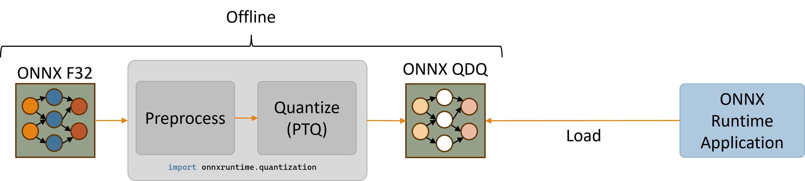

# QNN Execution Provider
{: .no_toc }

The QNN Execution Provider for ONNX Runtime enables hardware accelerated execution on Qualcomm chipsets. 
It uses the Qualcomm AI Engine Direct SDK (QNN SDK) to construct a QNN graph from an ONNX model which can 
be executed by a supported accelerator backend library.


## Contents
{: .no_toc }

* TOC placeholder
{:toc}

## Install Pre-requisites

Download the Qualcomm AI Engine Direct SDK (QNN SDK) from [https://qpm.qualcomm.com/main/tools/details/qualcomm_ai_engine_direct](https://qpm.qualcomm.com/main/tools/details/qualcomm_ai_engine_direct)

### QNN Version Requirements

ONNX Runtime QNN Execution Provider has been built and tested with QNN 2.18.x and Qualcomm SC8280, SM8350 SOC's

## Build
For build instructions, please see the [BUILD page](../build/eps.md#qnn).

## Pre-built Packages
Alternatively, ONNX Runtime with QNN EP can be installed from:
- [NuGet package](https://www.nuget.org/packages/Microsoft.ML.OnnxRuntime.QNN)
- Nightly Python package (Windows ARM64):
  - Requirements:
    - Windows ARM64
    - Python 3.11.x
    - Numpy 1.25.2 or >= 1.26.4
  - Install: `python -m pip install -i https://aiinfra.pkgs.visualstudio.com/PublicPackages/_packaging/ORT-Nightly/pypi/simple/ ort-nightly-qnn`

## Configuration Options
The QNN Execution Provider supports a number of configuration options. These provider options are specified as key-value string pairs.

|`"backend_path"`|Description|
|---|-----|
|'libQnnCpu.so' or 'QnnCpu.dll'|Enable CPU backend. Useful for integration testing. CPU backend is a reference implementation of QNN operators|
|'libQnnHtp.so' or 'QnnHtp.dll'|Enable HTP backend. Offloads compute to NPU.|

|`"profiling_level"`|Description|
|---|---|
|'off'||
|'basic'||
|'detailed'||

See [profiling-tools](../performance/tune-performance/profiling-tools.md) for more info on profiling  
Alternatively to setting profiling_level at compile time, profiling can be enabled dynamically with ETW (Windows). See [tracing](../performance/tune-performance/logging_tracing.md) for more details

|`"rpc_control_latency"`|Description|
|---|---|
|microseconds (string)|allows client to set up RPC control latency in microseconds|

|`"vtcm_mb"`|Description|
|---|---|
|size in MB (string)|QNN VTCM size in MB, defaults to 0 (not set)|

|`"htp_performance_mode"`|Description|
|---|---|
|'burst'||
|'balanced'||
|'default'||
|'high_performance'||
|'high_power_saver'||
|'low_balanced'||
|'low_power_saver'||
|'power_saver'||
|'sustained_high_performance'||

|`"qnn_saver_path"`|Description|
|---|---|
|filpath to 'QnnSaver.dll' or 'libQnnSaver.so'|File path to the QNN Saver backend library. Dumps QNN API calls to disk for replay/debugging.|


|`"qnn_context_priority"`|[Description](https://docs.qualcomm.com/bundle/publicresource/topics/80-63442-50/htp_yielding.html)|
|---|---|
|'low'||
|'normal'|default.|
|'normal_high'||
|'high'||


|`"htp_graph_finalization_optimization_mode"`|Description|
|---|---|
|'0'|default.|
|'1'|faster preparation time, less optimal graph.|
|'2'|longer preparation time, more optimal graph.|
|'3'|longest preparation time, most likely even more optimal graph.|

|`"soc_model"`|Description|
|---|---|
|Model number (string)|The SoC model number. Refer to the QNN SDK documentation for valid values.  Defaults to "0" (unknown).|

|`"htp_arch"`|Description|
|---|---|
|"0"|Default (none)|
|"68"||
|"69"||
|"73"||
|"75"||

|`"device_id"`|Description|
|---|---|
|Device ID (string)|The ID of the device to use when setting `htp_arch`. Defaults to "0" (for single device).|

|`"enable_htp_fp16_precision"`|Description [Example](https://github.com/microsoft/onnxruntime-inference-examples/tree/main/c_cxx/QNN_EP/mobilenetv2_classification)|
|---|---|
|'0'|default.|
|'1'|Enable the float32 model to be inferenced with fp16 precision.|

## Supported ONNX operators

|Operator|Notes|
|---|---|
|ai.onnx:Abs||
|ai.onnx:Add||
|ai.onnx:And||
|ai.onnx:ArgMax||
|ai.onnx:ArgMin||
|ai.onnx:Asin||
|ai.onnx:Atan||
|ai.onnx:AveragePool||
|ai.onnx:BatchNormalization||
|ai.onnx:Cast||
|ai.onnx:Clip||
|ai.onnx:Concat||
|ai.onnx:Conv||
|ai.onnx:ConvTranspose||
|ai.onnx:Cos||
|ai.onnx:DepthToSpace||
|ai.onnx:DequantizeLinear||
|ai.onnx:Div||
|ai.onnx:Elu||
|ai.onnx:Equal||
|ai.onnx:Exp||
|ai.onnx:Expand||
|ai.onnx:Flatten||
|ai.onnx:Floor||
|ai.onnx:Gather|Only supports positive indices|
|ai.onnx:Gelu||
|ai.onnx:Gemm||
|ai.onnx:GlobalAveragePool||
|ai.onnx:Greater||
|ai.onnx:GreaterOrEqual||
|ai.onnx:GridSample||
|ai.onnx:HardSwish||
|ai.onnx:InstanceNormalization||
|ai.onnx:LRN||
|ai.onnx:LayerNormalization||
|ai.onnx:LeakyRelu||
|ai.onnx:Less||
|ai.onnx:LessOrEqual||
|ai.onnx:Log||
|ai.onnx:LogSoftmax||
|ai.onnx:LpNormalization|p == 2|
|ai.onnx:MatMul|Supported input data types on HTP backend: (uint8, uint8), (uint8, uint16), (uint16, uint8)|
|ai.onnx:Max||
|ai.onnx:MaxPool||
|ai.onnx:Min||
|ai.onnx:Mul||
|ai.onnx:Neg||
|ai.onnx:Not||
|ai.onnx:Or||
|ai.onnx:Prelu||
|ai.onnx:Pad||
|ai.onnx:Pow||
|ai.onnx:QuantizeLinear||
|ai.onnx:ReduceMax||
|ai.onnx:ReduceMean||
|ai.onnx:ReduceMin||
|ai.onnx:ReduceProd||
|ai.onnx:ReduceSum||
|ai.onnx:Relu||
|ai.onnx:Resize||
|ai.onnx:Round||
|ai.onnx:Sigmoid||
|ai.onnx:Sign||
|ai.onnx:Sin||
|ai.onnx:Slice||
|ai.onnx:Softmax||
|ai.onnx:SpaceToDepth||
|ai.onnx:Split||
|ai.onnx:Sqrt||
|ai.onnx:Squeeze||
|ai.onnx:Sub||
|ai.onnx:Tanh||
|ai.onnx:Tile||
|ai.onnx:TopK||
|ai.onnx:Transpose||
|ai.onnx:Unsqueeze||
|ai.onnx:Where||
|com.microsoft:DequantizeLinear|Provides 16-bit integer dequantization support|
|com.microsoft:Gelu||
|com.microsoft:QuantizeLinear|Provides 16-bit integer quantization support|

Supported data types vary by operator and QNN backend. Refer to the [QNN SDK documentation](https://docs.qualcomm.com/bundle/publicresource/topics/80-63442-50/operations.html) for more information.

## Running a model with QNN EP's HTP backend (Python)
<p align="center"></p>

The QNN HTP backend only supports quantized models. Models with 32-bit floating-point activations and weights must first be quantized to use a lower integer precision (e.g., 8-bit or 16-bit integers).

This section provides instructions for quantizing a model and then running the quantized model on QNN EP's HTP backend using Python APIs. Please refer to the [quantization page](../performance/model-optimizations/quantization.md) for a broader overview of quantization concepts.

### Model requirements
QNN EP does not support models with dynamic shapes (e.g., a dynamic batch size). Dynamic shapes must be fixed to a specific value. Refer to the documentation for [making dynamic input shapes fixed](../tutorials/mobile/helpers/make-dynamic-shape-fixed.md) for more information.

Additionally, QNN EP supports a subset of ONNX operators (e.g., Loops and Ifs are not supported). Refer to the [list of supported ONNX operators](./QNN-ExecutionProvider.md#supported-onnx-operators).
### Generating a quantized model (x64)
The ONNX Runtime python package provides utilities for quantizing ONNX models via the `onnxruntime.quantization` import. The quantization utilities are currently only supported on x86_64 due to issues installing the `onnx` package on ARM64.
Therefore, it is recommended to either use an x64 machine to quantize models or, alternatively, use a separate x64 python installation on Windows ARM64 machines.

Install the nightly ONNX Runtime x64 python package.
```shell
python -m pip install -i https://aiinfra.pkgs.visualstudio.com/PublicPackages/_packaging/ORT-Nightly/pypi/simple/ ort-nightly
```

Quantization for QNN EP requires the use of calibration input data. Using a calibration dataset that is representative of typical model inputs is crucial in generating an accurate quantized model.

The following snippet defines a sample `DataReader` class that generates random float32 input data. Note that using random input data will most likely produce an inaccurate quantized model.
Refer to the [implementation of a Resnet data reader](https://github.com/microsoft/onnxruntime-inference-examples/blob/main/quantization/image_classification/cpu/resnet50_data_reader.py) for one example of how to create a `CalibrationDataReader` that provides input from image files on disk.

```python
# data_reader.py

import numpy as np
import onnxruntime
from onnxruntime.quantization import CalibrationDataReader


class DataReader(CalibrationDataReader):
    def __init__(self, model_path: str):
        self.enum_data = None

        # Use inference session to get input shape.
        session = onnxruntime.InferenceSession(model_path, providers=['CPUExecutionProvider'])

        inputs = session.get_inputs()

        self.data_list = []

        # Generate 10 random float32 inputs
        # TODO: Load valid calibration input data for your model
        for _ in range(10):
            input_data = {inp.name : np.random.random(inp.shape).astype(np.float32) for inp in inputs}
            self.data_list.append(input_data)

        self.datasize = len(self.data_list)

    def get_next(self):
        if self.enum_data is None:
            self.enum_data = iter(
                self.data_list
            )
        return next(self.enum_data, None)

    def rewind(self):
        self.enum_data = None

```

The following snippet pre-processes the original model and then quantizes the pre-processed model to use `uint16` activations and `uint8` weights.
Although the quantization utilities expose the `uint8`, `int8`, `uint16`, and `int16` quantization data types, QNN operators typically support the `uint8` and `uint16` data types.
Refer to the [QNN SDK operator documentation](https://docs.qualcomm.com/bundle/publicresource/topics/80-63442-50/HtpOpDefSupplement.html) for the data type requirements of each QNN operator.

```python
# quantize_model.py

import data_reader
import numpy as np
import onnx
from onnxruntime.quantization import QuantType, quantize
from onnxruntime.quantization.execution_providers.qnn import get_qnn_qdq_config, qnn_preprocess_model

if __name__ == "__main__":
    input_model_path = "model.onnx"  # TODO: Replace with your actual model
    output_model_path = "model.qdq.onnx"  # Name of final quantized model
    my_data_reader = data_reader.DataReader(input_model_path)

    # Pre-process the original float32 model.
    preproc_model_path = "model.preproc.onnx"
    model_changed = qnn_preprocess_model(input_model_path, preproc_model_path)
    model_to_quantize = preproc_model_path if model_changed else input_model_path

    # Generate a suitable quantization configuration for this model.
    # Note that we're choosing to use uint16 activations and uint8 weights.
    qnn_config = get_qnn_qdq_config(model_to_quantize,
                                    my_data_reader,
                                    activation_type=QuantType.QUInt16,  # uint16 activations
                                    weight_type=QuantType.QUInt8)       # uint8 weights

    # Quantize the model.
    quantize(model_to_quantize, output_model_path, qnn_config)
```

Running `python quantize_model.py` will generate a quantized model called `model.qdq.onnx` that can be run on Windows ARM64 devices via ONNX Runtime's QNN EP.

Refer to the following pages for more information on usage of the quantization utilities:
- [Quantization example for mobilenet on CPU EP](https://github.com/microsoft/onnxruntime-inference-examples/tree/main/quantization/image_classification/cpu)
- [quantization/execution_providers/qnn/preprocess.py](https://github.com/microsoft/onnxruntime/blob/23996bbbbe0406a5c8edbf6b7dbd71e5780d3f4b/onnxruntime/python/tools/quantization/execution_providers/qnn/preprocess.py#L16)
- [quantization/execution_providers/qnn/quant_config.py](https://github.com/microsoft/onnxruntime/blob/23996bbbbe0406a5c8edbf6b7dbd71e5780d3f4b/onnxruntime/python/tools/quantization/execution_providers/qnn/quant_config.py#L20-L27)

### Running a quantized model on Windows ARM64
The following assumes that the [Qualcomm AI Engine SDK (QNN SDK)](https://qpm.qualcomm.com/main/tools/details/qualcomm_ai_engine_direct) has already been downloaded and installed to a location such as `C:\Qualcomm\AIStack\QNN\2.18.0.240101`, hereafter referred to as `QNN_SDK`.

First, determine the HTP architecture version for your device by referring to the QNN SDK documentation:
- QNN_SDK\docs\QNN\general\htp\htp_backend.html#qnn-htp-backend-api
- QNN_SDK\docs\QNN\general\overview.html#supported-snapdragon-devices

For example, Snapdragon 8cx Gen 3 (SC8280X) devices have an HTP architecture value of 68, and Snapdragon 8cx Gen 4 (SC8380XP) have an HTP architecture value of 73. In the following, replace `<HTP_ARCH>` with your device's HTP architecture value.

Copy the `.so` file `QNN_SDK\lib\hexagon-v<HTP_ARCH>\unsigned\libQnnHtpV<HTP_ARCH>Skel.so` to the folder `QNN_SDK\lib\aarch64-windows-msvc\`. For example, the following terminal command copies the `libQnnHtpV73Skel.so` file:
```
cp QNN_SDK\lib\hexagon-v73\unsigned\libQnnHtpV73Skel.so QNN_SDK\lib\aarch64-windows-msvc\
```

Add the `QNN_SDK\lib\aarch64-windows-msvc\` directory to your Windows PATH environment variable:
```
- Open the `Edit the system environment variables` Control Panel.
- Click on `Environment variables`.
- Highlight the `Path` entry under `User variables for ..` and click `Edit`.
- Add a new entry that points to `QNN_SDK\lib\aarch64-windows-msvc\`
```

Install the nightly ONNX Runtime ARM64 python package for QNN EP (requires Python 3.11.x and Numpy 1.25.2 or >= 1.26.4):
```shell
python -m pip install -i https://aiinfra.pkgs.visualstudio.com/PublicPackages/_packaging/ORT-Nightly/pypi/simple/ ort-nightly-qnn
```

The following Python snippet creates an ONNX Runtime session with QNN EP and runs the quantized model `model.qdq.onnx` on the HTP backend.

```python
# run_qdq_model.py

import onnxruntime
import numpy as np

options = onnxruntime.SessionOptions()

# (Optional) Enable configuration that raises an exception if the model can't be
# run entirely on the QNN HTP backend.
options.add_session_config_entry("session.disable_cpu_ep_fallback", "1")

# Create an ONNX Runtime session.
# TODO: Provide the path to your ONNX model
session = onnxruntime.InferenceSession("model.qdq.onnx",
                                       sess_options=options,
                                       providers=["QNNExecutionProvider"],
                                       provider_options=[{"backend_path": "QnnHtp.dll"}]) # Provide path to Htp dll in QNN SDK

# Run the model with your input.
# TODO: Use numpy to load your actual input from a file or generate random input.
input0 = np.ones((1,3,224,224), dtype=np.float32)
result = session.run(None, {"input": input0})

# Print output.
print(result)
```

Running `python run_qdq_model.py` will execute the quantized `model.qdq.onnx` model on the QNN HTP backend.

Notice that the session has been optionally configured to raise an exception if the entire model cannot be executed on the QNN HTP backend. This is useful for verifying that the quantized model is fully supported by QNN EP.
Available session configurations include:
- [session.disable_cpu_ep_fallback](https://github.com/microsoft/onnxruntime/blob/a4cfdc1c28ac95ec6fd0667e856b6a6b8dd1020c/include/onnxruntime/core/session/onnxruntime_session_options_config_keys.h#L229): Disables fallback of unsupported operators to the CPU EP.
- [ep.context_enable](https://github.com/microsoft/onnxruntime/blob/a4cfdc1c28ac95ec6fd0667e856b6a6b8dd1020c/include/onnxruntime/core/session/onnxruntime_session_options_config_keys.h#L243): [Enable QNN context cache](./QNN-ExecutionProvider.md#qnn-context-binary-cache-feature) feature to dump a cached version of the model in order to decrease session creation time.

The above snippet only specifies the `backend_path` provider option. Refer to the [Configuration options section](./QNN-ExecutionProvider.md#configuration-options) for a list of all available QNN EP provider options.

## QNN context binary cache feature
There's a QNN context which contains QNN graphs after converting, compiling, filnalizing the model. QNN can serialize the context into binary file, so that user can use it for futher inference direclty (without the QDQ model) to improve the model loading cost.
The QNN Execution Provider supports a number of session options to configure this.

### Dump QNN context binary
1. Create session option, set "ep.context_enable" to "1" to enable QNN context dump. The key "ep.context_enable" is defined as kOrtSessionOptionEpContextEnable in [onnxruntime_session_options_config_keys.h](https://github.com/microsoft/onnxruntime/blob/8931854528b1b2a3f320d012c78d37186fbbdab8/include/onnxruntime/core/session/onnxruntime_session_options_config_keys.h#L239-L252).
2. Create the session with the QDQ model using session options created in step 1, and use HTP backend
A Onnx model with QNN context binary will be created once the session is created/initialized. No need to run the session.
The QNN context binary generation can be done on the QualComm device which has HTP using Arm64 build. It can also be done on x64 machine using x64 build (not able to run it since there's no HTP device).

The generated Onnx model which has QNN context binary can be deployed to production/real device to run inference. This Onnx model is treated as a normal model by QNN Execution Provider. Inference code keeps same as inference with QDQ model on HTP backend.

[Code example](https://github.com/microsoft/onnxruntime-inference-examples/blob/733ce6f3e8dd2ede8b67a8465684bca2f62a4a33/c_cxx/QNN_EP/mobilenetv2_classification/main.cpp#L90-L97)
```
#include "onnxruntime_session_options_config_keys.h"

// C++
Ort::SessionOptions so;
so.AddConfigEntry(kOrtSessionOptionEpContextEnable, "1");

// C
const OrtApi* g_ort = OrtGetApiBase()->GetApi(ORT_API_VERSION);
OrtSessionOptions* session_options;
CheckStatus(g_ort, g_ort->CreateSessionOptions(&session_options));
g_ort->AddSessionConfigEntry(session_options, kOrtSessionOptionEpContextEnable, "1");
```

```python
# Python
import onnxruntime

options = onnxruntime.SessionOptions()
options.add_session_config_entry("ep.context_enable", "1")
```

### Configure the context binary file path
The generated Onnx model with QNN context binary is default to [input_QDQ_model_path]_ctx.onnx in case user does not specify the path. User can to set the path in the session option with the key "ep.context_file_path". Example code below:

```
// C++
so.AddConfigEntry(kOrtSessionOptionEpContextFilePath, "./model_a_ctx.onnx");

// C
g_ort->AddSessionConfigEntry(session_options, kOrtSessionOptionEpContextFilePath, "./model_a_ctx.onnx");
```

```python
# Python
options.add_session_config_entry("ep.context_file_path", "./model_a_ctx.onnx")
```

### Disable the embed mode
The QNN context binary content is embeded in the generated Onnx model by default. User can to disable it by setting "ep.context_embed_mode" to "0". In that case, a bin file will be generated separately. The file name looks like [ctx.onnx]_QNNExecutionProvider_QNN_[hash_id]_x_x.bin. The name is provided by Ort and tracked in the generated Onnx model. It will cause problems if any changes to the bin file. This bin file needs to sit together with the generated Onnx file.

```
// C++
so.AddConfigEntry(kOrtSessionOptionEpContextEmbedMode, "0");

// C
g_ort->AddSessionConfigEntry(session_options, kOrtSessionOptionEpContextEmbedMode, "0");
```

```python
# Python
options.add_session_config_entry("ep.context_embed_mode", "0")
```

## Usage
### C++
C API details are [here](../get-started/with-c.md).
```
Ort::Env env = Ort::Env{ORT_LOGGING_LEVEL_ERROR, "Default"};
std::unordered_map<std::string, std::string> qnn_options;
qnn_options["backend_path"] = "QnnHtp.dll";
Ort::SessionOptions session_options;
session_options.AppendExecutionProvider("QNN", qnn_options);
Ort::Session session(env, model_path, session_options);
```
### Python
```
import onnxruntime as ort
# Create a session with QNN EP using HTP (NPU) backend.
sess = ort.InferenceSession(model_path, providers=['QNNExecutionProvider'], provider_options=[{'backend_path':'QnnHtp.dll'}])`
```

### Inference example

[Image classification with Mobilenetv2 in CPP using QNN Execution Provider with QNN CPU & HTP Backend](https://github.com/microsoft/onnxruntime-inference-examples/tree/main/c_cxx/QNN_EP/mobilenetv2_classification)
