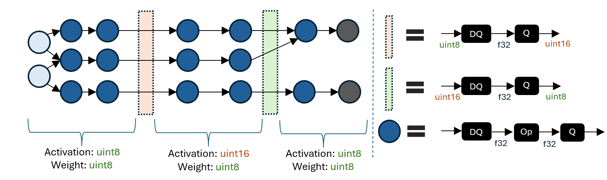
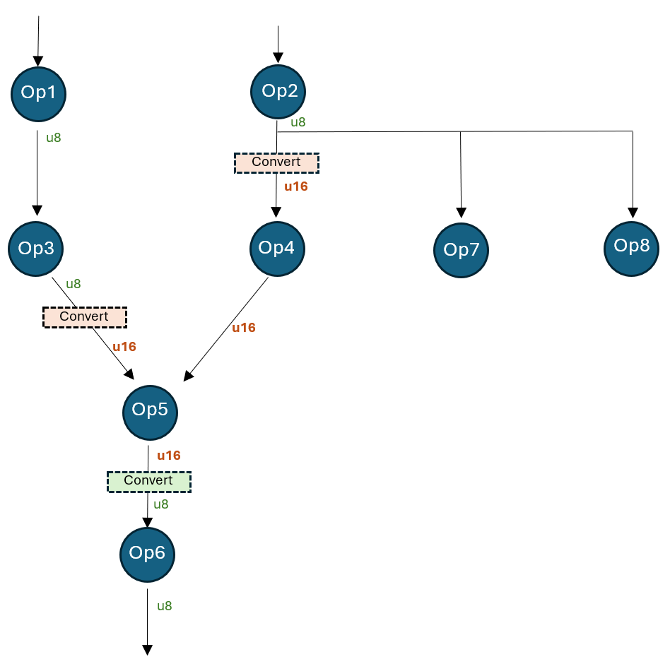

# QNN Execution Provider
{: .no_toc }

The QNN Execution Provider for ONNX Runtime enables hardware accelerated execution on Qualcomm chipsets. 
It uses the Qualcomm AI Engine Direct SDK (QNN SDK) to construct a QNN graph from an ONNX model which can 
be executed by a supported accelerator backend library.
OnnxRuntime QNN Execution Provider can be used on Android and Windows devices with Qualcomm Snapdragon SOC's.

## Contents
{: .no_toc }

* TOC placeholder
{:toc}

## Install Pre-requisites (Build from Source Only)

If you build QNN Execution Provider from source, you should first
download the Qualcomm AI Engine Direct SDK (QNN SDK) from [https://qpm.qualcomm.com/#/main/tools/details/Qualcomm_AI_Runtime_SDK](https://qpm.qualcomm.com/#/main/tools/details/Qualcomm_AI_Runtime_SDK)

### QNN Version Requirements

ONNX Runtime QNN Execution Provider has been built and tested with QNN 2.22.x and Qualcomm SC8280, SM8350, Snapdragon X SOC's on Android and Windows

## Build (Android and Windows)
For build instructions, please see the [BUILD page](../build/eps.md#qnn).

## Pre-built Packages (Windows Only)
Note: Starting version 1.18.0 , you do not need to separately download and install QNN SDK. The required QNN dependency libraries are included in the OnnxRuntime packages.
- [NuGet package](https://www.nuget.org/packages/Microsoft.ML.OnnxRuntime.QNN)
  - Feed for nightly packages of Microsoft.ML.OnnxRuntime.QNN can be found [here](https://aiinfra.visualstudio.com/PublicPackages/_artifacts/feed/ORT-Nightly)
- [Python package](https://pypi.org/project/onnxruntime-qnn/)
  - Requirements:
    - Windows ARM64 (for inferencing on local device with Qualcomm NPU)
    - Windows X64 (for quantizing models. see [Generating a quantized model](./QNN-ExecutionProvider.md#generating-a-quantized-model-x64-only))
    - Python 3.11.x
    - Numpy 1.25.2 or >= 1.26.4
  - Install: `pip install onnxruntime-qnn`
  - Install nightly package `python -m pip install --pre --extra-index-url https://aiinfra.pkgs.visualstudio.com/PublicPackages/_packaging/ORT-Nightly/pypi/simple onnxruntime-qnn`

## Qualcomm AI Hub
Qualcomm AI Hub can be used to optimize and run models on Qualcomm hosted devices.
OnnxRuntime QNN Execution Provider is a supported runtime in [Qualcomm AI Hub](https://aihub.qualcomm.com/)

## Configuration Options
The QNN Execution Provider supports a number of configuration options. These provider options are specified as key-value string pairs.
### EP Provider Options

|`"backend_type"`|Description|
|---|-----|
|'cpu'|Enable CPU backend. Useful for integration testing. The CPU backend is a reference implementation of QNN operators.|
|'gpu'|Enable GPU backend.|
|'htp'|Enable HTP backend. Offloads compute to NPU. Default.|
|'saver'|Enable Saver backend.|

|`"backend_path"`|Description|
|---|-----|
|'libQnnCpu.so' or 'QnnCpu.dll'|Enable CPU backend. See `backend_type` 'cpu'.|
|'libQnnHtp.so' or 'QnnHtp.dll'|Enable HTP backend. See `backend_type` 'htp'.|

**Note:** `backend_path` is an alternative to `backend_type`. At most one of the two should be specified.
`backend_path` requires a platform-specific path (e.g., `libQnnCpu.so` vs. `QnnCpu.dll`) but also allows one to specify an arbitrary path.

|`"profiling_level"`|Description|
|---|---|
|'off'|default.|
|'basic'||
|'detailed'||

|`"profiling_file_path"`|Description|
|---|---|
|'your_qnn_profile_path.csv'|Specify the csv file path to dump the QNN profiling events|

See [profiling-tools](../performance/tune-performance/profiling-tools.md) for more info on profiling  
Alternatively to setting profiling_level at compile time, profiling can be enabled dynamically with ETW (Windows). See [tracing](../performance/tune-performance/logging_tracing.md) for more details

|`"rpc_control_latency"`|Description|
|---|---|
|microseconds (string)|allows client to set up RPC control latency in microseconds|

|`"vtcm_mb"`|Description|
|---|---|
|size in MB (string)|QNN VTCM size in MB, defaults to 0 (not set)|

|`"htp_performance_mode"`|Description|
|---|---|
|'burst'||
|'balanced'||
|'default'|default.|
|'high_performance'||
|'high_power_saver'||
|'low_balanced'||
|'low_power_saver'||
|'power_saver'||
|'sustained_high_performance'||

|`"qnn_saver_path"`|Description|
|---|---|
|filpath to 'QnnSaver.dll' or 'libQnnSaver.so'|File path to the QNN Saver backend library. Dumps QNN API calls to disk for replay/debugging.|


|`"qnn_context_priority"`|[Description](https://docs.qualcomm.com/bundle/publicresource/topics/80-63442-50/htp_yielding.html)|
|---|---|
|'low'||
|'normal'|default.|
|'normal_high'||
|'high'||


|`"htp_graph_finalization_optimization_mode"`|Description|
|---|---|
|'0'|default.|
|'1'|faster preparation time, less optimal graph.|
|'2'|longer preparation time, more optimal graph.|
|'3'|longest preparation time, most likely even more optimal graph.|

|`"soc_model"`|Description|
|---|---|
|Model number (string)|The SoC model number. Refer to the [QNN SDK documentation](https://docs.qualcomm.com/bundle/publicresource/topics/80-63442-50/overview.html#supported-snapdragon-devices) for valid values.  Defaults to "0" (unknown).|

|`"htp_arch"`|Description|
|---|---|
|Hardware Architecture|HTP Architecture number. Refer to the [QNN SDK documentation](https://docs.qualcomm.com/bundle/publicresource/topics/80-63442-50/enum_QnnHtpDevice_8h_1a0ed976142af98a86143459dfd326f717.html#exhale-enum-qnnhtpdevice-8h-1a0ed976142af98a86143459dfd326f717) for valid values. Default (none)|

|`"device_id"`|Description|
|---|---|
|Device ID (string)|The ID of the device to use when setting `htp_arch`. Defaults to "0" (for single device).|

|`"enable_htp_fp16_precision"`|Description [Example](https://github.com/microsoft/onnxruntime-inference-examples/tree/main/c_cxx/QNN_EP/mobilenetv2_classification)|
|---|---|
|'0'|Disabled. Inferenced with fp32 precision if it's fp32 model.|
|'1'|Default. Enable the float32 model to be inferenced with fp16 precision.|

|`"offload_graph_io_quantization"`|Description|
|---|---|
|'0'|Disabled. QNN EP will handle quantization and dequantization of graph I/O.|
|'1'|Default. Enabled. Offload quantization and dequantization of graph I/O to CPU EP.|

|`"enable_htp_shared_memory_allocator"`|Description|
|---|---|
|'0'|Default. Disabled.|
|'1'|Enable the QNN HTP shared memory allocator. Requires libcdsprpc.so/dll to be available. [Code example](https://github.com/microsoft/onnxruntime/blob/544bdd60730270f49f6a5baafdff54065f626776/onnxruntime/test/shared_lib/test_inference.cc#L2262-L2354)|

### Run Options

|`"qnn.lora_config"`|Description|
|---|---|
|Config path|LoRAv2 config file path. The format of the config will be mentioned in the **LoraV2 support**.|

## Supported ONNX operators

|Operator|Notes|
|---|---|
|ai.onnx:Abs||
|ai.onnx:Add||
|ai.onnx:And||
|ai.onnx:ArgMax||
|ai.onnx:ArgMin||
|ai.onnx:Asin||
|ai.onnx:Atan||
|ai.onnx:AveragePool||
|ai.onnx:BatchNormalization|fp16 supported since 1.18.0|
|ai.onnx:Cast||
|ai.onnx:Clip|fp16 supported since 1.18.0|
|ai.onnx:Concat||
|ai.onnx:Conv|3d supported since 1.18.0|
|ai.onnx:ConvTranspose|3d supported since 1.18.0|
|ai.onnx:Cos||
|ai.onnx:DepthToSpace||
|ai.onnx:DequantizeLinear||
|ai.onnx:Div||
|ai.onnx:Elu||
|ai.onnx:Equal||
|ai.onnx:Exp||
|ai.onnx:Expand||
|ai.onnx:Flatten||
|ai.onnx:Floor||
|ai.onnx:Gather|Only supports positive indices|
|ai.onnx:Gelu||
|ai.onnx:Gemm||
|ai.onnx:GlobalAveragePool||
|ai.onnx:Greater||
|ai.onnx:GreaterOrEqual||
|ai.onnx:GridSample||
|ai.onnx:HardSwish||
|ai.onnx:InstanceNormalization||
|ai.onnx:LRN||
|ai.onnx:LayerNormalization||
|ai.onnx:LeakyRelu||
|ai.onnx:Less||
|ai.onnx:LessOrEqual||
|ai.onnx:Log||
|ai.onnx:LogSoftmax||
|ai.onnx:LpNormalization|p == 2|
|ai.onnx:MatMul|Supported input data types on HTP backend: (uint8, uint8), (uint8, uint16), (uint16, uint8)|
|ai.onnx:Max||
|ai.onnx:MaxPool||
|ai.onnx:Min||
|ai.onnx:Mul||
|ai.onnx:Neg||
|ai.onnx:Not||
|ai.onnx:Or||
|ai.onnx:Prelu|fp16, int32 supported since 1.18.0|
|ai.onnx:Pad||
|ai.onnx:Pow||
|ai.onnx:QuantizeLinear||
|ai.onnx:ReduceMax||
|ai.onnx:ReduceMean||
|ai.onnx:ReduceMin||
|ai.onnx:ReduceProd||
|ai.onnx:ReduceSum||
|ai.onnx:Relu||
|ai.onnx:Resize||
|ai.onnx:Round||
|ai.onnx:Sigmoid||
|ai.onnx:Sign||
|ai.onnx:Sin||
|ai.onnx:Slice||
|ai.onnx:Softmax||
|ai.onnx:SpaceToDepth||
|ai.onnx:Split||
|ai.onnx:Sqrt||
|ai.onnx:Squeeze||
|ai.onnx:Sub||
|ai.onnx:Tanh||
|ai.onnx:Tile||
|ai.onnx:TopK||
|ai.onnx:Transpose||
|ai.onnx:Unsqueeze||
|ai.onnx:Where||
|com.microsoft:DequantizeLinear|Provides 16-bit integer dequantization support|
|com.microsoft:Gelu||
|com.microsoft:QuantizeLinear|Provides 16-bit integer quantization support|

Supported data types vary by operator and QNN backend. Refer to the [QNN SDK documentation](https://docs.qualcomm.com/bundle/publicresource/topics/80-63442-50/operations.html) for more information.

## Running a model with QNN EP's HTP backend (Python)
<p align="center"></p>

The QNN HTP backend only supports quantized models. Models with 32-bit floating-point activations and weights must first be quantized to use a lower integer precision (e.g., 8-bit or 16-bit integers).

This section provides instructions for quantizing a model and then running the quantized model on QNN EP's HTP backend using Python APIs. Please refer to the [quantization page](../performance/model-optimizations/quantization.md) for a broader overview of quantization concepts.

### Model requirements
QNN EP does not support models with dynamic shapes (e.g., a dynamic batch size). Dynamic shapes must be fixed to a specific value. Refer to the documentation for [making dynamic input shapes fixed](../tutorials/mobile/helpers/make-dynamic-shape-fixed.md) for more information.

Additionally, QNN EP supports a subset of ONNX operators (e.g., Loops and Ifs are not supported). Refer to the [list of supported ONNX operators](./QNN-ExecutionProvider.md#supported-onnx-operators).
### Generating a quantized model (x64 only)
The ONNX Runtime python package provides utilities for quantizing ONNX models via the `onnxruntime.quantization` import. The quantization utilities are currently only supported on x86_64 due to issues installing the `onnx` package on ARM64.
Therefore, it is recommended to either use an x64 machine to quantize models or, alternatively, use a separate x64 python installation on Windows ARM64 machines.

Install the ONNX Runtime x64 python package. (please note, you must use x64 package for quantizing the model. use the arm64 package for inferencing and utilizing the HTP/NPU)
```shell
python -m pip install onnxruntime-qnn
```

Quantization for QNN EP requires the use of calibration input data. Using a calibration dataset that is representative of typical model inputs is crucial in generating an accurate quantized model.

The following snippet defines a sample `DataReader` class that generates random float32 input data. Note that using random input data will most likely produce an inaccurate quantized model.
Refer to the [implementation of a Resnet data reader](https://github.com/microsoft/onnxruntime-inference-examples/blob/main/quantization/image_classification/cpu/resnet50_data_reader.py) for one example of how to create a `CalibrationDataReader` that provides input from image files on disk.

```python
# data_reader.py

import numpy as np
import onnxruntime
from onnxruntime.quantization import CalibrationDataReader


class DataReader(CalibrationDataReader):
    def __init__(self, model_path: str):
        self.enum_data = None

        # Use inference session to get input shape.
        session = onnxruntime.InferenceSession(model_path, providers=['CPUExecutionProvider'])

        inputs = session.get_inputs()

        self.data_list = []

        # Generate 10 random float32 inputs
        # TODO: Load valid calibration input data for your model
        for _ in range(10):
            input_data = {inp.name : np.random.random(inp.shape).astype(np.float32) for inp in inputs}
            self.data_list.append(input_data)

        self.datasize = len(self.data_list)

    def get_next(self):
        if self.enum_data is None:
            self.enum_data = iter(
                self.data_list
            )
        return next(self.enum_data, None)

    def rewind(self):
        self.enum_data = None

```

The following snippet pre-processes the original model and then quantizes the pre-processed model to use `uint16` activations and `uint8` weights.
Although the quantization utilities expose the `uint8`, `int8`, `uint16`, and `int16` quantization data types, QNN operators typically support the `uint8` and `uint16` data types.
Refer to the [QNN SDK operator documentation](https://docs.qualcomm.com/bundle/publicresource/topics/80-63442-50/HtpOpDefSupplement.html) for the data type requirements of each QNN operator.

```python
# quantize_model.py

import data_reader
import numpy as np
import onnx
from onnxruntime.quantization import QuantType, quantize
from onnxruntime.quantization.execution_providers.qnn import get_qnn_qdq_config, qnn_preprocess_model

if __name__ == "__main__":
    input_model_path = "model.onnx"  # TODO: Replace with your actual model
    output_model_path = "model.qdq.onnx"  # Name of final quantized model
    my_data_reader = data_reader.DataReader(input_model_path)

    # Pre-process the original float32 model.
    preproc_model_path = "model.preproc.onnx"
    model_changed = qnn_preprocess_model(input_model_path, preproc_model_path)
    model_to_quantize = preproc_model_path if model_changed else input_model_path

    # Generate a suitable quantization configuration for this model.
    # Note that we're choosing to use uint16 activations and uint8 weights.
    qnn_config = get_qnn_qdq_config(model_to_quantize,
                                    my_data_reader,
                                    activation_type=QuantType.QUInt16,  # uint16 activations
                                    weight_type=QuantType.QUInt8)       # uint8 weights

    # Quantize the model.
    quantize(model_to_quantize, output_model_path, qnn_config)
```

Running `python quantize_model.py` will generate a quantized model called `model.qdq.onnx` that can be run on Windows ARM64 devices via ONNX Runtime's QNN EP.

Refer to the following pages for more information on usage of the quantization utilities:
- [Quantization example for mobilenet on CPU EP](https://github.com/microsoft/onnxruntime-inference-examples/tree/main/quantization/image_classification/cpu)
- [quantization/execution_providers/qnn/preprocess.py](https://github.com/microsoft/onnxruntime/blob/23996bbbbe0406a5c8edbf6b7dbd71e5780d3f4b/onnxruntime/python/tools/quantization/execution_providers/qnn/preprocess.py#L16)
- [quantization/execution_providers/qnn/quant_config.py](https://github.com/microsoft/onnxruntime/blob/23996bbbbe0406a5c8edbf6b7dbd71e5780d3f4b/onnxruntime/python/tools/quantization/execution_providers/qnn/quant_config.py#L20-L27)

### Running a quantized model on Windows ARM64 (onnxruntime-qnn version >= 1.18.0)
Install the ONNX Runtime ARM64 python package for QNN EP (requires Python 3.11.x and Numpy 1.25.2 or >= 1.26.4):
```shell
python -m pip install onnxruntime-qnn
```

The following Python snippet creates an ONNX Runtime session with QNN EP and runs the quantized model `model.qdq.onnx` on the HTP backend.

```python
# run_qdq_model.py

import onnxruntime
import numpy as np

options = onnxruntime.SessionOptions()

# (Optional) Enable configuration that raises an exception if the model can't be
# run entirely on the QNN HTP backend.
options.add_session_config_entry("session.disable_cpu_ep_fallback", "1")

# Create an ONNX Runtime session.
# TODO: Provide the path to your ONNX model
session = onnxruntime.InferenceSession("model.qdq.onnx",
                                       sess_options=options,
                                       providers=["QNNExecutionProvider"],
                                       provider_options=[{"backend_path": "QnnHtp.dll"}]) # Provide path to Htp dll in QNN SDK

# Run the model with your input.
# TODO: Use numpy to load your actual input from a file or generate random input.
input0 = np.ones((1,3,224,224), dtype=np.float32)
result = session.run(None, {"input": input0})

# Print output.
print(result)
```

Running `python run_qdq_model.py` will execute the quantized `model.qdq.onnx` model on the QNN HTP backend.

Notice that the session has been optionally configured to raise an exception if the entire model cannot be executed on the QNN HTP backend. This is useful for verifying that the quantized model is fully supported by QNN EP.
Available session configurations include:
- [session.disable_cpu_ep_fallback](https://github.com/microsoft/onnxruntime/blob/a4cfdc1c28ac95ec6fd0667e856b6a6b8dd1020c/include/onnxruntime/core/session/onnxruntime_session_options_config_keys.h#L229): Disables fallback of unsupported operators to the CPU EP.
- [ep.context_enable](https://github.com/microsoft/onnxruntime/blob/a4cfdc1c28ac95ec6fd0667e856b6a6b8dd1020c/include/onnxruntime/core/session/onnxruntime_session_options_config_keys.h#L243): [Enable QNN context cache](./QNN-ExecutionProvider.md#qnn-context-binary-cache-feature) feature to dump a cached version of the model in order to decrease session creation time.

The above snippet only specifies the `backend_path` provider option. Refer to the [Configuration options section](./QNN-ExecutionProvider.md#configuration-options) for a list of all available QNN EP provider options.

## QNN context binary cache feature
There's a QNN context which contains QNN graphs after converting, compiling, finalizing the model. QNN can serialize the context into binary file, so that user can use it for futher inference directly (without the QDQ model) to improve the model loading cost.
The QNN Execution Provider supports a number of session options to configure this.

### Dump QNN context binary
1. Create session option, set "ep.context_enable" to "1" to enable QNN context dump. The key "ep.context_enable" is defined as kOrtSessionOptionEpContextEnable in [onnxruntime_session_options_config_keys.h](https://github.com/microsoft/onnxruntime/blob/8931854528b1b2a3f320d012c78d37186fbbdab8/include/onnxruntime/core/session/onnxruntime_session_options_config_keys.h#L239-L252).
2. Create the session with the QDQ model using session options created in step 1, and use HTP backend
A Onnx model with QNN context binary will be created once the session is created/initialized. No need to run the session.
The QNN context binary generation can be done on the QualComm device which has HTP using Arm64 build. It can also be done on x64 machine using x64 build (not able to run it since there's no HTP device).

The generated Onnx model which has QNN context binary can be deployed to production/real device to run inference. This Onnx model is treated as a normal model by QNN Execution Provider. Inference code keeps same as inference with QDQ model on HTP backend.

[Code example](https://github.com/microsoft/onnxruntime-inference-examples/blob/733ce6f3e8dd2ede8b67a8465684bca2f62a4a33/c_cxx/QNN_EP/mobilenetv2_classification/main.cpp#L90-L97)
```
#include "onnxruntime_session_options_config_keys.h"

// C++
Ort::SessionOptions so;
so.AddConfigEntry(kOrtSessionOptionEpContextEnable, "1");

// C
const OrtApi* g_ort = OrtGetApiBase()->GetApi(ORT_API_VERSION);
OrtSessionOptions* session_options;
CheckStatus(g_ort, g_ort->CreateSessionOptions(&session_options));
g_ort->AddSessionConfigEntry(session_options, kOrtSessionOptionEpContextEnable, "1");
```

```python
# Python
import onnxruntime

options = onnxruntime.SessionOptions()
options.add_session_config_entry("ep.context_enable", "1")
```

### Configure the context binary file path
The generated Onnx model with QNN context binary is default to [input_QDQ_model_name]_ctx.onnx in case user does not specify the path. User can to set the path in the session option with the key "ep.context_file_path". Example code below:

```
// C++
so.AddConfigEntry(kOrtSessionOptionEpContextFilePath, "./model_a_ctx.onnx");

// C
g_ort->AddSessionConfigEntry(session_options, kOrtSessionOptionEpContextFilePath, "./model_a_ctx.onnx");
```

```python
# Python
options.add_session_config_entry("ep.context_file_path", "./model_a_ctx.onnx")
```

### Enable the embed mode
The QNN context binary content is not embedded in the generated Onnx model by default. A bin file will be generated separately. The file name looks like [input_model_file_name]_QNN_[hash_id].bin. The name is provided by Ort and tracked in the generated Onnx model. It will cause problems if any changes are made to the bin file. This bin file needs to sit together with the generated Onnx file. User can enable it by setting "ep.context_embed_mode" to "1". In that case the content of the context binary is embedded inside the Onnx model.

```
// C++
so.AddConfigEntry(kOrtSessionOptionEpContextEmbedMode, "1");

// C
g_ort->AddSessionConfigEntry(session_options, kOrtSessionOptionEpContextEmbedMode, "1");
```

```python
# Python
options.add_session_config_entry("ep.context_embed_mode", "1")
```

## QNN EP weight sharing
Refers to the [EPContext design doc](https://onnxruntime.ai/docs/execution-providers/EP-Context-Design.html#epcontext-with-weight-sharing)

Note: QNN EP requires **Linux x86_64** or **Windows x86_64** platform.

Additionally, if user creates the QNN context binary (`qnn_ctx.bin`) with weight sharing using the QNN toolchain (`qnn-context-binary-generator`), they can use a script to generate the wrapper Onnx model from the context:  [gen_qnn_ctx_onnx_model.py](https://github.com/microsoft/onnxruntime/blob/main/onnxruntime/python/tools/qnn/gen_qnn_ctx_onnx_model.py). The script creates multiple `model_x_ctx.onnx` files, each containing an `EPContext` node that references the shared `qnn_ctx.bin` file. Each `EPContext` node specifies a unique node name, referring to different Qnn graph from the QNN context.


## Usage
### C++
C API details are [here](../get-started/with-c.md).
```
Ort::Env env = Ort::Env{ORT_LOGGING_LEVEL_ERROR, "Default"};
std::unordered_map<std::string, std::string> qnn_options;
qnn_options["backend_path"] = "QnnHtp.dll";
Ort::SessionOptions session_options;
session_options.AppendExecutionProvider("QNN", qnn_options);
Ort::Session session(env, model_path, session_options);
```
### Python
```
import onnxruntime as ort
# Create a session with QNN EP using HTP (NPU) backend.
sess = ort.InferenceSession(model_path, providers=['QNNExecutionProvider'], provider_options=[{'backend_path':'QnnHtp.dll'}])`
```

### Inference example

[Image classification with Mobilenetv2 in CPP using QNN Execution Provider with QNN CPU & HTP Backend](https://github.com/microsoft/onnxruntime-inference-examples/tree/main/c_cxx/QNN_EP/mobilenetv2_classification)


## Error handling
### HTP SubSystem Restart - [SSR](https://docs.qualcomm.com/bundle/publicresource/topics/80-63442-50/htp_backend.html#subsystem-restart-ssr-)
QNN EP returns StatusCode::ENGINE_ERROR regarding QNN HTP SSR issue. Uppper level framework/application should recreate Onnxruntime session if this error detected during session run.


## Add new operator support in QNN EP
To enable new operator support in EP, areas to visit:
- QDQ script support this Op? [code example](https://github.com/microsoft/onnxruntime/pull/14867/files#diff-b1ea073c326fef46054382117c256f106d39bd7c34539d44c6e6d9e9eacc059c)
- Onnxruntime QDQ node unit support this Op? [code example](https://github.com/microsoft/onnxruntime/pull/14867/files#diff-ce0281aaf63e03ecadd592240e41f18742bf8eb095b3725c0e55e589c890946f)
- Is it layout sensitive operator?
  - Registered in LayoutTransformer?
    [code example](https://github.com/microsoft/onnxruntime/blob/6d464748ba7fed2275ecba3a7406298cabc93438/onnxruntime/core/optimizer/transpose_optimizer/transpose_optimizer.cc#L2168)
  - NHWC op schema registered?
    Example error message: <lambda_acc29b18d21b7c13448c4952cd957a60>::operator ()] Model face_det_qdq failed to load:Fatal error: com.ms.internal.nhwc:BatchNormalization(9) is not a registered function/op
    [Example PR](https://github.com/microsoft/onnxruntime/pull/15278)

### Example PRs to enable new operators:
- Non-layout sensitive operator. [Enable Hardsigmoid for QNN EP using SDK support direct support](https://github.com/microsoft/onnxruntime/pull/20956)

- Layout sensitive operator. [Add InstanceNormalization operator to QNN EP](https://github.com/microsoft/onnxruntime/pull/14867)


## Mixed precision support
The following figure demonstrates an example of mixed precision model.
<p align="center"></p>
A mixed precision QDQ model consists of regions with different activation/weight quantization data types. The boundary between regions converts between activation quantization data types (e.g., uint8 to uint16) using a DQ to Q sequence.

The ability to specify regions with different quantization data types enables exploring the tradeoffs between accuracy and latency. A higher integer precision may improve accuracy at the expense of latency, so selectively promoting certain regions to a higher precision can aid in achieving a desirable balance in key metrics.

The following figure shows a model with a region that has been promoted to 16-bit from the default 8-bit activation type.
<p align="center"></p>

This model is quantized to uint8 precision, but tensor "Op4_out" is quantized to 16-bit. This can be achieved by specifying the following initial tensor quantization overrides:

```
# Op4_out could be an inaccurate tensor that should be upgraded to 16bit
initial_overrides = {"Op4_out": [{"quant_type": QuantType.QUInt16}]}

qnn_config = get_qnn_qdq_config(
    float_model_path,
    data_reader,
    activation_type=QuantType.QUInt8,
    weight_type=QuantType.QUInt8,
    init_overrides=initial_overrides,  # These initial overrides will be "fixed"
)
```

The above snippet generates the following "fixed" overrides (get via qnn_config.extra_options["TensorQuantOverrides"]):

```
overrides = {
  “Op2_out”: [{“quant_type”: QUInt8, “convert”: {“quant_type”: QUInt16, “recv_nodes”: {“Op4”}}}],
  “Op3_out”: [{“quant_type”: QUInt8, “convert”: {“quant_type”: QUInt16, “recv_nodes”: {“Op5”}}}],
  “Op4_out”: [{“quant_type”: QUInt16}],
  “Op5_out”: [{“quant_type”: QUInt16, “convert”: {“quant_type”: QUInt8, “recv_nodes”: {“Op6”}}}]
}
```

After the override, the model works like this:

- Op2’s output is consumed by Op4, Op7, and Op8. Op4 consumes the converted u16 type, while Op7 and Op8 consume the original u8 type.
- Op3’s output is converted from u8 to u16. Op5 consumes the converted u16 type.
- Op4’s output is just u16 (not converted).
- Op5’s output is converted from u16 to u8. Op6 consumes the u8 type.

## LoRAv2 support
Currently, only pre-compiled models with EPContext nodes are supported. The  example script for reference [gen_qnn_ctx_onnx_model.py](https://github.com/microsoft/onnxruntime/blob/main/onnxruntime/python/tools/qnn/gen_qnn_ctx_onnx_model.py). After applying the model LoRAv2 using the [QNN SDK](https://docs.qualcomm.com/bundle/publicresource/topics/80-63442-50/tutorials.html#lora-(low-rank-adaptation)), a main qnn context binary and several adapter binary sections will be generated. We use the LoRAv2 config and place it into RunOptions for inference.

* The format of the LoRAv2 config:
  * graph name: QNN graph in QNN pre-built context binary.
  * adapter binary section path: binary section generated by qnn-context-binary-generator
```
<graph name>;<adapter binary section path>
```
