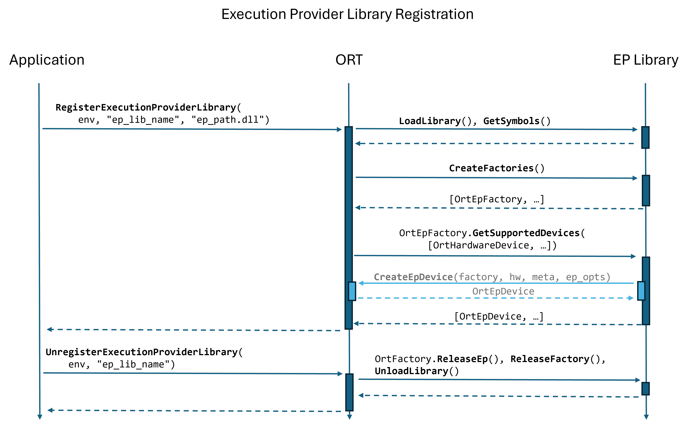
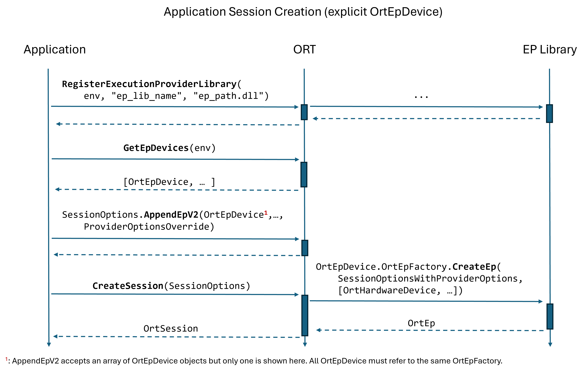

# Plugin Execution Provider Libraries
{: .no_toc }

## Contents
{: .no_toc }

* TOC placeholder
{:toc}

## Background
An ONNX Runtime Execution Provider (EP) executes model operations on one or more hardware accelerators (e.g., GPU, NPU, etc.). ONNX Runtime provides a variety of built-in EPs, such as the default CPU EP. To enable further extensibility, ONNX Runtime supports user-defined plugin EP libraries that an application can register with ONNX Runtime for use in an ONNX Runtime inference session.<br/>

This page provides a reference for the APIs necessary to develop and use plugin EP libraries with ONNX Runtime.

## Creating a plugin EP library
A plugin EP is built as a dynamic/shared library that exports the functions `CreateEpFactories()` and `ReleaseEpFactory()`. ONNX Runtime calls `CreateEpFactories()` to obtain one or more instances of `OrtEpFactory`. An `OrtEpFactory` creates `OrtEp` instances and specifies the hardware devices supported by the EPs it creates.

The ONNX Runtime repository includes a [sample plugin EP library](https://github.com/microsoft/onnxruntime/tree/main/onnxruntime/test/autoep/library), which is referenced in the following sections.

### Defining an OrtEp
An `OrtEp` represents an instance of an EP that is used by an ONNX Runtime session to identify and execute the model operations supported by the EP.

The following table lists the **required** varibles and functions that an implementer must define for an `OrtEp`.

<table>
<tr>
<th>Field</th>
<th>Summary</th>
<th>Example implementation</th>
</tr>

<tr>
<td><a href="#c-api-ort-ep-ort-version-supported">ort_version_supported</a></td>
<td>The ONNX Runtime version with which the EP was compiled. Implementation should set to <code>ORT_API_VERSION</code>.</td>
<td><a href="https://github.com/microsoft/onnxruntime/blob/16ae99ede405d3d6c59d7cce80c53f5f7055aeed/onnxruntime/test/autoep/library/ep.cc#L160">ExampleEp()</a></td>
</tr>

<tr>
<td><a href="#c-api-ort-ep-get-name">GetName</a></td>
<td>Get the execution provider name.</td>
<td><a href="https://github.com/microsoft/onnxruntime/blob/16ae99ede405d3d6c59d7cce80c53f5f7055aeed/onnxruntime/test/autoep/library/ep.cc#L181">ExampleEp::GetNameImpl()</a></td>
</tr>

<tr>
<td><a href="#c-api-ort-ep-get-capability">GetCapability</a></td>
<td>Get information about the nodes/subgraphs supported by the <code>OrtEp</code> instance.</td>
<td><a href="https://github.com/microsoft/onnxruntime/blob/16ae99ede405d3d6c59d7cce80c53f5f7055aeed/onnxruntime/test/autoep/library/ep.cc#L231">ExampleEp::GetCapabilityImpl()</a></td>
</tr>

<tr>
<td><a href="#c-api-ort-ep-compile">Compile</a></td>
<td>
Compile <code>OrtGraph</code> instances assigned to the <code>OrtEp</code>. Implementation must set a <code>OrtNodeComputeInfo</code> instance for each <code>OrtGraph</code> in order to define its computation function.<br/><br/>
If the session is configured to generate a pre-compiled model, the execution provider must return <code>count</code> number of EPContext nodes.
</td>
<td><a href="https://github.com/microsoft/onnxruntime/blob/16ae99ede405d3d6c59d7cce80c53f5f7055aeed/onnxruntime/test/autoep/library/ep.cc#L293">ExampleEp::CompileImpl()</a></td>
</tr>

<tr>
<td><a href="c-api-ort-ep-release-node-compute-infos">ReleaseNodeComputeInfos</a></td>
<td>
Release <code>OrtNodeComputeInfo</code> instances.
</td>
<td><a href="https://github.com/microsoft/onnxruntime/blob/16ae99ede405d3d6c59d7cce80c53f5f7055aeed/onnxruntime/test/autoep/library/ep.cc#L364">ExampleEp::ReleaseNodeComputeInfosImpl()</a></td>
</tr>

</table>

The following table lists the **optional** functions that an implementor may define for an `OrtEp`. If an optional `OrtEp` function is not defined, ONNX Runtime uses a default implementation.

<table>
<tr>
<th>Field</th>
<th>Summary</th>
<th>Example implementation</th>
</tr>

<tr>
<td><a href="c-api-ort-ep-get-preferred-data-layout">GetPreferredDataLayout</a></td>
<td>
Get the EP's preferred data layout.<br/><br/>
If this function is not implemented, ORT assumes that the EP prefers the data layout <code>OrtEpDataLayout::NCHW</code>.
</td>
<td></td>
</tr>

<tr>
<td><a href="c-api-ort-ep-should-convert-data-layout-for-op">ShouldConvertDataLayoutForOp</a></td>
<td>
Given an op with domain <code>domain</code> and type <code>op_type</code>, determine whether an associated node's data layout should be converted to a <code>target_data_layout</code>. If the EP prefers a non-default data layout, this function will be called during layout transformation with <code>target_data_layout</code> set to the EP's preferred data layout<br/><br/>
Implementation of this function is optional. If an EP prefers a non-default data layout, it may implement this to customize the specific op data layout preferences at a finer granularity.
</td>
<td></td>
</tr>

<tr>
<td><a href="c-api-ort-ep-set-dynamic-options">SetDynamicOptions</a></td>
<td>
Set dynamic options on this EP. Dynamic options can be set by the application at any time after session creation with <a href="https://onnxruntime.ai/docs/api/c/struct_ort_api.html#ab1117a51683e4fbb42687c9db6e8d5fb"><code>OrtApi::SetEpDynamicOptions()</code></a>.<br/><br/>
Implementation of this function is optional. An EP should only impliment this function if it needs to handle any dynamic options.
</td>
<td></td>
</tr>

<tr>
<td><a href="c-api-ort-ep-on-run-start">OnRunStart</a></td>
<td>
Called by ORT to notify the EP of the start of a run.<br/><br/>
Implementation of this function is optional. An EP should only impliment this function if it needs to handle application-provided options at the start of a run.
</td>
<td></td>
</tr>

<tr>
<td><a href="c-api-ort-ep-on-run-end">OnRunEnd</a></td>
<td>
Called by ORT to notify the EP of the end of a run.<br/><br/>
Implementation of this function is optional. An EP should only impliment this function if it needs to handle application-provided options at the end of a run.
</td>
<td></td>
</tr>

<tr>
<td><a href="c-api-ort-ep-create-allocator">CreateAllocator</a></td>
<td>
Create an <code>OrtAllocator</code> for the given <code>OrtMemoryInfo</code> for an <code>OrtSession</code>.<br/><br/>The <code>OrtMemoryInfo</code> instance will match one of the values set in the <code>OrtEpDevice</code> using <code>EpDevice_AddAllocatorInfo</code>. Any allocator specific options should be read from the session options.<br/><br/>
Implementation of this function is optional. If not provided, ORT will use `OrtEpFactory::CreateAllocator()`.
</td>
<td></td>
</tr>

<tr>
<td><a href="c-api-ort-ep-create-sync-stream-for-device">CreateSyncStreamForDevice</a></td>
<td>
Create a synchronization stream for the given memory device for an <code>OrtSession</code>.<br/><br/>This is used to create a synchronization stream for the execution provider and is used to synchronize operations on the device during model execution. Any stream specific options should be read from the session options.<br/><br/>
Implementation of this function is optional. If not provided, ORT will use `OrtEpFactory::CreateSyncStreamForDevice()`.
</td>
<td></td>
</tr>

<tr>
<td><a href="c-api-ort-ep-get-compiled-model-compatability-info">GetCompiledModelCompatibilityInfo</a></td>
<td>
Get a string with details about the EP stack used to produce a compiled model.<br/><br/>
The compatibility information string can be used with <code>OrtEpFactory::ValidateCompiledModelCompatibilityInfo</code> to determine if a compiled model is compatible with the EP.
</td>
<td></td>
</tr>

</table>

### Defining an OrtEpFactory
An `OrtEpFactory` represents an instance of an EP factory that is used by an ONNX Runtime session to query device support, create allocators, create data transfer objects, and create instances of an EP (i.e., an `OrtEp`).

The following table lists the **required** variables and functions that an implementer must define for an `OrtEpFactory`.

<table>
<tr>
<th>Field</th>
<th>Summary</th>
<th>Example implementation</th>
</tr>

<tr>
<td><a href="#c-api-ort-ep-factory-ort-version-supported">ort_version_supported</a></td>
<td>The ONNX Runtime version with which the EP was compiled. Implementation should set this to <code>ORT_API_VERSION</code>.</td>
<td><a href="https://github.com/microsoft/onnxruntime/blob/3cadbdb495761a6a54845b178f9bdb811a2c8bde/onnxruntime/test/autoep/library/ep_factory.cc#L16">ExampleEpFactory()</a></td>
</tr>

<tr>
<td><a href="#c-api-ort-ep-factory-get-name">GetName</a></td>
<td>Get the name of the EP that the factory creates. Must match <code>OrtEp::GetName()</code>.</td>
<td><a href="https://github.com/microsoft/onnxruntime/blob/3cadbdb495761a6a54845b178f9bdb811a2c8bde/onnxruntime/test/autoep/library/ep_factory.cc#L77">ExampleEpFactory::GetNameImpl()</a></td>
</tr>

<tr>
<td><a href="#c-api-ort-ep-factory-get-vendor">GetVendor</a></td>
<td>Get the name of the name of the vendor that owns the EP that the factory creates.</td>
<td><a href="https://github.com/microsoft/onnxruntime/blob/3cadbdb495761a6a54845b178f9bdb811a2c8bde/onnxruntime/test/autoep/library/ep_factory.cc#L83">ExampleEpFactory::GetVendor()</a></td>
</tr>

<tr>
<td><a href="#c-api-ort-ep-factory-get-vendor-id">GetVendorId</a></td>
<td>Get the vendor ID of the vendor that owns the EP that the factory creates. This is typically the <a href="https://pcisig.com/membership/member-companies">PCI vendor ID</a>.</td>
<td><a href="https://github.com/microsoft/onnxruntime/blob/3cadbdb495761a6a54845b178f9bdb811a2c8bde/onnxruntime/test/autoep/library/ep_factory.cc#L89">ExampleEpFactory::GetVendorId()</a></td>
</tr>

<tr>
<td><a href="#c-api-ort-ep-factory-get-version">GetVersion</a></td>
<td>Get the version of the EP that the factory creates. The version string should adhere to the <a href="https://github.com/semver/semver/blob/v2.0.0/semver.md">Semantic Versioning 2.0 specification</a>.</td>
<td><a href="https://github.com/microsoft/onnxruntime/blob/3cadbdb495761a6a54845b178f9bdb811a2c8bde/onnxruntime/test/autoep/library/ep_factory.cc#L95">ExampleEpFactory::GetVersionImpl()</a></td>
</tr>

<tr>
<td><a href="#c-api-ort-ep-factory-get-supported-devices">GetSupportedDevices</a></td>
<td>Get information about the <code>OrtHardwareDevice</code> instances supported by an EP created by the factory.</td>
<td><a href="https://github.com/microsoft/onnxruntime/blob/3cadbdb495761a6a54845b178f9bdb811a2c8bde/onnxruntime/test/autoep/library/ep_factory.cc#L101">ExampleEpFactory::GetSupportedDevicesImpl()</a></td>
</tr>

<tr>
<td><a href="#c-api-ort-ep-factory-create-ep">CreateEp</a></td>
<td>Creates an <code>OrtEp</code> instance for use in an ONNX Runtime session. ORT calls <code>OrtEpFactory::ReleaseEp()</code> to release the instance.</td>
<td><a href="https://github.com/microsoft/onnxruntime/blob/3cadbdb495761a6a54845b178f9bdb811a2c8bde/onnxruntime/test/autoep/library/ep_factory.cc#L163">ExampleEpFactory::CreateEpImpl()</a></td>
</tr>

</table>

The following table lists the **optional** functions that an implementer may define for an `OrtEpFactory`.

<table>
<tr>
<th>Field</th>
<th>Summary</th>
<th>Example implementation</th>
</tr>

<tr>
<td><a href="#c-api-ort-ep-factory-validate-compiled-model-compatibility-info">ValidateCompiledModelCompatibilityInfo</a></td>
<td>Validate the compatibility of a compiled model with the EP.<br/><br/>
This function validates if a model produced with the supllied compatibility information string is supported by the underlying EP.
The implementation should check if a compiled model is compatible with the EP and return the appropriate <code>OrtCompiledModelCompatibility</code> value.</td>
<td></td>
</tr>

<tr>
<td><a href="#c-api-ort-ep-factory-create-allocator">CreateAllocator</a></td>
<td>Create an <code>OrtAllocator</code> that can be shared across sessions for the given <code>OrtMemoryInfo</code>.<br/><br/>
The factory that creates the EP is responsible for providing the allocators required by the EP. The <code>OrtMemoryInfo</code> instance will match one of the values set in the <code>OrtEpDevice</code> using <code>EpDevice_AddAllocatorInfo</code>.</td>
<td><a href="https://github.com/microsoft/onnxruntime/blob/3cadbdb495761a6a54845b178f9bdb811a2c8bde/onnxruntime/test/autoep/library/ep_factory.cc#L212">ExampleEpFactory::CreateAllocatorImpl()</a></td>
</tr>

<tr>
<td><a href="#c-api-ort-ep-factory-release-allocator">ReleaseAllocator</a></td>
<td>Releases an <code>OrtAllocator</code> instance created by the factory.</td>
<td><a href="https://github.com/microsoft/onnxruntime/blob/3cadbdb495761a6a54845b178f9bdb811a2c8bde/onnxruntime/test/autoep/library/ep_factory.cc#L272">ExampleEpFactory::ReleaseAllocatorImpl()</a></td>
</tr>

<tr>
<td><a href="#c-api-ort-ep-factory-create-data-transfer">CreateDataTransfer</a></td>
<td>Creates an <code>OrtDataTransferImpl</code> instance for the factory.<br/><br/>
An <code>OrtDataTransferImpl</code> can be used to copy data between devices that the EP supports.</td>
<td><a href="https://github.com/microsoft/onnxruntime/blob/3cadbdb495761a6a54845b178f9bdb811a2c8bde/onnxruntime/test/autoep/library/ep_factory.cc#L286">ExampleEpFactory::CreateDataTransferImpl()</a></td>
</tr>

<tr>
<td><a href="#c-api-ort-ep-factory-is-stream-aware">IsStreamAware</a></td>
<td>Returns true if the EPs created by the factory are stream-aware.</td>
<td><a href="https://github.com/microsoft/onnxruntime/blob/3cadbdb495761a6a54845b178f9bdb811a2c8bde/onnxruntime/test/autoep/library/ep_factory.cc#L295">ExampleEpFactory::IsStreamAwareImpl()</a></td>
</tr>

<tr>
<td><a href="#c-api-ort-ep-factory-create-sync-stream-for-device">CreateSyncStreamForDevice</a></td>
<td>Creates a synchronization stream for the given <code>OrtMemoryDevice</code>.<br/><br/>
This is use to create a synchronization stream for the <code>OrtMemoryDevice</code> that can be used for operations outside of a session.</td>
<td><a href="https://github.com/microsoft/onnxruntime/blob/3cadbdb495761a6a54845b178f9bdb811a2c8bde/onnxruntime/test/autoep/library/ep_factory.cc#L300">ExampleEpFactory::CreateSyncStreamForDeviceImpl()</a></td>
</tr>

</table>


### Exporting functions to create and release factories
ONNX Runtime expects a plugin EP library to export certain functions/symbols.
The following table lists the functions that have to be exported from the plugin EP library.

<table>
<tr>
<th>Function</th>
<th>Description</th>
<th>Example implementation</th>
</tr>

<tr>
<td>CreateEpFactories</td>
<td>ONNX Runtime calls this function to create <code>OrtEpFactory</code> instances.</td>
<td><a href="https://github.com/microsoft/onnxruntime/blob/3cadbdb495761a6a54845b178f9bdb811a2c8bde/onnxruntime/test/autoep/library/example_plugin_ep.cc#L17">ExampleEp: CreateEpFactories</a></td>
</tr>

<tr>
<td>ReleaseEpFactory</td>
<td>ONNX Runtime calls this function to release an <code>OrtEpFactory</code> instance.</td>
<td><a href="https://github.com/microsoft/onnxruntime/blob/3cadbdb495761a6a54845b178f9bdb811a2c8bde/onnxruntime/test/autoep/library/example_plugin_ep.cc#L41">ExampleEp: ReleaseEpFactory</a></td>
</tr>

</table>


## Using a plugin EP library
### Plugin EP library registration
The sample application code below uses the following API functions to register and unregister a plugin EP library.
 - [RegisterExecutionProviderLibrary](https://onnxruntime.ai/docs/api/c/struct_ort_api.html#a7c8ea74a2ee54d03052f3d7cd1e1335d)
 - [UnregisterExecutionProviderLibrary](https://onnxruntime.ai/docs/api/c/struct_ort_api.html#acd4d148e149af2f2304a45b65891543f)

```cpp
// Note: this snippet does not handle errors.
const char* lib_registration_name = "ep_lib_name";

// Register plugin EP library with ONNX Runtime.
OrtStatus* status = ort_api->RegisterExecutionProviderLibrary(
  ort_env,
  lib_registration_name,  // Registration name can be anything the application chooses.
  "ep_path.dll"           // Path to the plugin EP library
);


{
  OrtSession* session = nullptr;
  // Create an OrtSession and run a model ...
}

// Unregister the library using the application-specified registration name.
// Must only unregister a library after all sessions that use the library have been released.
status = ort_api->UnregisterExecutionProviderLibrary(ort_env, lib_registration_name);
```

As shown in the following sequence diagram, registering a plugin EP library causes ONNX Runtime to load the library and
call the library's `CreateEpFactories()` function. During the call to `CreateEpFactories()`, ONNX Runtime determines the subset
of hardware devices supported by each factory by calling `OrtEpFactory::GetSupportedDevices()` with all hardware devices that
ONNX Runtime discovered during initialization.

The factory returns `OrtEpDevice` instances from `OrtEpFactory::GetSupportedDevices()`.
Each `OrtEpDevice` instance pairs a factory with a hardware device that the factory supports.
For example, if a single factory instance supports both CPU and NPU, then the call to `OrtEpFactory::GetSupportedDevices()` returns two `OrtEpDevice` instances:
    - ep_device_0: (factory_0, CPU)
    - ep_device_1: (factory_0, NPU)

<br/>
<p align="center"></p>

### Session creation with explicit OrtEpDevice(s)
The application code below use the API function [SessionOptionsAppendExecutionProvider_V2](https://onnxruntime.ai/docs/api/c/struct_ort_api.html#a285a5da8c9a63eff55dc48e4cf3b56f6) to add an EP to an ONNX Runtime session.

The application first calls [GetEpDevices](https://onnxruntime.ai/docs/api/c/struct_ort_api.html#a52107386ff1be870f55a0140e6add8dd) to get a list of `OrtEpDevices`
available to the application. Each `OrtEpDevice` represents a hardware device supported by an `OrtEpFactory`.
The `SessionOptionsAppendExecutionProvider_V2` function takes an array of `OrtEpDevice` instances as input, where all `OrtEpDevice` instances refer to the same `OrtEpFactory`.

```cpp
// NOTE: this snippet does not properly handle errors.

// NOTE: Assume plugin EP library has been registered with RegisterExecutionProviderLibrary()
OrtStatus* status = ort_api->RegisterExecutionProviderLibrary(/*...*/);

size_t num_ep_devices = 0;
const OrtEpDevice* const* ep_devices = nullptr;

status = ort_api->GetEpDevices(ort_env, &ep_devices, &num_ep_devices);

// Find the OrtEpDevice for "my_ep".
std::array<const OrtEpDevice*, 1> desired_ep_devices = { nullptr };
for (const OrtEpDevice* ep_device : ep_devices) {
  if (std::strcmp(ort_api->EpDevice_EpName(ep_device), "my_ep") == 0) {
    desired_ep_devices[0] = ep_device;
    break;
  }
}
assert(desired_ep_devices[0] != nullptr);  // Would normally handle this as an app error.

OrtSessionOptions* session_options = nullptr;
status = ort_api->CreateSessionOptions(&session_options);
status = ort_api->SessionOptionsAppendExecutionProvider_V2(
    session_options,
    ort_env,
    desired_ep_devices.data(),
    desired_ep_devices.size(),
    nullptr,  // ep_option_keys
    nullptr,  // ep_option_vals
    0         // num_ep_options
);


OrtSession* session = nullptr;
status = ort_api->CreateSession(
    ort_env,
    ORT_TSTR("model.onnx"),
    session_options,
    &session
);

// Run model ...

// Release resources
ort_api->ReleaseStatus(status);
ort_api->ReleaseSession(session);
ort_api->ReleaseSessionOptions(session_options);

status = ort_api->UnregisterExecutionProviderLibrary(/*...*/);
```

As shown in the following sequence diagram, ONNX Runtime calls `OrtEpFactory::CreateEp()` during session creation in order to create an instance of the plugin EP.

<br/>
<p align="center"></p>

## API reference
API header files:
 - [onnxruntime_ep_c_api.h](https://github.com/microsoft/onnxruntime/blob/main/include/onnxruntime/core/session/onnxruntime_ep_c_api.h)
   - Defines interfaces implemented by plugin EP and EP factory instances.
   - Provides APIs utilized by plugin EP and EP factory instances.
 - [onnxruntime_c_api.h](https://github.com/microsoft/onnxruntime/blob/main/include/onnxruntime/core/session/onnxruntime_c_api.h)
   - Provides APIs used to traverse an input model graph.


### Data Types

<!-- Use an HTML table to allow embedding a code block in a cell -->
<table>
<tr>
<th>Type</th>
<th>Description</th>
</tr>

<tr>
<td>
<a href="#ort-hardware-device-type">OrtHardwareDeviceType</a>
</td>
<td>
Enumerates classes of hardware devices:<br>
<ul>
<li>OrtHardwareDeviceType_CPU</li>
<li>OrtHardwareDeviceType_GPU</li>
<li>OrtHardwareDeviceType_NPU</li>
</ul>
</td>
</tr>

<tr>
<td>
OrtHardwareDevice
</td>
<td>
Opaque type that represents a physical hardware device.
</td>
</tr>

<tr>
<td>
OrtExecutionProviderDevicePolicy
</td>
<td>
Enumerates the default EP selection policies available to users of ORT's automatic EP selection.
</td>
</tr>

<tr>
<td>
OrtEpDevice
</td>
<td>
Opaque type that represents a pairing of an EP and hardware device that can run a model or model subgraph.
</td>
</tr>

<tr>
<td>
OrtNodeFusionOptions
</td>
<td>
Struct that contains options for fusing nodes supported by an EP.
</td>
</tr>

<tr>
<td>
OrtNodeComputeContext
</td>
<td>
Opaque type that contains a compiled/fused node's name and host memory allocation functions. ONNX Runtime provides an instance of <code>OrtNodeComputeContext</code> as an argument to <code>OrtNodeComputeInfo::CreateState()</code>.
</td>
</tr>

<tr>
<td>
OrtNodeComputeInfo
</td>
<td>
Struct that contains the computation function for a compiled `OrtGraph` instance. Initialized by an `OrtEp` instance.
</td>
</tr>

<tr>
<td>
OrtEpGraphSupportInfo
</td>
<td>
Opaque type that contains information on the nodes supported by an EP. An instance of `OrtEpGraphSupportInfo` is passed to `OrtEp::GetCapability()` and the EP populates the `OrtEpGraphSupportInfo` instance with information on the nodes that it supports.
</td>
</tr>

<tr>
<td>
OrtEpDataLayout
</td>
<td>
Enumerates the operator data layouts that could be preferred by an EP. By default, ONNX models use a "channel-first" layout (e.g., NCHW) but some EPs may prefer a "channel-last" layout (e.g., NHWC).
</td>
</tr>

<tr>
<td>
OrtMemoryDevice
</td>
<td>
Opaque type that represents a combination of a physical device and memory type. A memory allocation and allocator are associated with a specific `OrtMemoryDevice`, and this information is used to determine when data transfer is required.
</td>
</tr>

<tr>
<td>
<a href="#ort-data-transfer-impl">OrtDataTransferImpl</a>
</td>
<td>
Struct of functions that an EP implements to copy data between the devices that the EP uses and CPU.
</td>
</tr>

<tr>
<td>
<a href="#ort-sync-notification-impl">OrtSyncNotificationImpl</a>
</td>
<td>
Struct of functions that an EP implements for Stream notifications.
</td>
</tr>

<tr>
<td>
<a href="#ort-sync-stream-impl">OrtSyncStreamImpl</a>
</td>
<td>
Struct of functions that an EP implements if it needs to support Streams.
</td>
</tr>

<tr>
<td>
<a href="#ort-ep-factory">OrtEpFactory</a>
</td>
<td>
A plugin EP library provides ORT with one or more instances of `OrtEpFactory`. An `OrtEpFactory` implements functions that are used by ORT to query device support, create allocators, create data transfer objects, and create instances of an EP (i.e., an `OrtEp` instance).<br/>

An `OrtEpFactory` may support more than one hardware device (`OrtHardwareDevice`). If more than one hardware device is supported by the factory, an EP instance created by the factory is expected to internally partition any graph nodes assigned to the EP among its supported hardware devices.<br/>

Alternatively, if an EP library author needs ONNX Runtime to partition the graph nodes among different hardware devices supported by the EP library, then the EP library must provide multiple `OrtEpFactory` instances. Each `OrtEpFactory` instance must support one hardware device and must create an EP instance with a unique name (e.g., MyEP_CPU, MyEP_GPU, MyEP_NPU).
</td>
</tr>

<tr>
<td>
<a href="#ort-ep">OrtEp</a>
</td>
<td>
An instance of an Ep that can execute model nodes on one or more hardware devices (`OrtHardwareDevice`). An `OrtEp` implements functions that are used by ORT to query graph node support, compile supported nodes, query preferred data layout, set run options, etc. An `OrtEpFactory` creates an `OrtEp` instance via the `OrtEpFactory::CreateEp()` function.
</td>
</tr>

<tr>
<td>
OrtRunOptions
</td>
<td>
Opaque object containing options passed to the `OrtApi::Run()` function, which runs a model.
</td>
</tr>

<tr>
<td>
OrtGraph
</td>
<td>
Opaque type that represents a graph. Provided to `OrtEp` instances in calls to `OrtEp::GetCapability()` and `OrtEp::Compile()`.
</td>
</tr>

<tr>
<td>
OrtValueInfo
</td>
<td>
Opaque type that contains information for a value in a graph. A graph value can be a graph input, graph output, graph initializer, node input, or node output. An `OrtValueInfo` instance has the following information.<br/>
<ul>
<li>Type and shape (e.g., `OrtTypeInfo`)</li>
<li>`OrtNode` consumers</li>
<li>`OrtNode` producer</li>
<li>Information that classifies the value as a graph input, graph output, initializer, etc.</li>
</ul>
</td>
</tr>

<tr>
<td>
OrtExternalInitializerInfo
</td>
<td>
Opaque type that contains information for an initializer stored in an external file. An `OrtExternalInitializerInfo` instance contains the file path, file offset, and byte size for the initializer. Can be obtained from an `OrtValueInfo` via the function `ValueInfo_GetExternalInitializerInfo()`.
</td>
</tr>

<tr>
<td>
OrtTypeInfo
</td>
<td>
Opaque type that contains the element type and shape information for ONNX tensors, sequences, maps, sparse tensors, etc.
</td>
</tr>

<tr>
<td>
OrtTensorTypeAndShapeInfo
</td>
<td>
Opaque type that contains the element type and shape information for an ONNX tensor.
</td>
</tr>

<tr>
<td>
OrtNode
</td>
<td>
Opaque type that represents a node in a graph.
</td>
</tr>

<tr>
<td>
<a href="#ort-op-attr-type">OrtOpAttrType</a>
</td>
<td>
Enumerates attribute types.
</td>
</tr>

<tr>
<td>
OrtOpAttr
</td>
<td>
Opaque type that represents an ONNX operator attribute.
</td>
</tr>

</table>


### Plugin EP Library Registration APIs
The following table lists the API functions used for registration of a plugin EP library.

<table>
<tr>
<th>
Function
</th>
<th>
Description
</th>
</tr>

<tr>
<td>
RegisterExecutionProviderLibrary
</td>
<td>
</td>
</tr>

<tr>
<td>
UnregisterExecutionProviderLibrary
</td>
<td>
</td>
</tr>

<tr>
<td>
GetEpDevices
</td>
<td>
</td>
</tr>

<tr>
<td>
SessionOptionsAppendExecutionProvider_V2
</td>
<td>
</td>
</tr>

<tr>
<td>
SessionOptionsSetEpSelectionPolicy
</td>
<td>
</td>
</tr>

<tr>
<td>
SessionOptionsSetEpSelectionPolicyDelegate
</td>
<td>
</td>
</tr>

</table>

