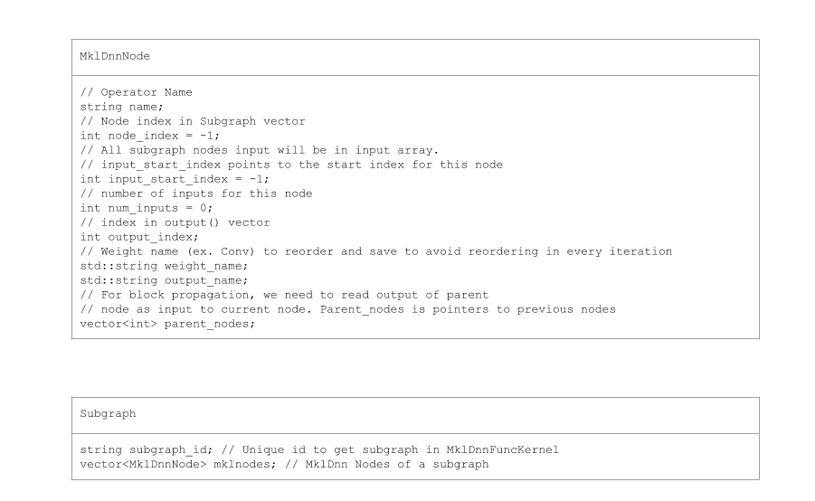
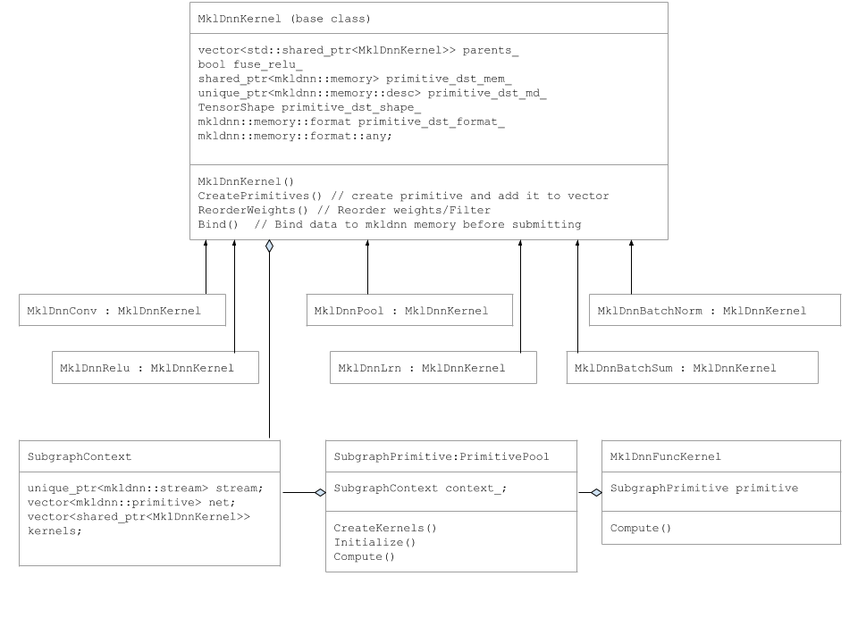

# Subgraph Optimization

DNNL uses blocked layout (example: nhwc with channels blocked by 16 – nChw16c) to take advantage of vector operations using AVX512.  To get best performance, we avoid reorders (example. Nchw16c to nchw) and propagate blocked layout to next primitive. 

Subgraph optimization achieves this in the following steps.
1.	Parses ONNX Runtime graph and creates an Internal Representation of subgraph..
2.	Subgraph Operator (DnnlFunKernel) iterates through DNNL nodes and creates a vector DNNL Kernels
3.	Compute Function of DnnlFunKernel iterates and binds data to DNNL primitives in the vector and submits vector for execution.


## Subgraph (IR) Internal Representation
DnnlExecutionProvicer::GetCapability() parses ONNX model graph and creates IR (Internal Representation) of subgraphs of DNNL operators.
Each subgraph contains a vector DnnlNodes, inputs, outputs and attributes for all its DnnlNodes. There can be attributes of same name. So, we prefix attribute names with Node name and its index. 
Unique id for subgraph is set as an attribute. 

DnnlNode has an index to its inputs and outputs and pointer to its parent nodes. DnnlNode directly reads blocked memory from its parent to avoid data reordering.

<p align="left"></p>


## Subgraph Classes
Primitive like DnnlConv, DnnlPool, etc are derived from DnnlKernel base class.

The following UML diagram captures Subgraph classes.

<p align="left"></p>


## Subgraph Execution

DnnlExecutionProvicer::Compute() function creates DnnlFuncKernel and call it’s Compute Function.


DnnlFuncKernel::Compute function creates SubgraphPrimitve pool and add the object to a map.

SubgraphPrimitve constructor calls the following member functions
```
SubgraphPrimitve::CreatePrimitives()
    for (auto& mklnode : mklnodes) {
      if (mklnode.name == "Conv") {
        kernel.reset(new DnnlConv());
        kernels.push_back(kernel);
      } else if (mklnode.name == "BatchNormalization-Relu") {
        kernel.reset(new DnnlBatchNorm());
        context_.kernels.push_back(kernel);
      } else if (mklnode.name == "MaxPool") {
        kernel.reset(new DnnlPool());
        context_.kernels.push_back(kernel);
      } 
      .
      .
      .
```      
In CreatePrimitives method, we iterate DnnlNodes and creates DnnlKernel objects and add DNNL primitive to a vector. It also reads attributes. This is done only once, at first iteration.

``` 
SubgraphPrimitve::Compute()
   for (auto& kernel : kernels) {
      kernel->Bind(input_tensors, output_tensors);
    }
    stream->submit(net);
```

In SubgraphPrimitve::Compute() method, we iterate thru Dnnl Kernels and bind input data. Then we submit the vector of Primitives to DNNL stream.

