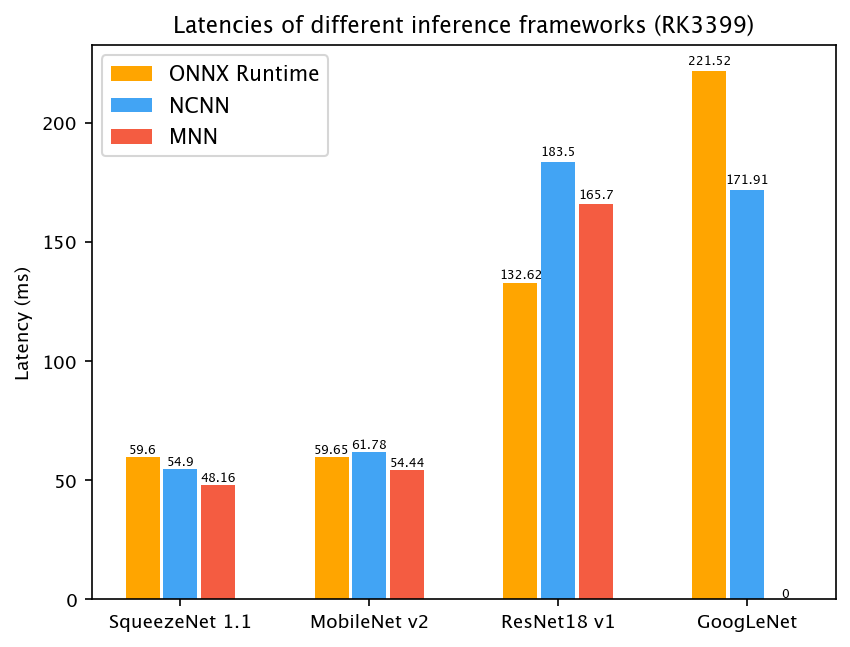
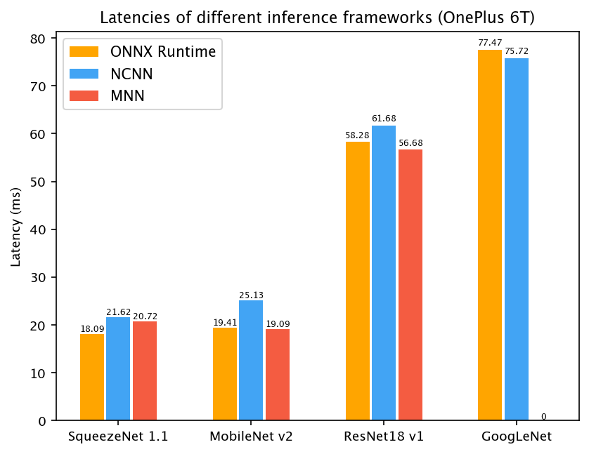
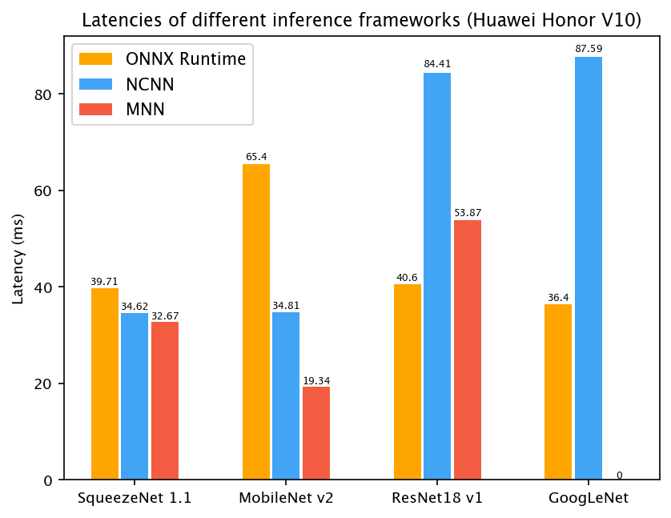

# NNAPI Execution Provider

[Android Neural Networks API (NNAPI)](https://developer.android.com/ndk/guides/neuralnetworks) is a unified interface to CPU, GPU, and NN accelerators on Android. It is supported by onnxruntime via [DNNLibrary](https://github.com/JDAI-CV/DNNLibrary).

## Minimum requirements

The NNAPI EP requires Android devices with Android 8.1 or higher.

## Build NNAPI EP

### Pre-Requisites

To build onnxruntime with NNAPI EP, install Android NDK first (see [BUILD.md](/BUILD.md#android))

### Build Instructions

The basic commands are following. There are also some other parameters for building the Android version. See [BUILD.md](/BUILD.md#android) for the details.

#### Cross compiling on Windows

```bash
./build.bat --android --android_ndk_path <android ndk path> --dnnlibrary
```

#### Cross compiling on Linux

```bash
./build.sh --android --android_ndk_path <android ndk path> --dnnlibrary
```

## Using NNAPI EP in C/C++

To use NNAPI EP for inferencing, please register it as below.
```
InferenceSession session_object{so};
session_object.RegisterExecutionProvider(std::make_unique<::onnxruntime::NnapiExecutionProvider>());
status = session_object.Load(model_file_name);
```
The C API details are [here](../C_API.md#c-api).

## Performance






