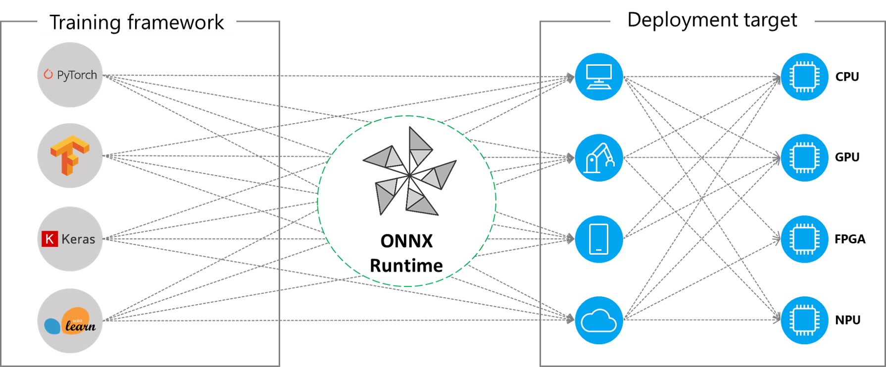
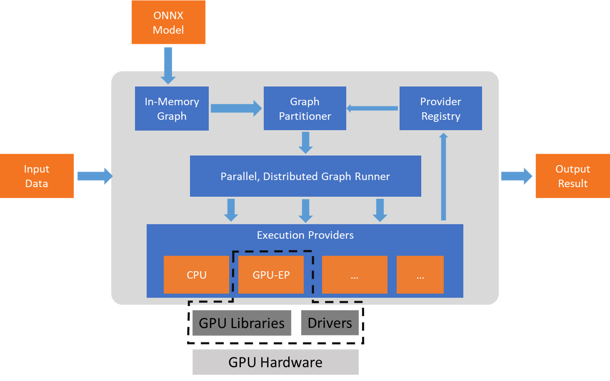

# Introduction

ONNX Runtime is capable of working with different HW acceleration libraries to execute the ONNX models on the hardware platform. ONNX Runtime supports an extensible framework, called **Execution Providers** (EP), to integrate with the HW specific libraries. This interface enables flexibility for the AP application developer to deploy their ONNX models in different environments in the cloud and the edge and optimize the execution by taking advantage of the compute capabilities of the platform.

<p align="center"></p>

ONNX Runtime works with the execution provider(s) using the `GetCapability()` interface to allocate specific nodes or sub-graphs for execution by the EP library in supported hardware. The EP libraries that are preinstalled in the execution environment processes and executes the ONNX sub-graph on the hardware. This architecture abstracts out the details of the hardware specific libraries that are essential to optimizing the execution of deep neural networks across hardware platforms like CPU, GPU, FPGA or specialized NPUs.

<p align="center"></p>

ONNX Runtime supports many different execution providers today. Some of the EPs are in GA and used in live service. Many are in released in preview to enable developers to develop and customize their application using the different options.

### Adding an Execution Provider

Developers of specialized HW acceleration solutions can integrate with ONNX Runtime to execute ONNX models on their stack. To create an EP to interface with ONNX Runtime you must first identify a unique name for the EP. Follow the steps outlined [here](../AddingExecutionProvider.md) to integrate your code in the repo.

### Building ONNX Runtime package with EPs

The ONNX Runtime package can be built with any combination of the EPs along with the default CPU execution provider. **Note** that if multiple EPs are combined into the same ONNX Runtime package then all the dependent libraries must be present in the execution environment. The steps for producing the ONNX Runtime package with different EPs is documented [here](../../BUILD.md#execution-providers).

### APIs for Execution Provider

The same ONNX Runtime API is used across all EPs. This provides the consistent interface for applications to run with different HW acceleration platforms. The APIs to set EP options are available across Python, C/C++/C#, Java and node.js. **Note** we are updating our API support to get parity across all language binding and will update specifics here.

    `get_providers`: Return list of registered execution providers.
    `get_provider_options`: Return the registered execution providers' configurations.
    `set_providers`: Register the given list of execution providers. The underlying session is re-created. 
        The list of providers is ordered by Priority. For example ['CUDAExecutionProvider', 'CPUExecutionProvider']
        means execute a node using CUDAExecutionProvider if capable, otherwise execute using CPUExecutionProvider.

### Using Execution Providers

``` python
import onnxruntime as rt

#define the priority order for the execution providers
# prefer CUDA Execution Provider over CPU Execution Provider
EP_list = ['CUDAExecutionProvider', 'CPUExecutionProvider']

# initialize the model.onnx
sess = rt.InferenceSession("model.onnx", providers=EP_list)

# get the outputs metadata as a list of :class:`onnxruntime.NodeArg`
output_name = sess.get_outputs()[0].name

# get the inputs metadata as a list of :class:`onnxruntime.NodeArg`
input_name = sess.get_inputs()[0].name

# inference run using image_data as the input to the model 
detections = sess.run([output_name], {input_name: image_data})[0]

print("Output shape:", detections.shape)

# Process the image to mark the inference points 
image = post.image_postprocess(original_image, input_size, detections)
image = Image.fromarray(image)
image.save("kite-with-objects.jpg")

# Update EP priority to only CPUExecutionProvider
sess.set_providers('CPUExecutionProvider')

cpu_detection = sess.run(...)

```
