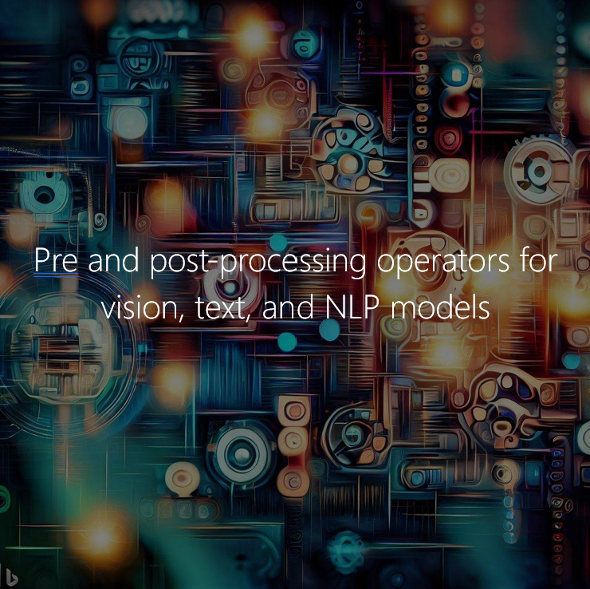

# ONNXRuntime-Extensions

[](https://dev.azure.com/onnxruntime/onnxruntime/_build/latest?definitionId=209&branchName=main)

ONNXRuntime-Extensions is a library that extends the capability of the ONNX models and inference with ONNX Runtime, via the ONNX Runtime custom operator interface. It includes a set of Custom Operators to support common model pre and post-processing for audio, vision, text, and language models. As with ONNX Runtime, Extensions also supports multiple languages and platforms (Python on Windows/Linux/macOS, Android and iOS mobile platforms and Web assembly for web).

The basic workflow is to add the custom operators to an ONNX model and then to perform inference on the enhanced model with ONNX Runtime and ONNXRuntime-Extensions packages.


<sub>This image was created using <a href="https://github.com/sayanshaw24/combine" target="_blank">Combine.AI</a>, which is powered by Bing Chat, Bing Image Creator, and EdgeGPT.</sub>

## Quickstart

### **Python installation**

```bash
pip install onnxruntime-extensions
```

#### **Nightly Build**

##### on Windows

```cmd
pip install --index-url https://aiinfra.pkgs.visualstudio.com/PublicPackages/_packaging/ORT-Nightly/pypi/simple/ onnxruntime-extensions
```

The onnxruntime-extensions package depends on onnx and onnxruntime.

##### on Linux/MacOS

Please make sure the compiler toolkit like gcc(later than g++ 8.0) or clang are installed before the following command

```bash
python -m pip install git+https://github.com/microsoft/onnxruntime-extensions.git
```

### **NuGet installation (with .NET CLI)**

```bash
dotnet add package Microsoft.ML.OnnxRuntime.Extensions --version 0.8.1-alpha
```

### **iOS installation**

In your CocoaPods `Podfile`, add the `onnxruntime-extensions-c` pod.

  ```ruby
  use_frameworks!

  # onnxruntime C/C++ full package
  pod 'onnxruntime-c'

  # onnxruntime-extensions C/C++ package
  pod 'onnxruntime-extensions-c'
  ```

Run `pod install`.

### **Android installation**

In your Android Studio Project, make the following changes to:

1. build.gradle (Project):

   ```gradle
    repositories {
        mavenCentral()
    }
   ```

2. build.gradle (Module):

    ```gradle
    dependencies {
        // onnxruntime full package
        implementation 'com.microsoft.onnxruntime:onnxruntime-android:latest.release'
        // onnxruntime-extensions package
        implementation 'com.microsoft.onnxruntime:onnxruntime-extensions-android:latest.release'
    }
    ```

## Add pre and post-processing to the model

There are multiple ways to add pre and post processing to an ONNX graph:

- [Use the pre-processing pipeline API if the model and its pre-processing is supported by the pipeline API](https://github.com/microsoft/onnxruntime-extensions/blob/main/onnxruntime_extensions/tools/pre_post_processing/pre_post_processor.py)
- [Export to ONNX from a PyTorch model](https://github.com/microsoft/onnxruntime-extensions/blob/main/tutorials/superresolution_e2e.py#L69)
- [Create an ONNX model with a model graph that includes your custom op node](https://github.com/microsoft/onnxruntime-extensions/blob/main/onnxruntime_extensions/_ortapi2.py#L50)
- [Compose the pre-processing with an ONNX model using ONNX APIs if you already have the pre processing in an ONNX graph](https://onnx.ai/onnx/api/compose.html)

If the pre processing operator is a HuggingFace tokenizer, you can also easily get the ONNX processing graph by converting from Huggingface transformer data processing classes such as in the following example:

```python
import onnxruntime as _ort
from transformers import AutoTokenizer, GPT2Tokenizer
from onnxruntime_extensions import OrtPyFunction, gen_processing_models

# SentencePieceTokenizer
spm_hf_tokenizer = AutoTokenizer.from_pretrained("t5-base", model_max_length=512)
spm_onnx_model = OrtPyFunction(gen_processing_models(spm_hf_tokenizer, pre_kwargs={})[0])

# GPT2Tokenizer
gpt2_hf_tokenizer = GPT2Tokenizer.from_pretrained("Xenova/gpt-4", use_fast=False)
gpt2_onnx_model = OrtPyFunction(gen_processing_models(gpt2_hf_tokenizer, pre_kwargs={})[0])
```

For more information, you can check the API using the following:

```python
help(onnxruntime_extensions.gen_processing_models)
```

### What if I cannot find the custom operator I am looking for?

Find the custom operators we currently support [here](https://github.com/microsoft/onnxruntime-extensions/tree/main/operators). If you do not find the custom operator you are looking for, you can add a new custom operator to ONNX Runtime Extensions like [this](./add-op.md). Note that if you do add a new operator, you will have to [build from source](./build.md).

## Inference with ONNX Runtime and Extensions

### Python

There are individual packages for the following languages, please install it for the build.

```python
import onnxruntime as _ort
from onnxruntime_extensions import get_library_path as _lib_path

so = _ort.SessionOptions()
so.register_custom_ops_library(_lib_path())

# Run the ONNXRuntime Session as per ONNXRuntime docs suggestions.
sess = _ort.InferenceSession(model, so)
sess.run (...)
```

### C++

Register Extensions with a path to the Extensions shared library.

```c++
Ort::Env env = ...;

// Note: use `wchar_t` instead of `char` for paths on Windows
const char* model_uri = "/path/to/the/model.onnx";
const char* custom_op_library_filename = "/path/to/the/onnxruntime-extensions/shared/library";

Ort::SessionOptions session_options;

// Register Extensions custom ops with the session options.
Ort::ThrowOnError(Ort::GetApi().RegisterCustomOpsLibrary_V2(static_cast<OrtSessionOptions*>(session_options),
                                                            custom_op_library_filename));

// Create a session.
Ort::Session session(env, model_uri, session_options);
```

Register Extensions by calling the `RegisterCustomOps` function directly.

```c++
Ort::Env env = ...;

// Note: use `wchar_t` instead of `char` for paths on Windows
const char* model_uri = "/path/to/the/model.onnx";

Ort::SessionOptions session_options;

// Register Extensions custom ops with the session options.
// `RegisterCustomOps` is declared in onnxruntime_extensions.h.
Ort::ThrowOnError(RegisterCustomOps(static_cast<OrtSessionOptions*>(session_options), OrtGetApiBase()));

// Create a session.
Ort::Session session(env, model_uri, session_options);
```

### Java

```java
var env = OrtEnvironment.getEnvironment();
var sess_opt = new OrtSession.SessionOptions();

/* Register the custom ops from onnxruntime-extensions */
sess_opt.registerCustomOpLibrary(OrtxPackage.getLibraryPath());
```

### C#

```java
SessionOptions options = new SessionOptions();
options.RegisterOrtExtensions();
session = new InferenceSession(model, options);
```

## Tutorials

Check out some end to end tutorials with our custom operators:

- NLP: [An end-to-end BERT tutorial](https://github.com/microsoft/onnxruntime-extensions/blob/main/tutorials/bert_e2e.py)
- Audio: [Using audio encoding and decoding for Whisper](https://github.com/microsoft/onnxruntime-extensions/blob/main/tutorials/whisper_e2e.py)
- Vision: [The YOLO model with our DrawBoundingBoxes operator](https://github.com/microsoft/onnxruntime-extensions/blob/main/tutorials/yolo_e2e.py)

## Contributing

This project welcomes contributions and suggestions.  Most contributions require you to agree to a
Contributor License Agreement (CLA) declaring that you have the right to, and actually do, grant us
the rights to use your contribution. For details, visit https://cla.microsoft.com.

When you submit a pull request, a CLA-bot will automatically determine whether you need to provide
a CLA and decorate the PR appropriately (e.g., label, comment). Simply follow the instructions
provided by the bot. You will only need to do this once across all repos using our CLA.

This project has adopted the [Microsoft Open Source Code of Conduct](https://opensource.microsoft.com/codeofconduct/).
For more information see the [Code of Conduct FAQ](https://opensource.microsoft.com/codeofconduct/faq/) or
contact [opencode@microsoft.com](mailto:opencode@microsoft.com) with any additional questions or comments.

## License

[MIT License](https://github.com/microsoft/onnxruntime-extensions/blob/main/LICENSE)
