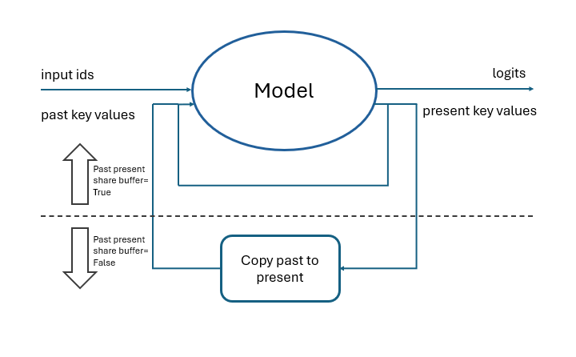

# How to configure the past present share buffer

The past present share buffer is an optimization that can be used to save memory and processing time.

When the share buffer is used, the past and present KV cache buffers point to the same memory block.

When buffer sharing is not used, the present KV cache buffers are re-allocated before every forward pass of the model and copied to the past KV cache buffers.

This is represented in the following diagram

The size of the KV cache is different depending on the value of the past present share buffer.

## Size of KV caches

### When past_present_share_buffer is true

Size of past KV caches = size of present KV caches (bytes)

$batch\_size * num\_key\_value\_heads * max\_length * head\_size
$

For example, for the [4-bit quantized Phi-4-mini-instruct](https://huggingface.co/microsoft/Phi-4-mini-instruct-onnx) model, with a batch size of 1 and a max length of 4k, the size of the cache is: $1 * 8 * 4096 * 128 = 4GB$

Note that the size of the cache is largely determined the value of the max_length parameter.

### When past_present_share_buffer is false

Size of past KV caches (bytes) = $batch\_size * num\_key\_value\_heads * past\_sequence\_length * head\_size$

Size of present KV caches (bytes) = $batch\_size *  num\_key\_value\_heads * (past\_sequence\_length + 1) *  head\_size$

For example, for the [4-bit quantized DeepSeek R1 Qwen 1.5B](https://huggingface.co/onnxruntime/DeepSeek-R1-Distill-ONNX) model, with a batch size of 1 and a past sequence length of 1k, the size of the past cache is: $1 * 2 * 1024 * 128 = 256M$ and the size of the present cache is: $1 * 2 * 1025 * 128 = 257M$

