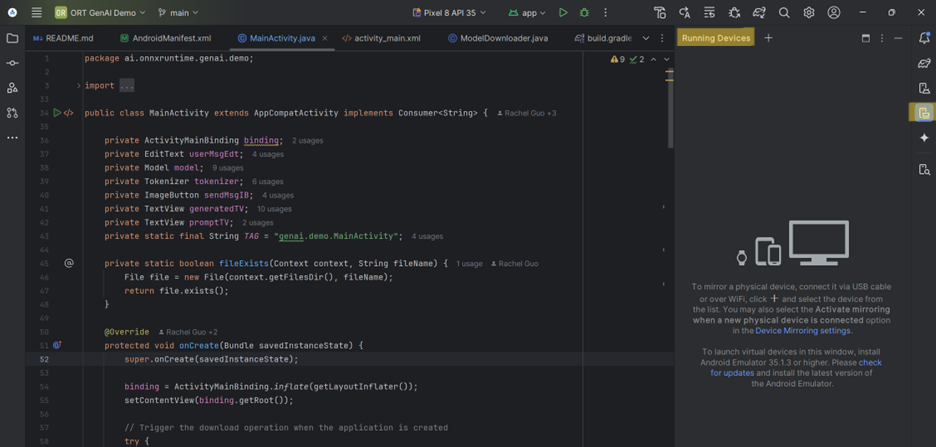

# Build an Android generative AI application
This is a [Phi-3](https://huggingface.co/microsoft/Phi-3-mini-4k-instruct) Android example application using [ONNX Runtime mobile](https://onnxruntime.ai/docs/tutorials/mobile/) and [ONNX Runtime Generate() API](https://github.com/microsoft/onnxruntime-genai) with support for efficiently running generative AI models. This tutorial will walk you through how to build and run the Phi-3 app on your own mobile device so you can get started incorporating Phi-3 into your own mobile developments.  

## Model Capabilities
[Phi-3 Mini-4k-Instruct](https://huggingface.co/microsoft/Phi-3-mini-4k-instruct) is a small language model that is used for language understanding, math, code, long context, logical reasoning, and more and showcases a robust and state-of-the-art performance among models with less than 13 billion parameters.

## Important Features

### Java API
This app uses the [generate() Java API](https://github.com/microsoft/onnxruntime-genai/tree/main/src/java/src/main/java/ai/onnxruntime/genai) GenAIException, Generator, GeneratorParams, Model, and TokenizerStream classes (see documentation [here](https://onnxruntime.ai/docs/genai/api/java.html)). The [generate() C API](https://onnxruntime.ai/docs/genai/api/c.html), [generate() C# API](https://onnxruntime.ai/docs/genai/api/csharp.html), and [generate() Python API](https://onnxruntime.ai/docs/genai/api/python.html) are also available.

### Model Download
This app downloads the [Phi-3-mini-4k-instruct](https://huggingface.co/microsoft/Phi-3-mini-4k-instruct) model from Hugging Face. To use a different model, such as the [Phi-3-mini-128k-instruct](https://huggingface.co/microsoft/Phi-3-mini-128k-instruct/tree/main), change the path links to refer to your chosen model. If using a model with imaging capabilities, use the [MultiModalProcessor class](https://github.com/microsoft/onnxruntime-genai/blob/main/src/java/src/main/java/ai/onnxruntime/genai/MultiModalProcessor.java) in place of the [Tokenizer class](https://github.com/microsoft/onnxruntime-genai/blob/main/src/java/src/main/java/ai/onnxruntime/genai/Tokenizer.java) and update the prompt template accordingly.

**NOTE:** The accuracy of outputs may depend upon when the model being used was trained (for example, Phi-3 was trained using data from 2021). As a result,  if you ask about current events, the output will be incorrect.

```java
final String baseUrl = "https://huggingface.co/microsoft/Phi-3-mini-4k-instruct-onnx/resolve/main/cpu_and_mobile/cpu-int4-rtn-block-32-acc-level-4/";
List<String> files = Arrays.asList(
    "added_tokens.json",
    "config.json",
    "configuration_phi3.py",
    "genai_config.json",
    "phi3-mini-4k-instruct-cpu-int4-rtn-block-32-acc-level-4.onnx",
    "phi3-mini-4k-instruct-cpu-int4-rtn-block-32-acc-level-4.onnx.data",
    "special_tokens_map.json",
    "tokenizer.json",
    "tokenizer.model",
    "tokenizer_config.json");
```
The model files will only need to be downloaded once. While editing your app and running new versions, the downloads will skip since all files already exist.
```java
if (urlFilePairs.isEmpty()) {
    // Display a message using Toast
    Toast.makeText(this, "All files already exist. Skipping download.", Toast.LENGTH_SHORT).show();
    Log.d(TAG, "All files already exist. Skipping download.");
    model = new Model(getFilesDir().getPath());
    tokenizer = model.createTokenizer();
    return;
}
```

### Status while model is downloading
Downloading the packages for the app on your mobile device takes ~10-15 minutes (depending on which device you are using). The progress bar indicates what percent of the downloads are completed. 
```java
public void onProgress(long lastBytesRead, long bytesRead, long bytesTotal) {
    long lastPctDone = 100 * lastBytesRead / bytesTotal;
    long pctDone = 100 * bytesRead / bytesTotal;
    if (pctDone > lastPctDone) {
        Log.d(TAG, "Downloading files: " + pctDone + "%");
        runOnUiThread(() -> {
            progressText.setText("Downloading: " + pctDone + "%");
        });
    }
}
```
Because the app is initialized when downloads start, the 'send' button for prompts is disabled until downloads are complete to prevent crashing.
```java
if (model == null) {
    // if the edit text is empty display a toast message.
    Toast.makeText(MainActivity.this, "Model not loaded yet, please wait...", Toast.LENGTH_SHORT).show();
    return;
}
```

### Prompt Template
On its own, this model's answers can be very long. To format the AI assistant's answers, you can adjust the prompt template. 
```java
String promptQuestion = userMsgEdt.getText().toString();
String promptQuestion_formatted = "<system>You are a helpful AI assistant. Answer in two paragraphs or less<|end|><|user|>"+promptQuestion+"<|end|>\n<assistant|>";
Log.i("GenAI: prompt question", promptQuestion_formatted);
```
You can also include limits such as a max_length or length_penalty to encourage the model to produce shorter responses. More information about each of these parameters can be found in the [Hugging Face Transformers documentation](https://huggingface.co/docs/transformers/main_classes/text_generation).
```java
generatorParams.setSearchOption("length_penalty", 1000);
generatorParams.setSearchOption("max_length", 500);
```
NOTE: Including a max_length will cut off the assistant's answer once reaching the maximum number of tokens rather than formatting a complete response.

## Run the App

### Download Android Studio
You will be using [Android Studio](https://developer.android.com/studio) to run the app.

### Download the application source code
Clone the [ONNX Runtime Inference Examples](https://github.com/microsoft/onnxruntime-inference-examples) repository.

### Enable Developer Mode on Mobile
On your Android Mobile device, go to "Settings > About Phone > Software information" and tap the "Build Number" tile repeatedly until you see the message “You are now in developer mode”. In "Developer Options", turn on Wireless or USB debugging.

### Open Project in Android Studio
Open the Phi-3 mobile app in Android Studio (file path: [onnxruntime-inference-examples/mobile/examples/phi-3/android/app](https://github.com/microsoft/onnxruntime-inference-examples/tree/main/mobile/examples/phi-3/android/app)).

### Connect Device
To run the app on a device, follow the instructions from the Running Devices tab on the right side panel. You can connect through Wi-Fi or USB.

You can easily pair new devices over Wi-Fi using a QR code:


### Manage Devices
You can manage/change devices and device model through the Device Manager tab on the right side panel.


### Downloading the App
Once your device is connected, run the app by using the play button on the top panel. Downloading all packages will take ~10-15 minutes. If you submit a prompt before downloads are complete, you will encounter an error message. Once completed, the logcat (the cat tab on the bottom left panel) will display an "All downloads complete" message.


### Ask questions
Now that the app is downloaded, you can start asking questions!


## Conclusion
In conclusion, the Phi-3 model's variants allow it to be easily applied to different Android devices. Now you can get started adding Phi-3 models into your own Android development! 


#### Learn more about Phi-3 with ONNX Runtime:
- [Introducing Phi-3](https://azure.microsoft.com/en-us/blog/introducing-phi-3-redefining-whats-possible-with-slms/)
- [Phi-3 with ONNX Runtime](https://huggingface.co/blog/Emma-N/enjoy-the-power-of-phi-3-with-onnx-runtime)
- [ONNX Runtime supports Phi-3 mini models](https://maanavd.github.io/onnxruntime/blogs/accelerating-phi-3)