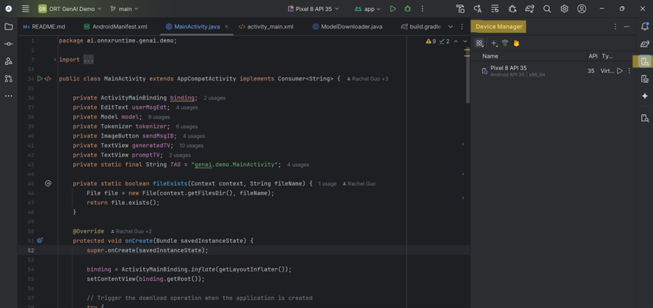

# Incorporate Phi-3 Vision Model for Android Development
This is a basic [Phi-3 Vision](https://huggingface.co/microsoft/Phi-3-vision-128k-instruct-onnx-cpu) Android example application using [ONNX Runtime mobile](https://onnxruntime.ai/docs/tutorials/mobile/) and [ONNX Runtime Generate() API](https://github.com/microsoft/onnxruntime-genai) with support for efficiently running generative AI models. This tutorial will walk you through how to download and run the Phi-3 Vision App on your own mobile device and help you incorporate Phi-3 Vision into your own mobile developments. 

## Capabilities
[Phi-3 Vision](https://huggingface.co/microsoft/Phi-3-vision-128k-instruct-onnx-cpu) is a multimodal model incorporating imaging into [Phi-3's](https://huggingface.co/microsoft/Phi-3-mini-4k-instruct) language input capabilities. This expands Phi-3's usages to include Optical Character Recognition (OCR), image captioning, table parsing, and more. 

## Important Features

### Java API
This app uses the [generate() Java API's](https://github.com/microsoft/onnxruntime-genai/tree/main/src/java/src/main/java/ai/onnxruntime/genai) GenAIException, Generator, GeneratorParams, Images, Model, MultiModalProcessor, NamedTensors, and TokenizerStream classes ([documentation](https://onnxruntime.ai/docs/genai/api/java.html)). The [generate() C API](https://onnxruntime.ai/docs/genai/api/c.html), [generate() C# API](https://onnxruntime.ai/docs/genai/api/csharp.html), and [generate() Python API](https://onnxruntime.ai/docs/genai/api/python.html) are also available.

### Model Downloads
This app downloads the [Phi-3 Vision](https://huggingface.co/microsoft/Phi-3-vision-128k-instruct-onnx-cpu) model through Hugging Face. To use a different model, change the path links to refer to your chosen model.
```java
final String baseUrl = "https://huggingface.co/microsoft/Phi-3-vision-128k-instruct-onnx-cpu/resolve/main/cpu-int4-rtn-block-32-acc-level-4/";
List<String> files = Arrays.asList(
    "genai_config.json",
    "phi-3-v-128k-instruct-text-embedding.onnx",
    "phi-3-v-128k-instruct-text-embedding.onnx.data",
    "phi-3-v-128k-instruct-text.onnx",
    "phi-3-v-128k-instruct-text.onnx.data",
    "phi-3-v-128k-instruct-vision.onnx",
    "phi-3-v-128k-instruct-vision.onnx.data",
    "processor_config.json",
    "special_tokens_map.json",
    "tokenizer.json",
    "tokenizer_config.json");
```
These packages will only need to be downloaded once. While editing your app and running new versions, the downloads will skip since all files already exist.
```java
if (urlFilePairs.isEmpty()) {
    // Display a message using Toast
    Toast.makeText(this, "All files already exist. Skipping download.", Toast.LENGTH_SHORT).show();
    Log.d(TAG, "All files already exist. Skipping download.");
    model = new Model(getFilesDir().getPath());
    multiModalProcessor = new MultiModalProcessor(model);
    return;
}
```
### Crash Prevention
Downloading the packages for the app on your mobile device takes ~15-30 minutes depending on which device you are using. The progress bar indicates what percent of the downloads are completed. 
```java
public void onProgress(long lastBytesRead, long bytesRead, long bytesTotal) {
    long lastPctDone = 100 * lastBytesRead / bytesTotal;
    long pctDone = 100 * bytesRead / bytesTotal;
    if (pctDone > lastPctDone) {}
        Log.d(TAG, "Downloading files: " + pctDone + "%");
        runOnUiThread(() -> {
            progressText.setText("Downloading: " + pctDone + "%");
        });
    }
}
```
Because the app is initialized when downloads start, the 'send' button for prompts is disabled until downloads are complete to prevent crashing.
```java
if (model == null) {
    // if the edit text is empty display a toast message.
    Toast.makeText(MainActivity.this, "Model not loaded yet, please wait...", Toast.LENGTH_SHORT).show();
    return;
}
```
### Multimodal Processor
Since we are using Phi-3 Vision, we refer to the [MultiModalProcessor Class]() to include imaging as well as text input. In an application with no imaging, you can use the [Tokenizer Class](https://github.com/microsoft/onnxruntime-genai/blob/main/src/java/src/main/java/ai/onnxruntime/genai/Tokenizer.java) instead.

### Prompt Template
On its own, this model's answers can be very long. To format the AI assistant's answers, you can adjust the prompt template. 
```java
String promptQuestion = "<|user|>\n";
if (inputImage != null) {
    promptQuestion += "<|image_1|>\n";
}
promptQuestion += userMsgEdt.getText().toString() + "<system>You are a helpful AI assistant. Answer in two paragraphs or less<|end|>\n<|assistant|>\n";
final String promptQuestion_formatted = promptQuestion;

Log.i("GenAI: prompt question", promptQuestion_formatted);
```
You can also include [parameters](https://huggingface.co/microsoft/Phi-3-vision-128k-instruct-onnx-cpu/blob/main/cpu-int4-rtn-block-32-acc-level-4/genai_config.json) such as a max_length or length_penalty to your liking. 
```java
generatorParams.setSearchOption("length_penalty", 1000);
generatorParams.setSearchOption("max_length", 500);
```
NOTE: Including a max_length will cut off the assistant's answer once reaching the maximum number of tokens rather than formatting a complete response.

## Run the App
### Build the generate() API
NOTE: **SKIP THIS STEP!** This project includes an .aar package, so does not need to be built. 

Follow the instructions on how to [Build the generate() API from source](https://onnxruntime.ai/docs/genai/howto/build-from-source.html) for the [java API](https://onnxruntime.ai/docs/genai/api/java.html).

### Download Android Studio
You will be using [Android Studio](https://developer.android.com/studio) to run the app.

### Download the App
Clone the [ONNX Runtime Inference Examples](https://github.com/microsoft/onnxruntime-inference-examples/tree/c29d8edd6d010a2649d69f84f54539f1062d776d) repository.

### Enable Developer Mode on Mobile
On your Android Mobile device, go to "Settings > About Phone > Software information" and tap the "Build Number" tile repeatedly until you see the message “You are now in developer mode”. In "Developer Options", turn on Wireless or USB debugging.

### Open Project in Android Studio
Open the Phi-3 mobile app in Android Studio (onnxruntime-inference-examples/mobile/examples/phi-3-vision/android/app).

### Connect Device
To run the app on a device, follow the instructions from the Running Devices tab on the right side panel. You can connect through Wi-Fi or USB.

#### Pair over Wi-Fi


### Manage Devices
You can manage/change devices and device model through the Device Manager tab on the right side panel.


### Downloading the App
Once your device is connected, run the app by using the play button on the top panel. Downloading all packages will take ~10-15 minutes. If you submit a prompt before downloads are complete, you will encounter an error message. Once completed, the logcat (the cat tab on the bottom left panel) will display an "All downloads complete" message.


### Ask questions
Now that the app is downloaded, you can start asking questions!


