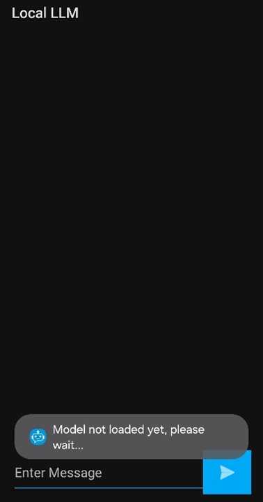

# Phi-3 App for Android
This is a basic [Phi-3](https://huggingface.co/microsoft/Phi-3-mini-4k-instruct) Android example application using [ONNX Runtime mobile](https://onnxruntime.ai/docs/tutorials/mobile/) and [ONNX Runtime Generate() API](https://github.com/microsoft/onnxruntime-genai) with support for efficiently running generative AI models. This tutorial will walk you through how to download and run the Phi-3 App on your own mobile device so you can get started incorporating Phi-3 into your own mobile developments. 
## Getting Started
### Build the generate() API
NOTE: **SKIP THIS STEP!** This project includes an .aar package, so does not need to be built. 

Follow the instructions on how to [Build the generate() API from source](https://onnxruntime.ai/docs/genai/howto/build-from-source.html) for the [java API](https://onnxruntime.ai/docs/genai/api/java.html).

### Download Anroid Studio
You will be using [Android Studio](https://developer.android.com/studio) to run the app.

### Download the App
Clone the [ONNX Runtime Inference Examples](https://github.com/microsoft/onnxruntime-inference-examples/tree/c29d8edd6d010a2649d69f84f54539f1062d776d) repository.

### Enable Developer Mode on Mobile
On your Android Mobile device, go to "Settings > About Phone > Software information" and tap the "Build Number" tile repeatedly until you see the message “You are now in developer mode”. In "Developer Options", turn on Wireless or USB debugging.

## Running the App

### Open Project in Android Studio
Open the Phi-3 mobile app in Android Studio (onnxruntime-inference-examples/mobile/examples/phi-3/android/app).

### Connect Device
To run the app on a device, follow the instructions from the Running Devices tab on the right side panel. You can connect through Wi-Fi or USB.

#### Pair over Wi-Fi

### Manage Devices
You can manage/change devices and device model through the Device Manager tab on the right side panel.

### Downloading the App
Once your device is connected, run the app by using the play button on the top panel. Downloading all packages will take ~10-15 minutes. If you submit a prompt before downloads are complete, you will encounter an error message. Once completed, the logcat (the cat tab on the bottom left panel) will display an "All downloads complete" message.

### Ask questions
Now that the app is downloaded, you can start asking questions!

