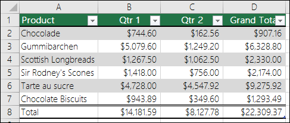

# Run the Phi-3 vision and Phi-3.5 vision models with the ONNX Runtime generate() API
{: .no_toc }

The Phi-3 vision and Phi-3.5 vision models are small, but powerful multi modal models that allow you to use both image and text to output text. They can be used in scenarios such as describing the content of images in detail.

The Phi-3 vision and Phi-3.5 vision models are supported by versions of onnxruntime-genai 0.5.1 and later.

You can download the models here:

* [https://huggingface.co/microsoft/Phi-3-vision-128k-instruct-onnx](https://huggingface.co/microsoft/Phi-3-vision-128k-instruct-onnx)
* [https://huggingface.co/microsoft/Phi-3.5-vision-instruct-onnx](https://huggingface.co/microsoft/Phi-3.5-vision-instruct-onnx)


* TOC placeholder
{:toc}

## Setup

1. Install the git large file system extension

   HuggingFace uses `git` for version control. To download the ONNX models you need `git lfs` to be installed, if you do not already have it.

   * Windows: `winget install -e --id GitHub.GitLFS` (If you don't have winget, download and run the `exe` from the [official source](https://docs.github.com/en/repositories/working-with-files/managing-large-files/installing-git-large-file-storage?platform=windows))
   * Linux: `apt-get install git-lfs`
   * MacOS: `brew install git-lfs`

   Then run `git lfs install`

2. Install the HuggingFace CLI

   ```bash
   pip install huggingface-hub[cli]
   ```

## Choose your platform
 
**Note: Only one package and model is required based on your hardware. That is, only execute the steps for one of the following sections**


## Run with DirectML

1. Download the model

   ```bash
   huggingface-cli download microsoft/Phi-3.5-vision-instruct-onnx --include gpu/gpu-int4-rtn-block-32/* --local-dir .
   ```

   This command downloads the model into a folder called `gpu/gpu-int4-rtn-block-32`.

2. Install the generate() API

   ```bash
   pip install onnxruntime-genai-directml
   ```

3. Run the model

   Run the model with [phi3v.py](https://github.com/microsoft/onnxruntime-genai/blob/main/examples/python/phi3v.py).

   ```bash
   curl https://raw.githubusercontent.com/microsoft/onnxruntime-genai/main/examples/python/phi3v.py -o phi3v.py
   pip install pyreadline3
   python phi3v.py -m gpu/gpu-int4-rtn-block-32 -p dml
   ```

   Enter the path to an image file and a prompt. The model uses the image and prompt to give you an answer.

   For example: `What does the sign say?`

   

   ```
   The sign says 'DO NOT ENTER'.
   ```

## Run with CUDA

1. Download the model

   ```bash
   huggingface-cli download microsoft/Phi-3.5-vision-instruct-onnx --include gpu/gpu-int4-rtn-block-32/* --local-dir .
   ```
   
   This command downloads the model into a folder called `gpu/gpu-int4-rtn-block-32`.

2. Setup your CUDA environment

   Install the [CUDA toolkit](https://developer.nvidia.com/cuda-toolkit-archive).

   Ensure that the `CUDA_PATH` environment variable is set to the location of your CUDA installation.


3. Install the generate() API

   * CUDA 11

   ```bash
   pip install onnxruntime-genai-cuda --index-url=https://aiinfra.pkgs.visualstudio.com/PublicPackages/_packaging/onnxruntime-cuda-11/pypi/simple/
   ```

   * CUDA 12

   ```bash
   pip install onnxruntime-genai-cuda
   ```

4. Run the model

   Run the model with [phi3v.py](https://github.com/microsoft/onnxruntime-genai/blob/main/examples/python/phi3v.py).

   ```bash
   curl https://raw.githubusercontent.com/microsoft/onnxruntime-genai/main/examples/python/phi3v.py -o phi3v.py
   pip install pyreadline3
   python phi3v.py -m gpu/gpu-int4-rtn-block-32 -p cuda
   ```

   Enter the path to an image file and a prompt, and the model uses the image and prompt to give you an answer.

   For example: `Describe the image`

   

   ```
   The image shows a cup of coffee with a latte art design on top. The coffee is a light brown color,
   and the art is white with a leaf-like pattern. The cup is white and has a handle on one side.</s>
   ```

## Run on CPU

1. Download the model

   ```bash
   huggingface-cli download microsoft/Phi-3.5-vision-instruct-onnx --include cpu_and_mobile/cpu-int4-rtn-block-32-acc-level-4/* --local-dir .
   ```

   This command downloads the model into a folder called `cpu_and_mobile/cpu-int4-rtn-block-32-acc-level-4`

2. Install the generate() API for CPU
   
   ```bash
   pip install onnxruntime-genai
   ```

3. Run the model

   Run the model with [phi3v.py](https://github.com/microsoft/onnxruntime-genai/blob/main/examples/python/phi3v.py).

   ```bash
   curl https://raw.githubusercontent.com/microsoft/onnxruntime-genai/main/examples/python/phi3v.py -o phi3v.py
   pip install pyreadline3
   python phi3v.py -m cpu_and_mobile/cpu-int4-rtn-block-32-acc-level-4 -p cpu
   ```

   Enter the path to an image file and a prompt, and the model uses the image and prompt to give you an answer.

   For example: `Convert this image to markdown format`

   

   ```
   | Product             | Qtr 1      | Qtr 2      | Grand Total |
   |---------------------|------------|------------|-------------|
   | Chocolade           | $744.60    | $162.56    | $907.16     |
   | Gummibarchen        | $5,079.60  | $1,249.20  | $6,328.80   |
   | Scottish Longbreads | $1,267.50  | $1,062.50  | $2,330.00   |
   | Sir Rodney's Scones | $1,418.00  | $756.00    | $2,174.00   |
   | Tarte au sucre      | $4,728.00  | $4,547.92  | $9,275.92   |
   | Chocolate Biscuits  | $943.89    | $349.60    | $1,293.49   |
   | Total               | $14,181.59 | $8,127.78  | $22,309.37  |

   The table lists various products along with their sales figures for Qtr 1, Qtr 2, and the Grand Total.
   The products include Chocolade, Gummibarchen, Scottish Longbreads, Sir Rodney's Scones, Tarte au sucre,
   and Chocolate Biscuits. The Grand Total column sums up the sales for each product across the two quarters.</s>
   ```
