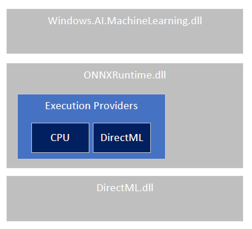

# Get started with ONNX Runtime for Windows 
{: .no_toc }

**WinML is the recommended Windows development path for ONNX Runtime.** The ONNX Runtime NuGet package provides the ability to use the full [WinML API](https://docs.microsoft.com/en-us/windows/ai/windows-ml/api-reference).
This allows scenarios such as passing a [Windows.Media.VideoFrame](https://docs.microsoft.com/en-us/uwp/api/Windows.Media.VideoFrame) from your connected camera directly into the runtime for realtime inference.

WinML offers several advantages for Windows developers:
- **Same ONNX Runtime APIs**: WinML uses the same ONNX Runtime APIs you're already familiar with
- **Dynamic execution provider selection**: Automatically selects the best execution provider (EP) based on your hardware
- **Simplified deployment**: Reduces complexity for Windows developers by handling hardware optimization automatically

The WinML API is a WinRT API that shipped inside the Windows OS starting with build 1809 (RS5) in the Windows.AI.MachineLearning namespace. It embedded a version of the ONNX Runtime.

In addition to using the in-box version of WinML, WinML can also be installed as an application re-distributable package. For legacy scenarios or specific DirectML requirements, see the [DirectML Execution Provider](../execution-providers/DirectML-ExecutionProvider) documentation (note: DirectML is deprecated).

## Contents
{: .no_toc }

* TOC placeholder
{:toc}

## Windows OS integration

ONNX Runtime is available in Windows 10 versions >= 1809 and all versions of Windows 11. It is embedded inside Windows.AI.MachineLearning.dll and exposed via the WinRT API (WinML for short). It includes the CPU execution provider and the [DirectML execution provider](../execution-providers/DirectML-ExecutionProvider) for GPU support (note: DirectML is deprecated - WinML is the preferred approach).

The high level design looks like this:

### API choice
{: .no_toc }

You can choose to use either the WinRT API or the C API.

||WinRT|C API|
|--|--|--|
|Type system| Integration with Windows RT types| Platform neutral types|
|Language support| Language support via WinRT Projections| Language support via per language projections|
|Tensorization| Accepts VideoFrames and converts to tensors (support for CPU and GPU)| Accepts tensors|

### Using the NuGet WinRT API with other C-API distributions
{: .no_toc }

The WinRT API NuGet package is distributed with a specific version of ONNX Runtime, but apps can include their own version of ONNX Runtime (either a [released version](../install/#cccwinml-installs) or [a custom build](../build/)). You may wish to do this to use non-default execution providers.
To use your own version of ONNX Runtime, replace onnxruntime.dll with your desired version.

<a href="#">Back to top</a>

## Supported Versions
Windows 8.1+

<a href="#">Back to top</a>

## Builds

|Artifact|Description|Supported Platforms|
|---|---|---|
|[Microsoft.AI.MachineLearning](https://www.nuget.org/packages/Microsoft.AI.MachineLearning)|WinRT - CPU, GPU (DirectML)|Windows 8.1+|

## API Reference
[Windows.AI.MachineLearning](https://docs.microsoft.com/en-us/windows/ai/windows-ml/api-reference)

## Samples

Any code already written for the Windows.AI.MachineLearning API can be easily modified to run against the Microsoft.ML.OnnxRuntime package. All types originally referenced by inbox customers via the Windows namespace will need to be updated to now use the Microsoft namespace.

* [Samples in Github](https://github.com/microsoft/Windows-Machine-Learning/tree/master/Samples/SqueezeNetObjectDetection/Desktop/cpp)

## Should I use the in-box vs NuGet WinML version?

For a comparison, see [Windows Machine Learning: In-box vs NuGet WinML solutions](https://docs.microsoft.com/en-us/windows/ai/windows-ml/#in-box-vs-nuget-winml-solutions).

To detect if a particular OS version of Windows has the WinML APIs, use the [IsApiContractPresent](https://docs.microsoft.com/en-us/uwp/api/windows.foundation.metadata.apiinformation.isapicontractpresent) method.  This can be called from either UWP or native apps.

If the OS does not have the runtime you need you can switch to use the redist binaries instead.

|Release|API contract version|
|--|--|
|Windows OS 1809| 1|
|Windows OS 1903| 2|
|Windows OS 1909| 2|
|ORT release 1.2| 3|
|ORT release 1.3| 3|
|ORT release 1.4| 3|

See [here](https://docs.microsoft.com/en-us/windows/ai/windows-ml/onnx-versions) for more about opsets and ONNX version details in Windows OS distributions.

## Additional Resources

For more information about Windows Machine Learning (WinML), see the [Windows ML Overview](https://learn.microsoft.com/en-us/windows/ai/new-windows-ml/overview).

<a href="#">Back to top</a>
