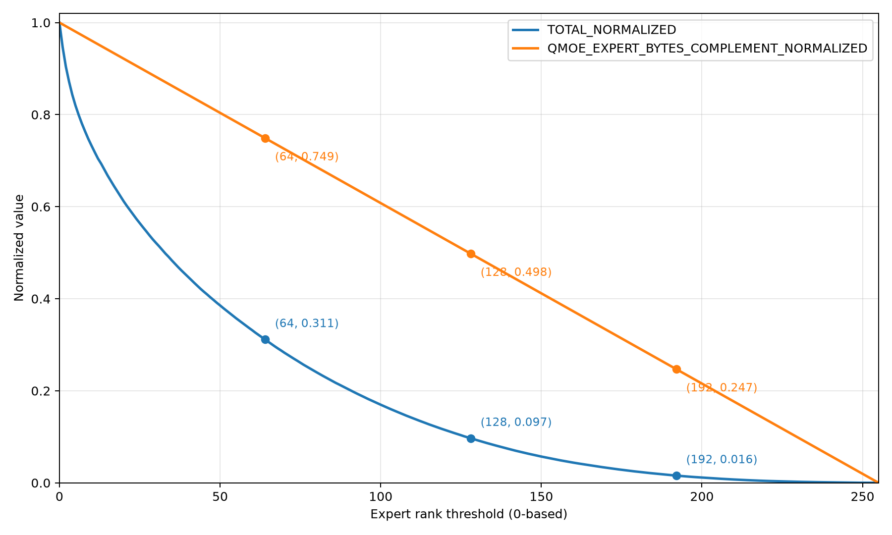
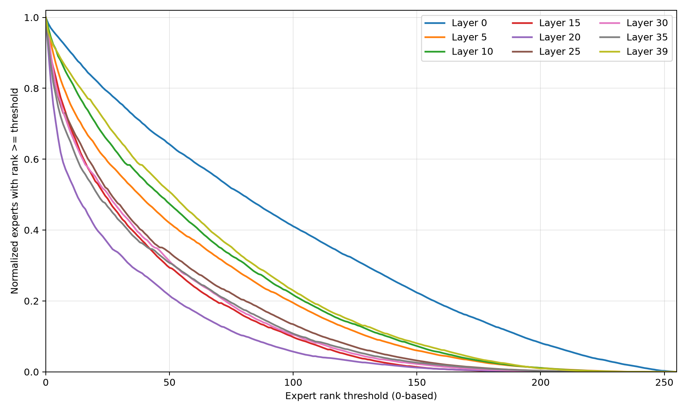

# Adaptive CUDA expert offloading for Qwen 3.6 MoE

**Status:** Implementation in progress

**Date:** 2026-09

## Objective

Implement adaptive expert placement for Qwen 3.6 and other Mixture-of-Experts (MoE) models whose expert weights do not
all fit in GPU memory.

Each expert is resident either on CPU or CUDA. The configured global offload target determines how many experts remain
on CPU, while the complementary set resides on CUDA. Each `MoE` and `QMoE` node maintains one exponentially decayed
counter per expert, uses those counters to rank experts, and updates its placement asynchronously.

The placement policy has two levels, both evaluated by the pilot after a complete model inference:

- Exchange hot CPU experts with cold CUDA experts when their counter differences exceed a configurable threshold.
- Redistribute the global CUDA expert budget across nodes while maximizing the number of nodes that can run entirely
  on CUDA.

Training, router changes, expert-weight quantization, and multiple CUDA devices are outside this implementation.

## Implemented foundations

- [#32261](https://github.com/microsoft/onnxruntime/pull/32261) added opt-in MoE/QMoE routing instrumentation,
  reproducible prompt and analysis tools, and the first routing measurements.
- [#32738](https://github.com/microsoft/onnxruntime/pull/32738) added the session-global expert state, CPU and CUDA
  expert-selection collection, and exponentially decayed counters. It does not implement placement, CPU offload,
  swaps, or redistribution.

## Exploratory routing analysis

An exploratory trace was collected from Qwen3.5-35B-A3B INT4 on CUDA using 10 prompts. It contains 59,880 valid routing
records from 40 QMoE layers, with 256 experts per layer and top-k 8. The frequency ranks below are zero-based and
learned from the complete trace. These preliminary results demonstrate the routing concentration but are not an
end-to-end offload performance measurement.

The first graph compares the fraction of routing decisions selecting an expert at or above a frequency-rank threshold
with the fraction of expert-weight bytes that can be offloaded at that threshold. Keeping only the 64 most frequent
experts of each layer on CUDA retains about 25.1% of expert bytes and covers about 68.9% of observed selections. Keeping
the first 128 experts retains about 50.2% of expert bytes and covers about 90.3% of selections. Keeping the first 192
retains about 75.3% of expert bytes and covers about 98.4% of selections. The curve therefore shows substantial routing
concentration, but it also shows that an aggressive memory reduction sends a meaningful fraction of expert work to CPU.

[](images/normalized-total-vs-expert-bytes.png)

The second graph compares the same rank-threshold distribution for representative early, middle, and late QMoE layers.
The shapes differ substantially: for example, layer 20 concentrates its selections among fewer experts, while layer 0
uses a broader portion of its expert set. A single fixed per-layer CUDA capacity is therefore unlikely to use the global
budget efficiently. This motivates per-node counters and the second implementation step's redistribution across nodes.

[](images/selected-layers-expert-ranks.png)

## Global offload configuration

The four numerical policy parameters are exposed as session configuration entries:

| Session option | Parameter | Meaning and valid range |
|---|---|---|
| `session.moe_cpu_offload_experts` | Offload target | Global integer expert count (`>= 1`) or proportion (`0 < value < 1`). |
| `session.moe_expert_counter_alpha` | `alpha` | Counter decay coefficient, finite and `>= 0`; default `0.9`. |
| `session.moe_expert_counter_beta` | `beta` | Increment for a used expert, finite and `>= 0`; default `0.1`. |
| `session.moe_expert_swap_epsilon` | `epsilon` | Relative swap margin, finite and `>= 0`. |

The optional `session.moe_expert_counter_state_file` path is configured separately from these four numerical parameters.

The offload target has the following meaning:

- An integer greater than or equal to `1` is the total number of experts to offload to CPU.
- A value strictly between `0` and `1` is the proportion of all experts to offload to CPU. The concrete expert count is
  `ceil(value * total_expert_count)`.
- Zero, negative values, non-integral values greater than `1`, non-finite values, and counts larger than the total
  number of experts are invalid.
- When the option is absent, expert offloading is disabled.

The global CUDA budget is:

```text
cuda_expert_count = total_expert_count - cpu_offload_expert_count
```

One CUDA slot contains all weights required to execute one expert. Moving an expert changes its residency: the expert
leaving CUDA is transferred to CPU before the replacement expert is transferred from CPU to CUDA.

## Expert counters

Each `MoE` and `QMoE` node owns one counter for each of its experts. After the node executes, every counter is updated
once:

```text
count_{t+1}(e) = alpha * count_t(e) + beta * (1 if expert e was used, otherwise 0)
```

The used term is binary for one invocation. Selecting the same expert for several rows still contributes `1`, not the
number of routed rows.

The policy exposes `alpha`, `beta`, and `epsilon` as validated non-negative parameters. The counter coefficients must
satisfy `alpha + beta <= 1`; zero is allowed for either coefficient. Counters are updated in place and remain bounded
by the larger of their initial value and `1`. Their defaults and constraints are covered by option-parsing tests.

Expert identity is `(graph_scope, node_index, node_type, expert_id)`. Ranking is by descending counter. Ties are resolved
by `expert_id`, then graph scope and node index, so placement is deterministic.

## Initial counter state

An optional session setting names a UTF-8 text file containing initial counter values:

```text
session.moe_expert_counter_state_file=<path>
```

The file starts with a format-version line and contains one line per
`(graph_scope, node_index, node_type, expert_id, counter_value)` record. Loading validates:

- the format version;
- graph scope, node identity, and operator type;
- expert index bounds;
- uniqueness of every expert record;
- finite, non-negative counter values.

Experts omitted from the file start at zero. When the setting is absent, all counters start at zero.

The first offload implementation does not use counters to choose its initial placement. It visits participating
`MoE` and `QMoE` kernels in graph order and fills the global CUDA expert budget from the first kernels. If the budget
ends within one kernel, the lowest expert IDs of that boundary kernel remain on CUDA. All remaining experts, including
those of the last kernels, execute on CPU. This placement remains fixed for the lifetime of the session and separates
hybrid CPU/CUDA inference correctness from the adaptive policy. Counter-based placement changes are added only in the
second implementation step.

## Per-node placement update

One invocation uses an immutable expert-to-device mapping:

- CUDA-resident experts execute on CUDA.
- CPU-resident experts execute on CPU.
- Counter updates do not change the mapping used by the current invocation.

After execution and counter updates, a node with experts on both CPU and CUDA computes:

```text
cpu_max = maximum counter among CPU experts
cuda_min = minimum counter among CUDA experts
```

The node exchanges the corresponding experts only when:

```text
cpu_max > (1 + epsilon) * cuda_min
```

Counter ties use expert ID order. The pilot evaluates placement only after the complete model inference and selects at
most one exchange per node for that boundary. Exchanges are fully asynchronous with respect to the next inference.

Each exchange uses a pinned host staging buffer and an extra CUDA staging slot so the published mapping remains usable
until the complete exchange is ready:

1. Record completion of all CUDA work that references the expert selected for CPU residency.
2. Copy that CUDA expert to the pinned staging buffer, then commit it to its CPU allocation.
3. Only after the device-to-host transfer completes, stage the selected CPU expert in pinned memory and copy it to the
   extra CUDA slot.
4. Record a transfer-completion event.
5. Publish the new mapping atomically only after both directions have completed.

The CPU-bound transfer must always complete before the CPU-to-CUDA transfer starts. An exchange never overwrites the
currently published CUDA slot. If the next inference reaches the same `MoE` or `QMoE` before the exchange completes,
the kernel uses the pre-exchange mapping and does not wait. A later invocation observes the new placement only after
the pilot has published the completed exchange.

```text
inference t
    -> every MoE/QMoE executes with immutable placement P
    -> counters are updated
    -> after Run() completes, the pilot selects and enqueues exchanges

inference t+1, node L
    -> if L's exchange is incomplete, execute with placement P without waiting
    -> if L's exchange is complete, publish and execute with placement P+1
```

CUDA devices expose their copy-engine count, but that value does not provide a portable expert-level concurrency
guarantee. The initial implementation therefore permits at most two in-flight expert exchanges per CUDA device. Two
independent pinned buffers and two extra CUDA staging slots allow one device-to-host transfer and one host-to-device
transfer from different exchanges to overlap on hardware with bidirectional copy engines. Hardware with one copy
engine serializes the transfers without changing correctness. Additional exchanges remain queued for a later
completion or inference boundary. For the measured Qwen model, where one QMoE expert occupies 1,775,616 bytes, this
limit requires about 3.4 MiB of pinned staging memory and 3.4 MiB of temporary CUDA storage.

## End-of-inference redistribution

After each complete model inference, the pilot first publishes completed exchanges, then recomputes how many CUDA
experts belong to each `MoE` and `QMoE` node while preserving the global CUDA budget.

The allocation objective is lexicographic:

1. Maximize the number of nodes whose complete expert set is CUDA-resident.
2. Among allocations with the same number of complete CUDA nodes, maximize the sum of counters retained on CUDA.
3. Break remaining ties by node index and expert ID.

Within each node, keep the experts with the highest counters. Redistribution may transfer slot ownership between
nodes, whereas a per-node exchange changes the expert stored in a slot without changing that node's slot count.

Redistribution never drains or waits for pending exchanges. It schedules up to the available two-exchange concurrency
limit and leaves additional non-conflicting exchanges queued. A node with an incomplete exchange continues using its
published pre-exchange placement. Slot metadata changes only after both transfer directions complete.

## Operator integration

The implementation extends `com.microsoft::MoE` and `com.microsoft::QMoE` without changing the exported ONNX model
contract.

The graph node remains assigned to the CUDA execution provider. Its CUDA kernel:

- owns or accesses the runtime expert cache;
- dispatches resident experts to CUDA;
- invokes shared CPU expert-compute helpers for CPU-resident experts;
- submits counter updates and, once adaptive swaps are enabled, placement changes to the cache manager.

The implementation must verify that initializer prepacking and memory planning can materialize each expert only on its
assigned device. If the existing input-memory contract cannot support this without
regressing the regular CUDA path, an internal graph transformer may insert an experimental `MoEWithCPUOffload`
operator. That operator must reuse `MoE`/`QMoE` schema semantics and kernels and must not become part of the exported
model contract.

When `session.moe_cpu_offload_experts` is absent, CPU and CUDA `MoE`/`QMoE` behavior remains unchanged.

## State ownership and concurrency

The root `SessionState` owns a dedicated `KernelPilotMoeExpertState` shared with its subgraph session states. It contains:

- policy parameters;
- per-node expert counters;
- the global expert budget and per-node allocation targets.

CPU and CUDA kernels obtain their session-owned `KernelPilot` through `OpKernelContext::GetKernelPilot()`.
The generic pilot in `core/framework` carries no kernel-specific logic; `KernelPilotMoeExpertSelection`, defined in
`kernel_pilot_moe_expert_selection.h`, deduplicates selected expert IDs. CUDA-specific copies and events stay in a
provider-side adapter.
After successful kernel execution, the executor commits the collected usage through
`KernelPilotMoeExpertState::RecordUsage()`, which owns the
counter-update logic. These are internal C++ calls, not a public C API.
Expert identity includes graph scope as well as node and expert IDs, so nodes in different
subgraphs cannot collide. The state persists across `Run()` calls and is isolated from other sessions.

The CUDA cache manager owns device-specific resources and execution state:

- CUDA slots, two extra staging slots, and current immutable mappings;
- two reusable pinned host staging buffers;
- pending exchanges and redistribution transfers;
- CUDA completion events.

Initialization builds an immutable dictionary from `(OpKernel pointer, local expert ID)` to a global expert index.
Counters are ordinary values; their update path does not acquire a mutex. Counting and adaptive placement require
non-overlapping `Run()` calls on a session, enforced at run entry. Distinct kernels may update disjoint expert ranges,
but a kernel cannot execute twice simultaneously. Global snapshots are read between runs.
Each invocation captures a stable placement mapping, and a slot cannot be overwritten until all work using its
previous contents has completed.

Errors are explicit. Invalid configuration, invalid initial state, allocation failures, copy failures, and event
failures fail session initialization or execution rather than silently disabling offload or retaining stale placement.

## Pull request plan

The session-global expert state and counters are already implemented. The remaining implementation is split into two
steps so that hybrid inference is validated before placement starts changing at runtime. Each pull request includes
the tests and documentation for its own scope.

### Step 1: fixed kernel-order placement and hybrid inference

- Parse and validate the count-or-proportion offload target.
- Fill the global CUDA expert budget from the first `MoE` and `QMoE` kernels in graph order, splitting only the
  boundary kernel when the budget does not contain a whole number of kernels.
- Keep the remaining experts, including all experts of the last kernels, on CPU.
- Keep this initial placement immutable: this step has no swaps or end-of-inference redistribution.
- Materialize each expert only on its assigned device.
- Dispatch resident experts on CUDA and offloaded experts through the shared CPU expert-compute path.
- Combine CPU and CUDA expert results without changing the exported `MoE` or `QMoE` model contract.
- Preserve the existing CUDA implementation when offloading is disabled.
- Test CPU-only, CUDA-only, and mixed expert execution, the global offload count, numerical agreement, bounded memory,
  repeated inference with a fixed placement, and unchanged disabled-path behavior.

### Step 2: adaptive expert swaps

- Use the session-global counters and optional initial counter state to rank experts.
- Apply the strict `cpu_max > (1 + epsilon) * cuda_min` rule and let the pilot schedule exchanges after inference.
- Move the CUDA expert to CPU before moving its replacement to CUDA.
- Manage CUDA slots, two staging slots, two pinned buffers, transfer streams, completion events, immutable
  per-invocation mappings, and atomic publication of completed swaps.
- Permit at most two in-flight exchanges per CUDA device and queue the rest.
- Never wait for an incomplete exchange when a `MoE` starts; use the pre-exchange placement for that invocation.
- Redistribute the global CUDA expert budget after inference without draining pending exchanges, while maximizing the
  number of completely CUDA-resident nodes.
- Test the epsilon boundary, transfer ordering, two-exchange concurrency, queued exchanges, nonblocking use of the old
  mapping, asynchronous publication, global budget preservation, counter-based placement, and explicit transfer
  failures.

After these two implementation steps, the remaining work is end-to-end measurement. Run reproducible CPU-only,
CUDA-only, and hybrid evaluations with identical models, prompts, and generation settings; sweep offload targets and
policy parameters; and record the metrics listed below. Commit the evaluation scripts, aggregate results, and documented
commands while keeping oversized raw traces outside the repository.

## Performance evaluation

Measure:

- token throughput;
- peak CUDA memory;
- peak CPU memory.
