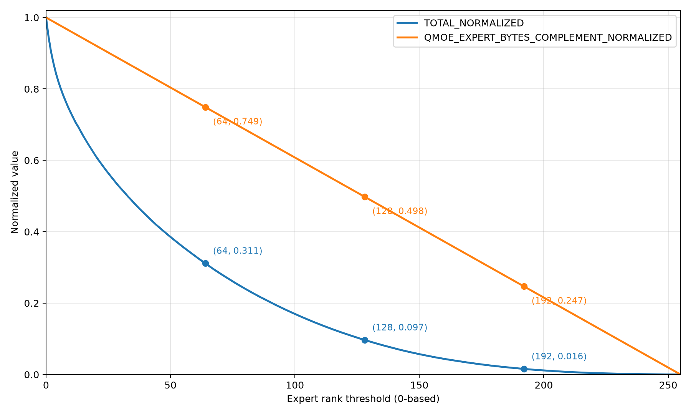
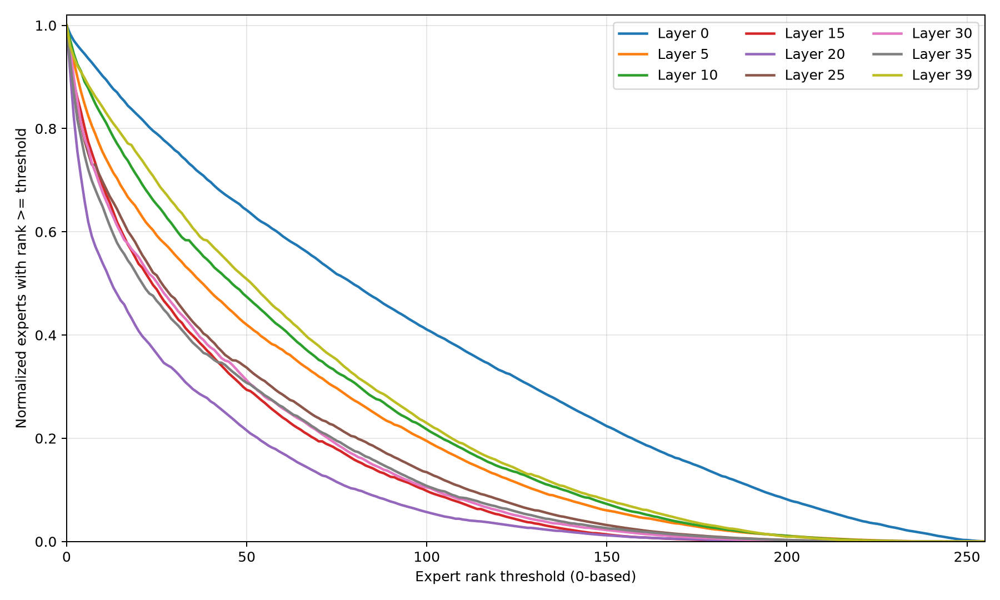

# Adaptive CUDA expert offloading for Qwen 3.6 MoE

**Status:** Discussion  
**Date:** 2026-08

## Objective

Determine which expert-placement strategy is worth implementing for Qwen 3.6 and other Mixture-of-Experts (MoE) models before implementing a CUDA cache. The first deliverable is an expert-routing logger, followed by measured traces and an offline cache simulator. Only the strategy selected from those simulations will be implemented in the CUDA operator.

The eventual operator must execute models whose expert weights do not all fit in GPU memory. CPU memory keeps the canonical copy of every expert. A bounded number of experts are also cached on CUDA without removing their CPU copy, so an evicted expert remains immediately available to the CPU path.

The initial adaptive policy counts how often each expert is selected. During each autoregressive inference step, experts used by the router have their counters incremented as soon as the routing decision is available. Experts with the largest counters become candidates for CUDA residency. The current MoE invocation first completes using the immutable placement snapshot: CUDA-resident experts run on CUDA and every other expert runs from its permanent CPU weights. Only after that MoE invocation completes are newly selected expert weights copied asynchronously from CPU to CUDA. The transfer overlaps subsequent model computation and should finish before the same layer processes the next token.

This approach is close to the activation-aware caching explored by [MoE-Infinity](https://arxiv.org/abs/2401.14361). The goal here is to test the cheapest useful model-agnostic policy: integer counters, bounded ranking, and asynchronous copies triggered by observed routing. It requires no predictor training, model-specific calibration, historical request database, or prior knowledge of important experts.

## Scope

The initial work targets the Qwen 3.6 MoE graph and its top-k routing pattern. Expert identity is the pair `(layer_id, expert_id)` because experts from different layers do not share weights or statistics.

The investigation proceeds in this order:

- Add opt-in logging of complete expert-selection sequences.
- Collect reproducible routing traces before implementing a cache.
- Build an offline simulator for static and cumulative adaptive placement.
- Sweep the number of experts allowed on CUDA.
- Review the literature and evaluate better policies against the traces.
- Implement the selected strategy, including the fused CUDA MoE operator, persistent CPU weights, fixed-capacity CUDA slots, and CPU fallback.

Training, router-logit changes, and expert-weight quantization are outside the initial implementation. The operator must preserve model output within the tolerance of the existing CPU or ONNX Runtime implementation.

## Memory and execution model

Each expert has one permanent CPU allocation. The CUDA cache owns `gpu_expert_capacity` slots, where one slot stores all weights required to execute one expert. CPU weights are never moved or released when an expert is copied to a slot.

Ultimately, `gpu_expert_capacity` should be derived from the CUDA memory budget, the memory already used by the model and runtime, and the size of one expert slot. The required reliable available-memory information is not currently exposed at the point where the cache is configured. Automatic sizing is therefore deferred.

For the initial implementation, capacity is fixed with the following session configuration entry:

```text
session.moe_cuda_expert_capacity=<non-negative integer>
```

When the option is absent, expert offloading is disabled and the existing CPU or CUDA `MoE`/`QMoE` implementation remains unchanged. Setting it to `0` explicitly enables hybrid mode with no CUDA-resident experts, which exercises CPU fallback. A positive value creates exactly that many CUDA slots. Values larger than the model's total expert count are rejected. The selected value is recorded in every trace and result. Benchmarks set it explicitly for each capacity sweep; the runtime must not silently infer or reduce it.

```text
CPU expert weights (canonical, always resident)
    expert 0 ---------------------------+
    expert 1 --------------+            |
    ...                    | copy       | copy
    expert N -------+      v            v
                    |  CUDA slot 0   CUDA slot 1  ...  CUDA slot C-1
                    +-> CPU fallback
```

The operator receives the fixed CUDA expert capacity from the session configuration, not from a placement policy. Cache policy, counters, and transfers belong to a runtime cache manager. The execution path receives an immutable snapshot of the current expert-to-slot mapping:

- A cache hit dispatches the token to the CUDA expert in its assigned slot.
- A cache miss executes the current token from the CPU weights.
- After the complete MoE invocation finishes, the policy compares the most frequent experts with the resident set.
- If the policy admits a non-resident expert, its permanent CPU weights are copied to a reserved slot on a dedicated transfer stream.
- A slot cannot be reused until all CUDA work referencing its previous expert has completed.

The cache manager must not block the current token merely to make an expert resident. It never moves or removes CPU weights: every expert remains executable on CPU before, during, and after CUDA residency. A host-to-device copy starts only after the current MoE invocation has finished. If the destination slot is still in use, the transfer stream waits for the previous expert's completion event before starting the copy.

An expert is `loading` while its copy is in flight. Before the next token reaches that MoE layer, the manager queries the transfer-completion event:

- If complete, publish the new mapping and use CUDA.
- If incomplete, keep the mapping unavailable and use CPU fallback without waiting.
- Publish the slot in the first subsequent mapping snapshot after completion.

The intended timeline is:

```text
token t, layer L router selects expert E
    -> increment count(L, E)
    -> compute the desired resident set without changing the current mapping
    -> execute the complete MoE using CUDA hits and CPU misses
    -> after the MoE completes, reserve a CUDA slot for E if required
    -> enqueue the CPU-to-CUDA weight copy asynchronously
    -> finish the remaining layers of token t
token t+1, before layer L
    -> publish E if the copy event is complete
    -> execute E on CUDA on a hit, otherwise use CPU without blocking
```

This gives the copy an overlap window from completion of layer `L`'s MoE for token `t` until layer `L` is reached for token `t + 1`. The simulator must use this shorter, implementable window rather than assuming that transfer starts at the routing decision. A synchronous transfer mode is retained only for correctness tests and transfer-cost calibration.

## Operator strategy

ONNX Runtime already provides `com.microsoft::MoE` and `com.microsoft::QMoE` kernels for both the CPU and CUDA execution providers. The initial implementation should extend these existing operators instead of adding a public operator whose contract is tied to two devices.

An ORT graph node is assigned to one execution provider; an operator is not jointly owned by the CPU and CUDA EPs. In hybrid mode, the node remains assigned to the CUDA EP. Its CUDA kernel owns the expert cache, keeps the canonical expert weights in CPU memory, launches cached experts on CUDA, and invokes shared CPU MoE computation for misses. CPU execution is therefore an internal fallback path, not a second EP assignment.

This approach preserves the existing operator schema and exported models:

- when `session.moe_cuda_expert_capacity` is absent, current CPU and CUDA behavior is unchanged;
- when the option is present, the CUDA kernel selects the hybrid implementation;
- CPU and CUDA implementations share routing validation and expert-compute helpers instead of duplicating numerical logic;
- placement policy and cache state remain runtime concerns rather than ONNX attributes.

PR 5 must first verify that initializer prepacking and ORT's memory planner can retain the canonical expert weights on CPU without also materializing every expert on CUDA. If that cannot be done without changing the existing kernel's input-memory contract or regressing its normal CUDA path, the fallback is an internal experimental `MoEWithCPUOffload` contrib operator inserted by an ORT graph transformer only when the session option is present. It must reuse the existing `MoE`/`QMoE` schema semantics and kernels and must not become the exported model contract unless the experiment proves that a separate operator is necessary.

## Placement strategies

### Cumulative adaptive placement

For each layer and expert, update the cumulative count as soon as routing completes:

```text
count_t(e) = count_{t-1}(e) + uses_t(e)
```

The manager admits the most frequently used experts until capacity is reached. Replacement occurs only when a non-resident expert has a strictly higher score than the least-used resident expert. `(layer_id, expert_id)` ordering breaks ties deterministically.

Admission is decided from the updated counters but does not affect the current MoE invocation. After that invocation completes, admission reserves a slot and enqueues the asynchronous copy. Residency changes only after the copy event completes, so kernels already in flight retain their immutable mapping snapshot. Counters and residency are session state; they can be reset before each benchmark repetition, exported with logs, and optionally initialized from a previous trace.

After measuring cumulative placement, evaluate:

- exponentially decayed frequency;
- sliding-window LFU;
- LRU or frequency-plus-recency scoring;
- separate budgets and counters per MoE layer;
- transition-aware prefetching based on recent expert sequences;
- prompt- or workload-conditioned placement.

### Hindsight-static baseline

The primary static baseline uses the same CUDA capacity, CPU fallback, kernels, tensor types, batch size, and transfer accounting as the adaptive strategy. It is computed *a posteriori* from the benchmark under evaluation:

1. Run the benchmark with expert-sequence logging enabled.
2. Aggregate all uses of every `(layer_id, expert_id)`.
3. Select the `gpu_expert_capacity` most frequently used experts, breaking ties deterministically.
4. Replay the trace with exactly those experts resident.
5. Keep the placement unchanged for the complete trace.

This gives static placement complete knowledge of the future trace and no in-run transfer cost, making it an intentionally strong, optimistic baseline. A cold static placement using the first experts in deterministic order may be reported as a sanity check, but it is not the decision baseline.

## Expert-sequence logging

Expert-statistics collection is disabled by default. It is enabled only when the following session configuration entry is set:

```text
session.enable_moe_expert_statistics=1
```

The default value is `0`. When it is `0`, the routing path must not allocate statistics buffers, collect expert identifiers, or add measurable synchronization overhead. The evaluation script exposes the same setting as `--enable-moe-expert-statistics`.

The implementation writes only MoE routing decisions through the normal ONNX Runtime logger at INFO severity. It does
not enable `profiling::Profiler`, retain a Chrome trace in memory, or record unrelated node and kernel events. Consumers
can redirect the logger output to a file and select lines beginning with `moe_routing `; the remainder of each such line
is a standalone JSON object.

Each current routing record contains `request_id`, `node_name`, `node_index`, `expert_ids`, `router_weights`, `num_rows`,
`top_k`, and `execution_device_id`. CUDA routing buffers are copied asynchronously and retained until the normal
end-of-run execution-provider synchronization, then serialized. Per-run record and routing-element limits bound pinned
host memory; a `moe_routing_truncated` warning reports any dropped decisions explicitly.

PR 2 adds a dedicated JSON Lines destination:

```text
session.moe_expert_statistics_file=<path>
```

When this entry is present together with `session.enable_moe_expert_statistics=1`, ORT writes only routing records to
the specified file. It does not redirect `stdout` or `stderr`, include unrelated ORT messages, or enable profiling.
The normal logger remains the backward-compatible destination when the file entry is absent. File-open and write
failures are reported as run errors rather than silently disabling trace collection.

A later output-prediction study extends these events with sampled MoE outputs. This extension remains behind `session.enable_moe_expert_statistics=1` and is disabled unless an explicit sampling configuration is provided. It records the source `(request_id, input_shapes, token_index, layer_id)`, output shape and type, and either the sampled output vector or a documented deterministic projection. It must not emit every full activation by default because that would make the JSON traces impractically large.

Each routing record contains:

| Field | Meaning |
|---|---|
| `run_id`, `request_id` | Reproducible benchmark and sequence identifiers. |
| `input_shapes` | Concrete model-input dimensions for detecting sequence growth and reset. |
| `input_token_hash` | Stable identifier for joining CPU and CUDA iterations with identical token inputs. |
| `token_index`, `layer_id` | Position of the routing decision in the generated sequence. |
| `expert_ids`, `router_weights` | Ordered top-k experts and their router weights. |
| `execution_device_id` | Device that executed the expert; `-1` denotes CPU and non-negative values denote CUDA device IDs. |
| `resident_experts` | Placement snapshot including `(layer_id, expert_id, cuda_device_id, slot_id)` tuples. |
| `cache_hit` | Whether each selected expert executed on CUDA. |
| `admitted`, `evicted` | Placement changes decided after the routing update. |
| `moe_completed_ns`, `copy_enqueued_ns`, `copy_ready_ns` | MoE completion, copy interval, and readiness before the next token. |
| `copy_source_device_id`, `copy_destination_device_id` | Transfer endpoints; CPU is identified by `-1`. |
| `copy_bytes`, `copy_duration_ns` | Host-to-device or future peer-to-peer traffic caused by cache changes. |
| `iteration_duration_us` | Complete `model_run` duration, including all non-MoE work. |
| `cpu_duration_ns`, `cuda_duration_ns` | MoE execution time split by device when the cache is implemented. |

Run metadata records the model revision, ONNX Runtime and `onnxruntime-genai` versions, CUDA version, GPU and CPU models, visible CUDA device IDs and topology, capacity, policy parameters, random seed, warm-up length, and benchmark configuration. Prompts and generated text are not logged by default; stable request identifiers are sufficient for joins when explicitly required.

## Evaluation scripts

`tools/python/qmoe_prompt_runner.py` submits a JSON list of prompts directly through the `onnxruntime-genai`
generation API. It does not import or invoke `locodellm`. Until the dedicated routing-file session option is
implemented, it redirects the native ORT `stderr` file descriptor to the requested routing log and emits explicit
`N/total` prompt boundaries. It writes generated text, token counts, durations, and throughput to a separate JSON file.

```bash
python tools/python/qmoe_prompt_runner.py /path/to/model --prompts-file prompts.json --provider cuda --max-new-tokens 256 --output qmoe-prompt-results.json --routing-log qmoe-routing.log
```

The prompt file is either a JSON array of strings or JSON Lines containing strings or objects with a `prompt` field.
Use `--prompt` repeatedly instead of `--prompts-file` for small manual runs. The runner applies the model tokenizer's
chat template by default; `--raw-prompts` disables that behavior.

`tools/python/qmoe_expert_distribution.py` validates and streams the routing records, computes prompt, layer, and global
expert distributions, ranks experts by frequency, maps every selected top-k expert to its zero-based frequency rank,
generates threshold aggregates, derives expert bytes from the ONNX external initializers, and writes the result plots.

```bash
python tools/python/qmoe_expert_distribution.py qmoe-routing.log --benchmark-json qmoe-prompt-results.json --model /path/to/model/model.onnx --output-prefix qmoe-routing-analysis
```

Both scripts keep the raw routing trace separate from aggregate CSV and PNG artifacts. PR 2 adds synthetic fixtures and
targeted tests for prompt boundaries, top-k extraction, rank ties, threshold totals, and ONNX expert-size calculation.

## First results

An exploratory trace was collected from Qwen3.5-35B-A3B INT4 on CUDA using 10 prompts. It contains 59,880 valid routing
records from 40 QMoE layers, with 256 experts per layer and top-k 8. General profiling was disabled. The frequency ranks
below are zero-based and learned from this complete 10-prompt trace; these preliminary results demonstrate the analysis
pipeline but are not sufficient to select a cache policy.

Five generated routing-analysis rows are shown below. The prefill record retains only the final token row so every event
contains exactly eight selected experts and eight corresponding frequency ranks.

| Prompt | Inference | QMoE | Selected expert IDs | Frequency ranks | Maximum rank |
|---:|---:|---|---|---|---:|
| 1 | 1 | `layers.0` | `[81,206,140,200,67,95,30,187]` | `[2,87,41,11,178,21,109,54]` | 178 |
| 1 | 1 | `layers.1` | `[94,224,128,233,112,33,11,172]` | `[15,2,16,23,4,1,8,3]` | 23 |
| 1 | 1 | `layers.2` | `[167,158,153,34,109,93,217,179]` | `[7,1,4,42,46,69,0,18]` | 69 |
| 1 | 1 | `layers.3` | `[6,214,196,69,233,117,230,225]` | `[20,73,6,0,68,22,33,32]` | 73 |
| 1 | 1 | `layers.4` | `[15,154,163,222,108,195,129,87]` | `[35,4,26,28,17,2,20,23]` | 35 |

The first figure compares observed routing coverage with the normalized bytes excluded by a frequency-ranked shortlist.
One expert occupies 1,775,616 bytes per QMoE layer, or 71,024,640 bytes across all 40 layers for one additional rank.



The second figure compares normalized rank-threshold curves for representative early, middle, and late QMoE layers.
Layer-specific differences motivate retaining per-layer statistics in the simulator.



## Benchmarks and simulation

Evaluate the model on a fixed set of 1,000 prompts using `onnxruntime-genai`. The evaluation driver must use the `onnxruntime-genai` generation API rather than a custom token-generation loop around `InferenceSession`. Run exactly the same prompts and generation limits once with CUDA and once with CPU. Pin and record the `onnxruntime-genai` revision, model configuration, provider configuration, tokenizer, sampling parameters, and random seed. The prompt set should contain long single-request generations and heterogeneous conversational or instruction prompts so the traces expose different routing-locality patterns.

For every prompt and execution provider, record:

- complete per-iteration `model_run` time and, where available, per-expert execution time;
- the concrete dimensions of every input for every iteration;
- the complete ordered sequence of selected `(layer_id, expert_id)` pairs;
- router weights and generated-token counts;
- all metadata required to reproduce and compare the CPU and CUDA runs.

Trace collection does not require an adaptive cache. Running the 1,000-prompt evaluation is the only activity in this plan that is not delivered through a pull request. The raw traces remain evaluation artifacts. All scripts used to process them, all aggregate results, and every update to this document are committed to the repository through pull requests.

The simulator replays every trace with hindsight-static and cumulative adaptive placement. It sweeps `gpu_expert_capacity` from zero to all experts, with dense sampling at small capacities and representative larger capacities. Both strategies receive the same trace, capacity, expert sizes, and measured transfer-cost model.

Report:

- expert-frequency distributions and complete routing sequences;
- simulated cache-hit rate per layer and overall;
- host-to-device bytes, transfer count, and copies completed before the next token;
- admissions, evictions, and CPU fallbacks;
- estimated latency and throughput from measured execution and transfer costs;
- the capacity required by each strategy to reach a target hit rate;
- sensitivity to copy and execution costs.

After implementation, add time to first token, inter-token latency, throughput, peak CPU and CUDA memory, and output agreement. Report kernel-only timing separately; it is not the decision metric.

## Sequence analysis

Analyze the traces before implementing a cache policy:

- expert-frequency concentration and capacity required for a target coverage;
- frequency drift across requests and generation phases;
- run lengths, reuse distance, and achievable LRU and LFU hit rates;
- per-layer differences in expert popularity;
- first- and higher-order transitions between selected experts;
- correlation between router weight and near-future reuse;
- an offline optimal cache trace as an upper bound.

Compare cumulative counts with request resets, sliding windows, and exponential decay. Select policy parameters on a trace prefix and evaluate them on held-out tokens and workloads.

### Mixing CPU and CUDA measurements

A checked-in script combines the CPU and CUDA measurements to estimate hybrid execution. For each expert decision, it applies the measured CPU cost to a simulated miss, the measured CUDA cost to a hit, and the measured host-to-device cost to an admission. It then compares the resulting estimated iteration time with the CPU-only and CUDA-only baselines.

CPU and CUDA may generate slightly different responses from the same prompt. Once a generated token differs, subsequent model inputs, routing decisions, and expert sequences may also differ, so records must not be joined only by prompt and iteration index.

The evaluation and mixing scripts therefore:

- record a stable hash of the complete token input for every iteration, without storing prompt text;
- join CPU and CUDA iterations only when `request_id`, input dimensions, and input-token hash all match;
- record the first divergent iteration for each prompt and stop paired comparisons after that point;
- report generated-token and expert-selection agreement before divergence;
- simulate the hybrid policy independently on the complete CPU and CUDA routing traces;
- report both simulation results rather than presenting one merged trace when expert choices differ.

For a directly paired CPU/CUDA cost comparison, the evaluation script also supports deterministic replay of one canonical generated-token sequence on both execution providers. Free-running generation remains the end-to-end correctness measurement; canonical replay isolates execution-provider timing from autoregressive output divergence.

A separate predictive analysis measures:

- `P(expert_n | expert_{n-1})` and mutual information between adjacent layers;
- prediction accuracy and copy lead time for inter-layer prefetching;
- the relation between experts in layer `n` and the top-1 token predicted from layer `n - 1`;
- the ability to predict the next selected expert from the current MoE output;
- the additional gain of token prediction over expert correlation alone.

The intermediate top-1 token requires an extra projection through final normalization and the language-model head. Log it only on sampled tokens or compute it offline, and exclude its cost from policy timing.

Output-based prediction treats two targets separately:

- the expert selected by the next MoE layer for the same token;
- the expert selected by the same MoE layer for the next token.

Train candidate predictors on a trace prefix and evaluate them on held-out requests. Report prediction accuracy, copy lead time, transfer waste from incorrect predictions, predictor runtime, and incremental gain over expert-transition statistics alone.

## Literature-informed candidates

No replacement policy dominates across all MoE models, workloads, capacities, and hardware. Published work does consistently indicate that routing contains exploitable structure and that transfer scheduling matters at least as much as replacement policy.

| Work | Implication for this plan |
|---|---|
| [Fast Inference of Mixture-of-Experts Language Models with Offloading](https://arxiv.org/abs/2312.17238) | Include recency as a baseline and measure consecutive-token locality. |
| [MoE-Infinity](https://arxiv.org/abs/2401.14361) | Compare the proposed cheap online counters with activation-aware historical trace matching and prefetching. |
| [Fiddler](https://arxiv.org/abs/2402.07033) | Model CPU execution as a credible non-blocking miss path, not every miss as a mandatory weight-transfer stall. |
| [SiDA-MoE](https://arxiv.org/abs/2310.18859) | Evaluate distinct workloads because expert popularity may be input-dependent. |
| [Pre-gated MoE](https://arxiv.org/abs/2308.12066) | Model when predictions become available and whether transfers finish before the target layer. |
| [ExFlow](https://arxiv.org/abs/2401.08383) | Preserve layer ordering and evaluate conditional transitions. |
| [ProMoE](https://arxiv.org/abs/2410.22134) | Consider chunked and cancellable copies; include predictor training and runtime costs. |
| [HOBBIT](https://arxiv.org/abs/2411.01433) | Evaluate multiple time scales; keep mixed-precision fallback outside the exact-weight experiment. |
| [Klotski](https://arxiv.org/abs/2502.06888) | Keep multi-request throughput results separate from single-request token latency. |
| [HybriMoE](https://arxiv.org/abs/2504.05897) | Consider impact-aware scoring based on miss cost and expected reuse. |
| [FreeToken](https://arxiv.org/abs/2608.16157) ([code](https://github.com/FlashML-org/FreeToken)) | Refines the same CPU/GPU expert split with a bandwidth-adaptive policy selecting how many experts run on CPU, global LRU expert caching, and runtime re-allocation of device memory between expert cache and KV cache; use it as a reference point for the cache-sizing and CPU-execution-versus-transfer trade-off. |

The minimum simulation set is hindsight static, cumulative LFU, LRU, decayed or windowed LFU, and an offline optimal bound. Inter-layer transition prediction and impact-aware scoring are the first advanced candidates. Refresh the literature review before implementation and distinguish preprints from peer-reviewed results.

## Correctness and concurrency

The cache manager owns all mutable state and exposes a mapping snapshot for one inference. Concurrent requests may share immutable CPU weights but must not mutate a session cache without synchronization. The initial implementation serializes placement updates; later parallel execution may use versioned snapshots and per-slot events.

Tests must cover:

- zero, partial, and full CUDA capacity;
- deterministic admission and eviction, including ties;
- repeated hits without additional copies;
- eviction without releasing or modifying CPU weights;
- CPU fallback while an asynchronous copy is in flight;
- no cache copy before the current MoE invocation completes;
- asynchronous copy enqueue immediately after MoE completion when an update reserves a slot;
- publication before the next token when the copy completes;
- non-blocking fallback when a copy misses the next-token deadline;
- safe slot reuse after CUDA completion;
- counter reset, export, and replay;
- complete logs and explicit buffer-overflow errors;
- numerical agreement for mixed CPU/CUDA expert execution.

## Pull request plan

Every persistent change is delivered through one of the following pull requests. The only work outside a pull request is executing the model evaluation to produce raw measurements.

### PR 1: expert-routing instrumentation

- Add the `session.enable_moe_expert_statistics` session configuration entry, disabled by default.
- Emit compact JSON routing records through the normal ORT logger without enabling general profiling.
- Record the request identifier, MoE node, selected experts, router weights, row count, top-k, and execution device.
- Record execution, cache-slot, and transfer endpoint device IDs so the trace format remains usable for the multi-GPU study.
- Test the disabled path, JSON schema, CUDA and CPU routing, and explicit overflow behavior.

### PR 2: reproducible evaluation and statistical-analysis scripts

- Add an `onnxruntime-genai` script that runs a fixed set of 1,000 prompts with identical generation settings on CPU and CUDA and passes `--enable-moe-expert-statistics`.
- Pin and validate the supported `onnxruntime-genai` revision and record its generation and provider configurations in every run.
- Add checked-in scripts that validate, normalize, and join the CPU and CUDA traces.
- Detect sequence boundaries from decreases in the sequence-length input dimension and validate them against request identifiers.
- Add input-token hashes, divergence detection, and canonical-sequence replay.
- Add a script that mixes measured CPU execution, CUDA execution, and transfer costs to estimate hybrid execution.
- Compute expert frequencies, per-layer distributions, reuse distance, transitions, full-iteration timing summaries, and CPU/CUDA comparisons.
- Add small synthetic fixtures and tests so the analysis is reproducible without the full evaluation artifacts.
- Document the exact commands, inputs, outputs, model revision, and hardware metadata.

**PRs 1 and 2 are independent deliverables and remain useful even if the offloading simulations fail.**
They provide reusable MoE routing instrumentation, reproducible `onnxruntime-genai` evaluation, CPU/CUDA comparison, and statistical-analysis
tooling for testing other placement, scheduling, prefetching, quantization, or kernel ideas.
They must not depend on the cache implementation introduced by later PRs.

### Model evaluation outside a PR

After PRs 1 and 2 are merged:

1. Use the checked-in `onnxruntime-genai` driver to run the model on the fixed 1,000 prompts with CUDA.
2. Use the same driver to run the model on the same 1,000 prompts with CPU.
3. Preserve the raw timing and expert-selection traces as evaluation artifacts.

This step changes no repository files. Any script correction discovered during the run is submitted as an update to PR 2 or as a follow-up PR before the data is accepted.

### PR 3: trace analysis, simulator, and measured results

- Add the offline cache simulator and policy implementations for hindsight static, cumulative LFU, LRU, decayed or windowed LFU, and the offline optimal bound.
- Process the 1,000-prompt CPU and CUDA traces with the checked-in scripts.
- Simulate hybrid execution against both routing traces and the paired canonical replay.
- Model every cache transfer as starting after the corresponding MoE invocation completes.
- Sweep CUDA capacity and history length using the measured timing and routing data.
- Commit aggregate tables and figures, excluding raw prompt content and oversized traces.
- Add the measured results and conclusions to this next-step document.
- Select adaptive placement if it is better or equivalent to hindsight static; otherwise select model-specific static placement.

### PR 4: predictive-strategy analysis, if justified

**Start PR 4 only if the PR 3 simulations produce a positive result and show that hybrid CPU/CUDA execution improves a measured baseline otherwise determine a different strategy based on the data.**

- Extend logging with sampled top-1 tokens from intermediate layers if required.
- Add adjacent-layer expert and token/expert correlation analyses.
- Simulate inter-layer prefetching on held-out traces, including copy lead time.
- Refresh the literature review and add relevant predictive policies.
- Update this document with results and select a predictive policy only if it consistently improves the PR 3 candidate.

### PR 5: runtime cache manager

- Implement only the selected placement policy.
- Add and validate the optional `session.moe_cuda_expert_capacity` option; absence preserves current behavior and explicit `0` tests CPU-only fallback.
  *This decision should be made on the estimation of the memory consumption but there is not such thing right now.*
- Verify that prepacking and memory planning retain canonical weights on CPU without allocating all expert weights on CUDA.
- Extend the existing CUDA `MoE`/`QMoE` implementation with hybrid dispatch and shared CPU expert-compute helpers.
- Use an internal graph-transformer-inserted `MoEWithCPUOffload` operator only if the existing input-memory contract makes the schema-preserving approach infeasible.
- Keep every expert's canonical weights permanently resident and executable on CPU, regardless of CUDA residency.
- Add fixed-capacity CUDA slots containing copies only, immutable mapping snapshots, and deterministic admission and eviction.
- After each MoE invocation completes, compare the most frequent experts with CUDA residency and enqueue any required copies asynchronously.
- Add completion events, next-token publication, and non-blocking CPU fallback.
- Cover capacity, concurrency, transfer, eviction, and fallback behavior with tests.

### PR 6: fused Qwen 3.6 MoE integration

- Integrate the cache manager with the fused Qwen 3.6 CUDA MoE operator.
- Preserve a permanent CPU copy of every expert and use CUDA slots only as disposable cache copies.
- Execute all non-resident experts on CPU for the current MoE invocation, then schedule cache updates after that invocation completes.
- Add mixed CPU/CUDA expert dispatch and numerical correctness tests.
- Add end-to-end bounded-memory tests for zero, partial, and full CUDA capacity.

### PR 7: end-to-end results

- Use measurements produced by repeating the out-of-PR CPU and CUDA evaluation against the completed implementation.
- Compare measured behavior with the PR 3 simulation.
- Add time to first token, inter-token latency, throughput, memory, transfer, hit-rate, and output-agreement results.
- Update this document with the final conclusion and move it to the appropriate next-step status.

## Going further: per-expert limits and MoE-output prediction

This is not a planned pull request or a requirement for completing the implementation. It describes possible follow-up research after PR 7 establishes a correct end-to-end baseline.

- Study whether one global cache policy should be supplemented by limits keyed by `(layer_id, expert_id)`.
- Keep the global CUDA memory capacity as a hard safety bound while evaluating per-expert admission, retention, or replacement limits derived from expert size, copy cost, CPU cost, CUDA speedup, and observed reuse.
- Extend the existing profiler-based JSON logging with explicitly sampled MoE outputs, including their source iteration, token, layer, shape, and type.
- Add checked-in scripts that predict the next-layer expert and the same-layer next-token expert from those outputs.
- Compare raw sampled outputs with compact deterministic projections to quantify trace size, logging overhead, and predictive accuracy.
- Simulate prefetching driven by the predictor and include late copies, unused copies, and predictor cost.
- If this research is pursued, document its results separately and propose implementation work only when it improves the PR 7 baseline.

## Going further: multiple CUDA devices

The initial implementation remains limited to one CUDA device, but the same trace-first plan can be extended to several CUDA devices installed in one machine. Every expert still has one canonical CPU copy. Each CUDA device owns an independent bounded cache containing copies of selected experts.

PR 1 already makes the trace schema forward-compatible by recording execution devices, cache-slot devices, transfer endpoints, and visible-device topology. This does not add multi-GPU behavior to the main implementation.

The multi-device study should distinguish two use cases:

- **Independent request placement:** each request runs on one CUDA device and uses only that device's expert cache.
- **Cross-device expert execution:** one request may dispatch experts to several CUDA devices and must transfer activations and outputs between them.

The first mode extends the single-device cache directly. The second requires explicit modeling of PCIe or NVLink topology, peer-to-peer availability, activation-transfer cost, synchronization, and output aggregation. It must not be assumed beneficial merely because aggregate CUDA memory increases.

Extend the study in the same order:

1. Measure CPU-to-device and device-to-device bandwidth and latency for every relevant pair.
2. Replay the existing traces with one capacity and cache state per CUDA device.
3. Compare replicated, statically sharded, and adaptive expert placement.
4. Include device assignment in every hit, miss, admission, eviction, and transfer.
5. Estimate end-to-end iteration time including activation movement, expert computation, weight copies, and synchronization.
6. Implement multi-device dispatch only if the simulator improves the best single-device result.

A future configuration may generalize `session.moe_cuda_expert_capacity` to a per-device capacity map while preserving the existing single-device option. Cache identity then becomes `(cuda_device_id, slot_id)`, and one expert may have copies on zero, one, or several CUDA devices while its CPU weights remain permanently resident.

## Decision criteria

The investigation succeeds first by producing trustworthy traces and enough evidence to choose a placement strategy before implementing it. Cumulative adaptive placement is competitive when it is better than or equivalent to hindsight-static placement, within a predefined uncertainty margin, across both benchmark classes and the useful capacity range. Its primary advantage is portability: it does not require a different expert set for each model.

If adaptive placement is worse, expert residency must be profiled per model or workload unless the literature review identifies a better generic policy. Final success requires a correct bounded-memory MoE operator whose measured end-to-end behavior confirms the simulation for the selected strategy.

A negative result ends the cache implementation plan but does not invalidate PRs 1 and 2. Their logging and analysis infrastructure is retained as the common experimental foundation for future MoE investigations.
