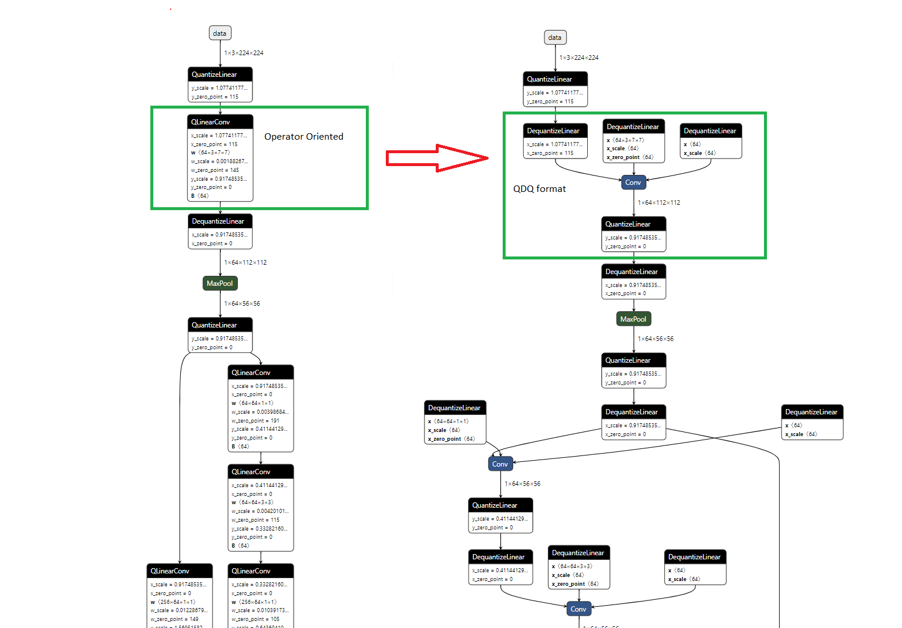

# Quantize ONNX Models
{: .no_toc }

## Contents
{: .no_toc }

* TOC placeholder
{:toc}

## Quantization Overview
Quantization in ONNX Runtime refers to 8 bit linear quantization of an ONNX model.

 During quantization, the floating point values are mapped to an 8 bit quantization space of the form:
 `val_fp32 = scale * (val_quantized - zero_point)`

 `scale` is a positive real number used to map the floating point numbers to a quantization space. It is calculated as follows:

 For asymmetric quantization:
 ```
 scale = (data_range_max - data_range_min) / (quantization_range_max - quantization_range_min)
 ```

 For symmetric quantization:
 ```
 scale = max(abs(data_range_max), abs(data_range_min)) * 2 / (quantization_range_max - quantization_range_min)
 ```

 `zero_point` represents zero in the quantization space. It is important that the floating point zero value be exactly representable in quantization space. This is because zero padding is used in many CNNs. If it is not possible to represent 0 uniquely after quantization, it will result in accuracy errors.

## ONNX quantization representation format
There are two ways to represent quantized ONNX models:
- Operator-oriented (QOperator). All the quantized operators have their own ONNX definitions, like QLinearConv, MatMulInteger and etc.
- Tensor-oriented (QDQ; Quantize and DeQuantize). This format inserts DeQuantizeLinear(QuantizeLinear(tensor)) between the original operators to simulate the quantization and dequantization process. In Static Quantization, the QuantizeLinear and DeQuantizeLinear operators also carry the quantization parameters. In Dynamic Quantization, a ComputeQuantizationParameters function proto is inserted to calculate quantization parameters on the fly. Models generated in the following ways are in the QDQ format:
  - Models quantized by quantize_static or quantize_dynamic API, explained below, with `quant_format=QuantFormat.QDQ`.
  - Quantization-Aware training (QAT) models converted from Tensorflow or exported from PyTorch.
  - Quantized models converted from TFLite and other frameworks.

For the latter two cases, you don't need to quantize the model with the quantization tool. ONNX Runtime can run them directly as a quantized model.

The picture below shows the equivalent representation with the QOperator and QDQ formats for quantized Conv. [This end-to-end example](https://github.com/microsoft/onnxruntime-inference-examples/tree/main/quantization/image_classification/cpu/run.py) demonstrates the two formats.



## Quantizing an ONNX model

ONNX Runtime provides python APIs for converting 32-bit floating point model to an 8-bit integer
model, a.k.a. quantization. These APIs include pre-processing, dynamic/static quantization, and
debugging.

### Pre-processing
{: .no_toc}

Pre-processing is to transform a float32 model to prepare it for quantization. It consists
of the following three optional steps:

1. Symbolic shape inference. This is best suited for transformer models.
2. Model optimization: This step uses ONNX Runtime native library to rewrite the
computation graph, including merging computation nodes, eliminating redundancies
to improve runtime efficiency.
3. ONNX shape inference.

The goal of these steps is to improve quantization quality. Our quantization tool
works best when the tensor's shape is known. Both symbolic shape inference and
ONNX shape inference help figure out tensor shapes. Symbolic shape inference works
best with transformer based models, and ONNX shape inference works with other
models.

Model optimization performs certain operator fusion that makes quantization tool's
job easier. For instance, a Convolution operator followed by BatchNormalization
can be fused into one during the optimization, which can be quantized very efficiently.

Unfortunately, a known issue in ONNX Runtime is that model optimization can not output
a model size greater than 2GB. So for large models, optimization must be skipped.

Pre-processing API is in Python module `onnxruntime.quantization.shape_inference`,
function `quant_pre_process()`. See
[`shape_inference.py`](https://github.com/microsoft/onnxruntime/blob/main/onnxruntime/python/tools/quantization/shape_inference.py).
To read about additional options and finer controls available to pre-processing,
run the following command:

```console
python -m onnxruntime.quantization.preprocess --help
```

Model optimization may also be performed during quantization. However, this is *NOT* recommended,
even though it's the default behavior due to historical reasons. Model optimization during
quantization creates difficulties for debugging quantization caused accuracy losses, which will
be discussed in [later sections](#qdqdebug). So, it is best to perform model optimization during
pre-processing instead of during quantization.


### Dynamic Quantization
{: .no_toc}

There are two ways of quantizing a model: dynamic and static. Dynamic quantization calculates the
quantization parameters (scale and zero point) for activations dynamically. These calculations
increase the cost of inference, while usually achieve higher accuracy comparing to static ones.

Python API for dynamic quantization is in module `onnxruntime.quantization.quantize`, function `quantize_dynamic()`

### Static Quantization
{: .no_toc}

Static quantization method first runs the model using a set of inputs called calibration data.
During these runs, we compute the quantization parameters for each activations. These quantization
parameters are written as constants to the quantized model and used for all inputs. Our
quantization tool supports three calibration methods: MinMax, Entropy and Percentile. Please refer
to
[`calibrate.py`](https://github.com/microsoft/onnxruntime/blob/main/onnxruntime/python/tools/quantization/calibrate.py)
for details.

Python API for static quantization is in module `onnxruntime.quantization.quantize`, function
`quantize_static()`.
Please refer to [quantize.py](https://github.com/microsoft/onnxruntime/blob/main/onnxruntime/python/tools/quantization/quantize.py)
for details.

### <a name="qdqdebug"></a>Quantization Debugging

Quantization is not a loss-less transformation. It may negatively affect a model's accuracy. A
solution to this problem is to compare the weights and activations tensors of the original
computation graph vs those of the quantized one, identify where they differ most, and avoid
quantizing these tensors, or choose another quantization/calibration method. This is called
quantization debugging. To facilitate this process, we provide Python APIs for matching
weights and activation tensors between a float32 model and its quantized counterpart.

API for debugging is in module `onnxruntime.quantization.qdq_loss_debug`, which has the following
functions:

- Function `create_weight_matching()`. It takes a float32 model and its quantized model, and output
  a dictionary that matches the corresponding weights between these two models.
- Function `modify_model_output_intermediate_tensors()`. It takes a float32 or quantized model, and
  augment it to save all its activations.
- Function `collect_activations()`. It takes a model augmented by
  `modify_model_output_intermediate_tensors()`, and an input data reader, runs the augmented model
  to collect all the activations.
- Function `create_activation_matching()`. You can imagine that you run
  `collect_activations(modify_model_output_intermediate_tensors())` on both the float32 and its
  quantized model, to collect two sets of activations. This function takes these two set of
  activations, and matches up corresponding ones, so that they can be easily compared by the user.

In summary, ONNX Runtimes provides Python APIs for matching up corresponding weights and activation
tensors between a float32 model and its quantized counterpart. This allows the user to easily
compare them to locate where are the biggest differences.

Model optimization during quantization creates difficulties for this debugging process though,
since it may changes the computation graph in a significant way, resulting in a quantized model
that is drastically different from the original. This makes it hard to match up corresponding
tensors from the two models. As a result, we recommend performing model optimization during
pre-processing instead of the quantization process.


#### Example
{: .no_toc }

- Dynamic quantization:

```python
import onnx
from onnxruntime.quantization import quantize_dynamic, QuantType

model_fp32 = 'path/to/the/model.onnx'
model_quant = 'path/to/the/model.quant.onnx'
quantized_model = quantize_dynamic(model_fp32, model_quant)
```

- Static quantization: please refer to the [end-to-end examples](https://github.com/microsoft/onnxruntime-inference-examples/tree/main/quantization/image_classification/cpu).

### Method selection
{: .no_toc}

The main difference between dynamic and static quantization is how the scale and zero point of activations are calculated. For static quantization, they are calculated in advance (offline) using a calibration data set. The activations thus have the same scale and zero point during each forward pass. For dynamic quantization, they are calculated on-the-fly (online) and are specific for each forward pass. They are thus more accurate but introduce an extra computational overhead.

In general, it is recommended to use dynamic quantization for RNNs and transformer-based models, and static quantization for CNN models.

If neither post-training quantization method can meet your accuracy goal, you can try using quantization-aware training (QAT) to retrain the model. ONNX Runtime does not provide retraining at this time, but you can retrain your models with the original framework and convert them back to ONNX.

### Data type selection
{: .no_toc}

The quantized values are 8 bits wide and can be either signed (int8) or unsigned (uint8). We can choose the signedness of the activations and the weights separately, so the data format can be (activations: uint8, weights: uint8), (activations: uint8, weights: int8), etc.
Let's use U8U8 as a shorthand for (activations: uint8, weights: uint8), U8S8 for (activations: uint8, weights: int8), and similarly S8U8 and S8S8 for the remaining two formats.

ONNX Runtime quantization on CPU can run U8U8, U8S8 and S8S8. S8S8 with QDQ is the default setting and balances performance and accuracy. It should be the first choice. Only in cases that the accuracy drops a lot, you can try U8U8. Note that S8S8 with QOperator will be slow on x86-64 CPUs and should be avoided in general.
ONNX Runtime quantization on GPU only supports S8S8.

#### When and why do I need to try U8U8?
{: .no_toc }

On x86-64 machines with AVX2 and AVX512 extensions, ONNX Runtime uses the VPMADDUBSW instruction for U8S8 for performance. This instruction might suffer from saturation issues: it can happen that the output does not fit into a 16-bit integer and has to be clamped (saturated) to fit. Generally, this is not a big issue for the final result. However, if you do encounter a large accuracy drop, it may be caused by saturation. In this case, you can either try [reduce_range](https://github.com/microsoft/onnxruntime/blob/main/onnxruntime/python/tools/quantization/quantize.py) or the U8U8 format which doesn't have saturation issues.

There is no such issue on other CPU architectures (x64 with VNNI and ARM).

### List of Supported Quantized Ops
{: .no_toc}

Please refer to the [registry](https://github.com/microsoft/onnxruntime/blob/main/onnxruntime/python/tools/quantization/registry.py) for the list of supported Ops.

### Quantization and model opset versions
{: .no_toc}

Models must be opset10 or higher to be quantized. Models with opset < 10 must be reconverted to ONNX from their original framework using a later opset.

## Transformer-based models
There are specific optimizations for transformer-based models, such as QAttention for quantization of attention layers. In order to leverage these optimizations, you need to optimize your models using the [Transformer Model Optimization Tool](https://github.com/microsoft/onnxruntime/tree/main/onnxruntime/python/tools/transformers) before quantizing the model.

This [notebook](https://github.com/microsoft/onnxruntime-inference-examples/tree/main/quantization/notebooks/bert) demonstrates the process.

## Quantization on GPU

Hardware support is required to achieve better performance with quantization on GPUs. You need a device that supports Tensor Core int8 computation, like T4 or A100. Older hardware will not benefit from quantization.

ONNX Runtime leverages the TensorRT Execution Provider for quantization on GPU now. Unlike the CPU Execution Provider, TensorRT takes in a full precision model and a calibration result for inputs. It decides how to quantize with their own logic. The overall procedure to leverage TensorRT EP quantization is:
- Implement a [CalibrationDataReader](https://github.com/microsoft/onnxruntime/blob/07788e082ef2c78c3f4e72f49e7e7c3db6f09cb0/onnxruntime/python/tools/quantization/calibrate.py).
- Compute quantization parameters using a calibration data set. Note: In order to include all tensors from the model for better calibration, please run `symbolic_shape_infer.py` first. Please refer to [here](../../execution-providers/TensorRT-ExecutionProvider.md#samples) for details.
- Save quantization parameters into a flatbuffer file
- Load model and quantization parameter file and run with the TensorRT EP.

We provide two end-to end examples: [Yolo V3](https://github.com/microsoft/onnxruntime-inference-examples/tree/main/quantization/object_detection/trt/yolov3) and [resnet50](https://github.com/microsoft/onnxruntime-inference-examples/tree/main/quantization/image_classification/trt/resnet50).

## FAQ
### Why am I not seeing performance improvements?
{: .no_toc }

The performance improvement depends on your model and hardware. The performance gain from quantization has two aspects: compute and memory. Old hardware has none or few of the instructions needed to perform efficient inference in int8. And quantization has overhead (from quantizing and dequantizing), so it is not rare to get worse performance on old devices.

x86-64 with VNNI, GPU with Tensor Core int8 support and ARM with dot-product instructions can get better performance in general.

### Which quantization method should I choose, dynamic or static?
{: .no_toc}

Please refer to the [Method selection](#method-selection) section.

### When to use reduce-range and per-channel quantization?
{: .no_toc}

Reduce-range will quantize the weights to 7 bits. It is designed for the U8S8 format on AVX2 and AVX512 (non-VNNI) machines to mitigate [saturation issues](#data-type-selection). This is not needed on machines supporting VNNI.

Per-channel quantization can improve the accuracy for models whose weight ranges are large. Try it if the accuracy loss is large. On AVX2 and AVX512 machines, you will generally need to enable reduce-range as well if per-channel is enabled.

### Why are operators like MaxPool not quantized?
{: .no_toc}

8-bit type support for certain operators such as MaxPool was added in ONNX opset 12. Please check your model version and upgrade it to opset 12 and above.
