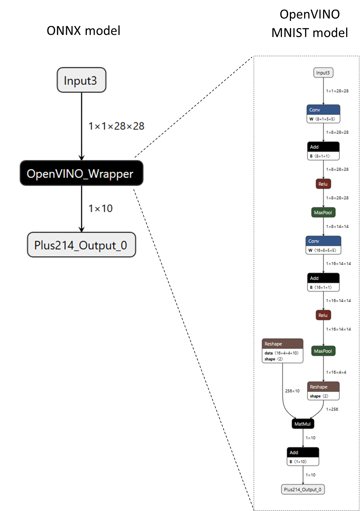

# Custom operators
{: .no_toc }

ONNX Runtime provides options to run custom operators that are not official ONNX operators. Note that custom operators differ from [contrib ops](./ContribOperators.md), which are selected unofficial ONNX operators that are built in directly to ORT.

## Contents
{: .no_toc }

* TOC placeholder
{:toc}

## Define and register a custom operator
Since onnxruntime 1.16, custom op could simply be implemented as a function:

```c++
void KernelOne(const Ort::Custom::Tensor<float>& X,
               const Ort::Custom::Tensor<float>& Y,
               Ort::Custom::Tensor<float>& Z) {
  auto input_shape = X.Shape();
  auto x_raw = X.Data();
  auto y_raw = Y.Data();
  auto z_raw = Z.Allocate(input_shape);
  for (int64_t i = 0; i < Z.NumberOfElement(); ++i) {
    z_raw[i] = x_raw[i] + y_raw[i];
  }
}

int main() {
  Ort::CustomOpDomain v1_domain{"v1"};
  // please make sure that custom_op_one has the same lifetime as the consuming session
  std::unique_ptr<OrtLiteCustomOp> custom_op_one{Ort::Custom::CreateLiteCustomOp("CustomOpOne", "CPUExecutionProvider", KernelOne)};
  v1_domain.Add(custom_op_one.get());
  Ort::SessionOptions session_options;
  session_options.Add(v1_domain);
  // create a session with the session_options ...
}
```

For custom ops that bear attributes, structs are also supported：

```c++
struct Merge {
  Merge(const OrtApi* ort_api, const OrtKernelInfo* info) {
    int64_t reverse;
    ORT_ENFORCE(ort_api->KernelInfoGetAttribute_int64(info, "reverse", &reverse) == nullptr);
    reverse_ = reverse != 0;
  }
  // a "Compute" member function is required to be present
  void Compute(const Ort::Custom::Tensor<std::string_view>& strings_in,
               std::string_view string_in,
               Ort::Custom::Tensor<std::string>* strings_out) {
    std::vector<std::string> string_pool;
    for (const auto& s : strings_in.Data()) {
      string_pool.emplace_back(s.data(), s.size());
    }
    string_pool.emplace_back(string_in.data(), string_in.size());
    if (reverse_) {
      for (auto& str : string_pool) {
        std::reverse(str.begin(), str.end());
      }
      std::reverse(string_pool.begin(), string_pool.end());
    }
    strings_out->SetStringOutput(string_pool, {static_cast<int64_t>(string_pool.size())});
  }
  bool reverse_ = false;
};

int main() {
  Ort::CustomOpDomain v2_domain{"v2"};
  // please make sure that mrg_op_ptr has the same lifetime as the consuming session
  std::unique_ptr<Ort::Custom::OrtLiteCustomOp> mrg_op_ptr{Ort::Custom::CreateLiteCustomOp<Merge>("Merge", "CPUExecutionProvider")};
  v2_domain.Add(mrg_op_ptr.get());
  Ort::SessionOptions session_options;
  session_options.Add(v2_domain);
  // create a session with the session_options ...
}
```
A "Compute" member function is required for the struct to run as a custom op.

For both cases:

- Inputs need to be declared as const references.
- Outputs need to be declared as non-const references.
- [Ort::Custom::Tensor::Shape()](https://github.com/microsoft/onnxruntime/blob/rel-1.16.0/include/onnxruntime/core/session/onnxruntime_lite_custom_op.h#L67) returns input shape.
- [Ort::Custom::Tensor::Data()](https://github.com/microsoft/onnxruntime/blob/rel-1.16.0/include/onnxruntime/core/session/onnxruntime_lite_custom_op.h#L80) returns raw input data.
- [Ort::Custom::Tensor::NumberOfElement()](https://github.com/microsoft/onnxruntime/blob/rel-1.16.0/include/onnxruntime/core/session/onnxruntime_lite_custom_op.h#L73) returns number of elements in the input.
- [Ort::Custom::Tensor::Allocate(...)](https://github.com/microsoft/onnxruntime/blob/rel-1.16.0/include/onnxruntime/core/session/onnxruntime_lite_custom_op.h#L83) allocates an output and returns raw data address.
- Supported template arguments are: int8_t, int16_t, int32_t, int64_t, float, double.
- Support [std::string_view](https://github.com/microsoft/onnxruntime/blob/rel-1.16.0/include/onnxruntime/core/session/onnxruntime_lite_custom_op.h#L188) as input and [std::string](https://github.com/microsoft/onnxruntime/blob/rel-1.16.0/include/onnxruntime/core/session/onnxruntime_lite_custom_op.h#L117) as output, please find usage [here](https://github.com/microsoft/onnxruntime/blob/rel-1.16.0/onnxruntime/test/shared_lib/test_inference.cc#L3129).
- For custom op functions running on CPUExecutionProvider, [span](https://github.com/microsoft/onnxruntime/blob/rel-1.16.0/include/onnxruntime/core/session/onnxruntime_lite_custom_op.h#L40) and scalar as inputs are supported, please find usage [here](https://github.com/microsoft/onnxruntime/blob/rel-1.16.0/onnxruntime/test/testdata/custom_op_library/cpu/cpu_ops.cc#L43).
- For custom op functions that expect kernel context, please see an example [here](https://github.com/microsoft/onnxruntime/blob/rel-1.16.0/onnxruntime/test/testdata/custom_op_library/cpu/cpu_ops.cc#L43).
- When using unique_ptr to host a created custom op, please be sure to keep it alive along with the consuming session.

More examples could be found [here](https://github.com/microsoft/onnxruntime/blob/rel-1.16.0/onnxruntime/test/testdata/custom_op_library/cpu/cpu_ops.cc) and [here](https://github.com/microsoft/onnxruntime/blob/rel-1.16.0/onnxruntime/test/shared_lib/test_inference.cc#L3123).

## Legacy way for custom op development and registration
The legacy way for developing custom op is still supported, please refer to examples [here](https://github.com/microsoft/onnxruntime/blob/rel-1.16.0/onnxruntime/test/shared_lib/custom_op_utils.h).

## Create a library of custom operators
Custom operators can be defined in a separate shared library (e.g., a .dll on Windows or a .so on Linux). A custom operator library must export and implement a `RegisterCustomOps` function. The `RegisterCustomOps` function adds a `Ort::CustomOpDomain` containing the library's custom operators to the provided session options.
Please refer to a project [here](https://github.com/microsoft/onnxruntime/tree/rel-1.16.0/onnxruntime/test/testdata/custom_op_library) and related cmake commands [here](https://github.com/microsoft/onnxruntime/blob/rel-1.16.0/cmake/onnxruntime_unittests.cmake#L1482).

## Calling a native operator from custom operator
To simplify implementation of custom operators, native onnxruntime operators can directly be invoked. For example, some custom ops might have to do GEMM or TopK in between other computations. 
This may also be useful for preprocessing and postprocessing on a node, such as Conv, for state management purpose. To achieve this, the Conv node can be wrapped up by a custom operator such as CustomConv,
within which the input and output could be cached and processed.

This feature is supported from ONNX Runtime 1.12.0+. See: [API](https://github.com/microsoft/onnxruntime/blob/ced7c2deac958391414d2bbf951f86e2fc904b05/include/onnxruntime/core/session/onnxruntime_cxx_api.h#L1156)
and [examples](https://github.com/microsoft/onnxruntime/blob/ced7c2deac958391414d2bbf951f86e2fc904b05/onnxruntime/test/shared_lib/custom_op_utils.cc#L210).

## Custom ops for CUDA and ROCM
Since onnxruntime 1.16, customer op for CUDA and ROCM devices are supported.
Device related resources could be directly accessed from within the op via a device related context.
Take CUDA for example:

```c++
void KernelOne(const Ort::Custom::CudaContext& cuda_ctx,
               const Ort::Custom::Tensor<float>& X,
               const Ort::Custom::Tensor<float>& Y,
               Ort::Custom::Tensor<float>& Z) {
  auto input_shape = X.Shape();
  CUSTOM_ENFORCE(cuda_ctx.cuda_stream, "failed to fetch cuda stream");
  CUSTOM_ENFORCE(cuda_ctx.cudnn_handle, "failed to fetch cudnn handle");
  CUSTOM_ENFORCE(cuda_ctx.cublas_handle, "failed to fetch cublas handle");
  auto z_raw = Z.Allocate(input_shape);
  cuda_add(Z.NumberOfElement(), z_raw, X.Data(), Y.Data(), cuda_ctx.cuda_stream); // launch a kernel inside
}
```
Details could be found [here](https://github.com/microsoft/onnxruntime/tree/rel-1.16.0/onnxruntime/test/testdata/custom_op_library/cuda).

For ROCM, it is like:

```c++
void KernelOne(const Ort::Custom::RocmContext& rocm_ctx,
               const Ort::Custom::Tensor<float>& X,
               const Ort::Custom::Tensor<float>& Y,
               Ort::Custom::Tensor<float>& Z) {
  auto input_shape = X.Shape();
  CUSTOM_ENFORCE(rocm_ctx.hip_stream, "failed to fetch hip stream");
  CUSTOM_ENFORCE(rocm_ctx.miopen_handle, "failed to fetch miopen handle");
  CUSTOM_ENFORCE(rocm_ctx.rblas_handle, "failed to fetch rocblas handle");
  auto z_raw = Z.Allocate(input_shape);
  rocm_add(Z.NumberOfElement(), z_raw, X.Data(), Y.Data(), rocm_ctx.hip_stream); // launch a kernel inside
}
```
Details could be found [here](https://github.com/microsoft/onnxruntime/tree/rel-1.16.0/onnxruntime/test/testdata/custom_op_library/rocm).

## One op, varied types
Since onnxruntime 1.16, a custom op is allowed to support varied data types:

```c++
template <typename T>
void MulTop(const Ort::Custom::Span<T>& in, Ort::Custom::Tensor<T>& out) {
  out.Allocate({1})[0] = in[0] * in[1];
}

int main() {
  std::unique_ptr<OrtLiteCustomOp> c_MulTopOpFloat{Ort::Custom::CreateLiteCustomOp("MulTop", "CPUExecutionProvider", MulTop<float>)};
  std::unique_ptr<OrtLiteCustomOp> c_MulTopOpInt32{Ort::Custom::CreateLiteCustomOp("MulTop", "CPUExecutionProvider", MulTop<int32_t>)};
  // create a domain adding both c_MulTopOpFloat and c_MulTopOpInt32
}
```

Code could be found [here](https://github.com/microsoft/onnxruntime/blob/rel-1.16.0/onnxruntime/test/testdata/custom_op_library/cpu/cpu_ops.cc#L39).
A unit test case could found [here](https://github.com/microsoft/onnxruntime/blob/rel-1.16.0/onnxruntime/test/shared_lib/test_inference.cc#L3272).

## Wrapping an external inference runtime in a custom operator
A custom operator can wrap an entire model that is then inferenced with an external API or runtime. This can facilitate the integration of external inference engines or APIs with ONNX Runtime.

As an example, consider the following ONNX model with a custom operator named "OpenVINO_Wrapper". The "OpenVINO_Wrapper" node encapsulates an entire MNIST model in OpenVINO's native model format (XML and BIN data). The model data is serialized into the node's attributes and later retrieved by the custom operator's kernel to build an in-memory representation of the model and run inference with OpenVINO C++ APIs.

<p align="center"></p>

The following code snippet shows how the custom operator is defined.

```c++
// Note - below code utilizes legacy custom op interfaces
struct CustomOpOpenVINO : Ort::CustomOpBase<CustomOpOpenVINO, KernelOpenVINO> {
  explicit CustomOpOpenVINO(Ort::ConstSessionOptions session_options);

  CustomOpOpenVINO(const CustomOpOpenVINO&) = delete;
  CustomOpOpenVINO& operator=(const CustomOpOpenVINO&) = delete;

  void* CreateKernel(const OrtApi& api, const OrtKernelInfo* info) const;

  constexpr const char* GetName() const noexcept {
    return "OpenVINO_Wrapper";
  }

  constexpr const char* GetExecutionProviderType() const noexcept {
    return "CPUExecutionProvider";
  }

  // IMPORTANT: In order to wrap a generic runtime-specific model, the custom operator
  // must have a single non-homogeneous variadic input and output.

  constexpr size_t GetInputTypeCount() const noexcept {
    return 1;
  }

  constexpr size_t GetOutputTypeCount() const noexcept {
    return 1;
  }

  constexpr ONNXTensorElementDataType GetInputType(size_t /* index */) const noexcept {
    return ONNX_TENSOR_ELEMENT_DATA_TYPE_UNDEFINED;
  }

  constexpr ONNXTensorElementDataType GetOutputType(size_t /* index */) const noexcept {
    return ONNX_TENSOR_ELEMENT_DATA_TYPE_UNDEFINED;
  }

  constexpr OrtCustomOpInputOutputCharacteristic GetInputCharacteristic(size_t /* index */) const noexcept {
    return INPUT_OUTPUT_VARIADIC;
  }

  constexpr OrtCustomOpInputOutputCharacteristic GetOutputCharacteristic(size_t /* index */) const noexcept {
    return INPUT_OUTPUT_VARIADIC;
  }

  constexpr bool GetVariadicInputHomogeneity() const noexcept {
    return false;  // heterogenous
  }

  constexpr bool GetVariadicOutputHomogeneity() const noexcept {
    return false;  // heterogeneous
  }

  // The "device_type" is configurable at the session level.
  std::vector<std::string> GetSessionConfigKeys() const { return {"device_type"}; }

 private:
  std::unordered_map<std::string, std::string> session_configs_;
};
```

Note that the custom operator is defined to have a single variadic/heterogenous input and a single variadic/heterogeneous output. This is necessary to enable wrapping OpenVINO models with varying input and output types and shapes (not just an MNIST model). For more information on input and output characteristics, refer to the [OrtCustomOp struct documentation](https://onnxruntime.ai/docs/api/c/struct_ort_custom_op.html).

Additionally, the custom operator declares "device_type" as a session configuration that can be set by the application. The following code snippet shows how to register and configure a custom operator library containing the aforementioned custom operator.

```c++
Ort::Env env;
Ort::SessionOptions session_options;
Ort::CustomOpConfigs custom_op_configs;

// Create local session config entries for the custom op.
custom_op_configs.AddConfig("OpenVINO_Wrapper", "device_type", "CPU");

// Register custom op library and pass in the custom op configs (optional).
session_options.RegisterCustomOpsLibrary("MyOpenVINOWrapper_Lib.so", custom_op_configs);

Ort::Session session(env, ORT_TSTR("custom_op_mnist_ov_wrapper.onnx"), session_options);
```

Refer to the [complete OpenVINO custom operator wrapper example](https://github.com/microsoft/onnxruntime/tree/main/onnxruntime/test/testdata/custom_op_openvino_wrapper_library) for more details. To create an ONNX model that wraps an external model or weights, refer to the [create_custom_op_wrapper.py tool](https://github.com/microsoft/onnxruntime/blob/main/onnxruntime/python/tools/custom_op_wrapper/create_custom_op_wrapper.py).

