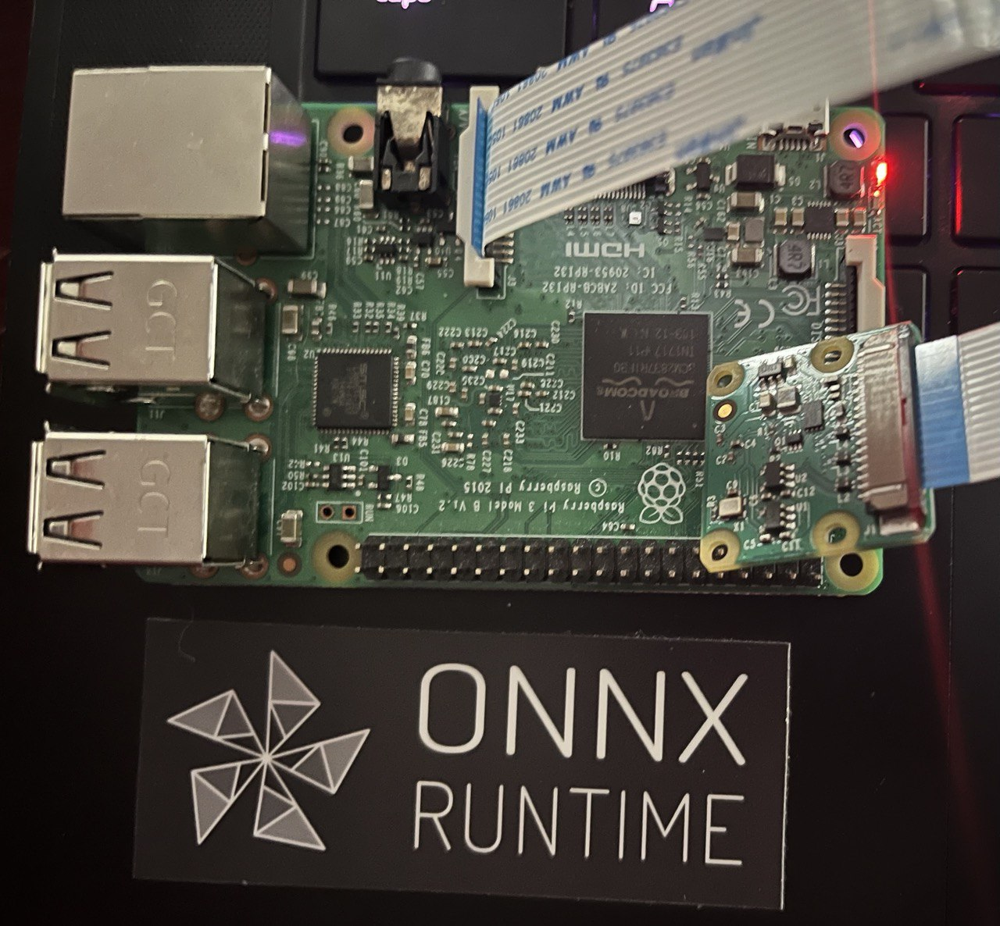
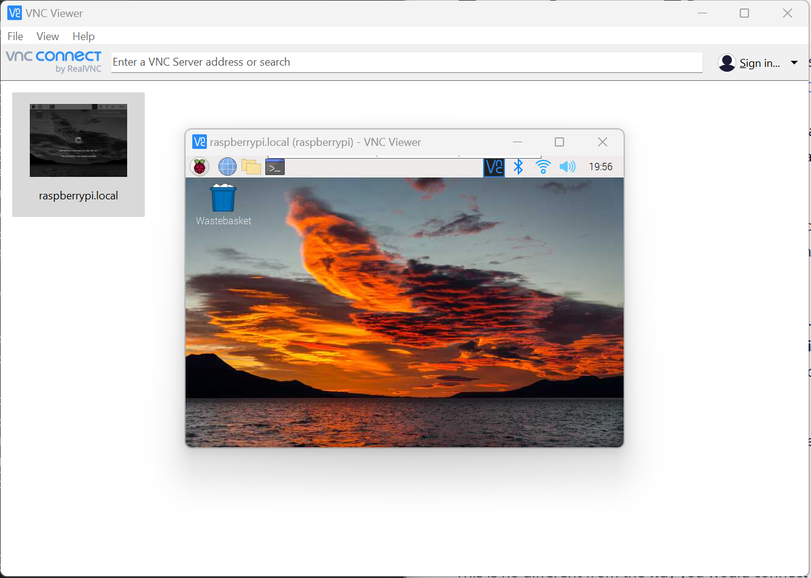

# ONNX Runtime IoT Deployment on Raspberry Pi
{: .no_toc }



In this tutorial we will look at how we can deploy ML Models to a Raspberry Pi edge device. There are many benefits and use cases for deploying models to edge devices. Check out the list on our [IoT tutorial home page](index.md). It is assumed that you have a basic understand of how to image and configure a Raspberry Pi. If you have not configured a Raspberry Pi before check out the [Raspberry Pi documentation](https://www.raspberrypi.com/documentation/computers/getting-started.html) to get your device setup.

## Contents
{: .no_toc }

* TOC placeholder
{:toc}

## Prerequisites
- [Raspberry Pi 3 B board](https://www.raspberrypi.com/products/raspberry-pi-3-model-b/)
- SD Card Imaged with [Debian from the Raspberry Pi Imager](https://www.raspberrypi.com/software/)
- Raspberry Pi [Camera Module](https://www.raspberrypi.com/products/camera-module-v2/) or other compatible camera.
- [VNC Viewer](https://www.raspberrypi.com/documentation/computers/remote-access.html#vnc) for remote access. Optionally you can connect the board to a monitor.
- This tutorial will _not_ cover imaging and setting up the Raspberry Pi. Basic understanding of how to configure and program with Python on the Raspberry Pi is expected.

## Download the source code, ML model and install the packages

Once you have imaged the Raspberry Pi and configured it for use its time to download the source to your device.

1. Connect to your Raspberry Pi device

In this tutorial we are using VNC Viewer to remote in. If you are going to use VNC Viewer be sure to follow [these setup steps to establish a connection.](https://www.realvnc.com/en/blog/how-to-setup-vnc-connect-raspberry-pi/). Once VNC is enabled on Raspberry Pi and you have [downloaded the VNC Viewer](https://www.realvnc.com/en/connect/download/viewer/) app on your computer, then you can remote into the device.



2. [Download the source](https://github.com/cassiebreviu/onnxruntime-raspberrypi) to your Raspberry Pi. The source code includes everything you need to run inference including a `mobilenet` ONNX model from the [model zoo](https://github.com/onnx/models) and `imagenet_classes.txt` classes.

```bash
git clone https://github.com/cassiebreviu/onnxruntime-raspberrypi.git
```

3. Navigate to the `onnxruntime-raspberrypi` download location and install the package from the `requirements.txt` with the following command.

```bash
pip install -r requirements.txt
```

4. Configure and test the camera.

In this tutorial we are using the Raspberry Pi [Camera Module](https://www.raspberrypi.com/products/camera-module-v2/). We want to test the camera with the `cameratest.py` script provided. 


## Install the prerequisites

## Run Inference

## Part 2 Add a Remote Control Arduino Powered Car

Now that you have got the CV model working on the Raspberry Pi, lets look at how we can add it to a remote control car. The instructions to build the remote control car can be found on this (Instructables tutorial)[https://www.instructables.com/HackerBoxes-0013-Autosport/]