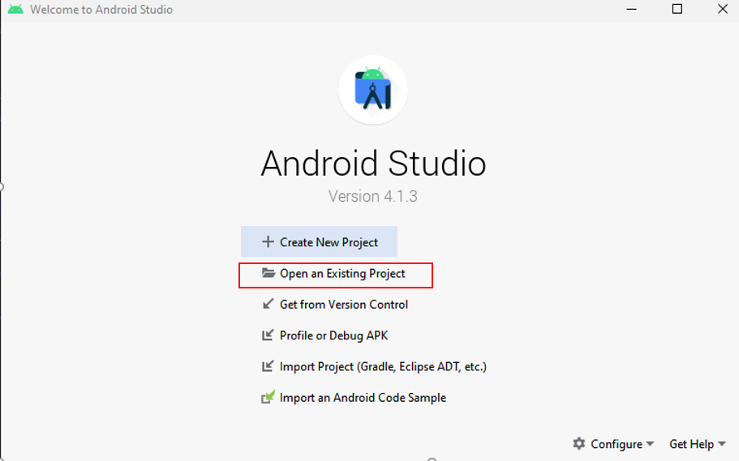
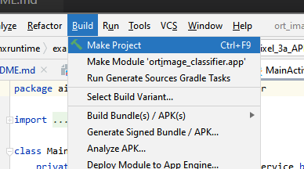
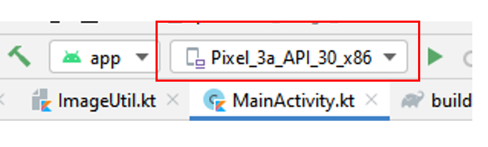
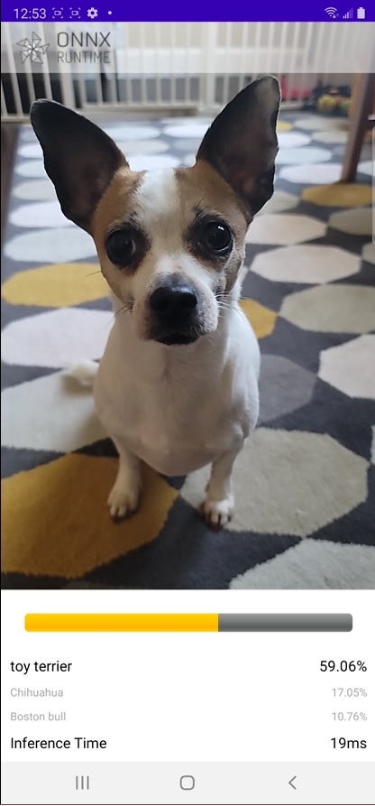

# Write a mobile image classification Android application

This app uses image classification to continuously classify the objects it sees from the device's camera in real-time and displays the most probable inference results on the screen.

This example is loosely based on [Google CodeLabs - Getting Started with CameraX](https://codelabs.developers.google.com/codelabs/camerax-getting-started)

The pre-trained [TorchVision MOBILENET V2](https://pytorch.org/hub/pytorch_vision_mobilenet_v2/) is used in this sample app.

## Contents
{: .no_toc }

* TOC placeholder
{:toc}

## Pre-requisites

- Android Studio 4.1+ (installed on Mac/Windows/Linux)
- Android SDK 29+
- Android NDK r21+
- Android device with a camera in [developer mode](https://developer.android.com/studio/debug/dev-options) with USB debugging enabled
- Clone the [onnxruntime-inference-examples](https://github.com/microsoft/onnxruntime-inference-examples) source code repo

## Prepare the model and data used in the application

1. Convert the model to ORT format

   Open [Mobilenet v2 Quantization with ONNX Runtime Notebook](https://github.com/microsoft/onnxruntime-inference-examples/blob/main/quantization/notebooks/imagenet_v2/mobilenet.ipynb), this notebook will demonstrate how to:

   - Export the pre-trained MobileNet V2 FP32 model from PyTorch to a FP32 ONNX model
   - Quantize the FP32 ONNX model to an uint8 ONNX model
   - Convert both FP32 and uint8 ONNX models to ORT models

   Note: this step is optional, you can download the FP32 and uint8 ORT models [here](https://onnxruntimeexamplesdata.z13.web.core.windows.net/mobilenet_v2_ort_models.zip).

2. Download the model class labels

   ```bash
   wget https://raw.githubusercontent.com/pytorch/hub/master/imagenet_classes.txt
   ```

3. Copy the labels file and models into the sample application resource directory

   ```bash
   cd onnxrutime-inference-examples
   cp *.ort mobile/examples/image_classification/android/app/src/main/res/raw/
   cp imagenet_classes.txt mobile/examples/image_classification/android/app/src/main/res/raw/
   ```

As an alternative to steps 1-3, you can use this pre-built script to download the models and data to the correct directory:

```bash
cd onnxruntime-inference-examples
mobile/examples/image_classification/android/download_model_files.sh
```

## Create the Android application

1. Open the sample application in Android Studio

   Open Android Studio and select `Open an existing project`, browse folders and open the folder `mobile/examples/image_classification/android/`.

   

   > This project uses the published Android package for ONNX Runtime. You can also customize ONNX Runtime to reduce the size of the application by only including the operators from the model. For more information on how to do this, and how to include the resulting package in your Android application, see the [custom build instruction for Android](../../build/custom.md#android)

2. Build the application

   Select `Build -> Make Project` in the top toolbar in Android Studio and check the projects has built successfully.

   

   

3. Connect your android device and run the app

   Connect your Android Device to the computer and select your device in the top-down device bar.

   

   Then Select `Run -> Run app` and this will prompt the app to be installed on your device.

   Now you can test and try by opening the app `ort_image_classifier` on your device. The app may request your permission to use the camera.

   Here's an example screenshot of the app.

   
