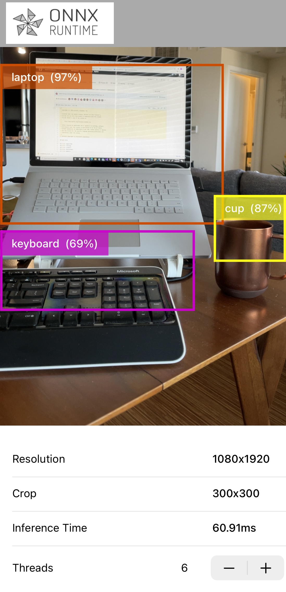

# Write a mobile object detection iOS application

Learn how to build an iOS object detection app with ONNX Runtime. This application continuously detect the objects in the frames seen by your iOS device's back camera and display:

- the class (type) of objects detected
- the bounding box of the detected objects
- the inference confidence

The application uses the pre-trained quantized MobileNet SSD V1 model.

This example is heavily based on [Google Tensorflow lite - Object Detection Examples](https://github.com/tensorflow/examples/tree/master/lite/examples/object_detection/ios)

Here's an example screenshot of the app:



## Contents
{: .no_toc }

* TOC placeholder
{:toc}

## Pre-requisites

- Xcode 12.5 and above (preferably latest version)
- A valid Apple Developer ID
- A real iOS device with a camera (preferably iphone 12/iphone 12 pro)
- Xcode command line tools `xcode-select --install`
- Clone the [onnxruntime-inference-examples](https://github.com/microsoft/onnxruntime-inference-examples) source code repo

## Prepare the model for mobile deployment

1. Create a separate Python environment so that this app's dependencies are separate from other python projects

   ```bash
   conda create -n ios-app Python=3.8
   conda activate ios-app
   ```

2. Install Python dependencies

   ```bash
   cd <onnxruntime-inference-example-root>/mobile/examples/object_detection/ios/ORTObjectDetection
   pip install -r ./prepare_model.requirements.txt
   ```

   The requirements file contains the onnxruntime, tf2onnx and tensorflow python packages required for model conversion in the next step.

3. Download the model and convert it into ORT format

   ```bash
   ./prepare_model.sh
   ```

   The script:
   - downloads the original tflite model along with the model metadata `labelmap.txt`
   - converts it to ONNX format
   - further converts it to ORT format, which can be executed by the ONNX Mobile Runtime

   The script outputs a `ModelsAndData` directory, which contains the ORT format model, `ssd_mobilenet_v1.all.ort` and the model label data file, `labelmap.txt`.

   > Conversion of this model is a two part process. The original model is in tflite format. This is firstly converted to ONNX format using the [tf2onnx converter](https://github.com/onnx/tensorflow-onnx).
   >
   > The model is then converted into ORT format using the [onnx to ort converter](../../performance/model-optimizations/ort-format-models.md).
   >
   > As well as generating the model in ORT format, the conversion script also outputs an [operator config file](../../reference/operators/reduced-operator-config-file.md)

## Create iOS application

1. Install CocoaPods

   ```bash
   sudo gem install cocoapods
   ```

2. Install dependencies and generate workspace file

   ```bash
   cd <onnxruntime-inference-example-root>/mobile/examples/object_detection/ios/
   pod install
   ```

   The `Podfile` contains the `onnxruntime-mobile-objc` dependency, which is the pod containing the Objective C API.

   At the end of this step, you should see a file called `ORTObjectDetection.xcworkspace` in the `mobile/examples/object_detection/ios` directory.

   > This tutorial uses one of the [pre-built](../../install/index.md#install-on-ios) packages for ONNX Runtime mobile. You can also build your own [custom](../../build/custom.md) runtime if the demands of your target environment require it. To include the custom ONNX Runtime build in your iOS app, see [Custom iOS package](../../build/custom.md#ios)

3. Build the project

   Open `<onnxruntime-inference-example-root>/mobile/examples/object_detection/ios/ORTObjectDetection.xcworkspace` in Xcode.

   Select your `Development Team` in the `Signing & Capabilities` workspace settings.

   Click on `Product` -> `Build for Running` to compile the application.

4. Run the application

   Connect your iOS device and run the app. You'll have to grant permissions for the app to use the device's camera.

   You should see an app with the ONNX Runtime logo on your device. Running the app opens your camera and performs object detection. <<Insert screenshot>>

### Related information

* This app uses [ONNX Runtime Objective-C API](https://onnxruntime.ai/docs/api/objectivec/index.html) for performing object detection functionality.

  It is written entirely in Swift and uses a bridgingheader file for the framework to be used in a Swift app.

* The original TensorFlow tutorial and model are [here](https://www.tensorflow.org/lite/examples/object_detection/overview#get_started)

* For more information on converting tflite models to ONNX [Converting TFlite models to ONNX](https://github.com/onnx/tensorflow-onnx#getting-started)

* [Convert ONNX models to ORT format](../../performance/model-optimizations/ort-format-models.md)

