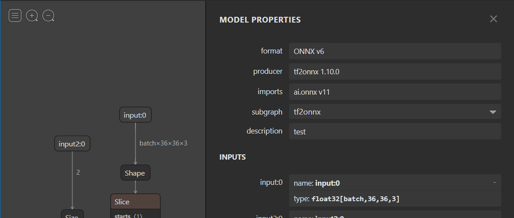
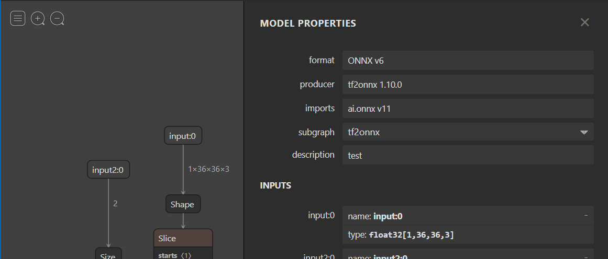
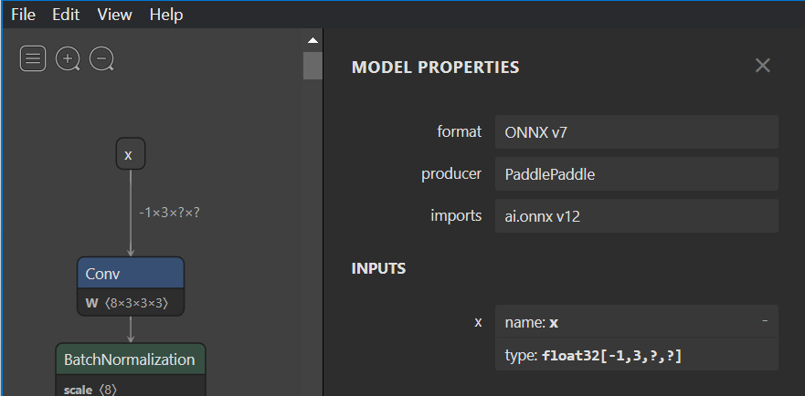
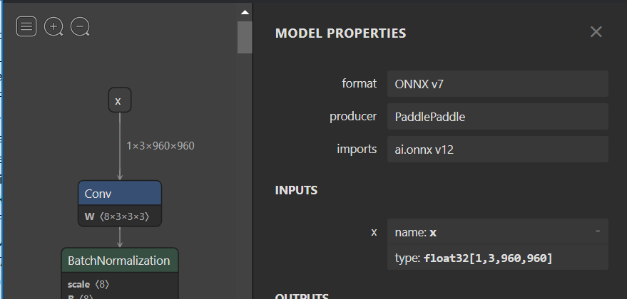

# Making dynamic input shapes fixed
{: .no_toc }

If a model can potentially be used with NNAPI or CoreML as reported by the [model usability checker](./model-usability-checker.md), it may benefit from making the input shapes 'fixed'.
This is because NNAPI does not support dynamic input shapes and CoreML may have better performance with fixed input shapes.

For example, often models have a dynamic batch size so that training is more efficient. In mobile scenarios the batch generally has a size of 1.
Making the batch size dimension 'fixed' by setting it to 1 may allow NNAPI to run the model.

The helper can be used to update specific dimensions, or the entire input shape.

## Contents
{: .no_toc }

* TOC placeholder
{:toc}

## Usage
```
python -m onnxruntime.tools.make_dynamic_shape_fixed -h
usage: make_dynamic_shape_fixed.py:make_dynamic_shape_fixed_helper [-h] [--dim_param DIM_PARAM] [--dim_value DIM_VALUE] [--input_name INPUT_NAME] [--input_shape INPUT_SHAPE] input_model output_model

Assign a fixed value to a dim_param or input shape. Provide either dim_param and dim_value or input_name and input_shape.

positional arguments:
  input_model           Provide path to ONNX model to update.
  output_model          Provide path to write updated ONNX model to.

optional arguments:
  -h, --help            show this help message and exit
  --dim_param DIM_PARAM
                        Symbolic parameter name. Provide dim_value if specified.
  --dim_value DIM_VALUE
                        Value to replace dim_param with in the model. Must be > 0.
  --input_name INPUT_NAME
                        Model input name to replace shape of. Provide input_shape if specified.
  --input_shape INPUT_SHAPE
                        Shape to use for input_shape. Provide comma separated list for the shape. All values must be > 0. e.g. --input_shape 1,3,256,256
```

To determine the update required by the model, it's generally helpful to view the model in [Netron](https://netron.app/) to inspect the inputs.


## Making a symbolic dimension fixed

Here is an example model, viewed using Netron, with a symbolic dimension called 'batch' for the batch size in 'input:0'. 
We will update that to use the fixed value of 1.




```

python -m onnxruntime.tools.make_dynamic_shape_fixed --dim_param batch --dim_value 1 model.onnx model.fixed.onnx

```

After replacement you should see that the shape for 'input:0' is now 'fixed' with a value of [1, 36, 36, 3]




## Making an input shape fixed

Here is an example model that has unnamed dynamic dimensions for the 'x' input. Netron represents these with '?'. 
As there is no name for the dimension, we need to update the shape using the `--input_shape` option.



```

python -m onnxruntime.tools.make_dynamic_shape_fixed --input_name x --input_shape 1,3,960,960 model.onnx model.fixed.onnx

```

After replacement you should see that the shape for 'x' is now 'fixed' with a value of [1, 3, 960, 960]


