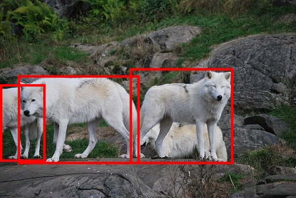
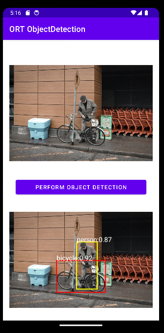
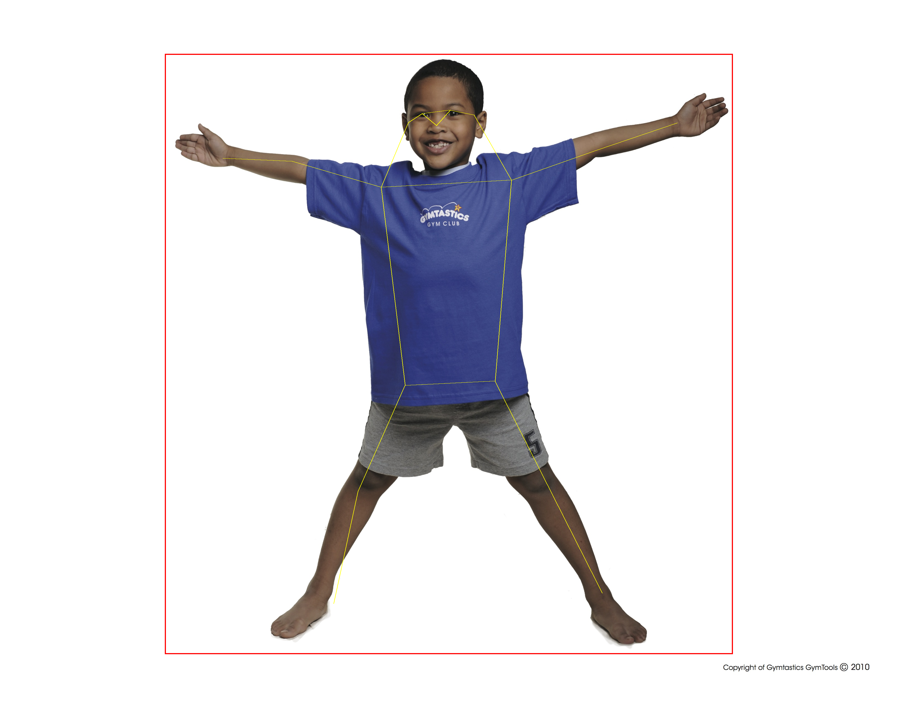

# Object detection and pose estimation on mobile with YOLOv8

Learn how to build and run ONNX models on mobile with built-in pre and post processing for object detection and pose estimation.

## Contents
{: .no_toc }

* TOC placeholder
{:toc}

## Object detection with YOLOv8

You can find the full source code for the [Android](https://github.com/microsoft/) app in the ONNX Runtime inference examples repository.

### Build the ONNX model with built-in pre and post processing

This step is optional as the model is available in the examples repository in the applications folders above. If you are interested, the following steps show you how to build the model yourself.

Create a Python environment and install the following packages.

```bash
pip install --upgrade onnx onnxruntime onnxruntime-extensions pillow
```

Download the following script to build the model.

```bash
curl https://raw.githubusercontent.com/microsoft/onnxruntime-extensions/main/tutorials/yolo_e2e.py > yolo_e2e.py
```

Run the script.

```bash
python yolo_e2e.py [--test_image <image to test on>]
```

After the script has run, you will see one PyTorch model and two ONNX models:
* `yolov8n.pt`: The original YOLOv8 PyTorch model
* `yolov8n.onnx`: The exported YOLOv8 ONNX model
* `yolov8n.with_pre_post_processing.onnx`: The ONNX model with pre and post processing included in the model
* `<test image>.out.jpg`: Your test image with bounding boxes supplied.

For example, the wolves test image in the extensions repo:



### Build an Android application

Load the Android application into Android Developer Studio.

You see the main inference code in [ObjectDetector.kt](https://github.com/microsoft/onnxruntime-inference-examples/blob/main/mobile/examples/object_detection/android/app/src/main/java/ai/onnxruntime/example/objectdetection/ObjectDetector.kt). It's as simple as loading the image image into byte array, and running it through the model with ONNX Runtime to get the original image with boxes.

```java
    fun detect(inputStream: InputStream, ortEnv: OrtEnvironment, ortSession: OrtSession): Result {
        // Step 1: convert image into byte array (raw image bytes)
        val rawImageBytes = inputStream.readBytes()

        // Step 2: get the shape of the byte array and make ort tensor
        val shape = longArrayOf(rawImageBytes.size.toLong())

        val inputTensor = OnnxTensor.createTensor(
            ortEnv,
            ByteBuffer.wrap(rawImageBytes),
            shape,
            OnnxJavaType.UINT8
        )
        inputTensor.use {
            // Step 3: call ort inferenceSession run
            val output = ortSession.run(Collections.singletonMap("image", inputTensor),
                setOf("image_out","scaled_box_out_next")
            )

            // Step 4: output analysis
            output.use {
                val rawOutput = (output?.get(0)?.value) as ByteArray
                val boxOutput = (output?.get(1)?.value) as Array<FloatArray>
                val outputImageBitmap = byteArrayToBitmap(rawOutput)

                // Step 5: set output result
                var result = Result(outputImageBitmap,boxOutput)
                return result
            }
        }
    }
```



## Pose estimation with YOLOv8

### Build the pose estimation model

Note: this part of the tutorial uses Python. Android and iOS samples are coming soon!

Create a Python environment and install the following packages.

```bash
pip install --upgrade onnx onnxruntime onnxruntime-extensions pillow
```

Download the following script to build the model.

```bash
curl https://raw.githubusercontent.com/microsoft/onnxruntime-extensions/main/tutorials/yolov8_pose_e2e.py > yolov8_pose_e2e.py
```

Run the script.

```bash
python yolov8_pose_e2e.py 
```

After the script has run, you will see one PyTorch model and two ONNX models:
* `yolov8n-pose.pt`: The original YOLOv8 PyTorch model
* `yolov8n-pose.onnx`: The exported YOLOv8 ONNX model
* `yolov8n-pose.with_pre_post_processing.onnx`: The ONNX model with pre and post processing included in the model


### Run examples of pose estimation

You can use the same script to run the model, supplying your own image to detect poses.

```bash
python yolov8_pose_e2e.py --test_image person.jpg --run_model
```

And the output is drawn on the original image!




### Develop your mobile application

You can use the Python inference code as a basis for developing your mobile application. 

## Additional resources

[ONNX Runtime examples repository](https://github.com/microsoft/onnxruntime-inference-examples)
[ONNX Runtime extentions repository](https://github.com/microsoft/onnxruntime-extensions)


