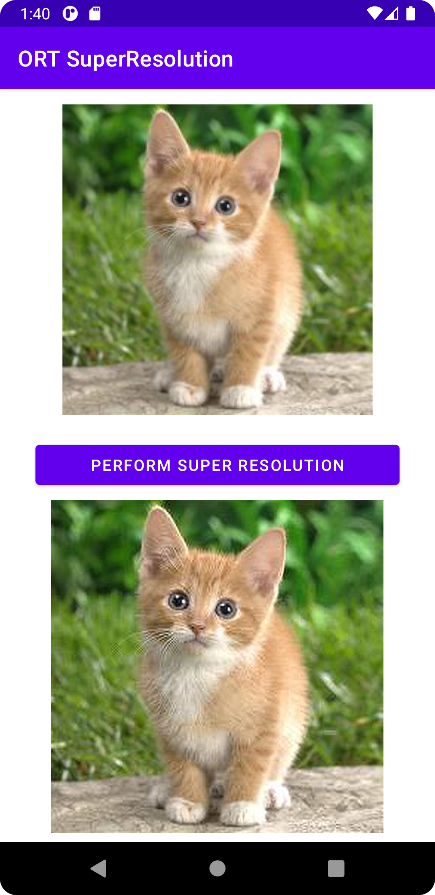
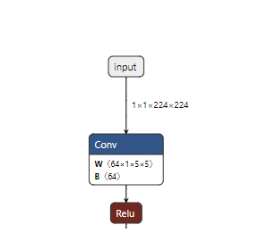
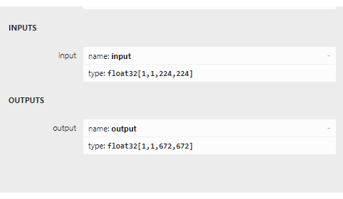
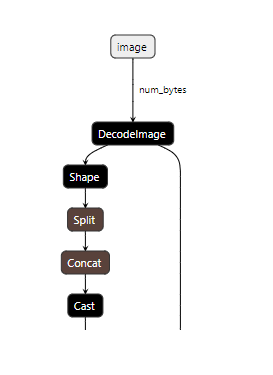

# Improve image resolution with machine learning super resolution on mobile

Learn how to build an application to improve image resolution using ONNX Runtime Mobile, with a model that includes pre and post processing.

You can use this tutorial to build the application for Android or iOS.

The application takes an image input, performs the super resolution operation when the button is clicked and displays the image with improved resolution below, as in the following screenshot.



## Contents
{: .no_toc }

* TOC placeholder
{:toc}

## Prepare the model

The machine learning model used in this tutorial is based on the one used in the PyTorch tutorial referenced at the bottom of this page.

We provide a convenient Python script that exports the PyTorch model into ONNX format and adds pre and post processing.

1. Before running this script, install the following python packages:

    ```bash
    pip install torch
    pip install pillow
    pip install onnx
    pip install onnxruntime
    pip install --index-url https://aiinfra.pkgs.visualstudio.com/PublicPackages/_packaging/ORT-Nightly/pypi/simple/ onnxruntime-extensions
    ```
  
    A note on versions: the best super resolution results are achieved with ONNX opset 18 (with its support for the Resize operator with anti-aliasing), which is supported by onnx 1.13.0 and onnxruntime 1.14.0 and later. The onnxruntime-extensions package is a pre-release version. The release version will be available soon.

2. Then download the script and test image from the onnxruntime-extensions GitHub repository (if you have not already cloned this repository):

    ```bash
    curl https://raw.githubusercontent.com/microsoft/onnxruntime-extensions/main/tutorials/superresolution_e2e.py > superresolution_e2e.py
    curl https://raw.githubusercontent.com/microsoft/onnxruntime-extensions/main/tutorials/data/super_res_input.png > data/super_res_input.png
    ```

3. Run the script to export the core model and add pre and post processing to it

    ```bash
    python superresolution_e2e.py 
    ```

After the script runs, you should see two ONNX files in the folder in the location that you ran the script:

```bash
pytorch_superresolution.onnx
pytorch_superresolution_with_pre_and_post_processing.onnx
```

If you load the two models into [netron](https://netron.app/) you can see the difference in inputs and outputs between the two. The first two images below show the original model with its inputs being batches of channel data, and the second two show the inputs and outputs being the image bytes.








Now it's time to write the application code.

## Android app

### Pre-requisites

* Android Studio Dolphin 2021.3.1 Patch + (installed on Mac/Windows/Linux)
* Android SDK 29+
* Android NDK r22+
* An Android device or an Android Emulator

### Sample code

You can find full [source code for the Android super resolution app](https://github.com/microsoft/onnxruntime-inference-examples/tree/main/mobile/examples/super_resolution/android) in GitHub.

To run the app from source code, clone the above repo and load the `build.gradle` file into Android studio, build and run!

To build the app, step by step, follow the following sections.

### Code from scratch

#### Setup project

Create a new project for Phone and Tablet in Android studio and select the blank template. Call the application `super_resolution` or similar.

#### Dependencies

Add the following dependencies to the app `build.gradle`:

```gradle
implementation 'com.microsoft.onnxruntime:onnxruntime-android:latest.release'
implementation 'com.microsoft.onnxruntime:onnxruntime-extensions-android:latest.release'
```

#### Project resources

1. Add the model file as a raw resource

   Create a folder called `raw` in the `src/main/res` folder and move or copy the ONNX model into the raw folder.

2. Add the test image as an asset

   Create a folder called `assets` in the main project folder and copy the image that you want to run super resolution on into that folder with the filename of `test_superresolution.png`

#### Main application class code

Create a file called MainActivity.kt and add the following pieces of code to it.

1. Add import statements

   ```kotlin
   import ai.onnxruntime.*
   import ai.onnxruntime.extensions.OrtxPackage
   import android.annotation.SuppressLint
   import android.os.Bundle
   import android.widget.Button
   import android.widget.ImageView
   import android.widget.Toast
   import androidx.activity.*
   import androidx.appcompat.app.AppCompatActivity
   import kotlinx.android.synthetic.main.activity_main.*
   import kotlinx.coroutines.*
   import java.io.InputStream
   import java.util.*
   import java.util.concurrent.ExecutorService
   import java.util.concurrent.Executors
   ```

2. Create the main activity class and add the class variables

   ```kotlin
   class MainActivity : AppCompatActivity() {
       private var ortEnv: OrtEnvironment = OrtEnvironment.getEnvironment()
       private lateinit var ortSession: OrtSession
       private var inputImage: ImageView? = null
       private var outputImage: ImageView? = null
       private var superResolutionButton: Button? = null

       ...
   }
   ```

3. Add the `onCreate()` method

   This is where we initialize the [ONNX Runtime session](https://onnxruntime.ai/docs/api/java/ai/onnxruntime/OrtSession.html). A session holds a reference to the model used to perform inference in the application. It also takes a session options parameter, which is where you can specify different execution providers (hardware accelerators such as NNAPI). In this case, we default to running on CPU. We do however register the custom op library where the image encoding and decoding operators at the input and output of the model are found.

   ```kotlin
    override fun onCreate(savedInstanceState: Bundle?) {
        super.onCreate(savedInstanceState)
        setContentView(R.layout.activity_main)

        inputImage = findViewById(R.id.imageView1)
        outputImage = findViewById(R.id.imageView2);
        superResolutionButton = findViewById(R.id.super_resolution_button)
        inputImage?.setImageBitmap(
            BitmapFactory.decodeStream(readInputImage())
        );

        // Initialize Ort Session and register the onnxruntime extensions package that contains the custom operators.
        // Note: These are used to decode the input image into the format the original model requires,
        // and to encode the model output into png format
        val sessionOptions: OrtSession.SessionOptions = OrtSession.SessionOptions()
        sessionOptions.registerCustomOpLibrary(OrtxPackage.getLibraryPath())
        ortSession = ortEnv.createSession(readModel(), sessionOptions)

        superResolutionButton?.setOnClickListener {
            try {
                performSuperResolution(ortSession)
                Toast.makeText(baseContext, "Super resolution performed!", Toast.LENGTH_SHORT)
                    .show()
            } catch (e: Exception) {
                Log.e(TAG, "Exception caught when perform super resolution", e)
                Toast.makeText(baseContext, "Failed to perform super resolution", Toast.LENGTH_SHORT)
                    .show()
            }
        }
    }
   ```

4. Add the onDestroy method

   ```kotlin
    override fun onDestroy() {
        super.onDestroy()
        ortEnv.close()
        ortSession.close()
    }

   ```

5. Add the updateUI method

   ```kotlin
   private fun updateUI(result: Result) {
       outputImage?.setImageBitmap(result.outputBitmap)
   }
   ```

6. Add the readModel method

   This method reads the ONNX model from the resources folder.

   ```kotlin
   private fun readModel(): ByteArray {
       val modelID = R.pytorch_superresolution_with_pre_post_processing_op18
       return resources.openRawResource(modelID).readBytes()
   }   
   ```

7. Add a method to read the input image

   This method reads a test image from the assets folder. Currently it reads a fixed image built into the application. The sample will soon be extended to read the image directly from the camera or the camera roll.

   ```kotlin
   private fun readInputImage(): InputStream {
       return assets.open("test_superresolution.png")
   }   
   ```

8. Add the method to perform inference

   This method calls the method that is at the heart of the application: `SuperResPerformer.upscale()`, which is the method that runs inference on the model. The code for this is shown in the next section.

   ```kotlin
    private fun performSuperResolution(ortSession: OrtSession) {
        var superResPerformer = SuperResPerformer()
        var result = superResPerformer.upscale(readInputImage(), ortEnv, ortSession)
        updateUI(result);
    }   
   ```

9. Add the TAG object

   ```kotlin
   companion object {
       const val TAG = "ORTSuperResolution"
   }
   ```

#### Model inference class code

Create a file called `SuperResPerformer.kt` and add the following snippets of code to it.

1. Add imports

   ```kotlin
   import ai.onnxruntime.OnnxJavaType
   import ai.onnxruntime.OrtSession
   import ai.onnxruntime.OnnxTensor
   import ai.onnxruntime.OrtEnvironment
   import android.graphics.Bitmap
   import android.graphics.BitmapFactory
   import java.io.InputStream
   import java.nio.ByteBuffer
   import java.util.*
   ```

2. Create a result class

   ```kotlin
   internal data class Result(
       var outputBitmap: Bitmap? = null
   ) {}
   ```

3. Create the super resolution performer class

   This class and its main function `upscale` are where most of the calls to ONNX Runtime live.

   * The [OrtEnvironment](https://onnxruntime.ai/docs/api/java/ai/onnxruntime/OrtEnvironment.html) singleton maintains properties of the environment and configured logging levels
   * [OnnxTensor.createTensor()](https://onnxruntime.ai/docs/api/java/ai/onnxruntime/OnnxTensor.html#createTensor(ai.onnxruntime.OrtEnvironment,java.nio.ByteBuffer,long%5B%5D,ai.onnxruntime.OnnxJavaType)) is used to create a tensor made up of the input image bytes, suitable as input to the model
   * [OnnxJavaType.UINT8](https://onnxruntime.ai/docs/api/java/ai/onnxruntime/OnnxJavaType.html) is the data type of the ByteBuffer of the input tensor
   * [OrtSession.run()](https://onnxruntime.ai/docs/api/java/ai/onnxruntime/OrtSession.html#run(java.util.Map)) run the inference (prediction) on the model to get the output upscaled image

   ```kotlin
   internal class SuperResPerformer(
   ) {

       fun upscale(inputStream: InputStream, ortEnv: OrtEnvironment, ortSession: OrtSession): Result {
           var result = Result()

           // Step 1: convert image into byte array (raw image bytes)
           val rawImageBytes = inputStream.readBytes()

           // Step 2: get the shape of the byte array and make ort tensor
           val shape = longArrayOf(rawImageBytes.size.toLong())

           val inputTensor = OnnxTensor.createTensor(
               ortEnv,
               ByteBuffer.wrap(rawImageBytes),
               shape,
               OnnxJavaType.UINT8
           )
           inputTensor.use {
               // Step 3: call ort inferenceSession run
               val output = ortSession.run(Collections.singletonMap("image", inputTensor))

               // Step 4: output analysis
               output.use {
                   val rawOutput = (output?.get(0)?.value) as ByteArray
                   val outputImageBitmap =
                       byteArrayToBitmap(rawOutput)

                   // Step 5: set output result
                   result.outputBitmap = outputImageBitmap
               }
           }
           return result
       }
   ```

### Build and run the app

Within Android studio:

* Select Build -> Make Project
* Run -> app

The app runs in the device emulator. Connect to your Android device to run the app on device.

## iOS app

### Pre-requisites

* Install Xcode 13.0 and above (preferably latest version)
* An iOS device or iOS simulator
* Xcode command line tools `xcode-select --install`
* CocoaPods `sudo gem install cocoapods`
* A valid Apple Developer ID (if you are planning to run on device)

### Sample code

You can find full [source code for the iOS super resolution app](https://github.com/microsoft/onnxruntime-inference-examples/tree/main/mobile/examples/super_resolution/ios) in GitHub.

To run the app from source code:

1. Clone the onnxruntime-inference-examples repo

   ```bash
   git clone https://github.com/microsoft/onnxruntime-inference-examples
   cd onnxruntime-inference-examples/mobile/examples/super_resolution/ios
   ```

2. Install required pod files

   ```bash
   pod install
   ```

3. Open the generated `ORTSuperResolution.xcworkspace` file in XCode

   (Optional: only required if you are running on device) Select your development team

4. Run the application

   Connect your iOS device or simulator, build and run the app

   Click the `Perform Super Resolution` button to see the app in action

To develop the app, step by step, follow the following sections.

### Code from scratch

#### Create project

Create a new project in XCode using the APP template

#### Dependencies

Install the following pods:

```bash
  # Pods for OrtSuperResolution
  pod 'onnxruntime-c'
  
  # Pre-release version pods
  pod 'onnxruntime-extensions-c', '0.5.0-dev+261962.e3663fb'
```

#### Project resources

1. Add the model file to the project

   Copy the model file generated at the beginning of this tutorial into the root of the project folder.

2. Add the test image as an asset

   Copy the image that you want to run super resolution on into the root of the project folder.

#### Main app

Open the file called `ORTSuperResolutionApp.swift` and add the following code:

```swift
import SwiftUI

@main
struct ORTSuperResolutionApp: App {
    var body: some Scene {
        WindowGroup {
            ContentView()
        }
    }
}
```

#### Content view

Open the file called `ContentView.swift` and add the following code:

```swift
import SwiftUI

struct ContentView: View {
    @State private var performSuperRes = false
    
    func runOrtSuperResolution() -> UIImage? {
        do {
            let outputImage = try ORTSuperResolutionPerformer.performSuperResolution()
            return outputImage
        } catch let error as NSError {
            print("Error: \(error.localizedDescription)")
            return nil
        }
    }
    
    var body: some View {
        ScrollView {
            VStack {
                VStack {
                    Text("ORTSuperResolution").font(.title).bold()
                        .frame(width: 400, height: 80)
                        .border(Color.purple, width: 4)
                        .background(Color.purple)
                    
                    Text("Input low resolution image: ").frame(width: 350, height: 40, alignment:.leading)
                    
                    Image("cat_224x224").frame(width: 250, height: 250)
                    
                    Button("Perform Super Resolution") {
                        performSuperRes.toggle()
                    }
                    
                    if performSuperRes {
                        Text("Output high resolution image: ").frame(width: 350, height: 40, alignment:.leading)
                        
                        if let outputImage = runOrtSuperResolution() {
                            Image(uiImage: outputImage)
                        } else {
                            Text("Unable to perform super resolution. ").frame(width: 350, height: 40, alignment:.leading)
                        }
                    }
                    Spacer()
                }
            }
            .padding()
        }
    }
}

struct ContentView_Previews: PreviewProvider {
    static var previews: some View {
        ContentView()
    }
}
```

#### Swift / Objective C bridging header

Create a file called `ORTSuperResolution-Bridging-Header.h` and add the following import statement:

```objectivec
#import "ORTSuperResolutionPerformer.h"
```

#### Super resolution code 

1. Create a file called `ORTSuperResolutionPerformer.h` and add the following code:

   ```objectivec
   #ifndef ORTSuperResolutionPerformer_h
   #define ORTSuperResolutionPerformer_h

   #import <Foundation/Foundation.h>
   #import <UIKit/UIKit.h>

   NS_ASSUME_NONNULL_BEGIN

   @interface ORTSuperResolutionPerformer : NSObject

   + (nullable UIImage*)performSuperResolutionWithError:(NSError**)error;

   @end

   NS_ASSUME_NONNULL_END

   #endif
   ```

2. Create a file called `ORTSuperResolutionPerformer.mm` and add the following code:

    ```objectivec
    #import "ORTSuperResolutionPerformer.h"
    #import <Foundation/Foundation.h>
    #import <UIKit/UIKit.h>

    #include <array>
    #include <cstdint>
    #include <stdexcept>
    #include <string>
    #include <vector>

    #include <onnxruntime_cxx_api.h>
    #include <onnxruntime_extensions.h>


    @implementation ORTSuperResolutionPerformer

    + (nullable UIImage*)performSuperResolutionWithError:(NSError **)error {
        
        UIImage* output_image = nil;
        
        try {
            
            // Register custom ops
            
            const auto ort_log_level = ORT_LOGGING_LEVEL_INFO;
            auto ort_env = Ort::Env(ort_log_level, "ORTSuperResolution");
            auto session_options = Ort::SessionOptions();
            
            if (RegisterCustomOps(session_options, OrtGetApiBase()) != nullptr) {
                throw std::runtime_error("RegisterCustomOps failed");
            }
            
            // Step 1: Load model
            
            NSString *model_path = [NSBundle.mainBundle pathForResource:@"pt_super_resolution_with_pre_post_processing_opset16"
                                                                ofType:@"onnx"];
            if (model_path == nullptr) {
                throw std::runtime_error("Failed to get model path");
            }
            
            // Step 2: Create Ort Inference Session
            
            auto sess = Ort::Session(ort_env, [model_path UTF8String], session_options);
            
            // Read input image
            
            // note: need to set Xcode settings to prevent it from messing with PNG files:
            // in "Build Settings":
            // - set "Compress PNG Files" to "No"
            // - set "Remove Text Metadata From PNG Files" to "No"
            NSString *input_image_path =
            [NSBundle.mainBundle pathForResource:@"cat_224x224" ofType:@"png"];
            if (input_image_path == nullptr) {
                throw std::runtime_error("Failed to get image path");
            }
            
            // Step 3: Prepare input tensors and input/output names
            
            NSMutableData *input_data =
            [NSMutableData dataWithContentsOfFile:input_image_path];
            const int64_t input_data_length = input_data.length;
            const auto memoryInfo =
            Ort::MemoryInfo::CreateCpu(OrtDeviceAllocator, OrtMemTypeCPU);
            
            const auto input_tensor = Ort::Value::CreateTensor(memoryInfo, [input_data mutableBytes], input_data_length,
                                                            &input_data_length, 1, ONNX_TENSOR_ELEMENT_DATA_TYPE_UINT8);
            
            constexpr auto input_names = std::array{"image"};
            constexpr auto output_names = std::array{"image_out"};
            
            // Step 4: Call inference session run
            
            const auto outputs = sess.Run(Ort::RunOptions(), input_names.data(),
                                        &input_tensor, 1, output_names.data(), 1);
            if (outputs.size() != 1) {
                throw std::runtime_error("Unexpected number of outputs");
            }
            
            // Step 5: Analyze model outputs
            
            const auto &output_tensor = outputs.front();
            const auto output_type_and_shape_info = output_tensor.GetTensorTypeAndShapeInfo();
            const auto output_shape = output_type_and_shape_info.GetShape();
            
            if (const auto output_element_type =
                output_type_and_shape_info.GetElementType();
                output_element_type != ONNX_TENSOR_ELEMENT_DATA_TYPE_UINT8) {
                throw std::runtime_error("Unexpected output element type");
            }
            
            const uint8_t *output_data_raw = output_tensor.GetTensorData<uint8_t>();
            
            // Step 6: Convert raw bytes into NSData and return as displayable UIImage
            
            NSData *output_data = [NSData dataWithBytes:output_data_raw length:(output_shape[0])];
            output_image = [UIImage imageWithData:output_data];
            
        } catch (std::exception &e) {
            NSLog(@"%s error: %s", __FUNCTION__, e.what());
            
            static NSString *const kErrorDomain = @"ORTSuperResolution";
            constexpr NSInteger kErrorCode = 0;
            if (error) {
                NSString *description =
                [NSString stringWithCString:e.what() encoding:NSASCIIStringEncoding];
                *error =
                [NSError errorWithDomain:kErrorDomain
                                    code:kErrorCode
                                userInfo:@{NSLocalizedDescriptionKey : description}];
            }
            return nullptr;
        }
        
        if (error) {
            *error = nullptr;
        }
        return output_image;
    }

    @end
    ```

### Build and run the app

In XCode, select the triangle build icon to build and run the app!

## Resources

[Original PyTorch tutorial](https://pytorch.org/tutorials/advanced/super_resolution_with_onnxruntime.html)
