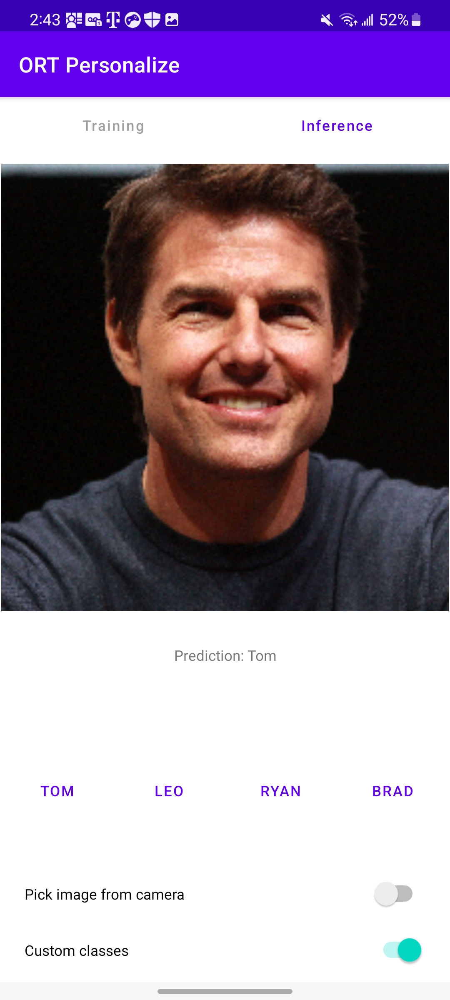
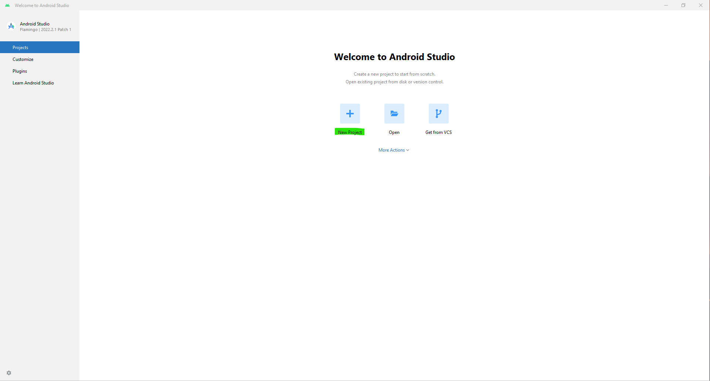
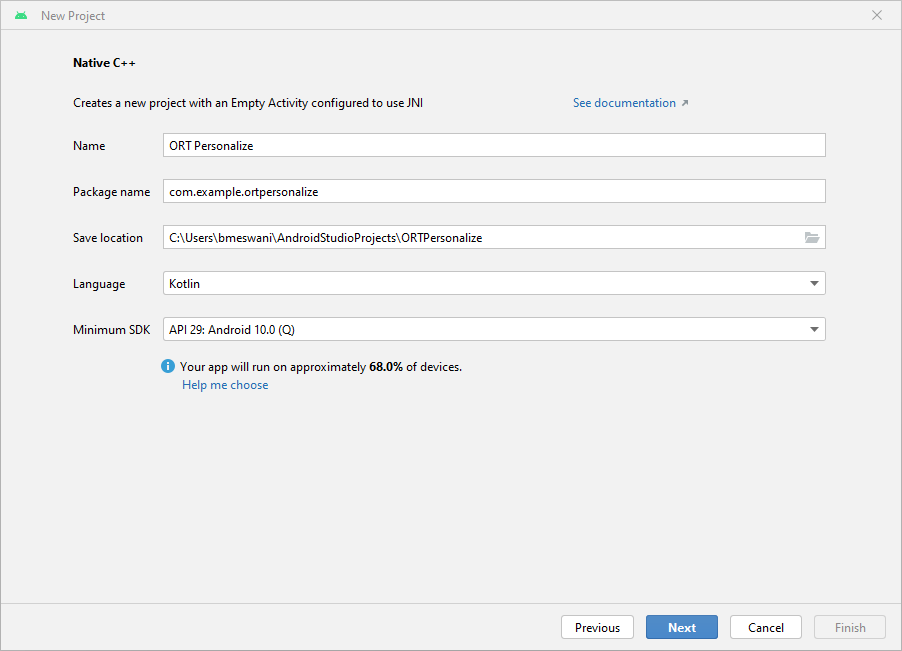
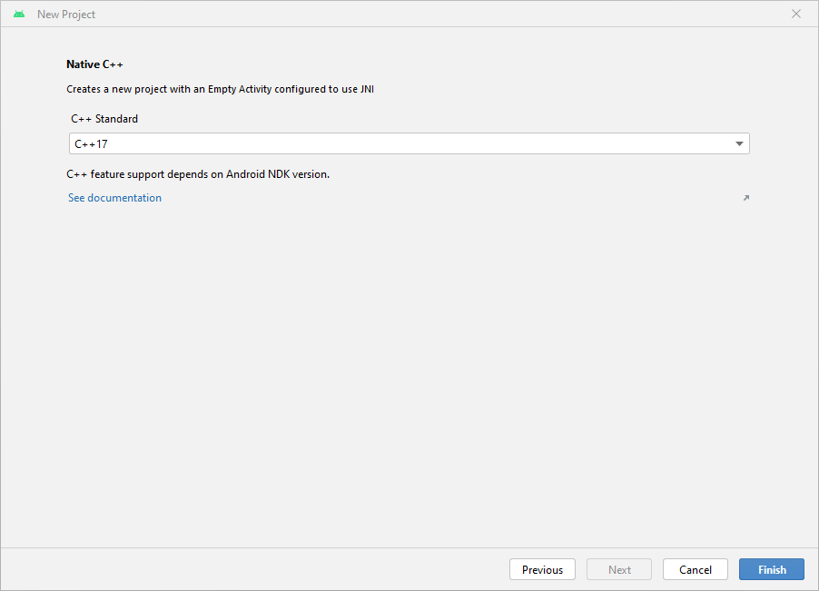
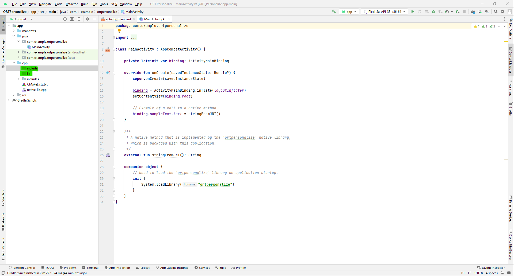
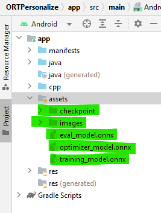
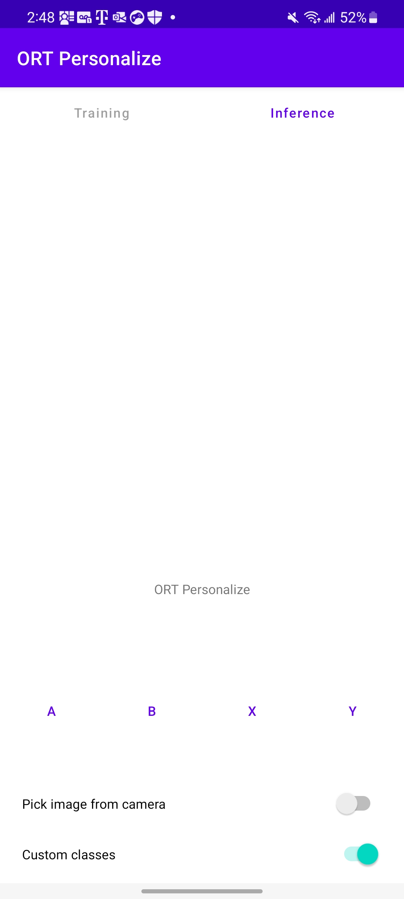
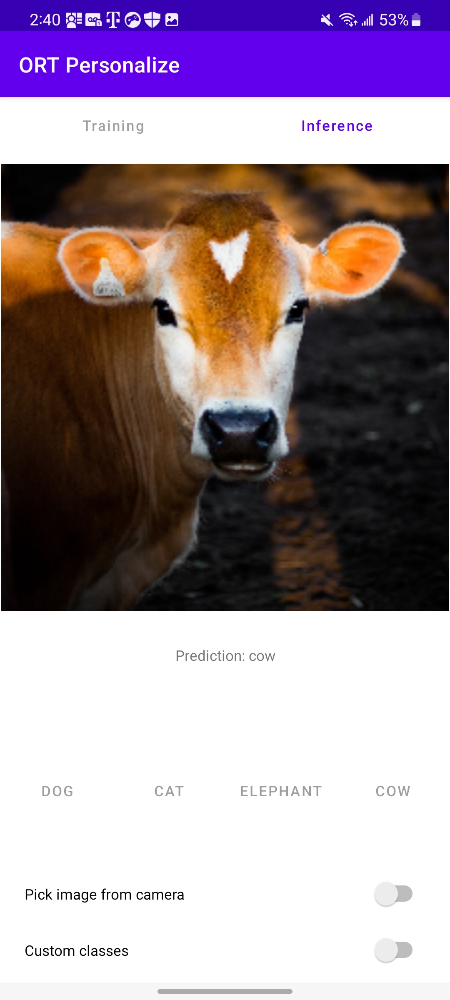

# On-Device Training: Building an Android Application

Here is what the application will look like at the end of this tutorial:



## Introduction

In this tutorial, we will explore how to build an Android application that incorporates ONNX Runtime's On-Device Training solution. On-device training refers to the process of training a machine learning model directly on an edge device without relying on cloud services or external servers.

We will guide you through the steps to create an Android app that can train a simple image classification model using on-device training techniques. This tutorial showcases the `transfer learning` technique where knowledge gained from training a model on one task is leveraged to improve the performance of a model on a different but related task. Instead of starting the learning process from scratch, transfer learning allows us to transfer the knowledge or features learned by a pre-trained model to a new task.

For this tutorial, we will leverage the `MobileNetV2` model which has been trained on large-scale image datasets such as ImageNet (which has 1,000 classes). We will use this model for classifying custom data into one of four classes. The initial layers of MobileNetV2 serve as a feature extractor, capturing generic visual features applicable to various tasks, and only the final classifier layer will be trained for the task at hand.

In this tutorial, we will use data to learn to:
- Classify animals into one of four categories using a pre-packed animals dataset.
- Classify celebrities into one of four categories using a custom celebrities dataset.

## Contents

- [Introduction](#introduction)
- [Prerequisites](#prerequisites)
- [Offline Phase - Building the training artifacts](#offline-phase---building-the-training-artifacts)
  - [Export the model to ONNX](#op1)
  - [Define the trainable and non trainable parameters](#op2)
  - [Generate the training artifacts](#op3)
- [Training Phase - Android application development](#training-phase---android-application-development)
  - [Setting up the project in Android Studio](#tp1)
  - [Adding the ONNX Runtime dependency](#tp2)
  - [Packaging the Prebuilt Training Artifacts and Dataset](#tp3)
  - [Interfacing with ONNX Runtime - C++ Code](#tp4)
  - [Image Preprocessing](#tp5)
  - [Application Frontend](#tp6)
- [Training Phase - Running the application on a device](#training-phase---running-the-application-on-a-device)
  - [Running the application on a device](#tp7)
  - [Training with a pre-loaded dataset - Animals](#tp8)
  - [Training with a custom dataset - Celebrities](#tp9)
- [Conclusion](#conclusion)

## Prerequisites

To follow this tutorial, you should have a basic understanding of Android app development using Java or Kotlin. Familiarity with C++ as well as familiarity with machine learning concepts such as neural networks and image classification will help as well.

- Python development environment to prepare the training artifacts
- Android Studio 4.1+
- Android SDK 29+
- Android NDK r21+
- An Android device with a camera in [developer mode](https://developer.android.com/studio/debug/dev-options) with USB debugging enabled

> **Note** The entire android application is also made available on the [`onnxruntime-training-examples`](https://github.com/microsoft/onnxruntime-training-examples/tree/master/on_device_training/mobile/android/c-cpp) GitHub repository.

## Offline Phase - Building the training artifacts

1. <a name="op1"></a>Export the model to ONNX.

    We start with a pre-trained PyTorch model and export it to ONNX. The `MobileNetV2` model has been pretrained on the imagenet dataset that has data in 1000 categories. For our task of image classification, we want to only classify images in 4 classes. So, we change the last layer of the model to output 4 logits instead of 1,000.

    More details around how to export PyTorch models to ONNX can be found [here](https://pytorch.org/docs/stable/onnx.html).

    ```python
   import torch
   import torchvision

   model = torchvision.models.mobilenet_v2(
      weights=torchvision.models.MobileNet_V2_Weights.IMAGENET1K_V2)

   # The original model is trained on imagenet which has 1000 classes.
   # For our image classification scenario, we need to classify among 4 categories.
   # So we need to change the last layer of the model to have 4 outputs.
   model.classifier[1] = torch.nn.Linear(1280, 4)

   # Export the model to ONNX.
   model_name = "mobilenetv2"
   torch.onnx.export(model, torch.randn(1, 3, 224, 224),
                     f"training_artifacts/{model_name}.onnx",
                     input_names=["input"], output_names=["output"],
                     dynamic_axes={"input": {0: "batch"}, "output": {0: "batch"}})
    ```

2. <a name="op2"></a>Define the trainable and non trainable parameters

    ```python
   import onnx

   # Load the onnx model.
   onnx_model = onnx.load(f"training_artifacts/{model_name}.onnx")

   # Define the parameters that require their gradients to be computed
   # (trainable parameters) and those that do not (frozen/non trainable parameters).
   requires_grad = ["classifier.1.weight", "classifier.1.bias"]
   frozen_params = [
      param.name
      for param in onnx_model.graph.initializer
      if param.name not in requires_grad
   ]
    ```

3. <a name="op-3"></a>Generate the training artifacts.

   We will use the `CrossEntropyLoss` loss and the `AdamW` optimizer for this tutorial. More details around artifact generation can be found [here](../../docs/api/python/on_device_training/training_artifacts.html).

    ```python
   from onnxruntime.training import artifacts

   # Generate the training artifacts.
   artifacts.generate_artifacts(
      onnx_model,
      requires_grad=requires_grad,
      frozen_params=frozen_params,
      loss=artifacts.LossType.CrossEntropyLoss,
      optimizer=artifacts.OptimType.AdamW,
      artifact_directory="training_artifacts"
   )
    ```


   That's all! The training artifacts have been generated in the `training_artifacts` folder. This marks the end of the offline phase. These artifacts are ready to be deployed to the Android device for training.

## Training Phase - Android application development

1. <a name="tp1"></a>Setting up the project in Android Studio

   a. Open Android Studio and click `New Project`
   

   b. Click on `Native C++` -> `Next`. Fill out the `New Project` details as follows:

     - Name - `ORT Personalize`
     - Package Name - `com.example.ortpersonalize`
     - Language - `Kotlin`

      Click `Next`.

   

   c. Select the `C++17` toolchain -> `Finish`

   

   d. That's it! The Android Studio project has been set up. You should now be able to see the Android Studio editor with some boiler plate code.

2. <a name="tp2"></a>Adding the ONNX Runtime dependency

   a. Create two new folder called `lib` and `include\onnxruntime` under the cpp directory in the Android Studio project.

   

   b. Head over to [Maven Central](https://central.sonatype.com/artifact/com.microsoft.onnxruntime/onnxruntime-training-android/). Go to `Versions`->`Browse`-> and download the `onnxruntime-training-android` archive package (aar file).

   c. Rename the `aar` extension to `zip`. So `onnxruntime-training-android-1.15.0.aar` becomes `onnxruntime-training-android-1.15.0.zip`.

   d. Extract the contents of the zip file.

   e. Copy the `libonnxruntime.so` shared library from the `jni\arm64-v8a` folder to your Android project under the newly created `lib` folder.

   f. Copy the contents of the `headers` folder to the newly created `include\onnxruntime` folder.

   g. In the `native-lib.cpp` file, include the training cxx header file.

   ```cpp
   #include "onnxruntime_training_cxx_api.h"
   ```

   h. Add `abiFilters` to the `build.gradle (Module)` file so as to select `arm64-v8a`. This setting must be added under `defaultConfig` in `build.gradle`:

   ```gradle
   ndk {
      abiFilters 'arm64-v8a'
   }
   ```

   Note that the `defaultConfig` section of the `build.gradle` file should look like:

   ```diff
   defaultConfig {
      applicationId "com.example.ortpersonalize"
      minSdk 29
      targetSdk 33
      versionCode 1
      versionName "1.0"

      testInstrumentationRunner "androidx.test.runner.AndroidJUnitRunner"
      externalNativeBuild {
         cmake {
               cppFlags '-std=c++17'
         }
      }

   +   ndk {
   +      abiFilters 'arm64-v8a'
   +   }
   }
   ```

   i. Add the `onnxruntime` shared library to the `CMakeLists.txt` so that `cmake` can find and build against the shared library. To do this, add these lines after the `ortpersonalize` library is added in the `CMakeLists.txt`:

   ```bash
   add_library(onnxruntime SHARED IMPORTED)
   set_target_properties(onnxruntime PROPERTIES IMPORTED_LOCATION ${CMAKE_SOURCE_DIR}/lib/libonnxruntime.so)
   ```
   Let `CMake` know where the ONNX Runtime header files can be found by adding this line right after the above two lines:

   ```bash
   target_include_directories(ortpersonalize PRIVATE ${CMAKE_SOURCE_DIR}/include/onnxruntime)
   ```

   Link the Android C++ project against the `onnxruntime` library by adding the `onnxruntime` library to `target_link_libraries`:

   ```bash
   target_link_libraries( # Specifies the target library.
        ortpersonalize

        # Links the target library to the log library
        # included in the NDK.
        ${log-lib}

        onnxruntime)
   ```

   Note that the `CMakeLists.txt` file should look like:

   ```diff
   project("ortpersonalize")

   add_library( # Sets the name of the library.
         ortpersonalize

         # Sets the library as a shared library.
         SHARED

         # Provides a relative path to your source file(s).
         native-lib.cpp
   +     utils.cpp
   +     inference.cpp
   +     train.cpp)

   + add_library(onnxruntime SHARED IMPORTED)
   + set_target_properties(onnxruntime PROPERTIES IMPORTED_LOCATION ${CMAKE_SOURCE_DIR}/lib/libonnxruntime.so)
   + target_include_directories(ortpersonalize PRIVATE ${CMAKE_SOURCE_DIR}/include/onnxruntime)

   find_library( # Sets the name of the path variable.
         log-lib

         # Specifies the name of the NDK library that
         # you want CMake to locate.
         log)

   target_link_libraries( # Specifies the target library.
         ortpersonalize

         # Links the target library to the log library
         # included in the NDK.
         ${log-lib}

   +     onnxruntime)

   ```

   j. Build the application and wait for success to confirm that the app has included the ONNX Runtime headers and can link against the shared onnxruntime library successfully.

3. <a name="tp3"></a>Packaging the Prebuilt Training Artifacts and Dataset

   a. Create a new `assets` folder inside the `app` from the left pane of the Android Studio project by right click app -> New -> Folder -> Assets Folder and place it under main.

   b. Copy the training artifacts generated in step 2 to this folder.

   c. Now, head over to the [`onnxruntime-training-examples`](https://github.com/microsoft/onnxruntime-training-examples/tree/master/on_device_training/mobile/android/c-cpp/data) repo and download the dataset (`images.zip`) to your machine and extract it. This dataset was modified from the orignal [`animals-10`](https://www.kaggle.com/datasets/alessiocorrado99/animals10) dataset available on Kaggle created by [Corrado Alessio](https://www.kaggle.com/alessiocorrado99).

   d. Copy the downloaded `images` folder to `assets/images` directory in Android Studio.

   The left pane of the project should look like this:

   

4. <a name="tp4"></a>Interfacing with ONNX Runtime - C++ Code

   a. We will implement the following four functions in C++ that will be called from the application:
      - `createSession`: Will be invoked on the application startup. It will create a new `CheckpointState` and `TrainingSession` objects.
      - `releaseSession`: Will be invoked when the application is about to close. This function will free up resources that were allocated at the start of the application.
      - `performTraining`: Will be invoked when the user clicks the `Train` button on the UI.
      - `performInference`: Will be invoked when the user clicks the `Infer` button on the UI.

   b. Create Session

      This function gets called when the application is launched. This will use the training artifacts assets to create the `C++` CheckpointState and TrainingSession objects. These objects will be used for training the model on the device.

      The arguments to `createSession` are:
      - `checkpoint_path`: Cached path to the checkpoint artifact.
      - `train_model_path`: Cached path to the training model artifact.
      - `eval_model_path`: Cached path to the eval model artifact.
      - `optimizer_model_path`: Cached path to the optimizer model artifact.
      - `cache_dir_path`: Path to the cache dir on the android device. The cache dir is used as a way to access the training artifacts from the C++ code.

      The function returns a `long` that represents the pointer to the `session_cache` object. This `long` can be cast to `SessionCache` whenever we need access to the training session.

   ```cpp
   extern "C" JNIEXPORT jlong JNICALL
   Java_com_example_ortpersonalize_MainActivity_createSession(
         JNIEnv *env, jobject /* this */,
         jstring checkpoint_path, jstring train_model_path, jstring eval_model_path,
         jstring optimizer_model_path, jstring cache_dir_path)
   {
      std::unique_ptr<SessionCache> session_cache = std::make_unique<SessionCache>(
               utils::JString2String(env, checkpoint_path),
               utils::JString2String(env, train_model_path),
               utils::JString2String(env, eval_model_path),
               utils::JString2String(env, optimizer_model_path),
               utils::JString2String(env, cache_dir_path));
      return reinterpret_cast<long>(session_cache.release());
   }
   ```

      As can be seen from the function body above, this function creates a unique pointer to an object of the class `SessionCache`. The definition of `SessionCache` is provided below.

   ```cpp
   struct SessionCache {
      ArtifactPaths artifact_paths;
      Ort::Env ort_env;
      Ort::SessionOptions session_options;
      Ort::CheckpointState checkpoint_state;
      Ort::TrainingSession training_session;
      Ort::Session* inference_session;

      SessionCache(const std::string &checkpoint_path, const std::string &training_model_path,
                  const std::string &eval_model_path, const std::string &optimizer_model_path,
                  const std::string& cache_dir_path) :
      artifact_paths(checkpoint_path, training_model_path, eval_model_path, optimizer_model_path, cache_dir_path),
      ort_env(ORT_LOGGING_LEVEL_WARNING, "ort personalize"), session_options(),
      checkpoint_state(Ort::CheckpointState::LoadCheckpoint(artifact_paths.checkpoint_path.c_str())),
      training_session(session_options, checkpoint_state, artifact_paths.training_model_path.c_str(),
                        artifact_paths.eval_model_path.c_str(), artifact_paths.optimizer_model_path.c_str()),
      inference_session(nullptr) {}
   };
   ```

      The definition of `ArtifactPaths` is:

   ```cpp
   struct ArtifactPaths {
      std::string checkpoint_path;
      std::string training_model_path;
      std::string eval_model_path;
      std::string optimizer_model_path;
      std::string cache_dir_path;
      std::string inference_model_path;

      ArtifactPaths(const std::string &checkpoint_path, const std::string &training_model_path,
                     const std::string &eval_model_path, const std::string &optimizer_model_path,
                     const std::string& cache_dir_path) :
      checkpoint_path(checkpoint_path), training_model_path(training_model_path),
      eval_model_path(eval_model_path), optimizer_model_path(optimizer_model_path),
      cache_dir_path(cache_dir_path), inference_model_path(cache_dir_path + "/inference.onnx") {}
   };
   ```

   c. Release Session

      This function gets called when the application is about to shutdown. It releases the resources that were created when the application was launched, mainly the CheckpointState and the TrainingSession.

      The arguments to `releaseSession` are:
      - `session`: `long` representing the `SessionCache` object.

   ```cpp
   extern "C" JNIEXPORT void JNICALL
   Java_com_example_ortpersonalize_MainActivity_releaseSession(
         JNIEnv *env, jobject /* this */,
         jlong session) {
      auto *session_cache = reinterpret_cast<SessionCache *>(session);
      delete session_cache->inference_session;
      delete session_cache;
   }
   ```

   d. Perform Training

      This function gets called for every batch that needs to be trained. The training loop is written on the application side in Kotlin, and within the training loop, the `performTraining` function gets invoked for every batch.

      The arguments to `performTraining` are:
      - `session`: `long` representing the `SessionCache` object.
      - `batch`: Input images as a float array to be passed in for training.
      - `labels`: Labels as an int array associated with the input images provided for training.
      - `batch_size`: Number of images to process with each `TrainStep`.
      - `channels`: Number of channels in the image. For our example, this will always be invoked with the value `3`.
      - `frame_rows`: Number of rows in the image. For our example, this will always be invoked with the value `224`.
      - `frame_cols`: Number of columns in the image. For our example, this will always be invoked with the value `224`.

      The function returns a `float` that represents the training loss for this batch.

   ```cpp
   extern "C"
   JNIEXPORT float JNICALL
   Java_com_example_ortpersonalize_MainActivity_performTraining(
         JNIEnv *env, jobject /* this */,
         jlong session, jfloatArray batch, jintArray labels, jint batch_size,
         jint channels, jint frame_rows, jint frame_cols) {
      auto* session_cache = reinterpret_cast<SessionCache *>(session);

      if (session_cache->inference_session) {
         // Invalidate the inference session since we will be updating the model parameters
         // in train_step.
         // The next call to inference session will need to recreate the inference session.
         delete session_cache->inference_session;
         session_cache->inference_session = nullptr;
      }

      // Update the model parameters using this batch of inputs.
      return training::train_step(session_cache, env->GetFloatArrayElements(batch, nullptr),
                                 env->GetIntArrayElements(labels, nullptr), batch_size,
                                 channels, frame_rows, frame_cols);
   }
   ```

      The above function leverages the `train_step` function. The definition of the `train_step` function is as follows:

   ```cpp
   namespace training {

      float train_step(SessionCache* session_cache, float *batches, int32_t *labels,
                        int64_t batch_size, int64_t image_channels, int64_t image_rows,
                        int64_t image_cols) {
         const std::vector<int64_t> input_shape({batch_size, image_channels, image_rows, image_cols});
         const std::vector<int64_t> labels_shape({batch_size});

         Ort::MemoryInfo memory_info = Ort::MemoryInfo::CreateCpu(OrtArenaAllocator, OrtMemTypeDefault);
         std::vector<Ort::Value> user_inputs; // {inputs, labels}
         // Inputs batched
         user_inputs.emplace_back(Ort::Value::CreateTensor(memory_info, batches,
                                                            batch_size * image_channels * image_rows * image_cols * sizeof(float),
                                                            input_shape.data(), input_shape.size(),
                                                            ONNX_TENSOR_ELEMENT_DATA_TYPE_FLOAT));

         // Labels batched
         user_inputs.emplace_back(Ort::Value::CreateTensor(memory_info, labels,
                                                            batch_size * sizeof(int32_t),
                                                            labels_shape.data(), labels_shape.size(),
                                                            ONNX_TENSOR_ELEMENT_DATA_TYPE_INT32));

         // Run the train step and execute the forward + loss + backward.
         float loss = *(session_cache->training_session.TrainStep(user_inputs).front().GetTensorMutableData<float>());

         // Update the model parameters by taking a step in the direction of the gradients computed above.
         session_cache->training_session.OptimizerStep();

         // Reset the gradients now that the parameters have been updated.
         // New set of gradients can then be computed for the next round of inputs.
         session_cache->training_session.LazyResetGrad();

         return loss;
      }

   } // namespace training
   ```

   e. Perform Inference

      This function gets called when the user wants to perform inferencing.

      The arguments to `performInference` are:
      - `session`: `long` representing the `SessionCache` object.
      - `image_buffer`: Input images as a float array to be passed in for training.
      - `batch_size`: Number of images to process with each inference. For our example, this will always be invoked with the value `1`.
      - `image_channels`: Number of channels in the image. For our example, this will always be invoked with the value `3`.
      - `image_rows`: Number of rows in the image. For our example, this will always be invoked with the value `224`.
      - `image_cols`: Number of columns in the image. For our example, this will always be invoked with the value `224`.
      - `classes`: List of strings representing all the four custom classes.

      The function returns a `string` that represents one of the four custom classes provided. This is the prediction of the model.

   ```cpp
   extern "C"
   JNIEXPORT jstring JNICALL
   Java_com_example_ortpersonalize_MainActivity_performInference(
         JNIEnv *env, jobject  /* this */,
         jlong session, jfloatArray image_buffer, jint batch_size, jint image_channels, jint image_rows,
         jint image_cols, jobjectArray classes) {

      std::vector<std::string> classes_str;
      for (int i = 0; i < env->GetArrayLength(classes); ++i) {
         // Access the current string element
         jstring elem = static_cast<jstring>(env->GetObjectArrayElement(classes, i));
         classes_str.push_back(utils::JString2String(env, elem));
      }

      auto* session_cache = reinterpret_cast<SessionCache *>(session);
      if (!session_cache->inference_session) {
         // The inference session does not exist, so create a new one.
         session_cache->training_session.ExportModelForInferencing(
                  session_cache->artifact_paths.inference_model_path.c_str(), {"output"});
         session_cache->inference_session = std::make_unique<Ort::Session>(
                  session_cache->ort_env, session_cache->artifact_paths.inference_model_path.c_str(),
                  session_cache->session_options).release();
      }

      auto prediction = inference::classify(
               session_cache, env->GetFloatArrayElements(image_buffer, nullptr),
               batch_size, image_channels, image_rows, image_cols, classes_str);

      return env->NewStringUTF(prediction.first.c_str());
   }
   ```

      The above function calls `classify`. The definition of classify is:

   ```cpp
   namespace inference {

      std::pair<std::string, float> classify(SessionCache* session_cache, float *image_data,
                                             int64_t batch_size, int64_t image_channels,
                                             int64_t image_rows, int64_t image_cols,
                                             const std::vector<std::string>& classes) {
         std::vector<const char *> input_names = {"input"};
         size_t input_count = 1;

         std::vector<const char *> output_names = {"output"};
         size_t output_count = 1;

         std::vector<int64_t> input_shape({batch_size, image_channels, image_rows, image_cols});

         Ort::MemoryInfo memory_info = Ort::MemoryInfo::CreateCpu(OrtArenaAllocator, OrtMemTypeDefault);
         std::vector<Ort::Value> input_values; // {input images}
         input_values.emplace_back(Ort::Value::CreateTensor(memory_info, image_data,
                                                            batch_size * image_channels * image_rows * image_cols * sizeof(float),
                                                            input_shape.data(), input_shape.size(),
                                                            ONNX_TENSOR_ELEMENT_DATA_TYPE_FLOAT));


         std::vector<Ort::Value> output_values;
         output_values.emplace_back(nullptr);

         // get the logits
         session_cache->inference_session->Run(Ort::RunOptions(), input_names.data(), input_values.data(),
                                                input_count, output_names.data(), output_values.data(), output_count);

         float *output = output_values.front().GetTensorMutableData<float>();

         // run softmax and get the probabilities of each class
         std::vector<float> probabilities = Softmax(output, classes.size());
         size_t best_index = std::distance(probabilities.begin(), std::max_element(probabilities.begin(), probabilities.end()));

         return {classes[best_index], probabilities[best_index]};
      }

   } // namespace inference
   ```

      The classify function invokes another function called `Softmax`. The definition of `Softmax` is:

   ```cpp
   std::vector<float> Softmax(float *logits, size_t num_logits) {
      std::vector<float> probabilities(num_logits, 0);
      float sum = 0;
      for (size_t i = 0; i < num_logits; ++i) {
            probabilities[i] = exp(logits[i]);
            sum += probabilities[i];
      }

      if (sum != 0.0f) {
            for (size_t i = 0; i < num_logits; ++i) {
               probabilities[i] /= sum;
            }
      }

      return probabilities;
   }
   ```

   d. Supporting functions and classes

      Lastly, let's define some utility functions that are needed for the above functions.

   ```cpp
   namespace utils {

      std::string JString2String(JNIEnv *env, jstring jStr) {
         if (!jStr)
               return std::string();

         const jclass stringClass = env->GetObjectClass(jStr);
         const jmethodID getBytes = env->GetMethodID(stringClass, "getBytes",
                                                      "(Ljava/lang/String;)[B");
         const jbyteArray stringJbytes = (jbyteArray) env->CallObjectMethod(jStr, getBytes,
                                                                              env->NewStringUTF(
                                                                                    "UTF-8"));

         size_t length = (size_t) env->GetArrayLength(stringJbytes);
         jbyte *pBytes = env->GetByteArrayElements(stringJbytes, nullptr);

         std::string ret = std::string((char *) pBytes, length);
         env->ReleaseByteArrayElements(stringJbytes, pBytes, JNI_ABORT);

         env->DeleteLocalRef(stringJbytes);
         env->DeleteLocalRef(stringClass);
         return ret;
      }

   } // utils
   ```

5. <a name="tp5"></a>Image Preprocessing

   a. The `MobileNetV2` model expects that the input image provided be
      - of size `3 x 224 x 224`.
      - a normalized image with the mean `(0.485, 0.456, 0.406)` subtracted and divided by the standard deviation `(0.229, 0.224, 0.225)`

      This preprocessing is done in Java/Kotlin using the android provided libraries.

      Let's create a new file called `ImageProcessingUtil.kt` under the `app/src/main/java/com/example/ortpersonalize` directory. We will add the utility methods for cropping and resizing, and normalizing the images in this file.

   b. Cropping and resizing the image.

   ```java
   fun processBitmap(bitmap: Bitmap) : Bitmap {
      // This function processes the given bitmap by
      //   - cropping along the longer dimension to get a square bitmap
      //     If the width is larger than the height
      //     ___+_________________+___
      //     |  +                 +  |
      //     |  +                 +  |
      //     |  +        +        +  |
      //     |  +                 +  |
      //     |__+_________________+__|
      //     <-------- width -------->
      //        <----- height ---->
      //     <-->      cropped    <-->
      //
      //     If the height is larger than the width
      //     _________________________   ʌ            ʌ
      //     |                       |   |         cropped
      //     |+++++++++++++++++++++++|   |      ʌ     v
      //     |                       |   |      |
      //     |                       |   |      |
      //     |           +           | height width
      //     |                       |   |      |
      //     |                       |   |      |
      //     |+++++++++++++++++++++++|   |      v     ʌ
      //     |                       |   |         cropped
      //     |_______________________|   v            v
      //
      //
      //
      //   - resizing the cropped square image to be of size (3 x 224 x 224) as needed by the
      //     mobilenetv2 model.
      lateinit var bitmapCropped: Bitmap
      if (bitmap.getWidth() >= bitmap.getHeight()) {
         // Since height is smaller than the width, we crop a square whose length is the height
         // So cropping happens along the width dimesion
         val width: Int = bitmap.getHeight()
         val height: Int = bitmap.getHeight()

         // left side of the cropped image must begin at (bitmap.getWidth() / 2 - bitmap.getHeight() / 2)
         // so that the cropped width contains equal portion of the width on either side of center
         // top side of the cropped image must begin at 0 since we are not cropping along the height
         // dimension
         val x: Int = bitmap.getWidth() / 2 - bitmap.getHeight() / 2
         val y: Int = 0
         bitmapCropped = Bitmap.createBitmap(bitmap, x, y, width, height)
      } else {
         // Since width is smaller than the height, we crop a square whose length is the width
         // So cropping happens along the height dimesion
         val width: Int = bitmap.getWidth()
         val height: Int = bitmap.getWidth()

         // left side of the cropped image must begin at 0 since we are not cropping along the width
         // dimension
         // top side of the cropped image must begin at (bitmap.getHeight() / 2 - bitmap.getWidth() / 2)
         // so that the cropped height contains equal portion of the height on either side of center
         val x: Int = 0
         val y: Int = bitmap.getHeight() / 2 - bitmap.getWidth() / 2
         bitmapCropped = Bitmap.createBitmap(bitmap, x, y, width, height)
      }

      // Resize the image to be channels x width x height as needed by the mobilenetv2 model
      val width: Int = 224
      val height: Int = 224
      val bitmapResized: Bitmap = Bitmap.createScaledBitmap(bitmapCropped, width, height, false)

      return bitmapResized
   }
   ```

   c. Normalizing the image.

   ```java
   fun processImage(bitmap: Bitmap, buffer: FloatBuffer, offset: Int) {
      // This function iterates over the image and performs the following
      // on the image pixels
      //   - normalizes the pixel values to be between 0 and 1
      //   - substracts the mean (0.485, 0.456, 0.406) (derived from the mobilenetv2 model configuration)
      //     from the pixel values
      //   - divides by pixel values by the standard deviation (0.229, 0.224, 0.225) (derived from the
      //     mobilenetv2 model configuration)
      // Values are written to the given buffer starting at the provided offset.
      // Values are written as follows
      // |____|____________________|__________________| <--- buffer
      //      ʌ                                         <--- offset
      //                           ʌ                    <--- offset + width * height * channels
      // |____|rrrrrr|_____________|__________________| <--- red channel read in column major order
      // |____|______|gggggg|______|__________________| <--- green channel read in column major order
      // |____|______|______|bbbbbb|__________________| <--- blue channel read in column major order

      val width: Int = bitmap.getWidth()
      val height: Int = bitmap.getHeight()
      val stride: Int = width * height

      for (x in 0 until width) {
         for (y in 0 until height) {
               val color: Int = bitmap.getPixel(y, x)
               val index = offset + (x * height + y)

               // Subtract the mean and divide by the standard deviation
               // Values for mean and standard deviation used for
               // the movilenetv2 model.
               buffer.put(index + stride * 0, ((Color.red(color).toFloat() / 255f) - 0.485f) / 0.229f)
               buffer.put(index + stride * 1, ((Color.green(color).toFloat() / 255f) - 0.456f) / 0.224f)
               buffer.put(index + stride * 2, ((Color.blue(color).toFloat() / 255f) - 0.406f) / 0.225f)
         }
      }
   }
   ```

      d. Getting a Bitmap from a Uri

   ```java
   fun bitmapFromUri(uri: Uri, contentResolver: ContentResolver): Bitmap {
      // This function reads the image file at the given uri and decodes it to a bitmap
      val source: ImageDecoder.Source = ImageDecoder.createSource(contentResolver, uri)
      return ImageDecoder.decodeBitmap(source).copy(Bitmap.Config.ARGB_8888, true)
   }
   ```

6. <a name="tp6"></a>Application Frontend

   a. For this tutorial, we will be using the following user interface elements:
     - Train and Infer buttons
     - Class buttons
     - Status message text
     - Image display
     - Progress dialogue

   b. This tutorial does not intend to show how the graphical user interface is created. For this reason, we will simply re-use the files available on [GitHub](https://github.com/microsoft/onnxruntime-training-examples/).

   c. Copy all the string definitions from [`strings.xml`](https://github.com/microsoft/onnxruntime-training-examples/blob/206521eb22e496b2ea50bef956e63273b6b1d5bf/on_device_training/mobile/android/c-cpp/app/ORTPersonalize/app/src/main/res/values/strings.xml) to `strings.xml` local to your Android Studio.

   d. Copy the contents from [`activity_main.xml`](https://github.com/microsoft/onnxruntime-training-examples/blob/206521eb22e496b2ea50bef956e63273b6b1d5bf/on_device_training/mobile/android/c-cpp/app/ORTPersonalize/app/src/main/res/layout/activity_main.xml) to `activity_main.xml` local to your Android Studio.

   e. Create a new file under the `layout` folder called `dialog.xml`. Copy the contents from [`dialog.xml`](https://github.com/microsoft/onnxruntime-training-examples/blob/206521eb22e496b2ea50bef956e63273b6b1d5bf/on_device_training/mobile/android/c-cpp/app/ORTPersonalize/app/src/main/res/layout/dialog.xml) to the newly created `dialog.xml` local to your Android Studio.

   f. The remainder of the changes in this section need to be made in the `MainActivity.kt` file.

   g. Imports:

   ```java
   package com.example.ortpersonalize

   import android.Manifest
   import android.app.Dialog
   import android.content.DialogInterface
   import android.content.Intent
   import android.content.pm.PackageManager
   import android.graphics.Bitmap
   import android.net.Uri
   import android.os.Bundle
   import android.provider.MediaStore
   import android.text.InputType
   import android.util.Log
   import android.view.View
   import android.view.Window
   import android.view.WindowManager
   import android.widget.*
   import androidx.appcompat.app.AlertDialog
   import androidx.appcompat.app.AppCompatActivity
   import com.example.ortpersonalize.databinding.ActivityMainBinding
   import java.nio.FloatBuffer
   import java.nio.IntBuffer
   import java.util.*
   ```

   h. All member variables in `MainActivity` class:

   ```java
   private lateinit var binding: ActivityMainBinding
   private var ort_session: Long = -1 // Give a default initial value.
   private val PICK_IMAGE = 1000 // Pick an image for inferencing from the android gallery
   private val CAPTURE_IMAGE = 2000 // Capture an image from the camera
   private val PICK_CLASS_A_IMAGES_FOR_TRAINING = 4000 // Pick class A images for training from the android gallery
   private val PICK_CLASS_B_IMAGES_FOR_TRAINING = 5000 // Pick class B images for training from the android gallery
   private val PICK_CLASS_X_IMAGES_FOR_TRAINING = 6000 // Pick class X images for training from the android gallery
   private val PICK_CLASS_Y_IMAGES_FOR_TRAINING = 7000 // Pick class Y images for training from the android gallery
   private val CAMERA_PERMISSION_CODE = 8 // Permission to access the camera
   private var images = ArrayList<Pair<Uri, Int>>() // Array that stores the Uri for all images that need to be trained.
   private var samplesClassA = 0 // Number of samples for class A
   private var nameClassA: String = "A" // Default class A name
   private var samplesClassB = 0 // Number of samples for class B
   private var nameClassB: String = "B" // Default class B name
   private var samplesClassX = 0 // Number of samples for class X
   private var nameClassX: String = "X" // Default class X name
   private var samplesClassY = 0 // Number of samples for class Y
   private var nameClassY: String = "Y" // Default class Y name
   private val prepackedDefaultLabels: Array<String> = arrayOf("dog", "cat", "elephant", "cow") // Default labels for non custom class
   ```

   i. Launching the application

      When the application launches, the `onCreate` function gets invoked. This function is responsible for setting up the session cache and the user interface handlers.

      The code for this function is:

   ```java
   override fun onCreate(savedInstanceState: Bundle?) {
      super.onCreate(savedInstanceState)

      binding = ActivityMainBinding.inflate(layoutInflater)
      setContentView(binding.root)

      val trainingModelPath = copyAssetToCacheDir("training_model.onnx", "training_model.onnx")
      val evalModelPath = copyAssetToCacheDir("eval_model.onnx", "eval_model.onnx")
      val checkpointPath = copyFileOrDir("checkpoint")
      val optimizerModelPath = copyAssetToCacheDir("optimizer_model.onnx", "optimizer_model.onnx")
      ort_session = createSession(checkpointPath, trainingModelPath, evalModelPath, optimizerModelPath,
            "$cacheDir")

      val inferButton: Button = findViewById(R.id.infer_button)
      inferButton.setOnClickListener(onInferenceButtonClickedListener)

      val trainButton: Button = findViewById(R.id.train_button)
      trainButton.setOnClickListener(onTrainButtonClickedListener)
      trainButton.isEnabled = false

      val classA: Button = findViewById(R.id.classA)
      classA.setOnClickListener(onClassAClickedListener)
      classA.setOnLongClickListener(onClassALongClickedListener)

      val classB: Button = findViewById(R.id.classB)
      classB.setOnClickListener(onClassBClickedListener)
      classB.setOnLongClickListener(onClassBLongClickedListener)

      val classX: Button = findViewById(R.id.classX)
      classX.setOnClickListener(onClassXClickedListener)
      classX.setOnLongClickListener(onClassXLongClickedListener)

      val classY: Button = findViewById(R.id.classY)
      classY.setOnClickListener(onClassYClickedListener)
      classY.setOnLongClickListener(onClassYLongClickedListener)

      binding.customClassSetting.setOnCheckedChangeListener(onCustomClassSettingChangedListener)

      // Home screen
      binding.statusMessage.text = "ORT Personalize"
   }
   ```

   j. Custom class button handlers - We would like to use the class buttons for users to select their custom images for training. We need to add the listeners for these buttons to do this. These listeners will do exactly that:

   ```java
   private val onClassAClickedListener: View.OnClickListener = object : View.OnClickListener {
      override fun onClick(v: View) {
         val intent = Intent()
         intent.type = "image/*"
         intent.putExtra(Intent.EXTRA_ALLOW_MULTIPLE, true)
         intent.action = Intent.ACTION_GET_CONTENT
         startActivityForResult(Intent.createChooser(intent, "Select Picture"), PICK_CLASS_A_IMAGES_FOR_TRAINING)
      }
   }

   private val onClassBClickedListener: View.OnClickListener = object : View.OnClickListener {
      override fun onClick(v: View) {
         val intent = Intent()
         intent.type = "image/*"
         intent.putExtra(Intent.EXTRA_ALLOW_MULTIPLE, true)
         intent.action = Intent.ACTION_GET_CONTENT
         startActivityForResult(Intent.createChooser(intent, "Select Picture"), PICK_CLASS_B_IMAGES_FOR_TRAINING)
      }
   }

   private val onClassXClickedListener: View.OnClickListener = object : View.OnClickListener {
      override fun onClick(v: View) {
         val intent = Intent()
         intent.type = "image/*"
         intent.putExtra(Intent.EXTRA_ALLOW_MULTIPLE, true)
         intent.action = Intent.ACTION_GET_CONTENT
         startActivityForResult(Intent.createChooser(intent, "Select Picture"), PICK_CLASS_X_IMAGES_FOR_TRAINING)
      }
   }

   private val onClassYClickedListener: View.OnClickListener = object : View.OnClickListener {
      override fun onClick(v: View) {
         val intent = Intent()
         intent.type = "image/*"
         intent.putExtra(Intent.EXTRA_ALLOW_MULTIPLE, true)
         intent.action = Intent.ACTION_GET_CONTENT
         startActivityForResult(Intent.createChooser(intent, "Select Picture"), PICK_CLASS_Y_IMAGES_FOR_TRAINING)
      }
   }
   ```

   k. Personalize the custom class labels

      By default, the custom class labels are `[A, B, X, Y]`. But, let's allow users to rename these labels for clarity. The code that does this is:

   ```java
   private val onClassALongClickedListener: View.OnLongClickListener = object : View.OnLongClickListener {
      override fun onLongClick(v: View): Boolean {
         val builder: AlertDialog.Builder = AlertDialog.Builder(v.context)
         builder.setTitle("Change class name")

         val input = EditText(v.context)
         input.inputType = InputType.TYPE_CLASS_TEXT
         builder.setView(input)

         builder.setPositiveButton("OK",
               DialogInterface.OnClickListener { dialog, which ->
                  val classA: Button = findViewById(R.id.classA)
                  nameClassA = input.text.toString()
                  classA.text = nameClassA
               })
         builder.setNegativeButton("Cancel",
               DialogInterface.OnClickListener { dialog, which -> dialog.cancel() })

         builder.show()

         return true
      }
   }

   private val onClassBLongClickedListener: View.OnLongClickListener = object : View.OnLongClickListener {
      override fun onLongClick(v: View): Boolean {
         val builder: AlertDialog.Builder = AlertDialog.Builder(v.context)
         builder.setTitle("Change class name")

         val input = EditText(v.context)
         input.inputType = InputType.TYPE_CLASS_TEXT
         builder.setView(input)

         builder.setPositiveButton("OK",
               DialogInterface.OnClickListener { dialog, which ->
                  val classB: Button = findViewById(R.id.classB)
                  nameClassB = input.text.toString()
                  classB.text = nameClassB
               })
         builder.setNegativeButton("Cancel",
               DialogInterface.OnClickListener { dialog, which -> dialog.cancel() })

         builder.show()

         return true
      }
   }

   private val onClassXLongClickedListener: View.OnLongClickListener = object : View.OnLongClickListener {
      override fun onLongClick(v: View): Boolean {
         val builder: AlertDialog.Builder = AlertDialog.Builder(v.context)
         builder.setTitle("Change class name")

         val input = EditText(v.context)
         input.inputType = InputType.TYPE_CLASS_TEXT
         builder.setView(input)

         builder.setPositiveButton("OK",
               DialogInterface.OnClickListener { dialog, which ->
                  val classX: Button = findViewById(R.id.classX)
                  nameClassX = input.text.toString()
                  classX.text = nameClassX
               })
         builder.setNegativeButton("Cancel",
               DialogInterface.OnClickListener { dialog, which -> dialog.cancel() })

         builder.show()

         return true
      }
   }

   private val onClassYLongClickedListener: View.OnLongClickListener = object : View.OnLongClickListener {
      override fun onLongClick(v: View): Boolean {
         val builder: AlertDialog.Builder = AlertDialog.Builder(v.context)
         builder.setTitle("Change class name")

         val input = EditText(v.context)
         input.inputType = InputType.TYPE_CLASS_TEXT
         builder.setView(input)

         builder.setPositiveButton("OK",
               DialogInterface.OnClickListener { dialog, which ->
                  val classY: Button = findViewById(R.id.classY)
                  nameClassY = input.text.toString()
                  classY.text = nameClassY
               })
         builder.setNegativeButton("Cancel",
               DialogInterface.OnClickListener { dialog, which -> dialog.cancel() })

         builder.show()

         return true
      }
   }
   ```

   l. Toggling the custom classes.

      When the custom class toggle is turned off, the prepackaged animals dataset is run. And when it is turned on, the user is expected to bring their own dataset for training. To handle this transition:

   ```java
   private val onCustomClassSettingChangedListener: CompoundButton.OnCheckedChangeListener = object : CompoundButton.OnCheckedChangeListener {
      override fun onCheckedChanged(button: CompoundButton?, isChecked: Boolean) {
            disableButtons()
            binding.statusMessage.text = ""
            binding.inputImage.setImageResource(0)
            if (isChecked) {
               binding.classA.text = nameClassA
               binding.classB.text = nameClassB
               binding.classX.text = nameClassX
               binding.classY.text = nameClassY
               releaseSession(ort_session)
               val trainingModelPath = copyAssetToCacheDir("training_model.onnx", "training_model.onnx")
               val evalModelPath = copyAssetToCacheDir("eval_model.onnx", "eval_model.onnx")
               val checkpointPath = copyFileOrDir("checkpoint")
               val optimizerModelPath = copyAssetToCacheDir("optimizer_model.onnx", "optimizer_model.onnx")
               ort_session = createSession(checkpointPath, trainingModelPath, evalModelPath, optimizerModelPath,
                  "$cacheDir")
               enableButtons()
            } else {
               binding.classA.text = String.format("%s (20)", prepackedDefaultLabels[0])
               binding.classB.text = String.format("%s (20)", prepackedDefaultLabels[1])
               binding.classX.text = String.format("%s (20)", prepackedDefaultLabels[2])
               binding.classY.text = String.format("%s (20)", prepackedDefaultLabels[3])
               releaseSession(ort_session)
               val trainingModelPath = copyAssetToCacheDir("training_model.onnx", "training_model.onnx")
               val evalModelPath = copyAssetToCacheDir("eval_model.onnx", "eval_model.onnx")
               val checkpointPath = copyFileOrDir("checkpoint")
               val optimizerModelPath = copyAssetToCacheDir("optimizer_model.onnx", "optimizer_model.onnx")
               ort_session = createSession(checkpointPath, trainingModelPath, evalModelPath, optimizerModelPath,
                  "$cacheDir")
               binding.trainButton.isEnabled = true
               binding.inferButton.isEnabled = true
            }
      }
   }
   ```

   m. Training handler
   
      When each class has at least 1 image, the `Train` button can be enabled. When the `Train` button is clicked, training kicks in for the selected images. The training handler is responsible for:
      - collecting the training images into one container.
      - shuffling the order of the images.
      - cropping and resizing the images.
      - normalizing the images.
      - batching the images.
      - executing the training loop (invoking the C++ `performTraining` function in a loop).

      Here is the complete function that does the above:

   ```java
   private val onTrainButtonClickedListener: View.OnClickListener = object : View.OnClickListener {
      override fun onClick(v: View) {
            // Reset the samples
            samplesClassA = 0
            samplesClassB = 0
            samplesClassX = 0
            samplesClassY = 0

            // Reset the state message
            binding.statusMessage.text = ""
            // Reset the image view
            binding.inputImage.setImageResource(0)

            // Update the class names based on whether customClassSetting is checked or not
            if (binding.customClassSetting.isChecked) {
               binding.classA.text = nameClassA
               binding.classB.text = nameClassB
               binding.classX.text = nameClassX
               binding.classY.text = nameClassY
            } else {
               binding.classA.text = prepackedDefaultLabels[0]
               binding.classB.text = prepackedDefaultLabels[1]
               binding.classX.text = prepackedDefaultLabels[2]
               binding.classY.text = prepackedDefaultLabels[3]

               // Move asset images to the cache and collect their Uris for training.
               val cachePath: String = copyFileOrDir("images")
               for ((index, label) in prepackedDefaultLabels.withIndex()) {
                  for (image_num in 1..20) {
                        val imagePath: String = String.format("%s/%s/%s%02d.jpeg", cachePath, label, label, image_num)
                        val f = java.io.File(imagePath)
                        images.add(Pair(Uri.fromFile(f), index))
                  }
               }
            }
            binding.trainButton.isEnabled = false

            disableButtons()
            binding.statusMessage.text = ""

            val dialog = Dialog(v.context)
            dialog.requestWindowFeature(Window.FEATURE_NO_TITLE)
            dialog.setTitle("Training...")
            dialog.setCancelable(false)
            dialog.setContentView(R.layout.dialog)

            val text = dialog.findViewById(R.id.progress_horizontal) as ProgressBar
            val percentage: TextView = dialog.findViewById(R.id.percent_complete)
            val trainingStatus: TextView = dialog.findViewById(R.id.train_status)
            trainingStatus.text = "Training... (epoch: 0/5)"

            dialog.show()
            val window = dialog.window
            window!!.setLayout(
               WindowManager.LayoutParams.MATCH_PARENT,
               WindowManager.LayoutParams.WRAP_CONTENT
            )

            Thread(Runnable {
               val batchSize: Int = 4
               val channels: Int = 3
               val width: Int = 224
               val height: Int = 224
               val numEpochs: Int = 5

               for (epoch in 0 until numEpochs) {
                  // Shuffle the images so that we don't have a bias during training
                  Collections.shuffle(images);
                  for (i in 0..images.size - 1 step batchSize) {
                        val imgData = FloatBuffer.allocate(batchSize * channels * width * height)
                        imgData.rewind()
                        val labels = IntBuffer.allocate(batchSize)
                        labels.rewind()
                        for (j in 0 until batchSize) {
                           if (i + j >= images.size) {
                              break
                           }

                           labels.put(j, images[i + j].second)

                           val bitmap: Bitmap =
                              processBitmap(bitmapFromUri(images[i + j].first, contentResolver))
                           val imageWidth: Int = bitmap.getWidth()
                           val imageHeight: Int = bitmap.getHeight()
                           val stride: Int = imageWidth * imageHeight
                           val offset = j * stride * channels

                           processImage(bitmap, imgData, offset)
                        }
                        imgData.rewind()
                        labels.rewind()

                        performTraining(
                           ort_session, imgData.array(), labels.array(), batchSize,
                           channels, height, width
                        )

                        this@MainActivity.runOnUiThread(java.lang.Runnable {
                           val status: Int = (100f * ((epoch*images.size).toFloat() + i.toFloat()) / (images.size * numEpochs)).toInt()
                           text.setProgress(status)
                           percentage.setText(status.toString())
                        })
                  }
                  this@MainActivity.runOnUiThread(java.lang.Runnable {
                        trainingStatus.setText(String.format("Training... (epoch: %d/%d)", epoch+1, numEpochs))
                  })
               }

               this@MainActivity.runOnUiThread(java.lang.Runnable {
                  images.clear()
                  dialog.dismiss()
                  binding.statusMessage.text = "Training Complete"
                  enableButtons()
               })
            }).start()
      }
   }
   ```

   n. Inference handler

      Once training is complete, the user can click the `Infer` button to infer any image. The inference handler is responsible for
      - collecting the inference image.
      - cropping and resizing the image.
      - normalizing the image.
      - invoking the C++ `performInference` function.
      - Reporting the inferred output to the user interface.

      Here is the complete function that does the above.

   ```java
   private val onInferenceButtonClickedListener: View.OnClickListener = object : View.OnClickListener {
      override fun onClick(v: View) {
            val cameraSetting: Switch = findViewById(R.id.camera_setting)
            if (cameraSetting.isChecked()) {
               if (checkSelfPermission(Manifest.permission.CAMERA) != PackageManager.PERMISSION_GRANTED) {
                  requestPermissions(arrayOf(Manifest.permission.CAMERA), CAMERA_PERMISSION_CODE)
               } else {
                  val cameraIntent = Intent(MediaStore.ACTION_IMAGE_CAPTURE)
                  startActivityForResult(cameraIntent, CAPTURE_IMAGE)
               }
            } else {
               val intent = Intent()
               intent.type = "image/*"
               intent.action = Intent.ACTION_GET_CONTENT
               startActivityForResult(Intent.createChooser(intent, "Select Picture"), PICK_IMAGE)
            }
      }
   }

   override fun onRequestPermissionsResult(
      requestCode: Int,
      permissions: Array<String?>,
      grantResults: IntArray
   ) {
      super.onRequestPermissionsResult(requestCode, permissions, grantResults)
      if (requestCode == CAMERA_PERMISSION_CODE) {
            if (grantResults[0] == PackageManager.PERMISSION_GRANTED) {
               Toast.makeText(this, "camera permission granted", Toast.LENGTH_LONG).show()
               val cameraIntent = Intent(MediaStore.ACTION_IMAGE_CAPTURE)
               startActivityForResult(cameraIntent, CAPTURE_IMAGE)
            } else {
               Toast.makeText(this, "camera permission denied", Toast.LENGTH_LONG).show()
            }
      }
   }
   ```

   o. Handler for the activities mentioned above

      Once the image(s) have been selected for inference or for the custom classes, they need to be processed. This function does that

   ```java
   override fun onActivityResult(requestCode: Int, resultCode: Int, data: Intent?) {
      super.onActivityResult(requestCode, resultCode, data)

      if (resultCode != RESULT_OK) {
            return
      }

      lateinit var srcBitMap: Bitmap
      if (requestCode == PICK_IMAGE) {
            srcBitMap = data?.data?.let { bitmapFromUri(it, contentResolver) }!!
      } else if (requestCode == CAPTURE_IMAGE) {
            srcBitMap = data?.extras?.get("data") as Bitmap
      } else if (requestCode == PICK_CLASS_A_IMAGES_FOR_TRAINING) {
            if (data?.getClipData() != null) {
               val count: Int = data?.getClipData()!!.getItemCount()
               for (i in 0 until count) {
                  samplesClassA += 1
                  val pair = Pair(data?.getClipData()!!.getItemAt(i).getUri(), 0)
                  images.add(pair)
               }
            } else if (data?.getData() != null) {
               samplesClassA += 1
               val pair = Pair(data?.getData()!!, 0);
               images.add(pair)
            }
            binding.classA.text = String.format("%s (%d)", nameClassA, samplesClassA)
            binding.trainButton.isEnabled = true
            binding.statusMessage.text = ""
            binding.inputImage.setImageResource(0)
            return
      } else if (requestCode == PICK_CLASS_B_IMAGES_FOR_TRAINING) {
            if (data?.getClipData() != null) {
               val count: Int = data?.getClipData()!!.getItemCount()
               for (i in 0 until count) {
                  samplesClassB += 1
                  val pair = Pair(data?.getClipData()!!.getItemAt(i).getUri(), 1)
                  images.add(pair)
               }
            } else if (data?.getData() != null) {
               samplesClassB += 1
               val pair = Pair(data.getData()!!, 1);
               images.add(pair)
            }
            binding.classB.text = String.format("%s (%d)", nameClassB, samplesClassB)
            binding.trainButton.isEnabled = true
            binding.statusMessage.text = ""
            binding.inputImage.setImageResource(0)
            return
      } else if (requestCode == PICK_CLASS_X_IMAGES_FOR_TRAINING) {
            if (data?.getClipData() != null) {
               val count: Int = data?.getClipData()!!.getItemCount()
               for (i in 0 until count) {
                  samplesClassX += 1
                  val pair = Pair(data?.getClipData()!!.getItemAt(i).getUri(), 2)
                  images.add(pair)
               }
            } else if (data?.getData() != null) {
               samplesClassX += 1
               val pair = Pair(data?.getData()!!, 2);
               images.add(pair)
            }
            binding.classX.text = String.format("%s (%d)", nameClassX, samplesClassX)
            binding.trainButton.isEnabled = true
            binding.statusMessage.text = ""
            binding.inputImage.setImageResource(0)
            return
      } else if (requestCode == PICK_CLASS_Y_IMAGES_FOR_TRAINING) {
            if (data?.getClipData() != null) {
               val count: Int = data?.getClipData()!!.getItemCount()
               for (i in 0 until count) {
                  samplesClassY += 1
                  val pair = Pair(data?.getClipData()!!.getItemAt(i).getUri(), 3)
                  images.add(pair)
               }
            } else if (data?.getData() != null) {
               samplesClassY += 1
               val pair = Pair(data?.getData()!!, 3);
               images.add(pair)
            }
            binding.classY.text = String.format("%s (%d)", nameClassY, samplesClassY)
            binding.trainButton.isEnabled = true
            binding.statusMessage.text = ""
            binding.inputImage.setImageResource(0)
            return
      }

      if (srcBitMap != null) {
            val batchSize: Int = 1
            val channels: Int = 3
            val width: Int = 224
            val height: Int = 224

            val bitmapResized: Bitmap = processBitmap(srcBitMap)

            binding.inputImage.setImageBitmap(bitmapResized)

            val imgData = FloatBuffer.allocate(batchSize * channels * width * height)
            imgData.rewind()
            processImage(bitmapResized, imgData, 0)
            imgData.rewind()
            var classes: Array<String>
            if (binding.customClassSetting.isChecked) {
               classes = arrayOf(nameClassA, nameClassB, nameClassX, nameClassY)
            } else {
               classes = prepackedDefaultLabels
            }
            binding.statusMessage.text = String.format("Prediction: %s", performInference(ort_session, imgData.array(), batchSize, channels, width, height, classes))

            if (requestCode == CAPTURE_IMAGE) {
               binding.cameraSetting.isChecked = true
            }
      }
   }
   ```

   p. Supporting functions:

   ```java
   private fun disableButtons() {
      binding.classA.isEnabled = false
      binding.classB.isEnabled = false
      binding.classX.isEnabled = false
      binding.classY.isEnabled = false
      binding.trainButton.isEnabled = false
      binding.inferButton.isEnabled = false
   }

   private fun enableButtons() {
      if (binding.customClassSetting.isChecked) {
            binding.classA.isEnabled = true
            binding.classB.isEnabled = true
            binding.classX.isEnabled = true
            binding.classY.isEnabled = true
      }
      binding.trainButton.isEnabled = false
      binding.inferButton.isEnabled = true
   }

   private fun mkCacheDir(cacheFileName: String) {
      val dirs = cacheFileName.split("/")
      var extendedCacheDir = "$cacheDir"
      for (index in 0..dirs.size-2) {
            val myDir = java.io.File(extendedCacheDir, dirs.get(index))
            myDir.mkdir()
            extendedCacheDir = extendedCacheDir + "/" + dirs.get(index)
      }
   }

   // copy file from asset to cache dir in the same dir structure.
   private fun copyAssetToCacheDir(assetFileName : String, cacheFileName : String): String {
      mkCacheDir(cacheFileName)
      val f = java.io.File("$cacheDir/$cacheFileName")
      if (!f.exists()) {
            try {
               val modelFile = assets.open(assetFileName)
               val size: Int = modelFile.available()
               val buffer = ByteArray(size)
               modelFile.read(buffer)
               modelFile.close()
               val fos = java.io.FileOutputStream(f)
               fos.write(buffer)
               fos.close()
            } catch (e: Exception) {
               throw RuntimeException(e)
            }
      }


      return f.path
   }

   private fun copyFileOrDir(path: String): String {
      val assetManager = assets
      try {
            val assets: Array<String>? = assetManager.list(path)
            if (assets!!.size == 0) {
               // asset is a file
               copyAssetToCacheDir(path, path)
            } else {
               // asset is a dir. loop over dir and copy all files or sub dirs to cache dir
               for (i in assets.indices) {
                  var p: String
                  p = if (path == "") "" else "$path/"
                  copyFileOrDir(p + assets[i])
               }
            }
      } catch (ex: java.io.IOException) {
            Log.e("ortpersonalize", "I/O Exception", ex)
      }

      return "$cacheDir/$path"
   }

   external fun createSession(checkpointPath:String, trainModelPath: String, evalModelPath: String,
                              optimizerModelPath: String, cacheDirPath: String): Long

   external fun releaseSession(session:Long)

   external fun performInference(session: Long, imageBuffer: FloatArray, batchSize: Int, channels: Int,
                                 frameCols: Int, frameRows: Int, classes: Array<String>): String

   external fun performTraining(session: Long, batches: FloatArray, labels: IntArray, batchSize: Int,
                                 channels: Int, frameRows: Int, frameCols: Int) : Float

   companion object {
      // Used to load the 'ortpersonalize' library on application startup.
      init {
            System.loadLibrary("ortpersonalize")
      }
   }
   ```

   q. One last thing. Add the following in the `AndroidManifest.xml` file to use the camera:

   ```xml
   <uses-permission android:name="android.permission.CAMERA" />
   <uses-feature android:name="android.hardware.camera" />
   ```

## Training Phase - Running the application on a device

1. <a name="tp7"></a>Running the application on a device

   a. Let's connect our Android device to the machine and run the application on the device.

   b. Launching the application on the device should look like this:

   

2. <a name="tp8"></a>Training with a pre-loaded dataset - Animals

   a. Let's get started with training using the pre-loaded animals device by launching the application on the device.

   b. Toggle the `Custom classes` switch at the bottom.

   c. The class labels will change to `Dog`, `Cat`, `Elephant` and `Cow`.

   d. Run `Training` and wait for the progress dialog to disappear (upon training completion).

   e. Use any animal image from your library for inferencing now.

   

   As can be seen from the image above, the model correctly predicted `Cow`.

3. <a name="tp9"></a>Training with a custom dataset - Celebrities

   a. Download images of Tom Cruise, Leonardo DiCaprio, Ryan Reynolds and Brad Pitt from the web.
   
   b. Make sure you launch a fresh session of the app by closing the app and relaunching it.

   c. After the application launches, rename the four classes to `Tom`, `Leo`, `Ryan`, `Brad` respectively using the long click.

   d. Click on the button for each class and select images associated with that celebrity. We can use around 10~15 images per category.

   e. Hit the `Train` button and let the application learn from the data provided.

   f. Once the training is complete, we can hit the `Infer` button and provide an image that the application has not seen yet.

   g. That's it!. Hopefully the application classified the image correctly.

   


## Conclusion

Congratulations! You have successfully built an Android application that learns to classify images using ONNX Runtime on the device. The application is also made available on GitHub at [`onnxruntime-training-examples`](https://github.com/microsoft/onnxruntime-training-examples/tree/master/on_device_training/mobile/android/c-cpp).
