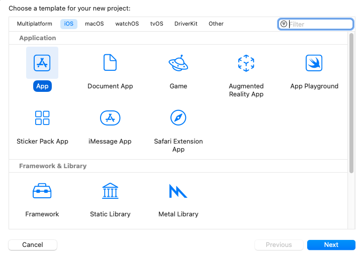
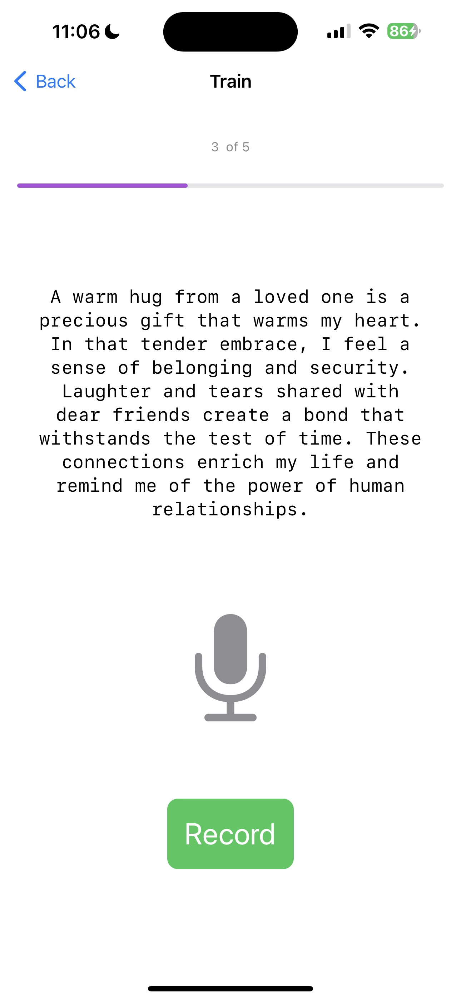
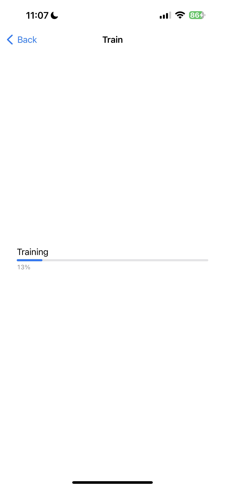
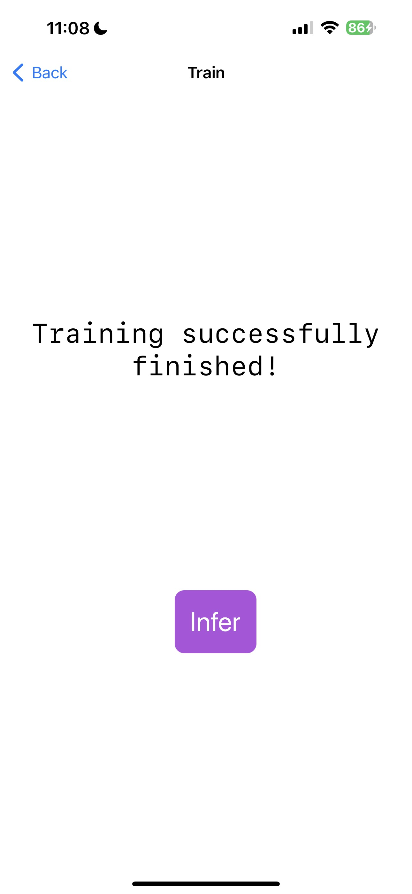
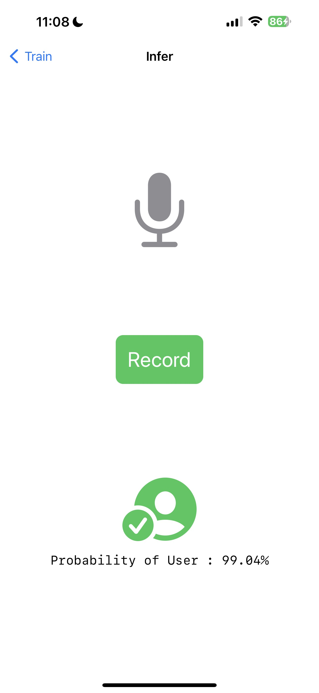

# Building an iOS Application

In this tutorial, we will explore how to build an iOS application that incorporates ONNX Runtime's On-Device Training solution. On-device training refers to the process of training a machine learning model directly on an edge device without relying on cloud services or external servers.

In this tutorial, we will build a simple speaker identification app that learns to identify a speaker's voice. We will take a look at how to train a model on-device, export the trained model, and use the trained model to perform inference.

Here is what the application will look like:


## Introduction
We will guide you through the process of building an iOS application that can train a simple audio classification model using on-device training techniques. The tutorial showcases the `transfer learning` technique where knowledge gained from training a model on one task is leveraged to improve the performance of a model on a different but related task. Instead of starting the learning process from scratch, transfer learning allows us to transfer the knowledge or features learned by a pre-trained model to a new task.

In this tutorial, we will leverage the [`wav2vec`](https://huggingface.co/superb/wav2vec2-base-superb-sid) model which has been trained on large-scale celebrity speech data such as `VoxCeleb1`. We will use the pre-trained model to extract features from the audio data and train a binary classifier to identify the speaker. The initial layers of the model serve as a feature extractor, capturing the important features of the audio data. Only the last layer of the model is trained to perform the classification task.

In the tutorial, we will:
- Use iOS audio APIs to capture audio data for training
- Train a model on-device
- Export the trained model
- Use the exported model to perform inference


## Contents
- [Introduction](#introduction)
- [Prerequisites](#prerequisites)
- [Generating the training artifacts](#generating-the-training-artifacts)
    - [Export the model to ONNX](#export-the-model-to-onnx)
    - [Define the trainable and non trainable parameters](#define-the-trainable-and-non-trainable-parameters)
    - [Generate the training artifacts](#generate-the-training-artifacts)

- [Building the iOS application](#building-the-ios-application)
    - [Xcode Setup](#xcode-setup)
    - [Application Overview](#application-overview)
    - [Training the model](#training-the-model)
        - [Loading the training artifacts and initializing training session](#loading-the-training-artifacts-and-initializing-training-session)
        - [Training the model](#training-the-model-1)
        - [Exporting the trained model](#exporting-the-trained-model)

    - [Inference with the trained model](#inference-with-the-trained-model)
    - [Recording Audio](#recording-audio)
    - [Train View](#train-view)
    - [Infer View](#infer-view)
    - [ContentView](#contentview)
- [Running the iOS application](#running-the-ios-application)
- [Conclusion](#conclusion)


## Prerequisites

To follow along with this tutorial, you should have a basic understanding of machine learning and iOS development. You should also have the following installed on your machine:

- Python development environment to prepare the training artifacts
- [Xcode](https://developer.apple.com/xcode/)
- [CocoaPods](https://cocoapods.org/)

> **Note:**  The entire iOS application is also made available on the [`onnxruntime-training-examples`](https://github.com/microsoft/onnxruntime-training-examples/tree/master/on_device_training/mobile/ios) GitHub repository. You can clone the repository and follow along with the tutorial.

## Generating the training artifacts

1. ### Export the model to ONNX.

    We will start with a pre-trained model from *HuggingFace* and export it to ONNX. The `wav2vec` model has been pretrained on `VoxCeleb1`, which has more than 1000 categories. For our task, we only need to classify audio in 2 classes. So, we change the last layer of the model to output 2 classes. We will use the `transformers` library to load the model and export it to ONNX.

    ```python
    from transformers import Wav2Vec2ForSequenceClassification, AutoConfig
    import torch

    # load config from the pretrained model
    config = AutoConfig.from_pretrained("superb/wav2vec2-base-superb-sid")
    model = Wav2Vec2ForSequenceClassification.from_pretrained("superb/wav2vec2-base-superb-sid")

    # modify last layer to output 2 classes
    model.classifier = torch.nn.Linear(256, 2)

    #export model to ONNX
    dummy_input = torch.randn(1, 160000, requires_grad=True)
    torch.onnx.export(model, dummy_input, "wav2vec.onnx",input_names=["input"], output_names=["output"],
                      dynamic_axes={"input": {0: "batch"}, "output": {0: "batch"}})
    ```
2. ### Define the trainable and non trainable parameters

    ```python
    import onnx

    # load the onnx model
    onnx_model = onnx.load("wav2vec.onnx")

    # Define the parameters that require gradients to be computed (trainable parameters) and
    # those that don't (frozen/non-trainable parameters)
    requires_grad = ["classifier.weight", "classifier.bias"]
    frozen_params = [
        param.name
        for param in onnx_model.graph.initializer
        if param.name not in requires_grad
    ]
    ```
3. ### Generate the training artifacts. 
    We will use the `CrossEntropyLoss` loss and the `AdamW` optimizer for this tutorial. More details around artifact generation can be found [here](../../../docs/api/python/on_device_training/training_artifacts.html).

    Since the model also outputs logits and hidden states, we will use `onnxblock` to define a custom loss function that extracts logits from the model output and passes it to the `CrossEntropyLoss` function.

    ```python
    import onnxruntime.training.onnxblock as onnxblock
    from onnxruntime.training import artifacts

    # define the loss function
    class CustomCELoss(onnxblock.Block):
        def __init__(self):
            super().__init__()
            self.celoss = onnxblock.loss.CrossEntropyLoss()


        def build(self, logits, *args):
            return self.celoss(logits)


    # Generate the training artifacts
    artifacts.generate_artifacts(
        onnx_model,
        requires_grad=requires_grad,
        frozen_params=frozen_params,
        loss=CustomCELoss(),
        optimizer=artifacts.OptimType.AdamW,
        artifact_directory="artifacts",
    )

    ```
    That's all! The training artifacts have been generated in the `artifacts` directory. The artifacts are ready to be deployed to the iOS device for training.


## Building the iOS application
### Xcode Setup
Open Xcode, and create a new project. Select `iOS` as the platform and `App` as the template. Click Next.



Enter the project name. Here, we will name the project 'MyVoice', but you can name it anything you prefer. Make sure to select `SwiftUI` as the interface, and `Swift` as the language. Then, click Next.


Select the location where you want to save the project and click `Create`.


Now, we will need to add the `onnxruntime-training-objc` pods to the project. We will use `CocoaPods` to add the dependency. If you don't have CocoaPods installed, you can check out the installation instructions [here](https://guides.cocoapods.org/using/getting-started.html#installation). 

After installing CocoaPods, navigate to the project directory and run the following command to create a `Podfile`:

```bash
pod init
```

This will create a `Podfile` in the project directory. Open the `Podfile` and add the following line after the `use_frameworks!` line:

```ruby
pod `onnxruntime-training-objc`, `~> 1.16.0`
```

Save the `Podfile` and run the following command to install the dependencies:

```bash
pod install
```

This will create a `MyVoice.xcworkspace` file in the project directory. Open the `xcworkspace` file in Xcode. This will open the project in Xcode with the CocoaPods dependencies available.

Now, right click on the 'MyVoice' group in the project navigator and click 'New Group' to create a new group in the project called `artifacts`. Drag and drop the artifacts generated in the previous section into the `artifacts` group. Make sure to select `Create folder references` and `Copy items if needed` options. This will add the artifacts to the project.

Next, right click on the 'MyVoice' group and click 'New Group' to create a new group in the project called `recordings`. This group will contain the audio recordings that will be used for training. You can generate the recordings by running the [`recording_gen.py`](https://github.com/microsoft/onnxruntime-training-examples/blob/master/on_device_training/mobile/ios/recording_gen.py) script at the root of the project. Alternatively, you can also use any other speakers' voice recordings except the speaker whose voice you are planning to use for training. Make sure that recordings are mono channel of length 10 seconds in .wav format with 16KHz sample rate. Additionally, make sure to name the recordings as `other_0.wav`, `other_1.wav`, etc., and add them to the `recordings` group.


The project structure should look like this:


### Application Overview

The application will consist of two main UI Views: `TrainView` and `InferView`. The `TrainView` is used to train the model on-device, and the `InferView` is used to perform inference with the trained model. Additionally, there is the `ContentView` which is the home view of the application and contains buttons to navigate to the `TrainView` and `InferView`.

Additionally, we will also create an `AudioRecorder` class to handle the recording of audio through the microphone. It will record 10 seconds of audio and output the audio data as a `Data` object, which can be used for training and inference purposes.

We will have a `Trainer` class which will handle the training and exporting of the model.

Lastly, we will also create a `VoiceIdentifier` class that will handle the inference with the trained model. 

### Training the model

First, we will create a `Trainer` class that will handle the training and exporting of the model. It will load the training artifacts, train the model on given audio, and export the trained model using ONNX Runtime on device training APIs. The detailed documentation for the API can be found [here](../../../docs/api/objectivec/index.html).

The `Trainer` class will have the following public methods:
- `init()` - Initializes the training session and loads the training artifacts.
- `train(_ trainingData: [Data])` - Trains the model on the given user audio data. It will take in an array of `Data` objects, where each `Data` object represents the audio data of the user, and use it along with some pre-recorded audio data to train the model.
- `exportModelForInference()` - Exports the trained model for inference purposes.


1. #### Loading the training artifacts and initializing training session

    To train a model, we first need to load the artifacts, create `ORTEnv`, `ORTTrainingSession`, and `ORTCheckpoint`. These objects will be used to train the model. We will create this objects in the `init` method of the `Trainer` class.


    ```swift
    import Foundation
    import onnxruntime_training_objc

    class Trainer {
        private let ortEnv: ORTEnv
        private let trainingSession: ORTTrainingSession
        private let checkpoint: ORTCheckpoint
        
        enum TrainerError: Error {
            case Error(_ message: String)
        }
        
        init() throws {
            ortEnv = try ORTEnv(loggingLevel: ORTLoggingLevel.warning)
            
            // get path for artifacts
            guard let trainingModelPath = Bundle.main.path(forResource: "training_model", ofType: "onnx") else {
                throw TrainerError.Error("Failed to find training model file.")
            }
            
            guard let evalModelPath = Bundle.main.path(forResource: "eval_model",ofType: "onnx") else {
                throw TrainerError.Error("Failed to find eval model file.")
            }
            
            guard let optimizerPath = Bundle.main.path(forResource: "optimizer_model", ofType: "onnx") else {
                throw TrainerError.Error("Failed to find optimizer model file.")
            }
            
            guard let checkpointPath = Bundle.main.path(forResource: "checkpoint", ofType: nil) else {
                throw TrainerError.Error("Failed to find checkpoint file.")
            }
            
            checkpoint = try ORTCheckpoint(path: checkpointPath)
            trainingSession = try ORTTrainingSession(env: ortEnv, sessionOptions: ORTSessionOptions(), checkpoint: checkpoint, trainModelPath: trainingModelPath, evalModelPath: evalModelPath, optimizerModelPath: optimizerPath)
        }
    }
    ```

2.  #### Training the model

    a. Before training the model, we first need to extract the data from the wav files that we created in earlier section. Here is the simple function that will extract the data from the wav file.
    ```swift
    private func getDataFromWavFile(fileName: String) throws -> (AVAudioBuffer, Data) {
        guard let fileUrl = Bundle.main.url(forResource: fileName, withExtension:"wav") else {
            throw TrainerError.Error("Failed to find wav file: \(fileName).")
        }
        
        let audioFile = try AVAudioFile(forReading: fileUrl)
        let format = audioFile.processingFormat
        let totalFrames = AVAudioFrameCount(audioFile.length)

        guard let buffer = AVAudioPCMBuffer(pcmFormat: format, frameCapacity: totalFrames) else {
            throw TrainerError.Error("Failed to create audio buffer.")
        }
        
        try audioFile.read(into: buffer)
        
        guard let floatChannelData = buffer.floatChannelData else {
            throw TrainerError.Error("Failed to get float channel data.")
        }
        
        let data = Data(
            bytesNoCopy: floatChannelData[0],
            count: Int(buffer.frameLength) * MemoryLayout<Float>.size,
            deallocator: .none
        )
        return (buffer, data)
    }
    ```

       

    b. The `TrainingSession.trainStep` function is responsible for training the model. It takes in the input data and the labels and returns the loss. The inputs are passed to ONNX Runtime as `ORTValue` objects. Thus, we need to convert the input audio `Data` objects and labels to `ORTValue`.

    ```swift
    private func getORTValue(dataList: [Data]) throws -> ORTValue {
        let tensorData = NSMutableData()
        dataList.forEach {data in tensorData.append(data)}
        let inputShape: [NSNumber] = [dataList.count as NSNumber, dataList[0].count / MemoryLayout<Float>.stride as NSNumber]
        
        return try ORTValue(
            tensorData: tensorData, elementType: ORTTensorElementDataType.float, shape: inputShape
        )
    }
    
    private func getORTValue(labels: [Int64]) throws -> ORTValue {
        let tensorData = NSMutableData(bytes: labels, length: labels.count * MemoryLayout<Int64>.stride)
        let inputShape: [NSNumber] = [labels.count as NSNumber]
        
        return try ORTValue (
            tensorData: tensorData, elementType: ORTTensorElementDataType.int64, shape: inputShape
        )
    }
    ```

    c. We are ready to write the `trainStep` function, which takes a batch of input data and labels and performs one training step on the given batch.

    ```swift
    func trainStep(inputData: [Data], labels: [Int64]) throws  {
        let inputs = [try getORTValue(dataList: inputData), try getORTValue(labels: labels)]
        try trainingSession.trainStep(withInputValues: inputs)
        
        // update the model params
        try trainingSession.optimizerStep()
        
        // reset the gradients
        try trainingSession.lazyResetGrad()
    }
    ```

    d. Finally, we have everything we need to write the training loop. Here, `kNumOtherRecordings` represent how many recordings we have in the `recordings` directory that we created earlier. `kNumEpochs` represents how many epochs we want to train the model on the given data. `kUserIndex` and `kOtherIndex` represent the labels for the user and other recordings respectively.

    We also have a `progressCallback` that will be called after each training step. We will use this callback to update the progress bar in the UI.

    ```swift
    private let kNumOtherRecordings: Int = 20
    private let kNumEpochs: Int = 3
    
    let kUserIndex: Int64 = 1
    let kOtherIndex: Int64 = 0

    func train(_ trainingData: [Data], progressCallback: @escaping (Double) -> Void) throws {
        let numRecordings = trainingData.count
        var otherRecordings = Array(0..<kNumOtherRecordings)
        for e in 0..<kNumEpochs {
            print("Epoch: \(e)")
            otherRecordings.shuffle()
            let otherData = otherRecordings.prefix(numRecordings)
            
            for i in 0..<numRecordings {
                let (buffer, wavFileData) = try getDataFromWavFile(fileName: "other_\(otherData[i])")
                try trainStep(inputData: [trainingData[i], wavFileData], labels: [kUserIndex, kOtherIndex])
                print("finished training on recording \(i)")
                
                let progress = Double((e * numRecordings) + i + 1) / Double(kNumEpochs * numRecordings)
                progressCallback(progress)
            }
        }
        
    }
    ```

3.  #### Exporting the trained model

    We can use the `exportModelForInference` method of the `ORTTrainingSession` class to export the trained model. The method takes in the path where the model should be exported and the output names of the model.
    
    Here, we will export the model to the `Library` directory of the application. The exported model will be used for inference purposes.

    ```swift
    func exportModelForInference() throws {
        guard let libraryDirectory = FileManager.default.urls(for: .libraryDirectory, in: .userDomainMask).first else {
            throw TrainerError.Error("Failed to find library directory ")
        }
        
        let modelPath = libraryDirectory.appendingPathComponent("inference_model.onnx").path
        try trainingSession.exportModelForInference(withOutputPath: modelPath, graphOutputNames: ["output"])
    }
    ```

You can find the complete implementation of the `Trainer` class [here](https://github.com/microsoft/onnxruntime-training-examples/blob/master/on_device_training/mobile/ios/MyVoice/Trainer.swift).


### Inference with the trained model
The `VoiceIdentifier` class will handle the inference with the trained model. It will load the trained model and perform inference on the given audio data. The class will have the `evaluate(inputData: Data) -> Result<(Bool, Float), Error>` method that will take in the audio data and return the result of the inference. The result will be a tuple of `(Bool, Float)`, where the first element represents whether the audio is identified to be the user or not, and the second element represents the confidence score of the prediction.

First, we load the trained model using the `ORTSession` object. 

```swift
class VoiceIdentifier {
    
    private let ortEnv : ORTEnv
    private let ortSession: ORTSession
    private let kThresholdProbability: Float = 0.80
    
    enum VoiceIdentifierError: Error {
        case Error(_ message: String)
    }
    
    init() throws {
        ortEnv = try ORTEnv(loggingLevel: ORTLoggingLevel.warning)

        guard let libraryDirectory = FileManager.default.urls(for: .libraryDirectory, in: .userDomainMask).first else {
            throw VoiceIdentifierError.Error("Failed to find library directory ")
        }
        let modelPath = libraryDirectory.appendingPathComponent("inference_model.onnx").path

        if !FileManager.default.fileExists(atPath: modelPath) {
            throw VoiceIdentifierError.Error("Failed to find inference model file.")
        }
        ortSession = try ORTSession(env: ortEnv, modelPath: modelPath, sessionOptions: nil)
    }
}
```

Next, we will write the `evaluate` method. First, it will take the audio data and convert it to `ORTValue`. Then, it will perform inference with the model. Lastly, it will extract logits from the output and apply softmax to get probabilities.


```swift
    private func isUser(logits: [Float]) -> Float {
        // apply softMax
        let maxInput = logits.max() ?? 0.0
        let expValues = logits.map { exp($0 - maxInput) } // Calculate e^(x - maxInput) for each element
        let expSum = expValues.reduce(0, +) // Sum of all e^(x - maxInput) values
        
        return expValues.map { $0 / expSum }[1] // Calculate the softmax probabilities
    }
    
    func evaluate(inputData: Data) -> Result<(Bool, Float), Error> {
        
        return Result<(Bool, Float), Error> { () -> (Bool, Float) in
            
            // convert input data to ORTValue
            let inputShape: [NSNumber] = [1, inputData.count / MemoryLayout<Float>.stride as NSNumber]
            
            let input = try ORTValue(
                tensorData: NSMutableData(data: inputData),
                elementType: ORTTensorElementDataType.float,
                shape: inputShape)
            
            let outputs = try ortSession.run(
                withInputs: ["input": input],
                outputNames: ["output"],
                runOptions: nil)
            
            guard let output = outputs["output"] else {
                throw VoiceIdentifierError.Error("Failed to get model output from inference.")
            }
            
            let outputData = try output.tensorData() as Data
            let probUser = outputData.withUnsafeBytes { (buffer: UnsafeRawBufferPointer) -> Float in
                let floatBuffer = buffer.bindMemory(to: Float.self)
                let logits = Array(UnsafeBufferPointer(start: floatBuffer.baseAddress, count: outputData.count/MemoryLayout<Float>.stride))
                return isUser(logits: logits)
            }
            
            return (probUser >= kThresholdProbability, probUser)
        }
    }
```

The complete implementation of the `VoiceIdentifier` class can be found [here](https://github.com/microsoft/onnxruntime-training-examples/blob/master/on_device_training/mobile/ios/MyVoice/VoiceIdentifier.swift).

### Recording Audio

We will use the `AudioRecorder` class to record audio through the microphone. It will record 10 seconds of audio and output the audio data as a `Data` object, which can be used for training and inference purposes. We will use the `AVFoundation` framework to access the microphone and record the audio. There will be one public method `record(callback: @escaping RecordingDoneCallback)` that will record the audio and call the callback function with the audio data when the recording is done.

```swift
import AVFoundation
import Foundation

private let kSampleRate: Int = 16000
private let kRecordingDuration: TimeInterval = 10

class AudioRecorder {
    typealias RecordResult = Result<Data, Error>
    typealias RecordingDoneCallback = (RecordResult) -> Void
    
    enum AudioRecorderError: Error {
        case Error(message: String)
    }
    
    func record(callback: @escaping RecordingDoneCallback) {
        let session = AVAudioSession.sharedInstance()
        session.requestRecordPermission { allowed in
            do {
                guard allowed else {
                    throw AudioRecorderError.Error(message: "Recording permission denied.")
                }
                
                try session.setCategory(.record)
                try session.setActive(true)
                
                let tempDir = FileManager.default.temporaryDirectory
                
                let recordingUrl = tempDir.appendingPathComponent("recording.wav")
                
                let formatSettings: [String: Any] = [
                    AVFormatIDKey: kAudioFormatLinearPCM,
                    AVSampleRateKey: kSampleRate,
                    AVNumberOfChannelsKey: 1,
                    AVLinearPCMBitDepthKey: 16,
                    AVLinearPCMIsBigEndianKey: false,
                    AVLinearPCMIsFloatKey: false,
                    AVEncoderAudioQualityKey: AVAudioQuality.high.rawValue,
                ]
                
                let recorder = try AVAudioRecorder(url: recordingUrl, settings: formatSettings)
                self.recorder = recorder
                
                let delegate = RecorderDelegate(callback: callback)
                recorder.delegate = delegate
                self.recorderDelegate = delegate
                
                guard recorder.record(forDuration: kRecordingDuration) else {
                    throw AudioRecorderError.Error(message: "Failed to record.")
                }
                
                // control should resume in recorder.delegate.audioRecorderDidFinishRecording()
            } catch {
                callback(.failure(error))
            }
        }
    }
    
    private var recorderDelegate: RecorderDelegate?
    private var recorder: AVAudioRecorder?
    
    private class RecorderDelegate: NSObject, AVAudioRecorderDelegate {
        private let callback: RecordingDoneCallback
        
        init(callback: @escaping RecordingDoneCallback) {
            self.callback = callback
        }
        
        func audioRecorderDidFinishRecording(
            _ recorder: AVAudioRecorder,
            successfully flag: Bool
        ) {
            let recordResult = RecordResult { () -> Data in
                guard flag else {
                    throw AudioRecorderError.Error(message: "Recording was unsuccessful.")
                }
                
                let recordingUrl = recorder.url
                let recordingFile = try AVAudioFile(forReading: recordingUrl)
                
                guard
                    let format = AVAudioFormat(
                        commonFormat: .pcmFormatFloat32,
                        sampleRate: recordingFile.fileFormat.sampleRate,
                        channels: 1,
                        interleaved: false)
                else {
                    throw AudioRecorderError.Error(message: "Failed to create audio format.")
                }
                
                guard
                    let recordingBuffer = AVAudioPCMBuffer(
                        pcmFormat: format,
                        frameCapacity: AVAudioFrameCount(recordingFile.length))
                else {
                    throw AudioRecorderError.Error(message: "Failed to create audio buffer.")
                }
                
                try recordingFile.read(into: recordingBuffer)
                
                guard let recordingFloatChannelData = recordingBuffer.floatChannelData else {
                    throw AudioRecorderError.Error(message: "Failed to get float channel data.")
                }
                
                return Data(bytes: recordingFloatChannelData[0], count: Int(recordingBuffer.frameLength) * MemoryLayout<Float>.size)
               
            }
            
            callback(recordResult)
        }
        
        func audioRecorderEncodeErrorDidOccur(
            _ recorder: AVAudioRecorder,
            error: Error?
        ) {
            if let error = error {
                callback(.failure(error))
            } else {
                callback(.failure(AudioRecorderError.Error(message: "Encoding was unsuccessful.")))
            }
        }
    }
}
```

### Train View

The `TrainView` will be used to train the model on the user's voice. First, it will prompt the user to record `kNumRecordings` recordings of their voice. Then, it will train the model on the user's voice and some pre-recorded recordings of other speakers' voices. Finally, it will export the trained model for inference purposes.

```swift
import SwiftUI

struct TrainView: View {
    
    enum ViewState {
        case recordingTrainingData, trainingInProgress, trainingComplete
    }
    
    private static let sentences = [
        "In the embrace of nature's beauty, I find peace and tranquility. The gentle rustling of leaves soothes my soul, and the soft sunlight kisses my skin. As I breathe in the fresh air, I am reminded of the interconnectedness of all living things, and I feel a sense of oneness with the world around me.",
        "Under the starlit sky, I gaze in wonder at the vastness of the universe. Each twinkle represents a story yet untold, a dream yet to be realized. With every new dawn, I am filled with hope and excitement for the opportunities that lie ahead. I embrace each day as a chance to grow, to learn, and to create beautiful memories.",
        "A warm hug from a loved one is a precious gift that warms my heart. In that tender embrace, I feel a sense of belonging and security. Laughter and tears shared with dear friends create a bond that withstands the test of time. These connections enrich my life and remind me of the power of human relationships.",
        "Life's journey is like a beautiful melody, with each note representing a unique experience. As I take each step, I harmonize with the rhythm of existence. Challenges may come my way, but I face them with resilience and determination, knowing they are opportunities for growth and self-discovery.",
        "With every page turned in a book, I open the door to new worlds and ideas. The written words carry the wisdom of countless souls, and I am humbled by the knowledge they offer. In stories, I find a mirror to my own experiences and a beacon of hope for a better tomorrow.",
        "Life's trials may bend me, but they will not break me. Through adversity, I discover the strength within my heart. Each obstacle is a chance to learn, to evolve, and to emerge as a better version of myself. I am grateful for every lesson, for they shape me into the person I am meant to be.",
        "The sky above is an ever-changing canvas of colors and clouds. In its vastness, I realize how small I am in the grand scheme of things, and yet, I know my actions can ripple through the universe. As I walk this Earth, I seek to leave behind a positive impact and a legacy of love and compassion.",
        "In the stillness of meditation, I connect with the depth of my soul. The external noise fades away, and I hear the whispers of my inner wisdom. With each breath, I release tension and embrace serenity. Meditation is my sanctuary, a place where I can find clarity and renewed energy.",
        "Kindness is a chain reaction that spreads like wildfire. A simple act of compassion can brighten someone's day and inspire them to pay it forward. Together, we can create a wave of goodness that knows no boundaries, reaching even the farthest corners of the world.",
        "As the sun rises on a new day, I am filled with gratitude for the gift of life. Every moment is a chance to make a difference, to love deeply, and to embrace joy. I welcome the adventures that await me and eagerly embrace the mysteries yet to be uncovered."
    ]

    
    private let kNumRecordings = 5
    private let audioRecorder = AudioRecorder()
    private let trainer = try! Trainer()
    
    @State private var trainingData: [Data] = []
    
    @State private var viewState: ViewState = .recordingTrainingData
    @State private var readyToRecord: Bool = true
    @State private var trainingProgress: Double = 0.0
    
    private func recordVoice() {
        audioRecorder.record { recordResult in
           switch recordResult {
           case .success(let recordingData):
               trainingData.append(recordingData)
               print("Successfully completed Recording")
           case .failure(let error):
               print("Error: \(error)")
            }
            
            readyToRecord = true
            
            if trainingData.count == kNumRecordings  {
                viewState = .trainingInProgress
                trainAndExportModel()
            }
        }
    }
    
    private func updateProgressBar(progress: Double) {
        DispatchQueue.main.async {
            trainingProgress = progress
        }
    }
    
    private func trainAndExportModel() {
        Task {
            do {
                try trainer.train(trainingData, progressCallback: updateProgressBar)
                try trainer.exportModelForInference()
                   
                DispatchQueue.main.async {
                    viewState = .trainingComplete
                    print("Training is complete")
                }
            } catch {
                DispatchQueue.main.async {
                    viewState = .trainingComplete
                    print("Training Failed: \(error)")
                }
            }
        }
    }
    
    
    var body: some View {
        VStack {
           
            switch viewState {
            case .recordingTrainingData:
                Text("\(trainingData.count + 1) of \(kNumRecordings)")
                    .font(.caption)
                    .foregroundColor(.secondary)
                    .padding()
                
                ProgressView(value: Double(trainingData.count),
                             total: Double(kNumRecordings))
                .progressViewStyle(LinearProgressViewStyle(tint: .purple))
                .frame(height: 10)
                .cornerRadius(5)
                
                Spacer()
                
                Text(TrainView.sentences[trainingData.count % TrainView.sentences.count])
                    .font(.body)
                    .padding()
                    .multilineTextAlignment(.center)
                    .fontDesign(.monospaced)
                
                Spacer()
                
                ZStack(alignment: .center) {
                    Image(systemName: "mic.fill")
                        .resizable()
                        .aspectRatio(contentMode: .fit)
                        .frame(width: 100, height: 100)
                        .foregroundColor( readyToRecord ? .gray: .red)
                        .transition(.scale)
                        .animation(.easeIn, value: 1)
                }
                
                Spacer()
                
                Button(action: {
                    readyToRecord = false
                    recordVoice()
                }) {
                    Text(readyToRecord ? "Record" : "Recording ...")
                        .font(.title)
                        .padding()
                        .background(readyToRecord ? .green : .gray)
                        .foregroundColor(.white)
                        .cornerRadius(10)
                }.disabled(!readyToRecord)
                    
            case .trainingInProgress:
                VStack {
                    Spacer()
                    ProgressView(value: trainingProgress,
                                 total: 1.0,
                                 label: {Text("Training")},
                                 currentValueLabel: {Text(String(format: "%.0f%%", trainingProgress * 100))})
                    .padding()
                    Spacer()
                }
                    
            case .trainingComplete:
                Spacer()
                Text("Training successfully finished!")
                    .font(.title)
                    .padding()
                    .multilineTextAlignment(.center)
                    .fontDesign(.monospaced)
                
                Spacer()
                NavigationLink(destination: InferView()) {
                    Text("Infer")
                        .font(.title)
                        .padding()
                        .background(.purple)
                        .foregroundColor(.white)
                        .cornerRadius(10)
                }
                .padding(.leading, 20)
            }
            
            Spacer()
        }
        .padding()
        .navigationTitle("Train")
    }
}

struct TrainView_Previews: PreviewProvider {
    static var previews: some View {
        TrainView()
    }
}
```

The complete implementation of the `TrainView` can be found [here](https://github.com/microsoft/onnxruntime-training-examples/blob/master/on_device_training/mobile/ios/MyVoice/TrainView.swift).

### Infer View
Lastly, we will create the `InferView` that will be used to perform inference with the trained model. It will prompt the user to record their voice and perform inference with the trained model. Then, it will display the result of the inference.

```swift
import SwiftUI

struct InferView: View {
    
    enum InferResult {
        case user, other, notSet
    }
    
    private let audioRecorder = AudioRecorder()
    
    @State private var voiceIdentifier: VoiceIdentifier? = nil
    @State private var readyToRecord: Bool = true
    
    @State private var inferResult: InferResult = InferResult.notSet
    @State private var probUser: Float = 0.0
    
    @State private var showAlert = false
    @State private var alertMessage = ""

    private func recordVoice() {
        audioRecorder.record { recordResult in
            let recognizeResult = recordResult.flatMap { recordingData in
                return voiceIdentifier!.evaluate(inputData: recordingData)
            }
            endRecord(recognizeResult)
        }
    }
    
    private func endRecord(_ result: Result<(Bool, Float), Error>) {
        DispatchQueue.main.async {
            switch result {
            case .success(let (isMatch, confidence)):
                print("Your Voice with confidence: \(isMatch),  \(confidence)")
                inferResult = isMatch ? .user : .other
                probUser = confidence
            case .failure(let error):
                print("Error: \(error)")
            }
            readyToRecord = true
        }
    }
    
    var body: some View {
        VStack {
            Spacer()
            
            ZStack(alignment: .center) {
                Image(systemName: "mic.fill")
                    .resizable()
                    .aspectRatio(contentMode: .fit)
                    .frame(width: 100, height: 100)
                    .foregroundColor( readyToRecord ? .gray: .red)
                    .transition(.scale)
                    .animation(.easeInOut, value: 1)
            }
            
            Spacer()
            
            Button(action: {
                readyToRecord = false
                recordVoice()
            }) {
                Text(readyToRecord ? "Record" : "Recording ...")
                    .font(.title)
                    .padding()
                    .background(readyToRecord ? .green : .gray)
                    .foregroundColor(.white)
                    .cornerRadius(10)
                
            }.disabled(voiceIdentifier == nil || !readyToRecord)
                .opacity(voiceIdentifier == nil ? 0.5: 1.0)
            
            if  inferResult != .notSet {
                Spacer()
                ZStack (alignment: .center) {
                    Image(systemName: inferResult == .user ? "person.crop.circle.fill.badge.checkmark": "person.crop.circle.fill.badge.xmark")
                        .resizable()
                        .aspectRatio(contentMode: .fit)
                        .frame(width: 100, height: 100)
                        .foregroundColor(inferResult == .user ? .green : .red)
                        .animation(.easeInOut, value: 2)
                    
                }
                
                Text("Probability of User : \(String(format: "%.2f", probUser*100.0))%")
                    .multilineTextAlignment(.center)
                    .fontDesign(.monospaced)
            }
            
            Spacer()
        }
        .padding()
        .navigationTitle("Infer")
        .onAppear {
            do {
                voiceIdentifier = try  VoiceIdentifier()
                
            } catch {
                alertMessage = "Error initializing inference session, make sure that training is completed: \(error)"
                showAlert = true
            }
            
        }
        .alert(isPresented: $showAlert) {
            Alert(title: Text("Error"), message: Text(alertMessage), dismissButton: .default(Text("OK")))
        }
    }
}

struct InferView_Previews: PreviewProvider {
    static var previews: some View {
        InferView()
    }
}
```

The complete implementation of the `InferView` can be found [here](https://github.com/microsoft/onnxruntime-training-examples/blob/master/on_device_training/mobile/ios/MyVoice/InferView.swift).

### ContentView
Finally, we will update the default `ContentView` so that it will contain buttons to navigate to the `TrainView` and `InferView`.

```swift
import SwiftUI

struct ContentView: View {
    var body: some View {
        NavigationView {
            VStack {
                
                Text("My Voice")
                    .font(.largeTitle)
                    .padding(.top, 50)
                
                Spacer()
                
                ZStack(alignment: .center) {
                    Image(systemName: "waveform.circle.fill")
                        .resizable()
                        .aspectRatio(contentMode: .fit)
                        .frame(width: 100, height: 100)
                        .foregroundColor(.purple)
                }
                
                Spacer()
                
                HStack {
                    NavigationLink(destination: TrainView()) {
                        Text("Train")
                            .font(.title)
                            .padding()
                            .background(Color.purple)
                            .foregroundColor(.white)
                            .cornerRadius(10)
                    }
                    .padding(.trailing, 20)
                    
                    NavigationLink(destination: InferView()) {
                        Text("Infer")
                            .font(.title)
                            .padding()
                            .background(.purple)
                            .foregroundColor(.white)
                            .cornerRadius(10)
                    }
                    .padding(.leading, 20)
                }
                
                Spacer()
            }
            .padding()
        }
    }
}

struct ContentView_Previews: PreviewProvider {
    static var previews: some View {
        ContentView()
    }
}
```

The complete implementation of the `ContentView` can be found [here](https://github.com/microsoft/onnxruntime-training-examples/blob/master/on_device_training/mobile/ios/MyVoice/ContentView.swift).


## Running the iOS application
Now, we are ready to run the application. You can run the application on the simulator or on the device. You can find more information about running the application on the simulator and device [here](https://developer.apple.com/documentation/xcode/devices-and-simulator).


a. Now, when you run the application, you should see the following screen:


b. Next, click on the `Train` button to navigate to the `TrainView`. The `TrainView` will prompt you to record your voice. You will need to record your voice `kNumRecordings` times. 




c. Once all the recordings are complete, the application will train the model on the given data. You will see the progress bar indicating the progress of the training.




d. Once the training is complete, you will see the following screen:




e. Now, click on the `Infer` button to navigate to the `InferView`. The `InferView` will prompt you to record your voice. Once the recording is complete, it will perform inference with the trained model and display the result of the inference.




That's it! Hopefully, it identified your voice correctly.

## Conclusion
Congratulations! You have successfully built an iOS application that can train a simple audio classification model using on-device training techniques. You can now use the application to train a model on your own voice and perform inference with the trained model. The application is also available on GitHub at  [`onnxruntime-training-examples`](https://github.com/microsoft/onnxruntime-training-examples/tree/master/on_device_training/mobile/ios)


[Back to top](#contents)

