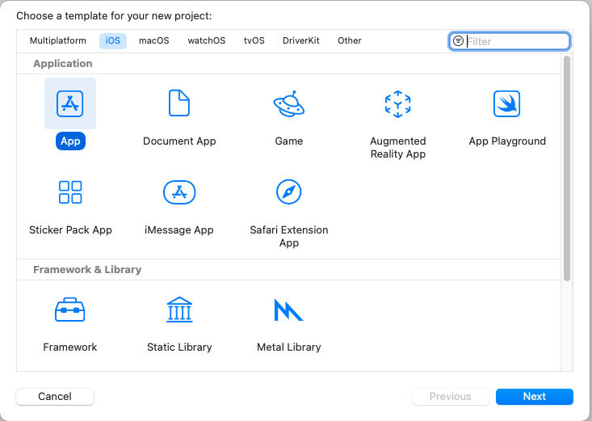
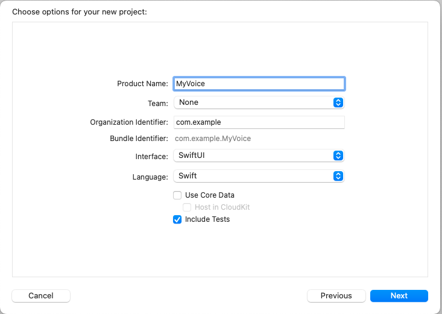
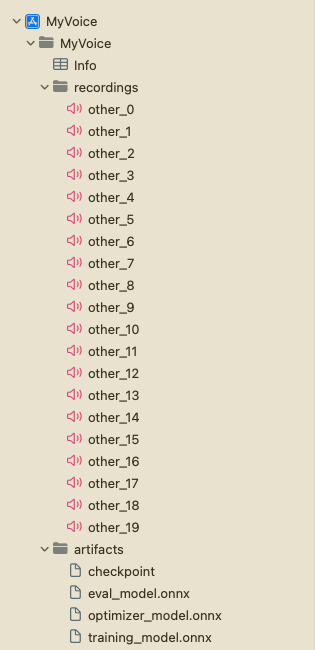

# Building an iOS Application

In this tutorial, we will explore how to build an iOS application that incorporates ONNX Runtime's On-Device Training solution. On-device training refers to the process of training a machine learning model directly on an edge device without relying on cloud services or external servers.

In this tutorial, we will build a simple speaker identification app that learns to idefiy a speaker's voice. We will take a look at how to train a model on-device, export the trained model, and use the trained model to perform inference.

Here is what the application will look like:


## Introduction
We will guide you through the process of building an iOS application that can train a simple audio classification model using on-device training techniques. The tutorial showcases the `transfer learning` technique where knowledge gained from training a model on one task is leveraged to improve the performance of a model on a different but realted task. Instead of starting the learning process from scratch, transfer learning allows us to transfer the knowledge or features learned by a pre-trained model to a new task.

In this tutorial, we will leverage the `wav2vec` model which has been trained on large-scale celebrity speech data such as `VoxCeleb1`. We will use the pre-trained model to extract features from the audio data and train a binary classifier to identify the speaker. The initial layers of the model servw as a feature extractor, capturing the important features of the audio data. and only the last layer of the model is trained to perform the classification task.

In the tutorial, we will:
- Use iOS audio APIs to capture audio data for training
- train a model on-device
- Export the trained model
- Use the exported model to perform inference


## Contents
- [Introduction](#introduction)
- [Prerequisites](#prerequisites)
- [Generating the training artifacts](#generating-the-training-artifacts)
    - [Export the model to ONNX](#export-the-model-to-onnx)
    - [Define the trainable and non trainable parameters](#define-the-trainable-and-non-trainable-parameters)
    - [Generate the training artifacts](#generate-the-training-artifacts)

- [Building the iOS application](#building-the-ios-application)
    - [Xcode Setup](#xcode-setup)
    - [Application Overview](#application-overview)
    - [Training the model](#training-the-model)
        - [Loading the training artifacts and initializing training session](#loading-the-training-artifacts-and-initializing-training-session)
        - [Training the model](#training-the-model-1)
        - [Exporting the trained model](#exporting-the-trained-model)
        
    - [Inference with the trained model](#inference-with-the-trained-model)
    - [Recording Audio](#recording-audio)
    - [Training View](#training-view)
    - [Inference View](#inference-view)
- [Running the iOS application](#running-the-ios-application)
- [Conclusion](#conclusion)


## Prerequisites

To follow along with this tutorial, you should have a basic understanding of machine learning and iOS development. You should also have the following installed on your machine:

- Python development environment to prepare the training artifacts
- [Xcode](https://developer.apple.com/xcode/)
- [CocoaPods](https://cocoapods.org/)

> **Note:**  The entire iOS application is also made available on the [`onnxruntime-training-examples`](https://github.com/microsoft/onnxruntime-training-examples/tree/master/on_device_training/mobile/ios) GitHub repository. You can clone the repository and follow along with the tutorial.

## Generating the training artifacts

1. ### Export the model to ONNX.

    We will start with a pre-trained model from *HuggingFace* and export it to ONNX. The `wav2vec` model has been pretrained on `VoxCeleb1`, which has more than 1000 categories. For our task, we only need to classify audio in 2 classes. So, we change the last layer of the model to output 2 classes. We will use the `transformers` library to load the model and export it to ONNX.

    ```python
    from transformers import Wav2Vec2ForSequenceClassification, AutoConfig
    import torch

    # load config from the pretrained model
    config = AutoConfig.from_pretrained("superb/wav2vec2-base-superb-sid")
    model = Wav2Vec2ForSequenceClassification.from_pretrained("superb/wav2vec2-base-superb-sid")

    # modify last layer to output 2 classes
    model.classifier = torch.nn.Linear(256, 2)

    #export model to ONNX
    dummy_input = torch.randn(1, 160000, requires_grad=True)
    torch.onnx.export(model, dummy_input, "wav2vec.onnx",input_names=["input"], output_names=["output"],
                    dynamic_axes={"input": {0: "batch"}, "output": {0: "batch"}})
    ```
2. ### Define the trainable and non trainable parameters

    ```python
    import onnx

    # load the onnx model
    onnx_model = onnx.load("wav2vec.onnx")

    # Define the parameters that require gradients to be computed (trainable parameters) and
    # those that don't (frozen/non-trainable parameters)
    requires_grad = ["classifier.weight", "classifier.bias"]
    frozen_params = [
        param.name
        for param in onnx_model.graph.initializer
        if param.name not in requires_grad
    ]
    ```
3. ### Generate the training artifacts. 
    We will use the `CrossEntropyLoss` loss and the `AdamW` optimizer for this tutorial. More details around artifact generation can be found [here](../../../docs/api/python/on_device_training/training_artifacts.html).

    Since, the model also outputs logits and hidden states, we will use `onnxblock` to define a custom loss function that extracts logits from the model output and passes it to the `CrossEntropyLoss` function.

    ```python
    import onnxruntime.training.onnxblock as onnxblock
    from onnxruntime.training import artifacts

    # define the loss function
    class CustomCELoss(onnxblock.Block):
    def __init__(self):
        super().__init__()
        self.celoss = onnxblock.loss.CrossEntropyLoss()

    def build(self, logits, *args):
        return self.celoss(logits)


    # Generate the training artifacts
    artifacts.generate_artifacts(
        onnx_model,
        requires_grad=requires_grad,
        frozen_params=frozen_params,
        loss=CustomCELoss(),
        optimizer=artifacts.OptimType.AdamW,
        artifact_directory="artifacts",
    )

    ```
    That's all! The training artifacts have been generated in the `artifacts` directory. The artifacts are ready to be deployed to the iOS device for training.


## Building the iOS application
### Xcode Setup
Open Xcode, and create a new project. Select `iOS` as the platform and `App` as the template. Click Next.



Enter the project name. Here, we will name the project 'MyVoice', but you can name it anything you prefer. Make sure to select `SwiftUI` as the interface, and `Swift` as the language. Then, click Next.



Select the location where you want to save the project and click `Create`.


Now, we will need to add the `onnxruntime-training-objc` pods to the project. We will use `CocoaPods` to add the dependency. If you don't have CocoaPods installed, you can install it by running the following command in the terminal:

```bash
sudo gem install cocoapods
```

Navigate to the project directory and run the following command to create a `Podfile`:

```bash
pod init
```

This will create a `Podfile` in the project directory. Open the `Podfile` and add the following line after the `use_frameworks!` line:

```ruby
pod `onnxruntime-training-objc`, `~> 1.16.0`
```

Save the `Podfile` and run the following command to install the dependencies:

```bash
pod install
```

This will create a `MyVoice.xcworkspace` file in the project directory. Open the `xcworkspace` file in Xcode. This will open the project in Xcode with the dependencies installed.

Now, create a new group in the project and name it `artifacts`. Drag and drop the artifacts generated in the previous section into the `artifacts` group. Make sure to select `Create folder references` and `Copy items if needed` options. This will add the artifacts to the project.

Next, create a new group in the project and name it `recrodings`. This group will contain the audio recordings that will be used for training. You can generate the recordings by running the [`recording_gen.py`](https://github.com/microsoft/onnxruntime-training-examples/blob/master/on_device_training/mobile/ios/recording_gen.py) script at the root of the project. Alternatively, you can also any other recordings of length 10 seconds in .wav format.
The project structure should look like this:




### Application Overview

The application will consitst of two main UI Views: `TrainingView` and `InferenceView`. The `TrainingView` is used to train the model on-device, and the `InferenceView` is used to perform inference with the trained model. Addtionally, there is `ContentView` which is the home view of the application and contains buttons to navigate to the `TrainingView` and `InferenceView`.

Additionally, we will also create `AudioRecorder` class to handle the recording of audio through the microphone. It will record 10 seconds of audio and output the audio data as a `Data` object, which can be used for training and inference purposes.

We will have `Trainer` class which will handle the training and exporting of the model.

Laslty, we will also create `VoiceIdentifier` class that will handle the inference with the trained model. 

### Training the model

First, we will create a `Trainer` class that will handle the training and exporting of the model. It will load the training artifacts, train the model on given audio, and export the trained model using onnnxruntime on device training APIs. The detailed documentation for the API can be found [here](../../../docs/api/objectivec/index.html).

The `Trainer` class will have the following public methods:
- `init()` - Initializes the training session and loads the training artifacts
- `train(_ trainingData: [Data])` - Trains the model on the given user audio data. It will take in an array of `Data` objects, where each `Data` object represents the audio data of the user and use it along with some pre-recorded audio data to train the model.
- `exportModelForInference()` - Exports the trained model for inference purposes


1. #### Loading the training artifacts and initializing training session

    To train a model, we first need to load the artifacts, create `ORTEnv`, `ORTTrainingSession`, and `ORTCheckpoint`. These objects will be used to train the model. We will create this objects in the `init` method of the `Trainer` class.


    ```swift
    import Foundation
    import onnxruntime_training_objc

    class Trainer {
        private let ortEnv: ORTEnv
        private let trainingSession: ORTTrainingSession
        private let checkpoint: ORTCheckpoint
        
        enum TrainerError: Error {
            case Error(_ message: String)
        }
        
        init() throws {
            ortEnv = try ORTEnv(loggingLevel: ORTLoggingLevel.warning)
            
            // get path for artifacts
            guard let trainingModelPath = Bundle.main.path(forResource: "training_model", ofType: "onnx") else {
                throw TrainerError.Error("Failed to find training model file.")
            }
            
            guard let evalModelPath = Bundle.main.path(forResource: "eval_model",ofType: "onnx") else {
                throw TrainerError.Error("Failed to find eval model file.")
            }
            
            guard let optimizerPath = Bundle.main.path(forResource: "optimizer_model", ofType: "onnx") else {
                throw TrainerError.Error("Failed to find optimizer model file.")
            }
            
            guard let checkpointPath = Bundle.main.path(forResource: "checkpoint", ofType: nil) else {
                throw TrainerError.Error("Failed to find checkpoint file.")
            }
            
            checkpoint = try ORTCheckpoint(path: checkpointPath)
            
            trainingSession = try ORTTrainingSession(env: ortEnv, sessionOptions: ORTSessionOptions(), checkpoint: checkpoint, trainModelPath: trainingModelPath, evalModelPath: evalModelPath, optimizerModelPath: optimizerPath)
        }
    }
    ```

2.  #### Training the model

    a. Before training the model, we first need to extrat the data from the wav files that we created in earlier section. Here is the simple function that will extract the data from the wav file.
    ```swift
    private func getDataFromWavFile(fileName: String) throws -> (AVAudioBuffer, Data) {
        guard let fileUrl = Bundle.main.url(forResource: fileName, withExtension:"wav") else {
            throw TrainerError.Error("Failed to find wav file: \(fileName).")
        }
        
        let audioFile = try AVAudioFile(forReading: fileUrl)
        
        let format = audioFile.processingFormat
        
        let totalFrames = AVAudioFrameCount(audioFile.length)
        
        guard let buffer = AVAudioPCMBuffer(pcmFormat: format, frameCapacity: totalFrames) else {
            throw TrainerError.Error("Failed to create audio buffer.")
        }
        
        try audioFile.read(into: buffer)
        
        guard let floatChannelData = buffer.floatChannelData else {
            throw TrainerError.Error("Failed to get float channel data.")
        }
        
        let data = Data(
            bytesNoCopy: floatChannelData[0],
            count: Int(buffer.frameLength) * MemoryLayout<Float>.size,
            deallocator: .none
        )
        
        return (buffer, data)
    }
    ```

       

    b. The `TrainingSession.trainStep` is responsible for training the model. It takes in the input data and the labels and returns the loss. The input audio data are passed as `ORTValue`. Thus, we need to convert the input audio `Data` objects and labels to `ORTValue`.

    ```swift
    private func getORTValue(dataList: [Data]) throws -> ORTValue {
        let tensorData = NSMutableData()
        dataList.forEach {data in tensorData.append(data)}
        let inputShape: [NSNumber] = [dataList.count as NSNumber, dataList[0].count / MemoryLayout<Float>.stride as NSNumber]
        
        return try ORTValue(
            tensorData: tensorData, elementType: ORTTensorElementDataType.float, shape: inputShape
        )
    }
    
    private func getORTValue(labels: [Int64]) throws -> ORTValue {
        let tensorData = NSMutableData(bytes: labels, length: labels.count * MemoryLayout<Int64>.stride)
        let inputShape: [NSNumber] = [labels.count as NSNumber]
        
        return try ORTValue (
            tensorData: tensorData, elementType: ORTTensorElementDataType.int64, shape: inputShape
        )
    ```

    c. Now we are ready to write `trainStep` function, which takes batch of input data and labels and performs one training step on given batch.

    ```swift
    func trainStep(inputData: [Data], labels: [Int64]) throws  {
        
        let inputs = [try getORTValue(dataList: inputData), try getORTValue(labels: labels)]
        try trainingSession.trainStep(withInputValues: inputs)
        
        // update the model params
        try trainingSession.optimizerStep()
        
        // reset the gradients
        try trainingSession.lazyResetGrad()
    }
    ```

    d. Finally, we have everything we need to write training loop. Here, `kNumOtherRecordings` reperesent how many recordings we have in `recordings` directory that we created earlier. `kNumEpochs` represents how many epochs we want to train the model on given data. `kUserIndex` and `kOtherIndex` represent the labels for user and other recordings respectively.

    ```swift
    private let kNumOtherRecordings: Int = 20
    private let kNumEpochs: Int = 3
    
    let kUserIndex: Int64 = 1
    let kOtherIndex: Int64 = 0

    func train(_ trainingData: [Data]) throws {
        let numRecordings = trainingData.count
        var otherRecordings = Array(0..<kNumOtherRecordings)
        for e in 0..<kNumEpochs {
            otherRecordings.shuffle()
            let otherData = otherRecordings.prefix(numRecordings)
            
            for i in 0..<numRecordings {
                let (buffer, wavFileData) = try getDataFromWavFile(fileName: "other_\(otherData[i])")
                try trainStep(inputData: [trainingData[i], wavFileData], labels: [kUserIndex, kOtherIndex])
            }
        }
        
    }
    ```

3.  #### Exporting the trained model

    We can use the `exportModelForInference` method of the `ORTTrainingSession` class to export the trained model. The method takes in the path where the model should be exported and the output names of the model.
    
    Here we will export the model to the `Library` directory of the application. The exported model will be used for inference purposes.

    ```swift
    func exportModelForInference() throws {
        guard let libraryDirectory = FileManager.default.urls(for: .libraryDirectory, in: .userDomainMask).first else {
            throw TrainerError.Error("Failed to find library directory ")
        }
        
        let modelPath = libraryDirectory.appendingPathComponent("inference_model.onnx").path
        try trainingSession.exportModelForInference(withOutputPath: modelPath, graphOutputNames: ["output"])
    }
    ```

You can find the complete implementation of the `Trainer` class [here](https://github.com/microsoft/onnxruntime-training-examples/blob/master/on_device_training/mobile/ios/MyVoice/Trainer.swift)


### Inference with the trained model

### Recording Audio

### Training View

### Inference View

## Running the iOS application

## Conclusion
Congratulations! You have successfully built an iOS application that can train a simple audio classification model using on-device training techniques. You can now use the application to train a model on your own voice and perform inference with the trained model. The application is also available on GitHub at  [`onnxruntime-training-examples`](https://github.com/microsoft/onnxruntime-training-examples/tree/master/on_device_training/mobile/ios)


[Back to top](#contents)

