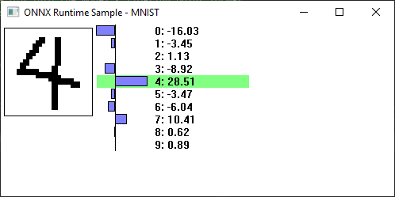

# Number recognition with MNIST in C++
{: .no_toc }

This sample uses the MNIST model from the Model Zoo: https://github.com/onnx/models/tree/master/vision/classification/mnist

## Contents
{: .no_toc }

* TOC placeholder
{:toc}

## Requirements

Compiled Onnxruntime.dll / lib (link to instructions on how to build dll)
Windows Visual Studio Compiler (cl.exe)

## Build

Run 'build.bat' in this directory to call cl.exe to generate MNIST.exe
Then just run MNIST.exe

## How to use it

Just draw a number with the left mouse button (or use touch) in the box on the left side. After releasing the mouse button the model will be run and the outputs of the model will be displayed. Note that when drawing numbers requiring multiple drawing strokes, the model will be run at the end of each stroke with probably wrong predictions (but it's amusing to see and avoids needing to press a 'run model' button).

To clear the image, click the right mouse button anywhere.

## How it works

A single Ort::Env is created globally to initialize the runtime.
https://github.com/microsoft/onnxruntime/blob/521dc757984fbf9770d0051997178fbb9565cd52/samples/c_cxx/MNIST/MNIST.cpp#L12

The MNIST structure abstracts away all of the interaction with the Onnx Runtime, creating the tensors, and running the model.

WWinMain is the Windows entry point, it creates the main window.

WndProc is the window procedure for the window, handling the mouse input and drawing the graphics

### Preprocessing the data

MNIST's input is a {1,1,28,28} shaped float tensor, which is basically a 28x28 floating point grayscale image (0.0 = background, 1.0 = foreground).

The sample stores the image in a 32-bit per pixel windows DIB section, since that's easy to draw into and draw to the screen for windows. The DIB is created here:
https://github.com/microsoft/onnxruntime/blob/521dc757984fbf9770d0051997178fbb9565cd52/samples/c_cxx/MNIST/MNIST.cpp#L109-L121

The function to convert the DIB data and writ it into the model's input tensor:
https://github.com/microsoft/onnxruntime/blob/521dc757984fbf9770d0051997178fbb9565cd52/samples/c_cxx/MNIST/MNIST.cpp#L77-L92

### Postprocessing the output

MNIST's output is a simple {1,10} float tensor that holds the likelihood weights per number. The number with the highest value is the model's best guess.

The MNIST structure uses std::max_element to do this and stores it in result_:
https://github.com/microsoft/onnxruntime/blob/521dc757984fbf9770d0051997178fbb9565cd52/samples/c_cxx/MNIST/MNIST.cpp#L31

To make things more interesting, the window painting handler graphs the probabilities and shows the weights here:
https://github.com/microsoft/onnxruntime/blob/521dc757984fbf9770d0051997178fbb9565cd52/samples/c_cxx/MNIST/MNIST.cpp#L164-L183

### The Ort::Session

1. Creation: The Ort::Session is created inside the MNIST structure here:
https://github.com/microsoft/onnxruntime/blob/521dc757984fbf9770d0051997178fbb9565cd52/samples/c_cxx/MNIST/MNIST.cpp#L43

2. Setup inputs & outputs: The input & output tensors are created here:
https://github.com/microsoft/onnxruntime/blob/521dc757984fbf9770d0051997178fbb9565cd52/samples/c_cxx/MNIST/MNIST.cpp#L19-L23
In this usage, we're providing the memory location for the data instead of having Ort allocate the buffers. This is simpler in this case since the buffers are small and can just be fixed members of the MNIST struct.

3. Run: Running the session is done in the Run() method:
https://github.com/microsoft/onnxruntime/blob/521dc757984fbf9770d0051997178fbb9565cd52/samples/c_cxx/MNIST/MNIST.cpp#L25-L33

