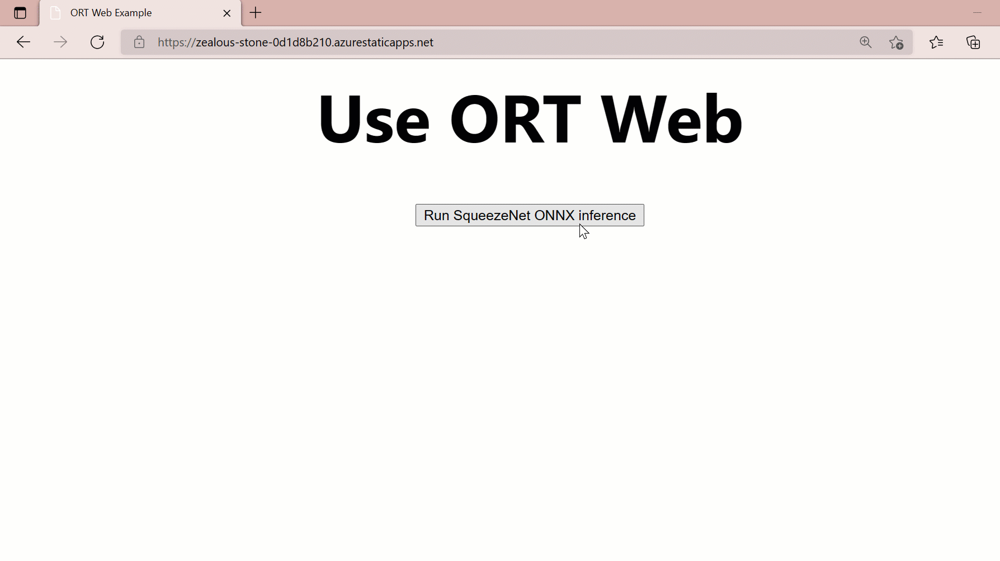

# Classify images in a web application with ONNX Runtime Web 
{: .no_toc }

In this tutorial we will use a GitHub repository template to build an image classification web app using ONNX Runtime web. We will do the inference in JavaScript on the browser for a computer vision model.

One of the hardest parts when deploying and inferencing in languages that are not commonly used for data science is figuring out how to do the data processing and inferencing. We have done all the hard work for you with [this template](https://github.com/microsoft/onnxruntime-nextjs-template)!

Below is what the site looks like from the template. It is looping through a list of example images, calling the inference session with a SqueezeNet model, then returning the score and label from inference.

Example template output:



## Contents
{: .no_toc }

* TOC placeholder
{:toc}

## Inference on device

This application performs inference on device, in the browser using the onnxruntime-web JavaScript library.

## SqueezeNet machine learning model

We will be using [SqueezeNet](https://github.com/onnx/models/tree/main/validated/vision/classification/squeezenet) from the [ONNX Model Zoo](https://github.com/onnx/models). SqueezeNet models perform image classification - they take images as input and classify the major object in the image into a set of pre-defined classes. They are trained on the ImageNet dataset which contains images from 1000 different classes. SqueezeNet models are highly efficient in terms of size and speed while providing good accuracies. This makes them ideal for platforms with strict constraints on size, like client side inference.

  > If you need even more model memory and disk efficiency, you can convert the ONNX model to [ORT format](../../reference/ort-format-models) and use an ORT model in your application instead of the ONNX one. You can also also [reduce the size of the ONNX Runtime](../../build/custom.md) binary itself to only include support for the specific models in your application.

## Create a Static Site with NextJS (a ReactJS Framework) to deploy models in the browser

### The Template
{: .no_toc }
The goal of this template is to provide a starting point for your accelerated ML web application. The template generates a computer vision application using the [NextJS](https://nextjs.org/) framework, authored in typescript and built with webpack. Let’s dive into the template and breakdown the code.

### The `utils` Folder 
{: .no_toc }
There are three files in the Utils folder `imageHelper.ts`, `modelHelper.ts` and `predict.ts`. Predict is the entry point from the web component to start inferencing. Here we import the helpers and call the default functions to get the image tensor and to run our model inference. 

### predict.ts

```javascript
// Language: typescript
// Path: react-next\utils\predict.ts
import { getImageTensorFromPath } from './imageHelper';
import { runSqueezenetModel } from './modelHelper';

export async function inferenceSqueezenet(path: string): Promise<[any,number]> {
  // 1. Convert image to tensor
  const imageTensor = await getImageTensorFromPath(path);
  // 2. Run model
  const [predictions, inferenceTime] = await runSqueezenetModel(imageTensor);
  // 3. Return predictions and the amount of time it took to inference.
  return [predictions, inferenceTime];
}
```

### imageHelper.ts

First, we need to get our image from a local file or URL and convert it to a tensor. The `getImageTensorFromPath` function in the `imageHelper.ts` uses `JIMP` to read the file, resize and return the `imageData`. [JIMP](https://www.npmjs.com/package/jimp) is a JavaScript image manipulation library. It has many built in functions for working with image data such as resizing, grey scale, write, and more. In this example we only need to resize however in your code you may need additional image data processing. 

```javascript
import * as Jimp from 'jimp';
import { Tensor } from 'onnxruntime-web';

export async function getImageTensorFromPath(path: string, dims: number[] =  [1, 3, 224, 224]): Promise<Tensor> {
  // 1. load the image  
  var image = await loadImagefromPath(path, dims[2], dims[3]);
  // 2. convert to tensor
  var imageTensor = imageDataToTensor(image, dims);
  // 3. return the tensor
  return imageTensor;
}

async function loadImagefromPath(path: string, width: number = 224, height: number= 224): Promise<Jimp> {
 // Use Jimp to load the image and resize it.
  var imageData = await Jimp.default.read(path).then((imageBuffer: Jimp) => {
    return imageBuffer.resize(width, height);
  });

  return imageData;
}
```

Once we have the imageData we will send it into the `imageDataToTensor` function to convert it to an ORT Tensor for inferencing. To convert an image to a tensor in JavaScript we need to get the RGB (Red, Green, Blue) values into arrays. To do this we will loop through the `imageBufferData` by each pixels 4 channels of RGBA. Once we have the RGB pixel channels for the image, then we create the `Float32Array` from the `transposedData` and divide by 255 to normalize the value. Why does 255 normalize the pixel value? Well normalization is a technique used to change values to a common scale without distorting the differences. 255 is the max number for an RGB value, so dividing by 255 normalizes our values to between 0 and 1 without losing the statistical differences.  Now that we have the `Float32Array` representation of the image we can create the ORT Tensor by sending in the type, data, and dimensions. Then we return the inputTensor for inferencing.

```javascript
function imageDataToTensor(image: Jimp, dims: number[]): Tensor {
  // 1. Get buffer data from image and create R, G, and B arrays.
  var imageBufferData = image.bitmap.data;
  const [redArray, greenArray, blueArray] = new Array(new Array<number>(), new Array<number>(), new Array<number>());

  // 2. Loop through the image buffer and extract the R, G, and B channels
  for (let i = 0; i < imageBufferData.length; i += 4) {
    redArray.push(imageBufferData[i]);
    greenArray.push(imageBufferData[i + 1]);
    blueArray.push(imageBufferData[i + 2]);
    // skip data[i + 3] to filter out the alpha channel
  }

  // 3. Concatenate RGB to transpose [224, 224, 3] -> [3, 224, 224] to a number array
  const transposedData = redArray.concat(greenArray).concat(blueArray);

  // 4. convert to float32
  let i, l = transposedData.length; // length, we need this for the loop
  // create the Float32Array size 3 * 224 * 224 for these dimensions output
  const float32Data = new Float32Array(dims[1] * dims[2] * dims[3]);
  for (i = 0; i < l; i++) {
    float32Data[i] = transposedData[i] / 255.0; // convert to float
  }
  // 5. create the tensor object from onnxruntime-web.
  const inputTensor = new Tensor("float32", float32Data, dims);
  return inputTensor;
}
```

### modelHelper.ts

The inputTensor is ready for inferencing. Let's call the default `modelHelper.ts` function and walk through the logic. First we create the `ort.InferenceSession` by sending in the path to the model and the `SessionOptions`. For the `executionProviders` you can use either `webgl` to use the GPU or `wasm` to use the CPU. See the documentation to learn more about the `SessionOptions` available for inferencing configuration [here](https://onnxruntime.ai/docs/api/js/interfaces/InferenceSession.SessionOptions.html).

```javascript
import * as ort from 'onnxruntime-web';
import _ from 'lodash';
import { imagenetClasses } from '../data/imagenet';

export async function runSqueezenetModel(preprocessedData: any): Promise<[any, number]> {
  // Create session and set options. See the docs here for more options: 
  //https://onnxruntime.ai/docs/api/js/interfaces/InferenceSession.SessionOptions.html#graphOptimizationLevel
  const session = await ort.InferenceSession
                          .create('./_next/static/chunks/pages/squeezenet1_1.onnx', 
                          { executionProviders: ['webgl'], graphOptimizationLevel: 'all' });
  console.log('Inference session created');
  // Run inference and get results.
  var [results, inferenceTime] =  await runInference(session, preprocessedData);
  return [results, inferenceTime];
}
```

Then let's call the `runInference` function by sending in the `session` and our input tensor `preprocessedData`.

```javascript
async function runInference(session: ort.InferenceSession, preprocessedData: any): Promise<[any, number]> {
  // Get start time to calculate inference time.
  const start = new Date();
  // create feeds with the input name from model export and the preprocessed data.
  const feeds: Record<string, ort.Tensor> = {};
  feeds[session.inputNames[0]] = preprocessedData;
  // Run the session inference.
  const outputData = await session.run(feeds);
  // Get the end time to calculate inference time.
  const end = new Date();
  // Convert to seconds.
  const inferenceTime = (end.getTime() - start.getTime())/1000;
  // Get output results with the output name from the model export.
  const output = outputData[session.outputNames[0]];
  //Get the softmax of the output data. The softmax transforms values to be between 0 and 1
  var outputSoftmax = softmax(Array.prototype.slice.call(output.data));
  //Get the top 5 results.
  var results = imagenetClassesTopK(outputSoftmax, 5);
  console.log('results: ', results);
  return [results, inferenceTime];
}
```

Once the inference completes, we return the top 5 results and time it took to run the inference. This is then displayed on the `ImageCanvas` web component.

## The `data` Folder

The data folder in this template has `imagenetClasses` that is used to assign the label based on the inferencing result index. Additionally, there is a `sample-image-urls.ts` provided for testing the application.

## ImageCanvas FSX Element Web Component

The `ImageCanvas.tsx` web component has the button and display elements. Below is the logic for the web component:

```javascript
import { useRef, useState } from 'react';
import { IMAGE_URLS } from '../data/sample-image-urls';
import { inferenceSqueezenet } from '../utils/predict';
import styles from '../styles/Home.module.css';

interface Props {
  height: number;
  width: number;
}

const ImageCanvas = (props: Props) => {

  const canvasRef = useRef<HTMLCanvasElement>(null);
  var image: HTMLImageElement;
  const [topResultLabel, setLabel] = useState("");
  const [topResultConfidence, setConfidence] = useState("");
  const [inferenceTime, setInferenceTime] = useState("");
  
  // Load the image from the IMAGE_URLS array
  const getImage = () => {
    var sampleImageUrls: Array<{ text: string; value: string }> = IMAGE_URLS;
    var random = Math.floor(Math.random() * (9 - 0 + 1) + 0);
    return sampleImageUrls[random];
  }

  // Draw image and other  UI elements then run inference
  const displayImageAndRunInference = () => { 
    // Get the image
    image = new Image();
    var sampleImage = getImage();
    image.src = sampleImage.value;

    // Clear out previous values.
    setLabel(`Inferencing...`);
    setConfidence("");
    setInferenceTime("");

    // Draw the image on the canvas
    const canvas = canvasRef.current;
    const ctx = canvas!.getContext('2d');
    image.onload = () => {
      ctx!.drawImage(image, 0, 0, props.width, props.height);
    }
    // Run the inference
    submitInference();
  };

  const submitInference = async () => {

    // Get the image data from the canvas and submit inference.
    var [inferenceResult,inferenceTime] = await inferenceSqueezenet(image.src);

    // Get the highest confidence.
    var topResult = inferenceResult[0];

    // Update the label and confidence
    setLabel(topResult.name.toUpperCase());
    setConfidence(topResult.probability);
    setInferenceTime(`Inference speed: ${inferenceTime} seconds`);

  };

  return (
    <>
    <button
      className={styles.grid}
      onClick={displayImageAndRunInference} >
      Run Squeezenet inference
    </button>
    <br/>
    <canvas ref={canvasRef} width={props.width} height={props.height} />
    <span>{topResultLabel} {topResultConfidence}</span>
    <span>{inferenceTime}</span>
    </>
  )
};

export default ImageCanvas;
```

This web component element is then imported in the `index.tsx`.

```html
<ImageCanvas width={240} height={240}/>
```

## next.config.js

We need to add a couple plugins in the `next.config.js`. This is the webpack configuration implemented in the NextJS Framework. The `CopyPlugin` is used to copy the `wasm` files and the model folder files to the `out` folder for deployment. 

```javascript
/** @type {import('next').NextConfig} */
const NodePolyfillPlugin = require("node-polyfill-webpack-plugin");
const CopyPlugin = require("copy-webpack-plugin");

module.exports = {
  reactStrictMode: true,
  //distDir: 'build',
  webpack: (config, {  }) => {

    config.resolve.extensions.push(".ts", ".tsx");
    config.resolve.fallback = { fs: false };

    config.plugins.push(
    new NodePolyfillPlugin(), 
    new CopyPlugin({
      patterns: [
        {
          from: './node_modules/onnxruntime-web/dist/ort-wasm.wasm',
          to: 'static/chunks/pages',
        },             {
          from: './node_modules/onnxruntime-web/dist/ort-wasm-simd.wasm',
          to: 'static/chunks/pages',
        },          
          {
            from: './model',
            to: 'static/chunks/pages',
          },
        ],
      }),
    );

    return config;
  } 
}
```

## package.json

Since we want to deploy this as a static site. We need to update the build command in the `package.json` to `next build && next export` to generate our static site output. This generates all the assets that are needed to deploy the static site and puts them in the `out` folder.

```json
{
  "name": "ort-web-template",
  "version": "0.1.0",
  "private": true,
  "scripts": {
    "dev": "next dev",
    "build": "next build && next export",
    "start": "next start",
    "lint": "next lint"
  },
  "dependencies": {
    "fs": "^0.0.1-security",
    "jimp": "^0.16.1",
    "lodash": "^4.17.21",
    "ndarray": "^1.0.19",
    "ndarray-ops": "^1.2.2",
    "next": "^11.1.2",
    "onnxruntime-web": "^1.9.0",
    "react": "17.0.2",
    "react-dom": "17.0.2"
  },
  "devDependencies": {
    "node-polyfill-webpack-plugin": "^1.1.4",
    "copy-webpack-plugin": "^9.0.1",
    "@types/lodash": "^4.14.176",
    "@types/react": "17.0.19",
    "eslint": "7.32.0",
    "eslint-config-next": "11.1.0",
    "typescript": "4.4.2"
  }
}

```

## Run the project locally

We are ready to run the project. Run the command based on if you want to start with debugging, build the `out` folder, or start without debugging.

```javascript
// to run with debugging
npm run dev
// to build the project
npm run build
// to run without debugging
npm run start
```

## Deploy to Azure Static Web Apps

Now that we have built out the site we are ready to deploy it to a [Azure Static Web Apps](https://docs.microsoft.com/en-us/azure/static-web-apps). Check out the docs to learn how to deploy using Azure [here](https://docs.microsoft.com/en-us/azure/static-web-apps/deploy-nextjs).

## TypeScript Notebook

We have walked through how to use this template, there is a bonus here though! Under the notebook folder in the tempalte there is a [notebook](https://github.com/microsoft/onnxruntime-nextjs-template/blob/main/notebook/inferenceNotebook.ipynb) with this code for you to experiment and try out changes you might need. This way if you have a different model or image you want to try out you can do it quite easily. To use the TypeScript Jupyter notebook download the VS Code Jupyter notebooks extension. 

## More Resources

* Start using the template now by going to the [GitHub NextJS ORT-Web Template](https://github.com/microsoft/onnxruntime-nextjs-template) repo.

* Check out the [release blog here](https://cloudblogs.microsoft.com/opensource/2021/09/02/onnx-runtime-web-running-your-machine-learning-model-in-browser/)

* The template is using [NextJS](https://nextjs.org/) a framework for building out applications with ReactJS.

* Check out [ONNX Runtime Web Demo for more models](https://github.com/microsoft/onnxruntime-web-demo). ONNX Runtime Web demo is an interactive demo portal showing real use cases running ONNX Runtime Web in VueJS. It currently supports four examples for you to quickly experience the power of ONNX Runtime Web.

* [This blog](https://hackernoon.com/how-to-run-machine-learning-models-in-the-browser-using-onnx) shows how to use ORT Web with Python for deploying a pre-trained AlexNet model to the browser.

* Check out more [ONNX Runtime JS examples](https://github.com/microsoft/onnxruntime-inference-examples/tree/main/js)