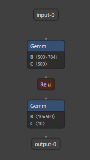
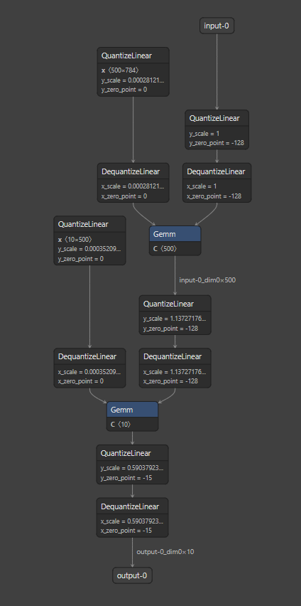

## Quantization Aware Training (QAT) with onnxruntime POC

This directory contains a complete example of how users can perform QAT in onnxruntime (as a Proof of Concept). There are two approaches to perform QAT in ort - a). Using `onnxruntime.training.api` and b). Using `onnxruntime.training.ORTModule`. The contents of this tutorial focus on the former (QAT with `ORTModule` is still under development and is not ready).

We will walk through a POC example using the `MNIST` dataset and a simple neural network with two linear layers:

```py
class MNIST(torch.nn.Module):
    """Simple PyTorch model that works with the MNIST dataset."""

    def __init__(self, input_size, hidden_size, num_classes):
        super(MNIST, self).__init__()

        self.fc1 = torch.nn.Linear(input_size, hidden_size)
        self.relu = torch.nn.ReLU()
        self.fc2 = torch.nn.Linear(hidden_size, num_classes)

    def forward(self, model_input):
        out = self.fc1(model_input)
        out = self.relu(out)
        out = self.fc2(out)

        return out
```

To begin with, let's export this model to onnx.



We won't be walking through the code, but just highlighting the different graph transformations that are needed along the way to performing QAT with ORT.

Let's begin by understanding what `onnxruntime.quantization` can do for us. Let's say we wanted to statically quantize the above model. Using the `onnxruntime.quantization.quantize_static` utility, we can generate the following onnx quantized onnx model:



The tool is able to place `QuantizeLinear->DequanziteLinear` (referred as QDQ pair of nodes from here) nodes at two places:
1. for model weights.
2. for model activations.

The key idea in performing QAT is to correct the loss in numerical precision as a result of the quantization process by adjusting the model parameters. In order to induce the loss of numerical precision, we need to ensure that the QAT forward graph is as close to the statically quantized onnx model as possible.

However, the QDQ pair is non differentiable. We could however, fuse this QDQ pair into a `FakeQuant` node whose gradient can be approximated. So, we do exactly that. To build the QAT onnx model on top of the above quantized model:
1. Fuse the QDQ pair into a FakeQuant node.
2. Add a loss at the output of the forward only model.
3. Build the gradient graph.

We use `onnxruntime.training.onnxblock` to perform the above operations to get the final QAT model that can be trained using the ort training api. The training onnx model can look quite dense as a result of the gradient nodes that are built, so we won't be presenting its image here.

> **_NOTE:_**  As of this writing, ORT does not have its own `"Observers"`. Instead, we rely on the `onnxruntime.quantization` tool to quantize the model and give us an initial estimate of the quantization parameters using its calibration process. Here the calibration process is used as a substitute for the observers to present the POC.

> **_NOTE:_** Typically, the weights in the statically quantized onnx model is associated with a DQ node only (not the QDQ pair) since weights are quantized. However, QAT requires weights and biases to be non quantized. We ensure that the weights have dedicated QDQ pair by passing in the flag `AddQDQPairToWeight=True`

> **_NOTE:_**  Typically, the bias term in the statically quantized onnx model is associated with a DQ node only (not the QDQ pair) since it is quantized as int32 as opposed to int8. So, we disable quantizing the bias term using the flag QuantizeBias=False`

Now that we have the training model, we can perform training to correct for the loss in numerical accuracy as a result of quantization using `onnxruntime.training.api`.

Finally, what's left after training is to create the inference onnx model that is quantized and is also trained to improve accuracy.
TODO(baijumeswani): this part is pending.

To execute the above process for the sample model, simply run [`qat.py`](qat.py)

```sh
python qat.py
```
