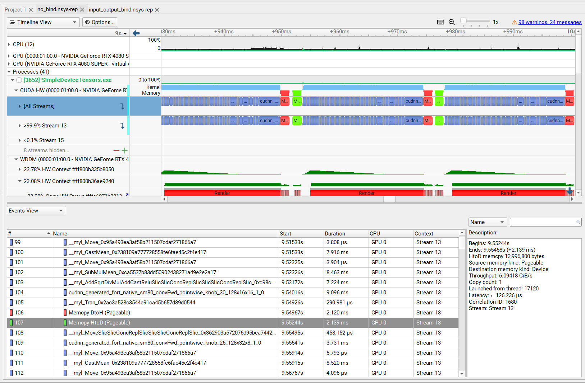
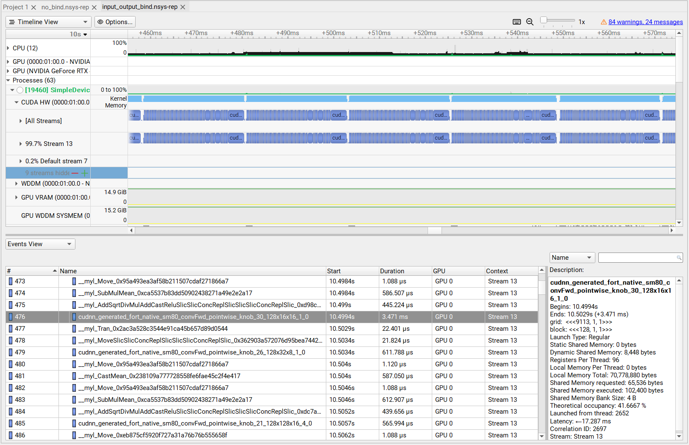

# EP agnostic IO binding

Binding inputs and outputs directly to device memory greatly reduces the need for repeated data transfers between CPU and GPU. It allows precise control over where tensors are allocated (CPU, GPU, or pinned memory), making it possible to leverage fast device memory for intermediate results and avoid blocking operations. By eliminating unnecessary CPU-GPU communication, IO Binding also helps achieve faster inference.

Efficient IO binding in ONNX Runtime (ORT) has historically required developers to tailor their applications for specific execution providers (EPs) and their relative vendor APIs like CUDA. Only DirectML allowed for vendor agnostic device tensors. This technical deep dive explores emerging practices that enable hardware-agnostic memory allocation and IO binding — simplifying application development and maximizing hardware compatibility.

Previously, creating and preparing tensors for inference in ORT involved code similar to below:

```c
Ort::SessionOptions opts;
auto cuda_options =  std::make_unique<OrtCUDAProviderOptions>();
opts.AppendExecutionProvider_CUDA(*cuda_options);
Ort::Session session(*ort_env,"model.onnx",opts);

Ort::MemoryInfo mem_info("CUDA", OrtArenaAllocator, 0, OrtMemTypeDefault);
Ort::Allocator alloc(session, mem_info);
std::vector<int64_t> shape{3, 4};
std::vector<float> data(12, 1.0f);
auto value = Ort::Value::CreateTensor(alloc,shape.data(), shape.size(), ONNX_TENSOR_ELEMENT_DATA_TYPE_FLOAT);
cudaMemcpy(value.GetTensorMutableData<float>(), data.data(), data.size() * sizeof(float), cudaMemcpyHostToDevice);

```

The workflow as seen the above code forces developers to:

* Know EP details in advance.  
* Maintain distinct code paths for each hardware target when creating device tensors  
* Use vendor specific APIs to copy data from CPU to the inference device and back

Such EP dependency increases code complexity, maintenance effort, and limits portability. Since ONNX Runtime 1.23 new cross vendor APIs are present which previously was only possible on windows through DirectX tensors and the DirectML execution provider.

# Hardware-Agnostic Memory Info Creation

The latest ONNX Runtime revision introduces the CreateMemoryInfo\_V2 API, which enables developers to create memory info objects without specifying EP-specific strings:

|  `ORT_API2_STATUS(CreateMemoryInfo_V2,     _In_ const char* name,     _In_ enum OrtMemoryInfoDeviceType device_type,     _In_ uint32_t vendor_id,     _In_ int32_t device_id,     _In_ enum OrtDeviceMemoryType mem_type,     _In_ size_t alignment,     enum OrtAllocatorType allocator_type,     _Outptr_ OrtMemoryInfo** out);`  |
| :---- |

Key parameters:

* **vendor\_id**: The sole value identifying the hardware vendor (e.g., NVIDIA, AMD). Use 0 for generic devices such as WebGPU.  
* **name**: Arbitrary string, no longer tied to EP.  
* **device\_type, device\_id, mem\_type**: Specify the device class and memory characteristics, independent of EP.  
* **alignment, allocator\_type**: Fine-tune memory allocation specifics.

This design dramatically reduces hardware coupling, allowing single code paths to serve multiple EPs.

# Determining Vendor ID with ONNX Runtime APIs

To keep the creation workflow hardware-agnostic, you can programmatically discover the vendor ID at runtime using the following session API:

|  `// Obtain EP device for the input(s) ortApi.SessionGetEpDeviceForInputs(session, &epDevices, num_epDevices); // Get the associated hardware device const OrtHardwareDevice* hw_device = ortApi.EpDevice_Device(epDevices); // Extract the vendor ID UINT vendorID = ortApi.HardwareDevice_VendorId(hw_device);`  |
| :---- |

* Register all anticipated EPs at application start.  
* Set EP selection policy to prefer GPU.  
* Delegate device selection to ORT, which matches inputs to suitable EPs based on the selection policy set above.  
* The vendor ID, retrieved at runtime, informs memory info creation—removing the need for hardcoding or prior knowledge of hardware.

This method ensures tensor creation and IO binding remain agnostic to specific IHV implementations.

## Alternative Vendor ID Discovery

Developers can enumerate graphics adapters using the DXCore library instead of ONNX Runtime’s built-in APIs. This approach provides system-wide hardware awareness, especially useful in multi-GPU environments or custom device management scenarios.

Example of EP Agnostic IO Binding in Practice is available at the following link: \<insert link here\>

# Technical Advantages

* **Portability**: Enables deployment across diverse hardware from various IHVs without modifying source code.  
* **Developer Velocity**: Removes EP-specific barriers, streamlining development and maintenance.  
* **Hardware Optimization**: Leverages ORT’s automatic EP selection and device management for optimal hardware utilization. With this it is possible to optimize for device specific memory instead of leveraging the common denominator which is usually a CPU tensor.

|  `// Register all supported EPs RegisterAvailableEPs(session); sessionOptions.SetEpSelectionPolicy(OrtExecutionProviderDevicePolicy_PREFER_GPU);   // Use SessionGetEpDeviceForInputs to determine the runtime EP device and vendor ID ortApi.SessionGetInputCount(session, &num_epDevices); ortApi.SessionGetEpDeviceForInputs(session, &epDevices, 1); const OrtHardwareDevice* hw_device = ortApi.EpDevice_Device(epDevices); UINT vendorID = ortApi.HardwareDevice_VendorId(hw_device);   // Use CreateMemoryInfo_V2 for hardware-agnostic tensor allocation OrtMemoryInfo* memory_info_agnostic_io = nullptr; ortApi.CreateMemoryInfo_V2("IHV_Agnostic_Memory", OrtMemoryInfoDeviceType_GPU, /*vendor_id*/vID, /*device_id*/0, OrtDeviceMemoryType_DEFAULT, /*default alignment*/0, OrtArenaAllocator, &memory_info_agnostic_io);   // Create input tensors with runtime-discovered memory_info OrtValue* input_tensor = CreateTensor(memory_info_agnostic_io, ...); OrtValue* output_tensor = CreateTensor(memory_info_agnostic_io, ...);   // Bind input/output using regular IO binding routines ioBinding.BindInput(InputTensorName.get(), inputTensor); ioBinding.BindOutput(OuptutTensorName.get(), outputTensor);`  |
| :---- |

# Efficient CPU–GPU Data Movement and Inference with ONNX Runtime

ONNX Runtime has also introduced an EP-agnostic mechanism for managing data transfers between host (CPU) and device (GPU). This feature allows application developers to upload data onto device memory, run inference, and avoid repeated data transfers — all without having to manage EP-specific complexities.

The latest ONNX Runtime exposes the CopyTensors API, which abstracts away EP-specific implementations of data movement. While backend-specific handling is executed by the respective EP (CUDA, ROCm, DirectML, etc.), developers interact with a single generic API.

This opaque design simplifies application-level development: once an EP is selected, the runtime transparently manages memory copies between CPU and GPU without requiring code changes for different hardware backends.

## **Step 1: Registering Execution Providers**

Before running inference, 

* All available EPs are registered  
* A GPU-preferred EP selection policy is chosen.   
* EP configuration options — such as a user-supplied stream (`user_compute_stream`) is assigned to fine-tune behavior and synchronization.

## **Step 2: Creating CPU Input Tensors**

We begin by constructing a CPU tensor to hold the input data:

```c
Ort::Value input_value = Ort::Value::CreateTensor<float>(
    cpu_allocator.GetInfo(),
    input_data.data(), input_data.size(),
    input_shape.data(), input_shape.size()
);
cpu_input_tensors.push_back(std::move(input_value));
```

This serves as the staging location for host-resident data.

## **Step 3: Allocating Device (GPU) Input Tensors**

To create a device tensor in an EP-agnostic manner, we construct an intermediate `OrtMemoryInfo` object and use it to obtain a shared allocator for device memory:

```c
OrtMemoryInfo* input_memory_info_agnostic = nullptr;
ortApi.CreateMemoryInfo_V2(
    "Input_Agnostic", 
    OrtMemoryInfoDeviceType_GPU, 
    /*vendor_id*/ 0x10de, 
    /*device_id*/ 0, 
    OrtDeviceMemoryType_DEFAULT, 
    /*default alignment*/ 0, 
    OrtArenaAllocator, 
    &input_memory_info_agnostic
);

OrtAllocator* allocator = nullptr;
ortApi.GetSharedAllocator(ortEnvironment, input_memory_info_agnostic, &allocator);

auto src_shape = cpu_input_tensors[idx].GetTensorTypeAndShapeInfo().GetShape();
Ort::Value device_input_value = Ort::Value::CreateTensor<float>(
    allocator, src_shape.data(), src_shape.size()
);
```

The resulting tensor resides in GPU memory and can now be used directly as an input for inference.

## **Step 4: Direct CPU Inference vs. IOBinding**

When performing inference in a loop, there are two possible approaches:

## **a) Direct CPU Pointer Inference**

It is possible to skip GPU explicit allocation and rely on ONNX Runtime to handle data transfers implicitly.

```c
input_tensors.push_back(std::move(cpu_input_tensors[idx]));
output_tensors.push_back(std::move(cpu_output_tensors[idx]));
for (int i = 0; i < 100; i++) {
    session.Run(Ort::RunOptions{}, input_names.data(), input_tensors.data(), input_tensors.size(), output_names.data(), output_tensors.data(), output_tensors.size());
}
```

In this mode, every iteration performs:

1. Upload of CPU → GPU input data  
2. Execution of the model  
3. Download of results back to CPU

Although simpler, this incurs repetitive transfer overhead.

## **b) Optimized Inference with IOBinding**

To avoid redundant transfers, ONNX Runtime allows IOBinding, where data is bound once to device memory and subsequently reused across runs.

```c
src_tensor_ptrs.push_back(cpu_input_tensors[idx]);
dst_tensor_ptrs.push_back(device_input_value);
input_tensors.push_back(std::move(device_input_value));

auto dst_shape = cpu_output_tensors[idx].GetTensorTypeAndShapeInfo().GetShape();
Ort::Value device_output_value = Ort::Value::CreateTensor<float>(allocator, dst_shape.data(), dst_shape.size());
output_tensors.push_back(std::move(device_output_value));

ortApi.CopyTensors(ortEnvironment, src_tensor_ptrs.data(), dst_tensor_ptrs.data(), stream, src_tensor_ptrs.size());

Ort::IoBinding iobinding(session);
iobinding.BindInput(InputTensorName.get(), input_tensors[0]);
iobinding.BindOutput(OutputTensorName.get(), output_tensors[0]);

for (int i = 0; i < 100; i++) {
    session.Run(Ort::RunOptions{}, input_names.data(), input_tensors.data(), input_tensors.size(), output_names.data(), output_tensors.data(), output_tensors.size());
}
```

With IOBinding:

* Data transfer (CopyTensors) happens only once before the loop.  
* The input tensor stays resident on device memory, eliminating CPU↔GPU synchronization at every inference step.

This significantly reduces latency in scenarios where repeated inference is performed on the same input size or preprocessed batches.

The following are Nsight traces depicting the performance overhead due to repetitive copies between host to device and device to host in case of no IO binding:



Prior to every inference run, copy operation of input from host to device copy takes around 2.1 milliseconds and a device to host copy of output takes around 2.1 milliseconds. For a 100 iteration loop, it adds up to around 420 milliseconds of copy time.

On the other hand, when input and output tensors are IO bound, we can perform host to device copy of input just once prior to the inference loop and device to host copy of output just once after the loop. The following Nsight trace depicts multiple inference runs in the loop without any copy operations in between:  


In this case the one time host to device copy takes 4.2 milliseconds and the one time device to host copy takes 1.3 milliseconds, making the total copy time only 5.5 milliseconds irrespective of number of iterations in the inference loop.

By leveraging CopyTensors \+ IOBinding, ONNX Runtime enables developers to perform EP-agnostic, GPU-accelerated inference with minimal runtime data transfer overhead — leading to improved performance and cleaner code design.

See the next sample [../30_syncstreams_cuda/README.md](../30_syncstreams_cuda/README.md) on how to use explicit synchronization 
using SyncStreams to optimize data transfers further.

## Dependencies

This sample vendors a copy of https://github.com/lvandeve/lodepng (Zlib license)
