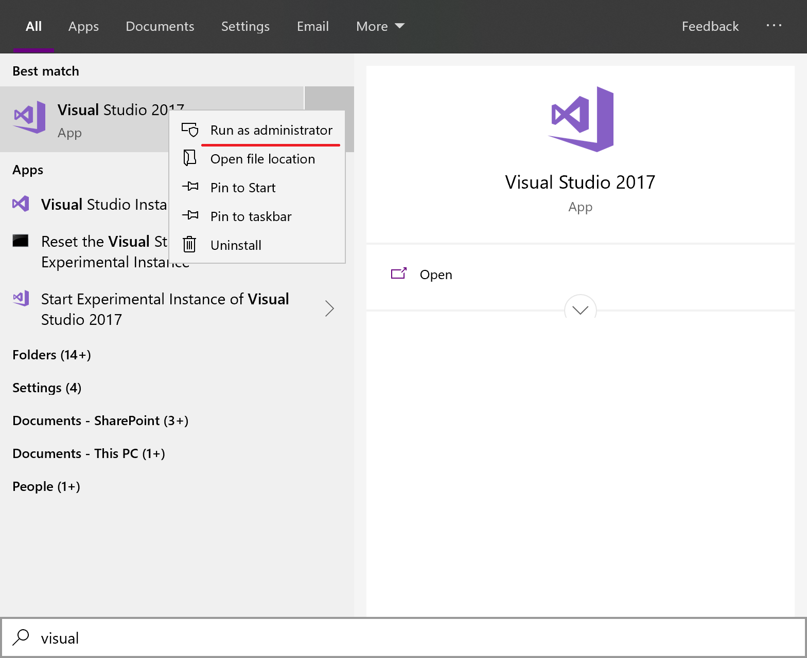

This directory contains a few C/C++ sample applications for demoing onnxruntime usage:

1. fns_candy_style_transfer: A C application that uses the FNS-Candy style transfer model to re-style images. 
2. MNIST: A windows GUI application for doing handwriting recognition
3. imagenet: An end-to-end sample for the [ImageNet Large Scale Visual Recognition Challenge 2012](http://www.image-net.org/challenges/LSVRC/2012/)

# How to build

## Prerequisites
1. Visual Studio 2015/2017/2019
2. cmake(version >=3.13)
3. (optional) [libpng 1.6](http://www.libpng.org/pub/png/libpng.html)

You may get a precompiled libpng library from [https://onnxruntimetestdata.blob.core.windows.net/models/libpng.zip](https://onnxruntimetestdata.blob.core.windows.net/models/libpng.zip)

## Install ONNX Runtime
You may either get a prebuit onnxruntime from nuget.org, or build it from source by following the [build instructions](../../BUILD.md). 
If you build it by yourself, you must append the "--build_shared_lib" flag to your build command. 
```
build.bat --config RelWithDebInfo --build_shared_lib --parallel
```
When the build is done, run Visual Studio as administrator and open the onnxruntime.sln file in your build directory.


When the solution is loaded, change the build configuration to "RelWithDebInfo"(which must match your previous build command), then select the "INSTALL" project, and build it.  It will install your onnxruntime to  "C:\Program Files (x86)\onnxruntime"

## Build the samples
Open cmd.exe, change your current directory to samples\c_cxx, then run
```bat
mkdir build
cmake .. -A x64 -T host=x64 -DLIBPNG_ROOTDIR=C:\path\to\your\libpng\binary
```
You may omit the "-DLIBPNG_ROOTDIR=..." argument if you don't have the libpng library.     
You may append "-Donnxruntime_USE_CUDA=ON" or "-Donnxruntime_USE_DML=ON" to the last command args if your onnxruntime binary was built with CUDA or DirectML support respectively.

Then you can open the onnxruntime_samples.sln file in the "build" directory and build the solution.


